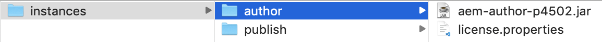

# Intégration d’AEM Sites à Adobe Target

Dans cette section, nous allons discuter de la configuration d’Adobe Experience Manager Sites avec Adobe Target pour différents scénarios. Selon votre scénario et les exigences de votre organisation.

* **Ajout de la bibliothèque JavaScript Adobe Target (obligatoire pour tous les scénarios)**
Pour les sites hébergés sur AEM, vous pouvez ajouter des bibliothèques Target à votre site à l’aide de : [Launch](https://experienceleague.adobe.com/docs/experience-platform/tags/home.html?lang=fr). Launch offre un moyen simple de déployer et de gérer toutes les balises nécessaires pour offrir des expériences client pertinentes.
* **Ajout des Cloud Services Adobe Target (requis pour le scénario Fragments d’expérience)**
Pour les clients AEM qui souhaitent utiliser les offres de fragments d’expérience pour créer une activité dans Adobe Target, vous devez intégrer Adobe Target à AEM à l’aide des Cloud Services hérités. Cette intégration est nécessaire pour transmettre les fragments d’expérience d’AEM à Target en tant qu’offres HTML/JSON et pour que les offres restent synchronisées avec AEM. *Cette intégration est requise pour la mise en oeuvre du scénario 1.*

## Conditions préalables

* **Adobe Experience Manager (AEM){#aem}**
   * AEM 6.5 (*Le dernier Service Pack est recommandé*)
   * Télécharger AEM packages de site de référence WKND
      * [aem-guides-wknd.ui.apps-0.0.1-SNAPSHOT.zip](https://github.com/adobe/aem-guides-wknd/releases/download/archetype-18.1/aem-guides-wknd.ui.apps-0.0.1-SNAPSHOT.zip)
      * [aem-guides-wknd.ui.content-0.0.1-SNAPSHOT.zip](https://github.com/adobe/aem-guides-wknd/releases/download/archetype-18.1/aem-guides-wknd.ui.content-0.0.1-SNAPSHOT.zip)
      * [Composants principaux](https://github.com/adobe/aem-core-wcm-components/releases/download/core.wcm.components.reactor-2.5.0/core.wcm.components.all-2.5.0.zip)
      * [Couche de données numérique](assets/implementation/digital-data-layer.zip)

* **Experience Cloud**
   * Accès à vos organisations Adobe Experience Cloud - `https://<yourcompany>.experiencecloud.adobe.com`
   * Experience Cloud fourni avec les solutions suivantes
      * [Adobe Experience Platform Launch](https://experiencecloud.adobe.com)
      * [Adobe Target](https://experiencecloud.adobe.com)
      * [Adobe I/O Console](https://console.adobe.io)

* **Environnement**
   * Java 1.8 ou Java 11 (AEM 6.5+ uniquement)
   * Apache Maven (3.3.9 ou version ultérieure)
   * Chrome

>[!NOTE]
>
> Le client doit être configuré avec l’Experience Platform Launch et l’Adobe I/O de [Prise en charge des Adobes](https://helpx.adobe.com/fr/contact/enterprise-support.ec.html) ou contactez votre administrateur système.

### Configuration des AEM{#set-up-aem}

AEM instance de création et de publication est nécessaire pour terminer ce tutoriel. L’instance d’auteur est en cours d’exécution. `http://localhost:4502` et l’instance de publication s’exécutant sur `http://localhost:4503`. Pour plus d’informations, voir : [Configuration d’un environnement de développement d’AEM local](https://helpx.adobe.com/experience-manager/kt/platform-repository/using/local-aem-dev-environment-article-setup.html).

#### Configuration des instances de création et de publication AEM

1. Obtention d’une copie de la variable [AEM Quickstart Jar et une licence .](https://helpx.adobe.com/experience-manager/6-5/sites/deploying/using/deploy.html#GettingtheSoftware)
2. Créez une structure de dossiers sur votre ordinateur comme suit :
   
3. Renommez le fichier Quickstart Jar en `aem-author-p4502.jar` et placez-le sous le `/author` répertoire . Ajoutez la variable `license.properties` sous le fichier `/author` répertoire .
   
4. Effectuez une copie du fichier Quickstart Jar, renommez-le en `aem-publish-p4503.jar` et placez-le sous le `/publish` répertoire . Ajoutez une copie de la fonction `license.properties` sous le fichier `/publish` répertoire .
   
5. Double-cliquez sur le bouton `aem-author-p4502.jar` pour installer l’instance d’auteur. Cela démarre l’instance d’auteur, exécutée sur le port 4502 sur l’ordinateur local.
6. Connectez-vous à l’aide des informations d’identification ci-dessous. Une fois connecté, vous êtes dirigé vers l’écran AEM page d’accueil.
username : **admin**
password : **admin**
   
7. Double-cliquez sur le bouton `aem-publish-p4503.jar` pour installer une instance de publication. Vous pouvez constater qu’un nouvel onglet s’ouvre dans votre navigateur pour votre instance de publication, s’exécutant sur le port 4503 et affichant la page d’accueil de WeRetail. Nous utilisons le site de référence WKND pour ce tutoriel et installons les packages sur l’instance de création.
8. Accédez à Auteur AEM dans votre navigateur web à l’adresse `http://localhost:4502`. Dans l’écran AEM Démarrer, accédez à *[Outils > Déploiement > Modules](http://localhost:4502/crx/packmgr/index.jsp)*.
9. Téléchargez et téléchargez les modules pour AEM (répertoriés ci-dessus sous *[Conditions préalables > AEM](#aem)*)
   * [aem-guides-wknd.ui.apps-0.0.1-SNAPSHOT.zip](https://github.com/adobe/aem-guides-wknd/releases/download/archetype-18.1/aem-guides-wknd.ui.apps-0.0.1-SNAPSHOT.zip)
   * [aem-guides-wknd.ui.content-0.0.1-SNAPSHOT.zip](https://github.com/adobe/aem-guides-wknd/releases/download/archetype-18.1/aem-guides-wknd.ui.content-0.0.1-SNAPSHOT.zip)
   * [core.wcm.components.all-2.5.0.zip](https://github.com/adobe/aem-core-wcm-components/releases/download/core.wcm.components.reactor-2.5.0/core.wcm.components.all-2.5.0.zip)
   * [digital-data-layer.zip](assets/implementation/digital-data-layer.zip)

   >[!VIDEO](https://video.tv.adobe.com/v/28377?quality=12&learn=on)
10. Après avoir installé les packages sur AEM Author, sélectionnez chaque package téléchargé dans AEM Package Manager, puis sélectionnez **Plus > Répliquer** pour vous assurer que les modules sont déployés sur AEM Publish.
11. À ce stade, vous avez installé avec succès votre site de référence WKND et tous les packages supplémentaires requis pour ce tutoriel.

[CHAPITRE SUIVANT](./using-launch-adobe-io.md): Dans le chapitre suivant, vous allez intégrer Launch à AEM.
