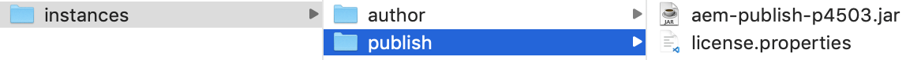

# Intégration de Adobe Experience Manager à Adobe Target

Dans cette section, nous aborderons comment configurer Adobe Experience Manager avec Adobe Target pour différents scénarios. Selon votre scénario et vos exigences organisationnelles.

* **Ajouter la bibliothèque JavaScript Adobe Target (obligatoire pour tous les scénarios)**
Pour les sites hébergés sur AEM, vous pouvez ajouter des bibliothèques de Cibles à votre site à l’aide de la fonction  [Lancement](https://docs.adobe.com/content/help/fr-FR/launch/using/overview.html). Launch fournit une méthode simple de déploiement et de gestion de toutes les balises nécessaires pour alimenter les expériences client pertinentes.
* **Ajoutez les Cloud Services Adobe Target (requis pour le scénario Fragments d’expérience)**
Pour les clients AEM qui souhaitent utiliser les offres Fragment d’expérience pour créer une activité dans Adobe Target, vous devez intégrer Adobe Target à l’AEM à l’aide des  hérités. Cette intégration est nécessaire pour transmettre les fragments d’expérience d’AEM à la Cible en tant qu’offres HTML/JSON et pour maintenir les offres synchronisées avec AEM. 
*Cette intégration est requise pour la mise en oeuvre du scénario 1.*

## Conditions préalables

* **Adobe Experience Manager (AEM){#aem}**
   * AEM 6.5 (*le dernier Service Pack est recommandé*)
   * Télécharger AEM packages de site de référence WKND
      * [aem-guides-wknd.ui.apps-0.0.1-SNAPSHOT.zip](https://github.com/adobe/aem-guides-wknd/releases/download/archetype-18.1/aem-guides-wknd.ui.apps-0.0.1-SNAPSHOT.zip)
      * [aem-guides-wknd.ui.content-0.0.1-SNAPSHOT.zip](https://github.com/adobe/aem-guides-wknd/releases/download/archetype-18.1/aem-guides-wknd.ui.content-0.0.1-SNAPSHOT.zip)
      * [Composants principaux](https://github.com/adobe/aem-core-wcm-components/releases/download/core.wcm.components.reactor-2.5.0/core.wcm.components.all-2.5.0.zip)
      * [Couche de données numérique](assets/implementation/digital-data-layer.zip)

* **Experience Cloud**
   * Accès à vos organisations Adobe Experience Cloud - <https://>`<yourcompany>`.experience encecloud.adobe.com
   * Experience Cloud doté des solutions suivantes
      * [Adobe Experience Platform Launch](https://experiencecloud.adobe.com)
      * [Adobe Target](https://experiencecloud.adobe.com)
      * [Adobe I/O Console](https://console.adobe.io)

* **Environnement**
   * Java 1.8 ou Java 11 (AEM 6.5+ uniquement)
   * Apache Maven (3.3.9 ou version ultérieure)
   * Chrome

>[!NOTE]
>
> Le client doit être approvisionné en Experience Platform Launch et en Adobe I/O par [prise en charge des Adobes](https://helpx.adobe.com/fr/contact/enterprise-support.ec.html) ou contacter votre administrateur système.

### Configuration de AEM{#set-up-aem}

AEM instance d’auteur et de publication est nécessaire pour terminer ce didacticiel. L’instance d’auteur s’exécute sur `http://localhost:4502` et l’instance de publication sur `http://localhost:4503`. Pour plus d&#39;informations, voir : [Configurez un Environnement de développement AEM local](https://helpx.adobe.com/experience-manager/kt/platform-repository/using/local-aem-dev-environment-article-setup.html).

#### Configuration des instances d’auteur et de publication AEM

1. Obtenez une copie du fichier Jar de démarrage rapide [AEM et une licence.](https://helpx.adobe.com/experience-manager/6-5/sites/deploying/using/deploy.html#GettingtheSoftware)
2. Créez une structure de dossiers sur votre ordinateur comme suit :
   
3. Renommez le fichier JAR Quickstart en `aem-author-p4502.jar` et placez-le sous le répertoire `/author`. Ajoutez le fichier `license.properties` sous le répertoire `/author`.
   
4. Effectuez une copie du fichier JAR Quickstart, renommez-le en `aem-publish-p4503.jar` et placez-le sous le répertoire `/publish`. Ajoutez une copie du fichier `license.properties` situé sous le répertoire `/publish`.
   
5. Doublon cliquez sur le fichier `aem-author-p4502.jar` pour installer l’instance d’auteur. L’instance d’auteur est ainsi début et s’exécute sur le port 4502 sur l’ordinateur local.
6. Connectez-vous à l’aide des informations d’identification ci-dessous. Une fois que vous vous êtes identifié, vous serez redirigé vers l’écran d’Page d&#39;accueil AEM.
username : **admin**
password : **admin**
   
7. Doublon cliquez sur le fichier `aem-publish-p4503.jar` pour installer une instance de publication. Vous pouvez constater qu&#39;un nouvel onglet s&#39;ouvre dans votre navigateur pour votre instance de publication, s&#39;exécutant sur le port 4503 et affichant la page d&#39;accueil WeRetail. Nous utiliserons le site de référence WKND pour ce tutoriel et installons les paquets sur l&#39;instance d&#39;auteur.
8. Accédez à AEM Author dans votre navigateur Web à l’adresse `http://localhost:4502`. Dans l’écran Début de l’AEM, accédez à *[Outils > Déploiement > Packages](http://localhost:4502/crx/packmgr/index.jsp)*.
9. Téléchargez et téléchargez les packages pour AEM (répertoriés ci-dessus sous *[Conditions préalables > AEM](#aem)*).
   * [aem-guides-wknd.ui.apps-0.0.1-SNAPSHOT.zip](https://github.com/adobe/aem-guides-wknd/releases/download/archetype-18.1/aem-guides-wknd.ui.apps-0.0.1-SNAPSHOT.zip)
   * [aem-guides-wknd.ui.content-0.0.1-SNAPSHOT.zip](https://github.com/adobe/aem-guides-wknd/releases/download/archetype-18.1/aem-guides-wknd.ui.content-0.0.1-SNAPSHOT.zip)
   * [core.wcm.components.all-2.5.0.zip](https://github.com/adobe/aem-core-wcm-components/releases/download/core.wcm.components.reactor-2.5.0/core.wcm.components.all-2.5.0.zip)
   * [digital-data-layer.zip](assets/implementation/digital-data-layer.zip)

   >[!VIDEO](https://video.tv.adobe.com/v/28377?quality=12&learn=on)
10. Après avoir installé les packages sur AEM Author, sélectionnez chaque package téléchargé dans AEM Package Manager, puis sélectionnez **Plus > Répliquer** pour vous assurer que les packages sont déployés dans AEM Publish.
11. À ce stade, vous avez installé avec succès votre site de référence WKND et tous les autres packages requis pour ce tutoriel.

[CHAPITRE](./using-launch-adobe-io.md) SUIVANT : Dans le chapitre suivant, vous allez intégrer Launch à AEM.
