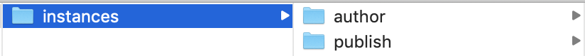

# Intégrer AEM Sites à Adobe Target

Dans cette section, nous allons discuter de la configuration d’Adobe Experience Manager Sites avec Adobe Target pour différents scénarios. La procédure dépend de votre scénario et des exigences de votre organisation.

* **Ajouter la bibliothèque JavaScript Adobe Target (obligatoire pour tous les scénarios)**
Pour les sites hébergés sur AEM, vous pouvez ajouter des bibliothèques Target à votre site à l’aide de [Launch](https://experienceleague.adobe.com/docs/experience-platform/tags/home.html?lang=fr). Launch offre un moyen simple de déployer et de gérer toutes les balises nécessaires pour offrir des expériences pertinentes à votre clientèle.
* **Ajouter les services cloud Adobe Target (requis pour le scénario Fragments d’expérience)**
Pour les clientes et clients AEM qui souhaitent utiliser les offres de fragments d’expérience pour créer une activité dans Adobe Target, vous devez intégrer Adobe Target à AEM à l’aide des services cloud hérités. Cette intégration est requise pour transmettre les fragments d’expérience d’AEM à Target en tant qu’offres HTML/JSON et pour que les offres restent synchronisées avec AEM. *Cette intégration est requise pour la mise en œuvre du scénario 1.*

## Conditions préalables

* **Adobe Experience Manager (AEM){#aem}**
   * AEM 6.5 (*dernier pack de services recommandé*)
   * Télécharger les packages du site de référence AEM WKND
      * [aem-guides-wknd.ui.apps-0.0.1-SNAPSHOT.zip](https://github.com/adobe/aem-guides-wknd/releases/download/archetype-18.1/aem-guides-wknd.ui.apps-0.0.1-SNAPSHOT.zip)
      * [aem-guides-wknd.ui.content-0.0.1-SNAPSHOT.zip](https://github.com/adobe/aem-guides-wknd/releases/download/archetype-18.1/aem-guides-wknd.ui.content-0.0.1-SNAPSHOT.zip)
      * [Composants principaux](https://github.com/adobe/aem-core-wcm-components/releases/download/core.wcm.components.reactor-2.5.0/core.wcm.components.all-2.5.0.zip)
      * [Couche de données numérique](assets/implementation/digital-data-layer.zip)

* **Experience Cloud**
   * Accéder à la solution Adobe Experience Cloud de votre organisation - `https://<yourcompany>.experiencecloud.adobe.com`
   * Experience Cloud est fourni avec les solutions suivantes
      * [Adobe Experience Platform Launch](https://experiencecloud.adobe.com)
      * [Adobe Target](https://experiencecloud.adobe.com)
      * [Console Adobe I/O](https://console.adobe.io)

* **Environnement**
   * Java 1.8 ou Java 11 (AEM 6.5 et ultérieure uniquement)
   * Apache Maven (3.3.9 ou version ultérieure)
   * Chrome

>[!NOTE]
>
> La personne cliente doit être configurée dans Experience Platform Launch et Adobe I/O par le [support Adobe](https://helpx.adobe.com/fr/contact/enterprise-support.ec.html). Contactez l’administration système le cas échéant.

### Configurer AEM{#set-up-aem}

Vous devez disposer d’une instance de création et de publication AEM avant de suivre ce tutoriel. L’instance de création est en cours d’exécution sur `http://localhost:4502` et l’instance de publication s’exécute sur `http://localhost:4503`. Pour plus d’informations, voir [Configurer un environnement de développement AEM local](https://experienceleague.adobe.com/docs/experience-manager-learn/foundation/development/set-up-a-local-aem-development-environment.html?lang=fr).

#### Configurer des instances de création et de publication AEM

1. Obtenez une copie du [fichier JAR de démarrage rapide AEM et une licence.](https://helpx.adobe.com/experience-manager/6-5/sites/deploying/using/deploy.html#GettingtheSoftware?lang=fr)
2. Créez une structure de dossiers sur votre ordinateur comme suit :
   
3. Renommez le fichier JAR de démarrage rapide en `aem-author-p4502.jar` et placez-le sous le répertoire `/author`. Ajoutez le fichier `license.properties` sous le répertoire `/author`.
   
4. Effectuez une copie du fichier JAR de démarrage rapide, renommez-le en `aem-publish-p4503.jar` et placez-le sous le répertoire `/publish`. Ajoutez une copie du fichier `license.properties` sous le répertoire `/publish`.
   
5. Double-cliquez sur le fichier `aem-author-p4502.jar` pour installer l’instance de création. Cela démarre l’instance de création, exécutée sur le port 4502 de l’ordinateur local.
6. Connectez-vous à l’aide des informations d’identification ci-dessous. Une fois la connexion établie, nous vous redirigerons vers l’écran de la page d’accueil AEM.
Nom d’utilisateur ou d’utilisatrice : **admin**
Mot de passe : **admin**
   
7. Double-cliquez sur le fichier `aem-publish-p4503.jar` pour installer une instance de publication. Vous pouvez constater qu’un nouvel onglet s’ouvre dans votre navigateur pour votre instance de publication, s’exécutant sur le port 4503 et affichant la page d’accueil de WeRetail. Nous utilisons le site de référence WKND pour ce tutoriel et installons les packages sur l’instance de création.
8. Accédez à l’instance de création AEM dans votre navigateur web à l’adresse `http://localhost:4502`. Dans l’écran Démarrer d’AEM, accédez à *[Outils > Déploiement > Packages](http://localhost:4502/crx/packmgr/index.jsp)*.
9. Téléchargez et chargez les packages pour AEM (répertoriés ci-dessus sous *[Conditions préalables > AEM](#aem)*).
   * [aem-guides-wknd.ui.apps-0.0.1-SNAPSHOT.zip](https://github.com/adobe/aem-guides-wknd/releases/download/archetype-18.1/aem-guides-wknd.ui.apps-0.0.1-SNAPSHOT.zip)
   * [aem-guides-wknd.ui.content-0.0.1-SNAPSHOT.zip](https://github.com/adobe/aem-guides-wknd/releases/download/archetype-18.1/aem-guides-wknd.ui.content-0.0.1-SNAPSHOT.zip)
   * [core.wcm.components.all-2.5.0.zip](https://github.com/adobe/aem-core-wcm-components/releases/download/core.wcm.components.reactor-2.5.0/core.wcm.components.all-2.5.0.zip)
   * [digital-data-layer.zip](assets/implementation/digital-data-layer.zip)

   >[!VIDEO](https://video.tv.adobe.com/v/28377?quality=12&learn=on)
10. Après avoir installé les packages sur l’instance de création AEM, sélectionnez chaque package chargé dans le gestionnaire de packages AEM, puis sélectionnez **Plus > Répliquer** pour vous assurer que les packages sont déployés sur l’instance de publication AEM.
11. À ce stade, vous avez installé avec succès votre site de référence WKND et tous les packages supplémentaires requis pour ce tutoriel.

[Chapitre suivant](./using-launch-adobe-io.md) : dans le chapitre suivant, vous allez intégrer Launch à AEM.
