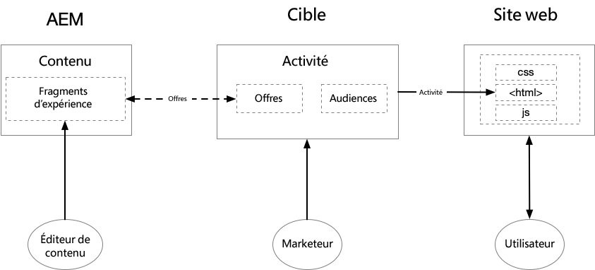
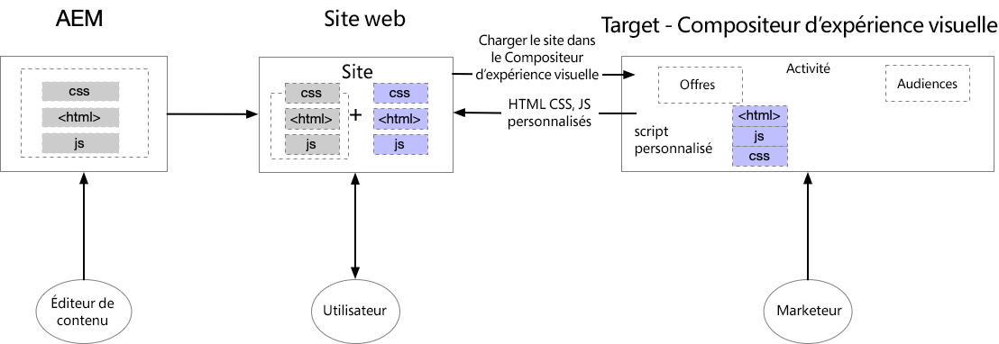
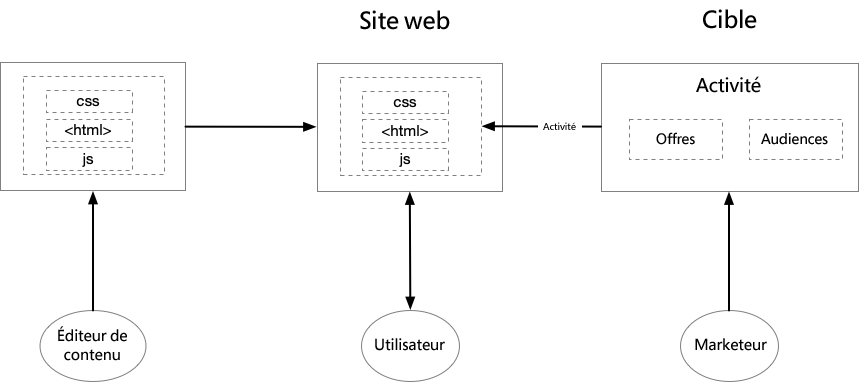

# Prise en main d’AEM et d’Adobe Target {#getting-started-with-aem-target}

L&#39;AEM et la Cible sont deux solutions puissantes avec des capacités qui semblent se chevaucher. Les clients ont parfois du mal à comprendre comment et quand utiliser ces produits conjointement pour offrir une expérience personnalisée. Pour offrir une expérience optimisée à chaque utilisateur final, différentes équipes de votre entreprise doivent travailler en étroite collaboration et définir qui fait quoi.

Dans ce didacticiel, nous abordons trois scénarios différents pour l’AEM et la Cible, qui vous aident à comprendre ce qui fonctionne le mieux pour votre organisation et comment les différentes équipes collaborent.

* Scénario 1 : Personnalisation à l’aide de fragments d’expérience AEM
* Scénario 2 : Personnalisation à l’aide du compositeur d’expérience visuelle
* Scénario 3 : Personnalisation des expériences de pages Web complètes

## Personnalisation à l’aide de fragments d’expérience AEM {#personalization-using-aem-experience-fragment}

Pour ce scénario, nous allons utiliser l&#39;AEM et la Cible. Il est clair que les deux produits ont leurs propres atouts et, lorsqu&#39;il s&#39;agit de fournir des expériences personnalisées aux utilisateurs de votre site, vous avez besoin **de contenu personnalisé (contenu de l&#39;AEM)** et d&#39;une **Cible (intelligente)** pour diffuser ces contenus en fonction d&#39;un utilisateur spécifique.

aem vous aide à créer du contenu personnalisé, en rassemblant l’ensemble de votre contenu et de vos ressources dans un emplacement central afin d’alimenter votre stratégie de personnalisation. aem vous permet de créer facilement du contenu pour les ordinateurs de bureau, les tablettes et les périphériques mobiles en un seul endroit sans écrire de code. Il n’est pas nécessaire de créer des pages pour chaque périphérique : AEM ajuste automatiquement chaque expérience à l’aide de votre contenu. Vous pouvez également exporter le contenu de l’AEM vers Adobe Target sous forme d’offres en appuyant sur un bouton.

Nous avons maintenant un contenu personnalisé sous la forme d&#39;Offres d&#39;AEM en Cible. La cible vous permet de diffuser ces offres à grande échelle en fonction d’une combinaison d’approches d’apprentissage automatique basées sur des règles et basées sur l’IA qui intègrent des variables comportementales, contextuelles et hors ligne.  Grâce à la Cible, vous pouvez facilement configurer et exécuter des activités A/B et multivariées (MVT) afin de déterminer les meilleures offres, contenus et expériences.

**Les** fragmentations d’expérience représentent un énorme pas en avant pour lier les créateurs de contenu/d’expérience aux professionnels de la personnalisation qui génèrent des résultats commerciaux en utilisant la Cible.

* aem auteurs d’éditeurs de contenu personnalisé le contenu en tant que fragments d’expérience et ses variations
* aem exporte le fragment d’expérience HTML vers la Cible &#x200B;
* Cible &#x200B; utilise les annotations AEM du fragment d’expérience comme Offres dans les Activités
* La cible fournit du code HTML de fragment d’expérience, AEM fournit des images référencées.

   

**Pour mettre en oeuvre ce scénario, vous devez :**

* [Intégration de l’AEM et de Adobe Target à l’aide de Launch et de Adobe I/O](./implementation.md#integrating-aem-target-options)
* [aem et Adobe Target à l’aide de Cloud Services hérités](./implementation.md#integrating-aem-target-options)

***Après avoir implémenté les intégrations ci-dessus, nous pouvons explorer le  [scénario en détail](./personalization-use-case-1.md).***

## Personnalisation à l’aide du compositeur d’expérience visuelle

Les marketeurs peuvent apporter rapidement des modifications à leur site Web sans modifier le code pour exécuter un test à l’aide du compositeur d’expérience visuelle Adobe Target. Le compositeur d’expérience visuelle est une interface utilisateur WYSIWYG (ce que vous voyez est ce que vous obtenez) qui vous permet de créer et de tester facilement des expériences et des Offres personnalisées dans le contexte du site. Vous pouvez créer des expériences et des Offres pour les activités de Cible en faisant glisser-déposer, en permutant et en modifiant la mise en page et le contenu d’une page Web (ou d’une Offre) ou d’une page Web mobile.

Le compositeur d’expérience visuelle est l’une des principales caractéristiques de l’Adobe Target. Le compositeur d’expérience visuelle permet aux marketeurs et aux concepteurs de créer et de modifier du contenu à l’aide d’une interface visuelle. De nombreux choix de conception peuvent être effectués sans avoir à modifier directement le code. Il est également possible de modifier du code HTML et du code JavaScript à l’aide des options d’édition disponibles dans le compositeur.

* Le contenu réside dans AEM, et les éditeurs de contenu créent et gèrent les pages du site.
* Cible utilise AEM pages hébergées du site pour exécuter des tests et personnaliser
* La cible fournit du contenu personnalisé
* Nouveau contenu net créé à l’aide du compositeur d’expérience visuelle Adobe Target
* S’applique à la fois aux sites AEM hébergés et aux sites non AEM hébergés.

   

**Pour mettre en oeuvre ce scénario, vous devez :**

* [Intégration de l’AEM et de Adobe Target à l’aide de Launch et de Adobe I/O](./implementation.md#integrating-aem-target-options)

***Après avoir mis en oeuvre l’intégration ci-dessus, explorons le  [scénario en détail.](./personalization-use-case-3.md)***

## Personnalisation des expériences de pages Web complètes

L’intégration de Adobe Experience Manager à Adobe Target vous aide à offrir une expérience personnalisée aux utilisateurs de votre site. En outre, il vous permet également de mieux comprendre les versions du contenu de votre site Web qui améliorent le mieux vos conversions au cours d’une période de test spécifiée. Par exemple, un test A/B compare deux versions ou plus du contenu de votre site Web pour identifier celle qui génère le plus de conversions, de ventes ou d’autres mesures que vous identifiez. Un spécialiste du marketing peut créer des activités dans Adobe Target pour comprendre comment les utilisateurs interagissent avec le contenu de votre site et comment il affecte les mesures de votre site.

* Le contenu réside dans AEM, et les éditeurs de contenu créent et gèrent les pages du site.
* Cible utilise AEM pages hébergées du site pour exécuter des tests et personnaliser
* La cible fournit du contenu personnalisé
* Aucun nouveau contenu net n&#39;est créé ici
* S’applique aux sites AEM et non AEM

   

**Pour mettre en oeuvre ce scénario, vous devez :**

* [Intégration de l’AEM et de Adobe Target à l’aide de Launch et de Adobe I/O](./implementation.md#integrating-aem-target-options)

***Après avoir mis en oeuvre l’intégration ci-dessus, explorons le  [scénario en détail.](./personalization-use-case-2.md)***
