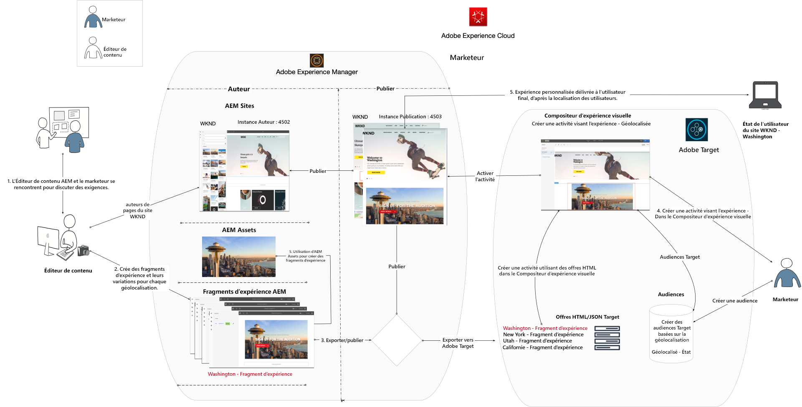
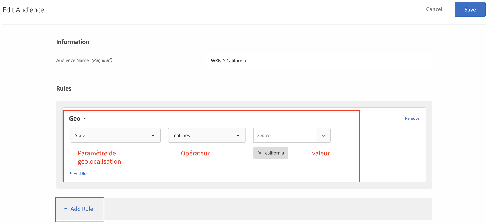
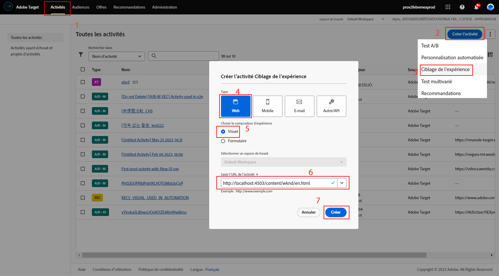
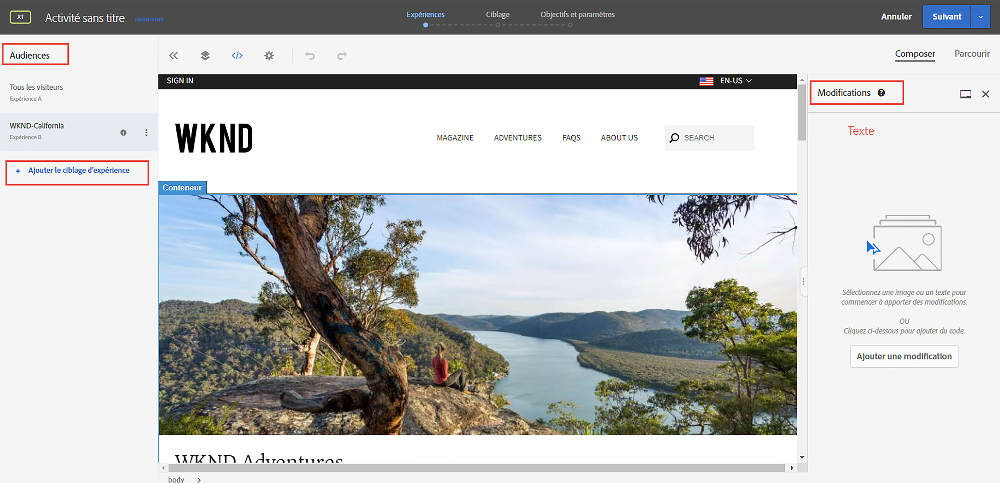
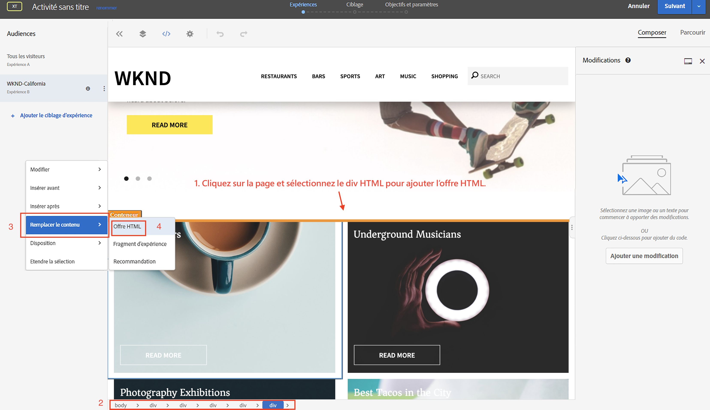
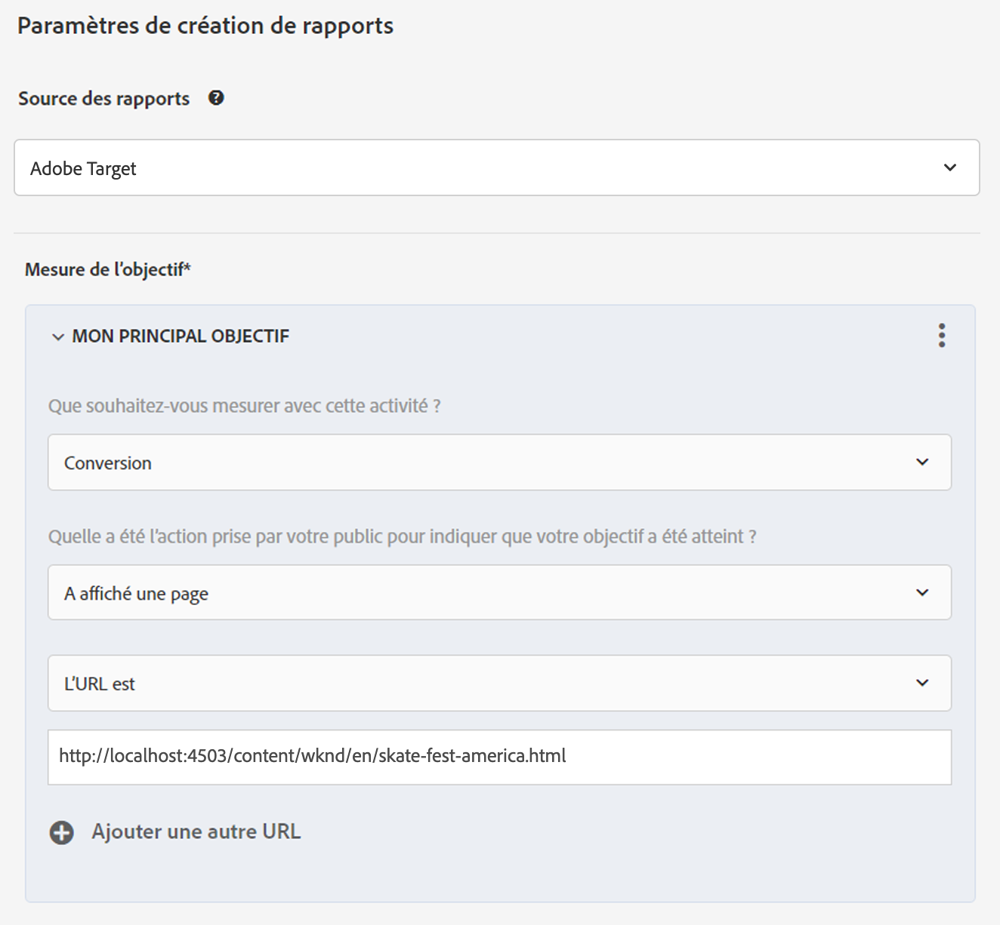
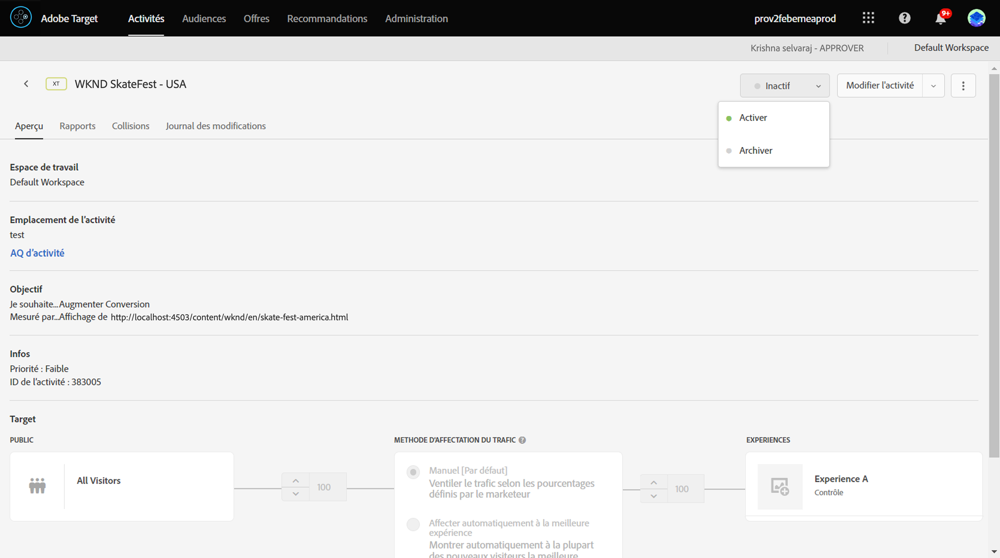
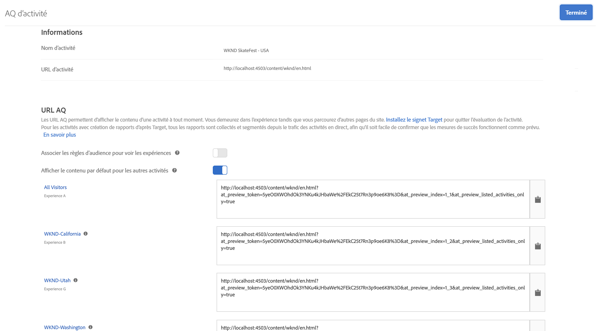

# Personnalisation à l’aide de fragments d’expérience AEM et d’Adobe Target

Grâce à la possibilité d’exporter des fragments d’expérience AEM dans Adobe Target en tant qu’offres HTML, vous pouvez combiner la facilité d’utilisation et la puissance de l’AEM avec de puissantes fonctionnalités d’intelligence automatisée (AI) et d’apprentissage automatique (ML) en Cible pour tester et personnaliser des expériences à grande échelle.

aem rassemble l’ensemble de vos contenus et ressources dans un emplacement central afin d’alimenter votre stratégie de personnalisation. aem vous permet de créer facilement du contenu pour les ordinateurs de bureau, les tablettes et les périphériques mobiles à un seul emplacement sans écrire de code. Il n’est pas nécessaire de créer des pages pour chaque périphérique : AEM ajuste automatiquement chaque expérience à l’aide de votre contenu.

La cible vous permet de proposer des expériences personnalisées à l’échelle en fonction d’une combinaison d’approches d’apprentissage automatique basées sur des règles et basées sur l’IA qui intègrent des variables comportementales, contextuelles et hors ligne.  Grâce à la Cible, vous pouvez facilement configurer et exécuter des activités A/B et multivariées (MVT) afin de déterminer les meilleures offres, contenus et expériences.

Les fragments d’expérience représentent un grand pas en avant pour lier les créateurs de contenu aux marketeurs qui génèrent des résultats commerciaux à l’aide de la Cible.

## Présentation du scénario

Le site WKND prévoit d&#39;annoncer un **SkateFest Challenge** à travers l&#39;Amérique à travers son site Web et aimerait que les utilisateurs du site s&#39;inscrivent à l&#39;audition organisée dans chaque Etat. En tant que spécialiste du marketing, vous avez reçu la tâche d’exécuter une campagne sur la page d&#39;accueil du site WKND, avec des bannières indiquant l’emplacement des utilisateurs et un lien vers la page des détails du événement. Examinons la page d&#39;accueil du site WKND et apprenons à créer et à offrir une expérience personnalisée à un utilisateur en fonction de son emplacement actuel.

### Utilisateurs impliqués

Pour cet exercice, les utilisateurs suivants doivent être impliqués et pour exécuter certaines tâches, vous pouvez avoir besoin d’un accès administratif.

* **Producteur de contenu / Editeur** de contenu (Adobe Experience Manager)
* **Marketer** (Adobe Target / Équipe d’optimisation)

### Conditions préalables

* **AEM**
   * [aem instance](./implementation.md#getting-aem) d’auteur et de publication s’exécutant sur localhost 4502 et 4503, respectivement.
* **Experience Cloud**
   * Accès à vos organisations Adobe Experience Cloud - <https://>`<yourcompany>`.experience ecloud.adobe.com
   * experience cloud doté des solutions suivantes
      * [Adobe Target](https://experiencecloud.adobe.com)

### Page d&#39;accueil du site WKND

1. Marketer initie la discussion de campagne WKND SkateFest avec AEM Content Editor et détaille les exigences.
   * ***Exigence***: Faites la promotion de la campagne WKND SkateFest sur la page d&#39;accueil du site WKND avec du contenu personnalisé pour les visiteurs de chaque Etat des Etats-Unis. ajoutez un nouveau bloc de contenu sous le carrousel de Page d&#39;accueil contenant une image d’arrière-plan, du texte et un bouton.
      * **Image** d&#39;arrière-plan : L’image doit être adaptée à l’état d’où provient l’utilisateur qui consulte la page du site WKND.
      * **Texte**: &quot;Inscrivez-vous aux Auditions&quot;
      * **Bouton**: &quot;Détails du Événement&quot; pointant vers la page WKND SkateFest
      * **WKND SkateFest Page**: une nouvelle page contenant les détails du événement, y compris le lieu, la date et l’heure de l’audition.
2. En fonction des exigences, AEM Editeur de contenu crée un fragment d’expérience pour le bloc de contenu et l’exporte dans Adobe Target en tant qu’Offre. Pour offrir un contenu personnalisé à tous les états des États-Unis, l’auteur de contenu peut créer une variation principale de fragment d’expérience, puis créer 50 autres variations, une pour chaque état. Le contenu de chaque variation d’état avec les images et le texte appropriés peut ensuite être modifié manuellement. Lors de la création d’un fragment d’expérience, les éditeurs de contenu peuvent accéder rapidement à l’ensemble des ressources disponibles dans AEM Assets à l’aide de l’option Outil de recherche de ressources. Lorsqu’un fragment d’expérience est exporté vers Adobe Target, toutes ses variations sont également transférées vers Adobe Target en tant qu’Offres.

3. Après avoir exporté un fragment d’expérience d’AEM vers Adobe Target en tant qu’Offres, les spécialistes du marketing peuvent créer une Activité dans la Cible à l’aide de ces Offres. Selon la campagne SkateFest du site WKND, le spécialiste du marketing doit créer et offrir une expérience personnalisée aux visiteurs du site WKND de chaque état. Pour créer une activité de ciblage d’expérience, le spécialiste du marketing doit identifier les audiences. Pour notre campagne WKND SkateFest, nous devons créer 50 audiences distinctes, en fonction de leur emplacement d&#39;où elles visitent le site Web de WKND.
   * [Les Audiences](https://docs.adobe.com/content/help/en/target/using/introduction/target-key-concepts.html#section_3F32DA46BDF947878DD79DBB97040D01) définissent la cible de votre activité et sont utilisées partout où le ciblage est disponible. Les audiences de cible sont un ensemble défini de critères visiteurs. Les Offres peuvent être ciblées sur des audiences (ou segments) spécifiques. Seuls les visiteurs qui appartiennent à cette audience voient l’expérience qui leur est ciblée.  Par exemple, vous pouvez fournir une offre à une audience composée de visiteurs qui utilisent un navigateur particulier ou d’un emplacement géographique spécifique.
   * Une [Offre](https://docs.adobe.com/content/help/en/target/using/introduction/target-key-concepts.html#section_973D4CC4CEB44711BBB9A21BF74B89E9) est le contenu qui s’affiche sur vos pages Web pendant les campagnes ou les activités. Lorsque vous testez vos pages Web, vous mesurez le succès de chaque expérience avec différentes offres dans vos emplacements. Une Offre peut contenir différents types de contenu, notamment :
      * Image
      * Text (Texte)
      * **HTML**
         * *Les Offres HTML seront utilisées pour l&#39;Activité de ce scénario*
      * Lien
      * Bouton

## Activités de l’éditeur de contenu

>[!VIDEO](https://video.tv.adobe.com/v/28596?quality=12&learn=on)

>[!NOTE]
>
>Publiez le fragment d’expérience avant de l’exporter vers Adobe Target.

## Activités du marketeur

### Création d’une Audience avec le géociblage {#marketer-audience}

1. Accédez à votre entreprise [Adobe Experience Cloud](https://experiencecloud.adobe.com/) (<https://>`<yourcompany>`.experience encecloud.adobe.com)
2. Connectez-vous à l’aide de votre Adobe ID et assurez-vous que vous êtes dans l’organisation appropriée.
3. Dans le sélecteur de solution, cliquez sur **Cible** , puis **lancez** Adobe Target.

   

4. Accédez à l&#39;onglet **Offres** et recherchez &quot;offres WKND&quot;. Vous devriez être en mesure d’afficher la liste des variations de fragments d’expérience, exportées à partir d’AEM en tant qu’Offres HTML. Chaque Offre correspond à un état. Par exemple, *WKND SkateFest California* est l’offre qui est transmise à un visiteur du site WKND de Californie.

   

5. Dans la navigation principale, cliquez sur **Audiences**.

   Un spécialiste du marketing doit créer 50 audiences distinctes pour les visiteurs du site WKND provenant de chaque État des États-Unis d&#39;Amérique.

6. Pour créer une audience, cliquez sur le bouton **Créer une Audience** et donnez un nom à votre audience.

   **Format du nom de l&#39;Audience : WKND-\&lt;*state*\>**

   

7. Click **Add Rule > Geo**.
8. Cliquez sur **Sélectionner**, puis sélectionnez l’une des options suivantes :
   * Pays
   * **Etat** *(sélectionnez Etat pour le site WKND SkateFest Campaign)*
   * Ville
   * Code postal
   * Latitude
   * Longitude
   * DMA
   * Opérateur de téléphonie mobile

   **Géo** : utilisez les audiences pour les utilisateurs de la cible en fonction de leur emplacement géographique, notamment leur pays, état/province, ville, code postal, zone desservie ou opérateur de téléphonie mobile. Les paramètres de géolocalisation vous permettent d’cible des activités et des expériences en fonction de la géographie de vos visiteurs. Ces données sont envoyées avec chaque demande de Cible et sont basées sur l’adresse IP du visiteur. Sélectionnez ces paramètres comme n’importe quelle valeur de ciblage.

   >[!NOTE]
   >Une fois par visite (session), une adresse IP d’un visiteur est transmise avec une requête de mbox afin de résoudre les paramètres de géociblage de ce visiteur.

9. Sélectionnez l’opérateur **correspondant**, fournissez une valeur appropriée (Par exemple : Californie) et **enregistrez** vos modifications. Dans notre cas, indiquez le nom de l’état.

   

   >[!NOTE]
   >Plusieurs règles peuvent être attribuées à une audience.

10. Répétez les étapes 6 à 9 pour créer des audiences pour les autres états.

   

À ce stade, nous avons créé avec succès des audiences pour tous les visiteurs du site WKND dans différents états des États-Unis d&#39;Amérique et nous avons également l&#39;offre HTML correspondante pour chaque état. Alors maintenant, créons une activité de ciblage d’expérience pour cible de l’audience avec une offre correspondante pour la Page d&#39;accueil du site WKND.

### Création d’une Activité avec le géociblage

1. Dans la fenêtre Adobe Target, accédez à l&#39;onglet **Activités** .
2. Cliquez sur **Créer une Activité** et sélectionnez le type d’activité de ciblage **d’** expérience.
3. Sélectionnez le canal **Web** et choisissez le compositeur d’expérience **** visuelle.
4. Saisissez l’URL **de l’** Activité et cliquez sur **Suivant** pour ouvrir le compositeur d’expérience visuelle.

   URL de publication de la Page d&#39;accueil du site WKND : http://localhost:4503/content/wknd/en.html
   
5. Pour que le compositeur **d’expérience** visuelle se charge, activez l’option **Autoriser le chargement des scripts** non sécurisés dans votre navigateur et rechargez votre page.
   
6. Notez que la page d&#39;accueil de site WKND s’ouvre dans l’éditeur du compositeur d’expérience visuelle.
   
7. Pour ajouter une audience à votre compositeur d’expérience visuelle, cliquez sur **Ajouter le ciblage** d’expérience sous Audiences, puis sélectionnez l’audience WKND-California et cliquez sur **Suivant**.
   
8. Cliquez sur la page du site WKND dans le compositeur d’expérience visuelle, sélectionnez l’élément HTML pour ajouter l’offre pour l’audience WKND-California, puis choisissez l’option **Remplacer par** , puis sélectionnez l’Offre ****HTML.
   
9. Sélectionnez l’offre HTML **WKND SkateFest California** pour l’audience **WKND-California** dans l’offre sélectionnez UI et cliquez sur **Terminé**.
10. Vous devriez maintenant pouvoir voir l&#39;Offre HTML **WKND SkateFest California** ajoutée à votre page de site WKND pour l&#39;audience WKND-California.
11. Répétez les étapes 7 à 10 pour ajouter le ciblage d’expérience pour les autres états et sélectionnez l’Offre HTML correspondante.
12. Cliquez sur **Suivant** pour continuer et vous pouvez voir un mappage des Audiences aux expériences.
13. Cliquez sur **Suivant** pour passer à Objectifs et paramètres.
14. Choisissez votre source de rapports et identifiez un objectif Principal pour votre activité. Pour notre scénario, sélectionnez la source du Rapports comme **Adobe Target**, mesurez l&#39;activité comme **Conversion**, l&#39;action comme vue sur une page et l&#39;URL pointant vers la page Détails de WKND SkateFest.
   

   >[!NOTE]
   >Vous pouvez également choisir Adobe Analytics comme source de rapports.

15. Passez la souris sur le nom actuel de l’activité et vous pouvez le renommer en **WKND SkateFest - USA**, puis **Enregistrer et fermer** vos modifications.
16. Dans l’écran Détails de l’Activité, veillez à **activer** votre activité.
   
17. Votre WKND SkateFest Campaign est maintenant en direct pour tous les visiteurs du site WKND.
18. Accédez à la Page d&#39;accueil [du site](http://localhost:4503/content/wknd/en.html)WKND et vous devriez être en mesure de voir l&#39;Offre WKND SkateFest en fonction de votre emplacement géographique (*état : Californie*).
   

### Contrôle qualité de l&#39;Activité cible

1. Sous l’onglet Détails de l’ **Activité > Aperçu** , cliquez sur le bouton Contrôle qualité **des** Activités et vous pouvez obtenir le lien Contrôle qualité direct vers toutes vos expériences.
   
2. Accédez à la Page d&#39;accueil [du site](http://localhost:4503/content/wknd/en.html)WKND et vous devriez être en mesure de voir l&#39;Offre WKND SkateFest en fonction de votre géolocalisation (état).
3. Regardez la vidéo ci-dessous pour comprendre comment une offre est diffusée sur votre page, comment personnaliser des jetons de réponse et effectuer un contrôle de qualité.

>[!VIDEO](https://video.tv.adobe.com/v/28658?quality=12&learn=on)

## Résumé

Dans ce chapitre, un éditeur de contenu a été en mesure de créer tout le contenu pour prendre en charge la campagne WKND SkateFest dans Adobe Experience Manager et de l’exporter vers Adobe Target en tant qu’Offres HTML, afin de créer le ciblage d’expérience, en fonction de la géolocalisation des utilisateurs.
