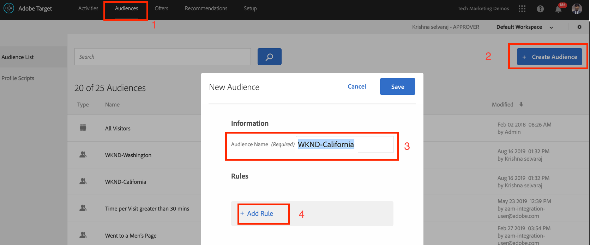
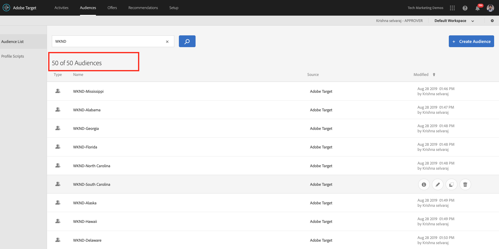
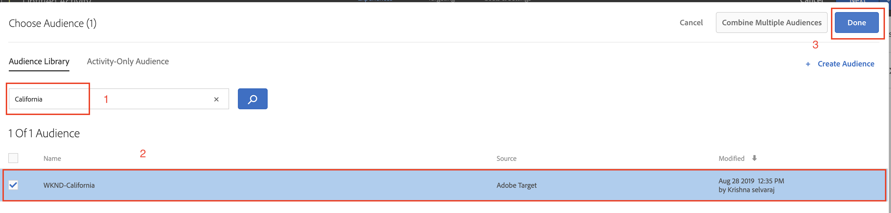

# Personnalisation à l’aide des fragments d’expérience AEM et d’Adobe Target

Grâce à la possibilité d’exporter des fragments d’expérience AEM vers Adobe Target en tant qu’offres HTML, vous pouvez combiner la facilité d’utilisation et la puissance d’AEM avec de puissantes fonctionnalités d’intelligence automatisée (AI) et de machine learning (ML) dans Target, afin de tester et de personnaliser des expériences à grande échelle.

AEM regroupe l’ensemble de votre contenu et de vos ressources dans un emplacement central afin d’alimenter votre stratégie de personnalisation. AEM vous permet de créer facilement du contenu à un seul endroit pour les ordinateurs de bureau, les tablettes et les appareils mobiles, sans devoir écrire de code. Il n’est pas nécessaire de créer des pages pour chaque appareil : AEM ajuste automatiquement chaque expérience à l’aide de votre contenu.

Target vous permet de diffuser des expériences personnalisées à grande échelle sur la base d’une combinaison d’approches de machine learning basées sur des règles et pilotées par l’IA, qui intègrent des variables comportementales, contextuelles et hors ligne.  Avec Target, vous pouvez facilement configurer et exécuter des activités de tests A/B et multivariés (MVT) afin de déterminer les offres, expériences et contenus les mieux adaptés.

Les fragments d’expérience représentent un énorme pas en avant permettant de lier les créateurs et créatrices de contenu aux marketeurs et marketeuses qui génèrent des résultats commerciaux à l’aide de Target.

## Vue d’ensemble du scénario

Le site WKND prévoit d’annoncer un **SkateFest Challenge** à travers toute l’Amérique via leur site web et souhaite que les utilisateurs et utilisatrices du site s’inscrivent à l’audition conduite dans chaque État. En tant que marketeur ou marketeuse, vous avez la tâche de mener une campagne sur la page d’accueil du site WKND, avec des bannières pertinentes selon l’emplacement des utilisateurs et utilisatrices et un lien vers la page de détails de l’événement. Explorons la page d’accueil du site WKND et apprenons à créer et à offrir une expérience personnalisée à un utilisateur ou une utilisatrice en fonction de son emplacement actuel.

### Utilisateurs et utilisatrices impliqués

Pour cet exercice, les utilisateurs et utilisatrices suivants doivent être impliqués et effectuer certaines tâches nécessitant un accès administratif.

* **Producteur ou productrice de contenu/éditeur ou éditrice de contenu** (Adobe Experience Manager)
* **Marketeur ou marketeuse** (Adobe Target/équipe d’optimisation)

### Conditions préalables

* **AEM**
   * [Instances de création et de publication AEM](./implementation.md#getting-aem) s’exécutant sur localhost 4502 et 4503, respectivement.
* **Experience Cloud**
   * Accéder à la solution Adobe Experience Cloud de votre organisation - `https://<yourcompany>.experiencecloud.adobe.com`
   * Experience Cloud est fourni avec les solutions suivantes
      * [Adobe Target](https://experiencecloud.adobe.com)

### Page d’accueil du site WKND

1. Le marketeur ou la marketeuse lance la discussion de campagne WKND SkateFest avec l’éditeur ou l’éditrice de contenu AEM et détaille les exigences.
   * ***Exigence*** : promouvoir la campagne WKND SkateFest sur la page d’accueil du site WKND avec du contenu personnalisé pour les visiteurs et visiteuses de chaque État des États-Unis. Ajouter un nouveau bloc de contenu sous le carrousel de page d’accueil contenant une image d’arrière-plan, du texte et un bouton.
      * **Image d’arrière-plan** : l’image doit correspondre à l’État depuis lequel l’utilisateur ou l’utilisatrice visite la page du site WKND.
      * **Texte** : « Inscrivez-vous aux auditions ».
      * **Bouton** : « Détails de l’événement » pointant vers la page WKND SkateFest.
      * **Page WKND SkateFest** : nouvelle page contenant les détails de l’événement, notamment le lieu, la date et l’heure de l’audition.
1. Selon les exigences, l’éditeur ou éditrice de contenu AEM crée un fragment d’expérience pour le bloc de contenu et l’exporte vers Adobe Target en tant qu’offre. Pour diffuser du contenu personnalisé pour tous les États des États-Unis, l’auteur ou autrice de contenu peut créer une variation principale de fragment d’expérience, puis créer 50 autres variations, une pour chaque État. Le contenu de chaque variation d’État avec les images et le texte appropriés peut ensuite être modifié manuellement. Lors de la création d’un fragment d’expérience, les éditeurs et éditrices de contenu peuvent accéder rapidement à toutes les ressources disponibles dans AEM Assets à l’aide de l’option de recherche de ressources. Lorsqu’un fragment d’expérience est exporté vers Adobe Target, toutes ses variations sont également transférées vers Adobe Target en tant qu’offres.

1. Après avoir exporté le fragment d’expérience d’AEM vers Adobe Target en tant qu’offres, les marketeurs et marketeuses peuvent créer une activité dans Target à l’aide de ces offres. Sur la base de la campagne SkateFest du site WKND, le marketeur ou la marketeuse doit créer et offrir une expérience personnalisée aux visiteurs et visiteuses du site WKND de chaque État. Pour créer une activité de ciblage d’expérience, le marketeur ou la marketeuse doit identifier les audiences. Pour notre campagne WKND SkateFest, nous devons créer 50 audiences distinctes en fonction de l’emplacement d’où elles visitent le site web WKND.
   * Les [audiences](https://experienceleague.adobe.com/docs/target/using/introduction/target-key-concepts.html?lang=fr#section_3F32DA46BDF947878DD79DBB97040D01) définissent la cible de votre activité et sont utilisées partout où le ciblage est disponible. Les audiences cibles sont un ensemble défini de critères de visiteurs et visiteuses. Les offres peuvent être ciblées sur des audiences (ou des segments) spécifiques. Seuls les visiteurs et visiteuses qui appartiennent à cette audience voient l’expérience qui est ciblée sur eux.  Par exemple, vous pouvez diffuser une offre à une audience composée de visiteurs et visiteuses qui utilisent un navigateur particulier ou d’une zone géographique spécifique.
   * Une [offre](https://experienceleague.adobe.com/docs/target/using/introduction/target-key-concepts.html?lang=fr#section_973D4CC4CEB44711BBB9A21BF74B89E9) est le contenu qui s’affiche sur vos pages web au cours des campagnes ou activités. Lorsque vous testez vos pages web, vous mesurez le succès de chaque expérience avec différentes offres dans vos emplacements. Une offre peut contenir différents types de contenu, notamment :
      * Image
      * Texte
      * **HTML**
         * *Les offres HTML sont utilisées pour l’activité de ce scénario.*
      * Lien
      * Bouton

## Activités du créateur ou de la créatrice de contenu

>[!VIDEO](https://video.tv.adobe.com/v/28596?quality=12&learn=on)

>[!NOTE]
>
>Publiez le fragment d’expérience avant de l’exporter vers Adobe Target.

## Activités de la personne spécialiste marketing

### Créer une audience avec le géociblage {#marketer-audience}

1. Accédez à vos organisations [Adobe Experience Cloud](https://experiencecloud.adobe.com/) (`<https://<yourcompany>.experiencecloud.adobe.com`).
1. Connectez-vous à l’aide de votre Adobe ID et assurez-vous que vous vous trouvez dans la bonne organisation.
1. Dans le sélecteur de solution, cliquez sur **Target**, puis **démarrer** Adobe Target.

   

1. Accédez à l’onglet **Offres** et recherchez les offres « WKND ». Vous devriez être en mesure de voir la liste des variations de fragments d’expérience, exportées à partir d’AEM en tant qu’offres en HTML. Chaque offre correspond à un État. Par exemple : *WKND SkateFest California* est l’offre qui est diffusée à une personne visitant le site WKND de Californie.

   

1. Dans la navigation principale, cliquez sur **Audiences**.

   La personne chargée du marketing doit créer 50 audiences distinctes pour les visiteurs et les visiteuses du site WKND provenant de chaque État des États-Unis d’Amérique.

1. Pour créer une audience, cliquez sur le bouton **Créer une audience** et attribuez un nom à votre audience.

   **Format du nom de l’audience : WKND-\&lt;*state*\>**

   

1. Cliquez sur **Ajouter une règle > Géo**.
1. Cliquez sur **Sélectionner**, puis sélectionnez l’une des options suivantes :
   * Pays
   * **État** *(sélectionnez l’État pour la campagne SkateFest du site WKND).*
   * Ville
   * Code postal
   * Latitude
   * Longitude
   * DMA
   * Opérateur de téléphonie mobile

   **Géo** : utilisez les audiences pour cibler les utilisateurs et les utilisatrices en fonction de leur emplacement géographique, notamment en fonction de leur pays, État/province, ville, code postal, DMA ou opérateur de téléphonie mobile. Les paramètres de géolocalisation vous permettent de cibler des activités et des expériences en fonction de l’emplacement géographique de vos visiteurs et visiteuses. Ces données sont envoyées avec chaque requête Target et basées sur l’adresse IP du visiteur ou de la visiteuse. Sélectionnez ces paramètres comme n’importe quelle autre valeur de ciblage.

   >[!NOTE]
   >L’adresse IP de la personne est transmise avec une requête mbox, une fois par visite (session), afin de résoudre les paramètres de géociblage de cette personne.

1. Sélectionnez l’opérateur **correspondant**, indiquez une valeur appropriée (par exemple : Californie) et cliquez sur **Enregistrer** pour enregistrer vos modifications. Dans notre cas, indiquez le nom de l’État.

   

   >[!NOTE]
   >Plusieurs règles peuvent être affectées à une audience.

1. Répétez les étapes 6 à 9 pour créer des audiences pour les autres États.

   

Jusqu’à présent, vous avez créé des audiences pour tous les visiteurs et visiteuses du site WKND dans les différents États américains, et chaque État a son offre HTML correspondante. Vous allez maintenant créer une activité de ciblage d’expérience afin de cibler l’audience avec une offre correspondante pour la page d’accueil du site WKND.

### Créer une activité avec le géociblage

1. Dans la fenêtre Adobe Target, accédez à l’onglet **Activités**.
1. Cliquez sur **Créer une activité** et sélectionnez le type d’activité **Ciblage d’expérience**.
1. Sélectionnez le canal **Web**, puis choisissez le **Compositeur d’expérience visuelle**.
1. Saisissez l’**URL de l’activité** et cliquez sur **Suivant** pour ouvrir le compositeur d’expérience visuelle.

   URL de publication de la page d’accueil du site WKND : http://localhost:4503/content/wknd/en.html.

   

1. Pour permettre le chargement du **Compositeur d’expérience visuelle**, activez la case **Autoriser le chargement de scripts non sécurisés** dans le navigateur et actualisez la page.

   

1. Notez que la page d’accueil du site WKND s’ouvre dans l’éditeur du compositeur d’expérience visuelle.

   

1. Pour ajouter une audience au compositeur d’expérience visuelle, cliquez sur **Ajouter un ciblage d’expérience** sous Audiences, puis sélectionnez l’audience WKND-California et cliquez sur **Suivant**.

   

1. Cliquez sur la page du site WKND dans le compositeur d’expérience visuelle, sélectionnez l’élément HTML permettant d’ajouter l’offre à l’audience WKND-California, puis choisissez l’option **Remplacer par** et sélectionnez l’**Offre HTML**.

   

1. Sélectionnez l’offre HTML **WKND SkateFest California** pour l’audience **WKND-California** dans l’interface utilisateur de sélection des offres et cliquez sur **Terminé**.
1. L’offre HTML **WKND SkateFest California** est à présent ajoutée à votre page de site WKND pour l’audience WKND-California.
1. Répétez les étapes 7 à 10 pour ajouter le ciblage d’expérience pour les autres États et choisir l’offre HTML correspondante.
1. Cliquez sur **Suivant** pour continuer et afficher un mappage entre les audiences et les expériences.
1. Cliquez sur **Suivant** pour accéder aux objectifs et aux paramètres.
1. Sélectionnez votre source de création de rapports et identifiez un objectif principal pour votre activité. Pour notre scénario, sélectionnez la source de création de rapports **Adobe Target**, l’activité de mesure **Conversion**, l’action Page vue et indiquez l’URL de la page de détails de SkateFest WKND.

   

   >[!NOTE]
   >Libre à vous de choisir Adobe Analytics comme source de création de rapports.

1. Passez la souris sur le nom actuel de l’activité et renommez-la **WKND SkateFest - USA**, puis **Enregistrez et fermez** vos modifications.
1. Dans l’écran Détails de l’activité, veillez à **Activer** votre activité.

   

1. Votre campagne SkateFest WKND est maintenant en ligne, pour le plus grand bonheur des visiteurs et visiteuses du site WKND.
1. Accédez à la [Page d’accueil du site WKND](http://localhost:4503/content/wknd/en.html) pour découvrir l’offre SkateFest WKND basée sur votre géolocalisation (*État : Californie*).

   

### QA de l’activité Target

1. Sous l’onglet **Détails de l’activité > Vue d’ensemble**, cliquez sur le bouton **QA de l’activité** pour obtenir le lien direct QA vers toutes vos expériences.

   

1. Accédez à la [Page d’accueil du site WKND](http://localhost:4503/content/wknd/en.html) pour afficher l’offre SkateFest WKND basée sur votre géolocalisation (État).
1. Regardez la vidéo ci-dessous pour comprendre comment une offre est diffusée sur votre page, comment personnaliser les jetons de réponse et effectuer un contrôle qualité.

>[!VIDEO](https://video.tv.adobe.com/v/28658?quality=12&learn=on)

## Résumé

Dans ce chapitre, un éditeur de contenu a créé tout le contenu nécessaire à la prise en charge de la campagne SkateFest WKND dans Adobe Experience Manager avant de l’exporter vers Adobe Target en tant qu’offres HTML à des fins de ciblage d’expérience en fonction de la géolocalisation des utilisateurs et utilisatrices.
