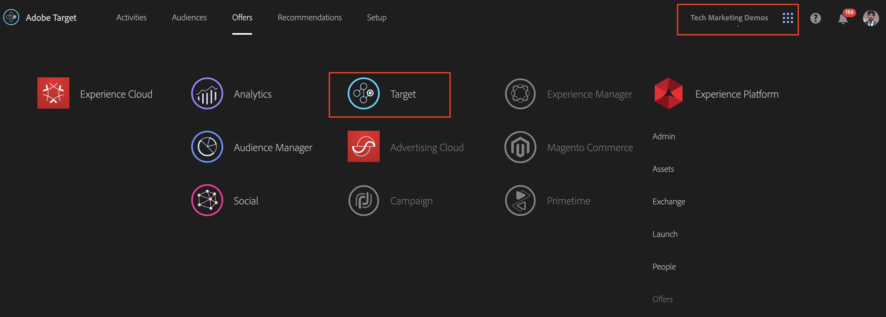
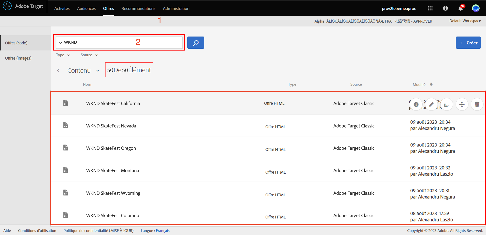

# Personnalisation à l’aide des fragments d’expérience AEM et d’Adobe Target

Grâce à la possibilité d’exporter des fragments d’expérience AEM vers Adobe Target sous forme d’offres HTML, vous pouvez combiner la facilité d’utilisation et la puissance d’AEM avec de puissantes fonctionnalités d’intelligence automatisée (AI) et d’apprentissage automatique (ML) dans Target afin de tester et de personnaliser des expériences à grande échelle.

AEM rassemble l’ensemble de votre contenu et de vos ressources à un emplacement central afin d’alimenter votre stratégie de personnalisation. AEM vous permet de créer facilement du contenu pour les ordinateurs de bureau, les tablettes et les appareils mobiles à un seul emplacement sans devoir écrire de code. Il n’est pas nécessaire de créer des pages pour chaque appareil : AEM ajuste automatiquement chaque expérience à l’aide de votre contenu.

Target vous permet de proposer des expériences personnalisées à grande échelle en fonction d’une combinaison d’approches d’apprentissage automatique basées sur des règles et basées sur l’IA qui intègrent des variables comportementales, contextuelles et hors ligne.  Avec Target, vous pouvez facilement configurer et exécuter des activités A/B et multivariées (MVT) afin de déterminer les meilleures offres, contenus et expériences.

Les fragments d’expérience représentent un énorme pas en avant pour lier les créateurs de contenu aux marketeurs qui génèrent des résultats commerciaux à l’aide de Target.

## Présentation du scénario

Le site WKND prévoit d’annoncer un **SkateFest Challenge** à travers l’Amérique à travers son site web et souhaite que les utilisateurs du site s’inscrivent à l’audition qui aura lieu dans chaque Etat. En tant que marketeur, vous avez la tâche d’exécuter une campagne sur la page d’accueil du site WKND, avec des bannières indiquant l’emplacement des utilisateurs et un lien vers la page de détails de l’événement. Explorons la page d’accueil du site WKND et apprenons à créer et à offrir une expérience personnalisée à un utilisateur en fonction de son emplacement actuel.

### Utilisateurs impliqués

Pour cet exercice, les utilisateurs suivants doivent être impliqués et effectuer certaines tâches nécessitant un accès administratif.

* **Producteur de contenu/éditeur de contenu**  (Adobe Experience Manager)
* **Marketer**  (Adobe Target/équipe d’optimisation)

### Prérequis

* **AEM **
   * [AEM instance de création et d’édition ](./implementation.md#getting-aem) sur localhost 4502 et 4503 respectivement.
* **Experience Cloud**
   * Accès à vos organisations Adobe Experience Cloud - <https://>`<yourcompany>`.experiencecloud.adobe.com
   * Experience Cloud fourni avec les solutions suivantes
      * [Adobe Target](https://experiencecloud.adobe.com)

### Page d’accueil du site WKND

1. Marketer lance la discussion de campagne WKND SkateFest avec AEM Content Editor et détaille les exigences.
   * ***Condition requise*** : Convertissez la campagne WKND SkateFest sur la page d’accueil du site WKND avec du contenu personnalisé pour les visiteurs de chaque état aux États-Unis. Ajoutez un nouveau bloc de contenu sous le carrousel de page d’accueil contenant une image d’arrière-plan, du texte et un bouton.
      * **Image d’arrière-plan** : L’image doit correspondre à l’état à partir duquel l’utilisateur visite la page du site WKND.
      * **Texte** : &quot;Inscrivez-vous aux Auditions&quot;
      * **Bouton** : &quot;Détails de l’événement&quot; pointant vers la page WKND SkateFest
      * **Page** WKND SkateFest : une nouvelle page contenant les détails de l’événement, notamment le lieu, la date et l’heure de l’audition.
1. Selon les besoins, AEM Éditeur de contenu crée un fragment d’expérience pour le bloc de contenu et l’exporte vers Adobe Target as a Offer. Pour diffuser du contenu personnalisé pour tous les états des États-Unis, l’auteur de contenu peut créer une variation principale de fragment d’expérience, puis créer 50 autres variations, une pour chaque état. Le contenu de chaque variation d’état avec les images et le texte appropriés peut ensuite être modifié manuellement. Lors de la création d’un fragment d’expérience, les éditeurs de contenu peuvent accéder rapidement à toutes les ressources disponibles dans AEM Assets à l’aide de l’option de recherche de ressources. Lorsqu’un fragment d’expérience est exporté vers Adobe Target, toutes ses variantes sont également transférées vers Adobe Target en tant qu’offres.

1. Après avoir exporté le fragment d’expérience d’AEM vers Adobe Target en tant qu’offres, les marketeurs peuvent créer une activité dans Target à l’aide de ces offres. Sur la base de la campagne SkateFest du site WKND, le marketeur doit créer et offrir une expérience personnalisée aux visiteurs du site WKND de chaque État. Pour créer une activité de ciblage d’expérience, le marketeur doit identifier les audiences. Pour notre campagne WKND SkateFest, nous devons créer 50 audiences distinctes, en fonction de leur emplacement d’où elles visitent le site web WKND.
   *  Les audiences définissent la cible de votre activité et sont utilisées partout où le ciblage est disponible. Les audiences cibles sont un ensemble défini de critères de visiteurs. Les offres peuvent être ciblées sur des audiences (ou des segments) spécifiques. Seuls les visiteurs qui appartiennent à cette audience voient l’expérience qui leur est ciblée.  Par exemple, vous pouvez diffuser une offre à une audience composée de visiteurs qui utilisent un navigateur particulier ou d’une zone géographique spécifique.
   * Une [offre](https://docs.adobe.com/content/help/en/target/using/introduction/target-key-concepts.html#section_973D4CC4CEB44711BBB9A21BF74B89E9) est le contenu qui s’affiche sur vos pages web pendant les campagnes ou activités. Lorsque vous testez vos pages web, vous mesurez le succès de chaque expérience avec différentes offres dans vos emplacements. Une offre peut contenir différents types de contenu, notamment :
      * Image
      * Texte
      * **HTML**
         * *Les offres HTML seront utilisées pour l’activité de ce scénario.*
      * Lien
      * Bouton

## Activités de l’éditeur de contenu

>[!VIDEO](https://video.tv.adobe.com/v/28596?quality=12&learn=on)

>[!NOTE]
>
>Publiez le fragment d’expérience avant de l’exporter vers Adobe Target.

## Activités marketing

### Créer une audience avec le géociblage {#marketer-audience}

1. Accédez à vos organisations [Adobe Experience Cloud](https://experiencecloud.adobe.com/) (<https://>`<yourcompany>`.experiencecloud.adobe.com)
1. Connectez-vous à l’aide de votre Adobe ID et assurez-vous que vous vous trouvez dans la bonne organisation.
1. Dans le sélecteur de solution, cliquez sur **Target**, puis sur **launch** Adobe Target.

   

1. Accédez à l’onglet **Offres** et recherchez les offres &quot;WKND&quot;. Vous devriez être en mesure de voir la liste des variations de fragments d’expérience, exportées à partir d’AEM sous forme d’offres HTML. Chaque offre correspond à un état. Par exemple, *WKND SkateFest California* est l’offre qui est proposée à un visiteur du site WKND de Californie.

   

1. Dans la navigation principale, cliquez sur **Audiences**.

   Un marketeur doit créer 50 audiences distinctes pour les visiteurs du site WKND provenant de chaque État des États-Unis d’Amérique.

1. Pour créer une audience, cliquez sur le bouton **Créer une audience** et donnez un nom à votre audience.

   **Format du nom d’audience : WKND-\&lt;>state *\>***

   

1. Cliquez sur **Ajouter une règle > Géo**.
1. Cliquez sur **Sélectionner**, puis sélectionnez l’une des options suivantes :
   * Pays
   * **Etat** *(sélectionnez Etat pour la campagne SkateFest du site WKND)*
   * Ville
   * Code postal
   * Latitude
   * Longitude
   * DMA
   * Opérateur de téléphonie mobile

   **Géo**  : utilisez les audiences pour cibler les utilisateurs en fonction de leur emplacement géographique, notamment en fonction de leur pays, état/province/département, ville, code postal, zone desservie ou opérateur de téléphonie mobile. Les paramètres de géolocalisation vous permettent de cibler des activités et des expériences en fonction de la géographie de vos visiteurs. Ces données sont envoyées avec chaque requête Target et basées sur l’adresse IP du visiteur. Sélectionnez ces paramètres comme pour n&#39;importe quelle valeur de ciblage.

   >[!NOTE]
   >L’adresse IP d’un visiteur est transmise avec une requête de mbox, une fois par visite (session), afin de résoudre les paramètres de géociblage de ce visiteur.

1. Sélectionnez l’opérateur **correspond**, fournissez une valeur appropriée (par exemple : Californie) et **Enregistrez** vos modifications. Dans notre cas, indiquez le nom de l’état.

   

   >[!NOTE]
   >Plusieurs règles peuvent être affectées à une audience.

1. Répétez les étapes 6 à 9 pour créer des audiences pour les autres états.

   

À ce stade, nous avons réussi à créer des audiences pour tous les visiteurs du site WKND dans différents états des États-Unis d’Amérique et nous avons également l’offre HTML correspondante pour chaque état. Créons maintenant une activité de ciblage d’expérience pour cibler l’audience avec une offre correspondante pour la page d’accueil du site WKND.

### Création d’une activité avec le géociblage

1. Dans la fenêtre Adobe Target, accédez à l’onglet **Activités**.
1. Cliquez sur **Créer l’activité** et sélectionnez le type d’activité **Ciblage d’expérience** .
1. Sélectionnez le canal **Web** et choisissez le **compositeur d’expérience visuelle**.
1. Saisissez l’ **URL d’activité** et cliquez sur **Suivant** pour ouvrir le compositeur d’expérience visuelle.

   URL de publication de la page d’accueil du site WKND : http://localhost:4503/content/wknd/en.html

   

1. Pour que **le compositeur d’expérience visuelle** se charge, activez l’option **Autoriser le chargement de scripts non sécurisés** sur votre navigateur et rechargez votre page.

   

1. La page d’accueil du site WKND s’ouvre dans l’éditeur du compositeur d’expérience visuelle.

   

1. Pour ajouter une audience à votre VEC, cliquez sur **Ajouter le ciblage d’expérience** sous Audiences, puis sélectionnez l’audience WKND-California et cliquez sur **Suivant**.

   

1. Cliquez sur la page du site WKND dans VEC, sélectionnez l’élément HTML pour ajouter l’offre pour l’audience WKND-California, puis choisissez l’option **Remplacer par** et sélectionnez ensuite l’option **Offre HTML**.

   

1. Sélectionnez l’offre HTML **WKND SkateFest California** pour l’audience **WKND-California** dans l’interface utilisateur de sélection de l’offre et cliquez sur **Terminé**.
1. Vous devriez maintenant pouvoir voir l’ **offre HTML WKND SkateFest California** ajoutée à votre page de site WKND pour l’audience WKND-California.
1. Répétez les étapes 7 à 10 pour ajouter le ciblage d’expérience pour les autres états et choisir l’offre HTML correspondante.
1. Cliquez sur **Suivant** pour continuer et vous pouvez voir un mappage pour les audiences aux expériences.
1. Cliquez sur **Suivant** pour passer aux objectifs et aux paramètres.
1. Sélectionnez votre source de création de rapports et identifiez un objectif Principal pour votre activité. Pour notre scénario, sélectionnez la source de création de rapports **Adobe Target**, mesurez l’activité comme **Conversion**, l’action comme vue sur une page et l’URL pointant vers la page Détails de WKND SkateFest.

   

   >[!NOTE]
   >Vous pouvez également choisir Adobe Analytics comme source de création de rapports.

1. Passez la souris sur le nom actuel de l’activité, puis renommez-le **WKND SkateFest - USA**, puis **Enregistrez et fermez** vos modifications.
1. Dans l’écran Détails de l’activité, veillez à **Activer** votre activité.

   

1. Votre campagne WKND SkateFest est maintenant en ligne pour tous les visiteurs du site WKND.
1. Accédez à la [page d’accueil du site WKND](http://localhost:4503/content/wknd/en.html) et vous devriez pouvoir voir l’offre WKND SkateFest en fonction de votre emplacement géographique (*état : Californie*).

   

### AQ d’activité Target

1. Sous l’onglet **Détails de l’activité > Aperçu**, cliquez sur le bouton **AQ d’activité** et vous pouvez obtenir le lien AQ direct vers toutes vos expériences.

   

1. Accédez à la [page d’accueil du site WKND](http://localhost:4503/content/wknd/en.html) et vous devriez pouvoir voir l’offre WKND SkateFest en fonction de votre emplacement géographique (état).
1. Regardez la vidéo ci-dessous pour comprendre comment une offre est diffusée sur votre page, comment personnaliser les jetons de réponse et effectuer un contrôle qualité.

>[!VIDEO](https://video.tv.adobe.com/v/28658?quality=12&learn=on)

## Résumé

Dans ce chapitre, un éditeur de contenu a pu créer tout le contenu nécessaire à la prise en charge de la campagne WKND SkateFest dans Adobe Experience Manager et l’exporter vers Adobe Target en tant qu’offres HTML, afin de créer un ciblage d’expérience en fonction de la géolocalisation des utilisateurs.
