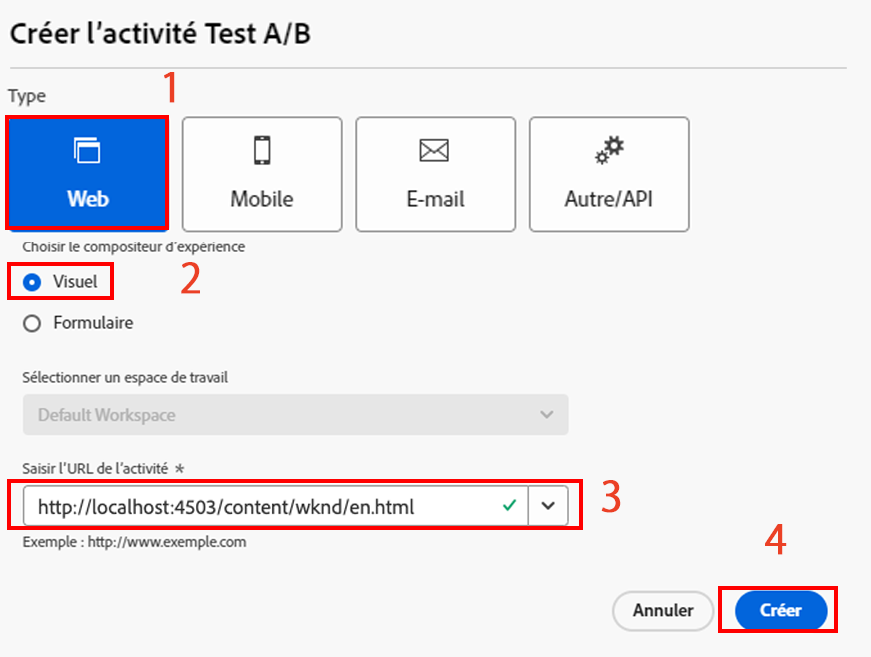
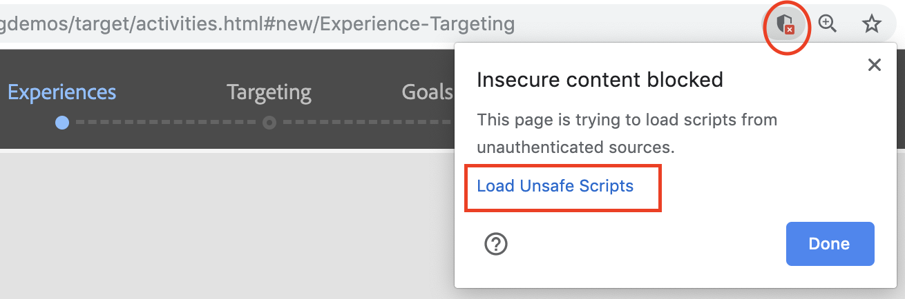

# Personnalisation des expériences de pages Web complètes à l’aide de Adobe Target

Dans le chapitre précédent, nous avons appris à créer une activité basée sur la géolocalisation dans Adobe Target à l’aide de contenu créé en tant que fragments d’expérience et exporté à partir d’AEM en tant qu’Offres HTML.

Ce chapitre porte sur la création d&#39;activités de redirection des pages de votre site hébergées sur AEM vers une nouvelle page utilisant Adobe Target.

## Présentation du scénario

Le site WKND a repensé sa page d&#39;accueil et souhaite rediriger ses visiteurs pages d&#39;accueil actuels vers la nouvelle page d&#39;accueil. En même temps, vous devez également comprendre comment la nouvelle page d&#39;accueil permet d’améliorer l’engagement des utilisateurs et les recettes. En tant que spécialiste du marketing, vous avez reçu la tâche de créer une activité pour rediriger les visiteurs vers la nouvelle page d&#39;accueil. Explorons la page d&#39;accueil du site WKND et apprenons comment créer une activité à l&#39;aide de Adobe Target.

### Utilisateurs impliqués

Pour cet exercice, les utilisateurs suivants doivent être impliqués et pour exécuter certaines tâches, vous pouvez avoir besoin d’un accès administratif.

* **Producteur de contenu/Editeur** de contenu (Adobe Experience Manager)
* **Marketer** (Adobe Target / Équipe d’optimisation)

### Page d&#39;accueil du site WKND

### Conditions préalables

* **AEM**
   * [aem instance](./implementation.md#getting-aem) d’auteur et de publication s’exécutant sur localhost 4502 et 4503, respectivement.
   * [aem intégré à Adobe Target à l&#39;aide de Adobe Experience Platform Launch](./using-launch-adobe-io.md#aem-target-using-launch-by-adobe)
* **Experience Cloud**
   * Accès à vos organisations Adobe Experience Cloud - <https://>`<yourcompany>`.experience ecloud.adobe.com
   * experience cloud doté des solutions suivantes
      * [Adobe Target](https://experiencecloud.adobe.com)

## Activités de l’éditeur de contenu

1. Le spécialiste du marketing lance la discussion sur la reconception de la Page d&#39;accueil WKND avec AEM Content Editor et détaille les exigences.
   * ***Exigence*** : Reconcevoir la Page d&#39;accueil de site WKND avec une conception basée sur une carte.
2. En fonction des exigences, AEM Éditeur de contenu crée ensuite une nouvelle page d&#39;accueil de site WKND avec une conception basée sur une carte et publie la nouvelle page d&#39;accueil.

## Activités du marketeur

1. Marketer crée une activité d’cible A/B avec l’offre de redirection comme expérience et alloue 100 % du trafic sur le site Web à la nouvelle page d&#39;accueil avec l’objectif de réussite et les mesures ajoutées.
   1. Dans la fenêtre Adobe Target, accédez à l&#39;onglet **Activités** .
   2. Cliquez sur le bouton **Créer une Activité** et sélectionnez le type d’activité en tant que test **A/B.**

      
   3. Sélectionnez le canal **Web** et choisissez le compositeur d’expérience **** visuelle.
   4. Saisissez l’URL **de l’** Activité et cliquez sur **Suivant** pour ouvrir le compositeur d’expérience visuelle.
      
   5. Pour que le compositeur **d’expérience** visuelle se charge, activez l’option **Autoriser le chargement des scripts** non sécurisés dans votre navigateur et rechargez votre page.
      
   6. Notez que la page d&#39;accueil de site WKND s’ouvre dans l’éditeur du compositeur d’expérience visuelle.
      
   7. Passez la souris sur **l’expérience B** et sélectionnez vue d’autres options.
      
   8. Sélectionnez l’option **Rediriger vers l’URL** et saisissez l’URL vers la nouvelle Page d&#39;accueil WKND. (http://localhost:4503/content/wknd/en1.html)
      
   9. **Enregistrez** vos modifications et poursuivez les étapes suivantes de la création d’Activités.
   10. Sélectionnez la méthode **d’affectation du** trafic comme manuelle et affectez 100 % du trafic à l’ **expérience B**.
      
   11. Cliquez sur **Suivant**.
   12. Indiquez des mesures **** d’objectif pour votre Activité et enregistrez et fermez votre test A/B.
      
   13. Attribuez un nom (**WKND Page d&#39;accueil Redesign**) à votre Activité et enregistrez vos modifications.
   14. Dans l’écran Détails de l’Activité, veillez à **activer** votre activité.
      
   15. Accédez à la Page d&#39;accueil WKND (http://localhost:4503/content/wknd/en.html) et vous serez redirigé vers la Page d&#39;accueil de site WKND repensée (http://localhost:4503/content/wknd/en1.html).
      

## Résumé

Dans ce chapitre, un spécialiste du marketing a été en mesure de créer une activité de redirection des pages de votre site hébergées sur AEM vers une nouvelle page utilisant Adobe Target.
