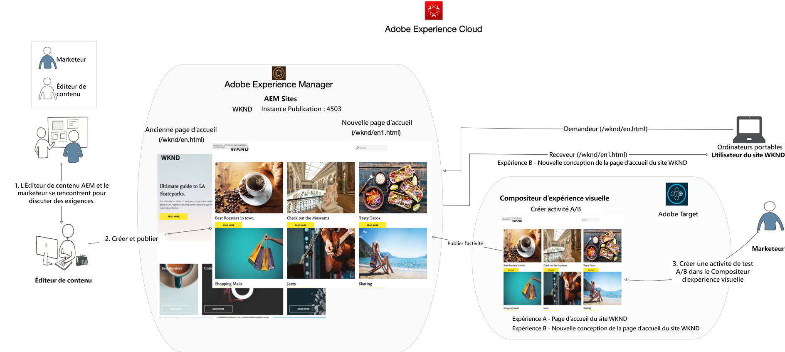
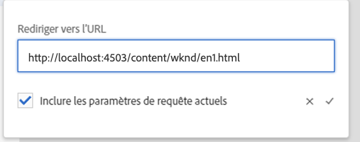

# Personnalisation des expériences de pages web complètes à l’aide d’Adobe Target

Dans le chapitre précédent, nous avons appris à créer une activité basée sur la géolocalisation dans Adobe Target à l’aide de contenu créé en tant que fragments d’expérience et exporté depuis AEM en tant qu’offres HTML.

Dans ce chapitre, nous allons explorer la création d’une activité pour rediriger les pages de votre site hébergées sur AEM vers une nouvelle page à l’aide d’Adobe Target.

## Présentation du scénario

Le site WKND a repensé sa page d’accueil et souhaite rediriger les visiteurs de sa page d’accueil actuelle vers la nouvelle page d’accueil. En même temps, vous devez également comprendre comment la nouvelle page d’accueil contribue à améliorer l’engagement et les recettes des utilisateurs. En tant que marketeur, vous avez reçu la tâche de créer une activité pour rediriger les visiteurs vers la nouvelle page d’accueil. Explorons la page d’accueil du site WKND et apprenons à créer une activité à l’aide d’Adobe Target.

### Utilisateurs impliqués

Pour cet exercice, les utilisateurs suivants doivent être impliqués et effectuer certaines tâches nécessitant un accès administratif.

* **Producteur de contenu/éditeur de contenu**  (Adobe Experience Manager)
* **Marketer**  (Adobe Target/équipe d’optimisation)

### Page d’accueil du site WKND

### Prérequis

* **AEM **
   * [AEM instance de création et d’édition ](./implementation.md#getting-aem) sur localhost 4502 et 4503 respectivement.
   * [AEM intégré à Adobe Target à l’aide d’Adobe Experience Platform Launch](./using-launch-adobe-io.md#aem-target-using-launch-by-adobe)
* **Experience Cloud**
   * Accès à vos organisations Adobe Experience Cloud - <https://>`<yourcompany>`.experiencecloud.adobe.com
   * Experience Cloud fourni avec les solutions suivantes
      * [Adobe Target](https://experiencecloud.adobe.com)

## Activités de l’éditeur de contenu

1. Le spécialiste du marketing lance la discussion de reconception de la page d’accueil WKND avec AEM Content Editor et détaille les exigences.
   * ***Condition requise***  : Reconcevez la page d’accueil du site WKND à l’aide d’une conception basée sur des cartes.
2. En fonction des exigences, AEM Éditeur de contenu crée ensuite une page d’accueil du site WKND avec une conception par carte et publie la nouvelle page d’accueil.

## Activités marketing

1. Le marketeur crée une activité de ciblage A/B avec l’offre de redirection comme expérience et un trafic de site web à 100 % affecté à la nouvelle page d’accueil avec un objectif de succès et des mesures ajoutées.
   1. Dans la fenêtre Adobe Target, accédez à l’onglet **Activités**.
   2. Cliquez sur le bouton **Créer l’activité** et sélectionnez le type d’activité **Test A/B**

      
   3. Sélectionnez le canal **Web** et choisissez le **compositeur d’expérience visuelle**.
   4. Saisissez l’ **URL d’activité** et cliquez sur **Suivant** pour ouvrir le compositeur d’expérience visuelle.
      
   5. Pour que **le compositeur d’expérience visuelle** se charge, activez l’option **Autoriser le chargement de scripts non sécurisés** sur votre navigateur et rechargez votre page.
      
   6. La page d’accueil du site WKND s’ouvre dans l’éditeur du compositeur d’expérience visuelle.
      
   7. Passez la souris sur **Expérience B** et sélectionnez Afficher d’autres options.
      
   8. Sélectionnez l’option **Rediriger vers l’URL** et saisissez l’URL vers la nouvelle page d’accueil WKND. (http://localhost:4503/content/wknd/en1.html)
      
   9. **** Enregistrez vos modifications et passez aux étapes suivantes de la création de l’activité.
   10. Sélectionnez la **Méthode d’affectation du trafic** comme manuelle et affectez 100 % du trafic à **Expérience B**.
      
   11. Cliquez sur **Suivant**.
   12. Fournissez les **Mesures d’objectif** pour votre activité et enregistrez et fermez votre test A/B.
      
   13. Attribuez un nom (**Redesign de page d’accueil WKND**) à votre activité et enregistrez vos modifications.
   14. Dans l’écran Détails de l’activité, veillez à **Activer** votre activité.
      
   15. Accédez à la page d’accueil WKND (http://localhost:4503/content/wknd/en.html) et vous serez redirigé vers la page d’accueil du site WKND repensée (http://localhost:4503/content/wknd/en1.html).
      

## Résumé

Dans ce chapitre, un spécialiste du marketing a pu créer une activité pour rediriger les pages de votre site hébergées sur AEM vers une nouvelle page à l’aide d’Adobe Target.
