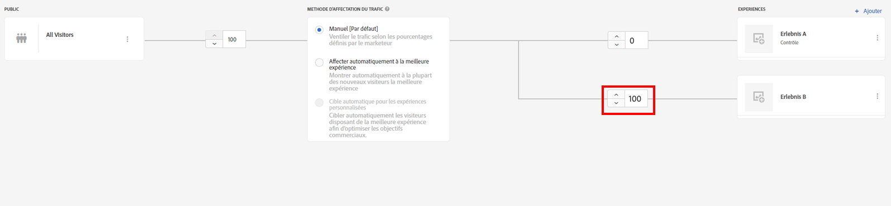

# Personnalisation des expériences de pages web complètes à l’aide d’Adobe Target

Dans le chapitre précédent, nous avons appris à créer une activité basée sur la géolocalisation dans Adobe Target à l’aide de contenu créé en tant que fragments d’expérience et exporté à partir d’AEM en tant qu’offres HTML.

Dans ce chapitre, nous allons explorer la création d’une activité pour rediriger les pages de votre site hébergées sur AEM vers une nouvelle page à l’aide d’Adobe Target.

## Vue d’ensemble du scénario

Le site WKND a repensé sa page d’accueil et souhaite rediriger les visiteurs et les visiteuses de sa page d’accueil actuelle vers la nouvelle page d’accueil. Vous devez également comprendre comment la nouvelle page d’accueil contribue à améliorer l’engagement des utilisateurs et utilisatrices et le chiffre d’affaires. En tant que personne spécialiste marketing, on vous a confié la tâche de créer une activité pour rediriger les visiteurs et les visiteuses vers la nouvelle page d’accueil. Explorons la page d’accueil du site WKND et apprenons à créer une activité à l’aide d’Adobe Target.

### Utilisateurs et utilisatrices impliqués

Pour cet exercice, les utilisateurs et utilisatrices suivants doivent être impliqués et effectuer certaines tâches nécessitant un accès administratif.

* **Producteur ou productrice de contenu/créateur ou créatrice de contenu** (Adobe Experience Manager)
* **Marketeur ou marketeuse** (Adobe Target/équipe d’optimisation)

### Page d’accueil du site WKND

### Conditions préalables

* **AEM**
   * [Instances de création et de publication AEM](./implementation.md#getting-aem) s’exécutant sur localhost 4502 et 4503, respectivement.
   * [AEM intégré à Adobe Target à l’aide d’Adobe Experience Platform Launch](./using-launch-adobe-io.md#aem-target-using-launch-by-adobe)
* **Experience Cloud**
   * Accéder à la solution Adobe Experience Cloud de votre organisation - `https://<yourcompany>.experiencecloud.adobe.com`
   * Experience Cloud est fourni avec les solutions suivantes
      * [Adobe Target](https://experiencecloud.adobe.com)

## Activités du créateur ou de la créatrice de contenu

1. La personne spécialiste marketing lance la discussion sur la refonte de la page d’accueil WKND avec l’éditeur de contenu AEM et précise les exigences.
   * ***Exigence*** : repenser la page d’accueil du site WKND à l’aide d’une conception basée sur des cartes.
2. En fonction des exigences, le créateur ou la créatrice de contenu AEM crée ensuite une page d’accueil du site WKND avec une conception basée sur des cartes et publie la nouvelle page d’accueil.

## Activités de la personne spécialiste marketing

1. La personne spécialiste marketing crée une activité de ciblage A/B avec l’offre de redirection comme expérience et un trafic de site web à 100 % affecté à la nouvelle page d’accueil avec un objectif de réussite et des mesures ajoutés.
   1. Dans la fenêtre Adobe Target, accédez à l’onglet **Activités**.
   2. Cliquez sur le bouton **Créer une activité** et sélectionnez le type d’activité **Test A/B**.
      
   3. Sélectionnez le canal **Web** et choisissez le **Compositeur d’expérience visuelle**.
   4. Saisissez l’**URL de l’activité** et cliquez sur **Suivant** pour ouvrir le compositeur d’expérience visuelle.
      
   5. Pour que le **Compositeur d’expérience visuelle** charge, activez **Autoriser le chargement de scripts non sécurisés** dans votre navigateur et rechargez la page.
      
   6. Notez que la page d’accueil du site WKND s’ouvre dans l’éditeur du compositeur d’expérience visuelle.
      
   7. Pointez la souris sur **Expérience B** et sélectionnez Afficher d’autres options.
      
   8. Sélectionnez **Rediriger vers l’URL** et saisissez l’URL de la nouvelle page d’accueil WKND. (http://localhost:4503/content/wknd/en1.html)
      
   9. **Enregistrez** vos modifications et passez aux étapes suivantes de la création de l’activité.
   10. Définissez la **Méthode d’affectation du trafic** sur Manuelle et affectez 100 % du trafic vers **Expérience B**.
      
   11. Cliquez sur **Suivant**.
   12. Fournissez des **Mesures d’objectif** pour votre activité, puis enregistrez et fermez votre test A/B.
      
   13. Attribuez un nom (**WKND Home Page Redesign**) à votre activité et enregistrez vos modifications.
   14. Dans l’écran Détails de l’activité, veillez à **activer** votre activité.
      
   15. Accédez à la page d’accueil WKND (http://localhost:4503/content/wknd/en.html) pour une redirection vers la page d’accueil du site WKND repensée (http://localhost:4503/content/wknd/en1.html).
      

## Résumé

Dans ce chapitre, une personne spécialiste marketing a pu créer une activité pour rediriger les pages de votre site hébergées sur AEM vers une nouvelle page à l’aide d’Adobe Target.
