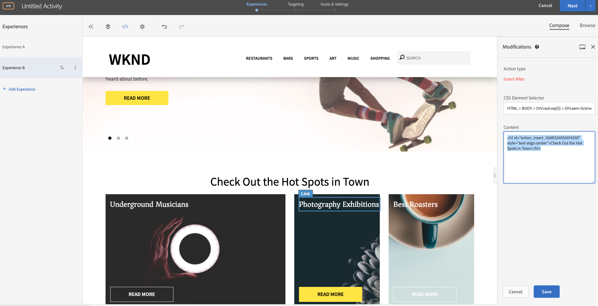

# Personnalisation à l’aide du compositeur d’expérience visuelle

Ce chapitre porte sur la création d’expériences à l’aide du compositeur d’expérience visuelle **Visual Experience Composer** en faisant glisser et déposer, en permutant et en modifiant la mise en page et le contenu d’une page Web depuis la Cible.

## Présentation du scénario

La page d&#39;accueil du site WKND présente les activités locales ou les meilleures choses à faire dans une ville sous la forme de cartes de mise en page. En tant que spécialiste du marketing, vous avez reçu la tâche de modifier la page d&#39;accueil en réorganisant les dispositions des cartes pour voir comment elles affectent l’engagement des utilisateurs et conduisent à la conversion.

### Utilisateurs impliqués

Pour cet exercice, les utilisateurs suivants doivent être impliqués et pour exécuter certaines tâches, vous pouvez avoir besoin d’un accès administratif.

* **Producteur de contenu/Editeur**  de contenu (Adobe Experience Manager)
* **Marketer**  (Adobe Target / Équipe d’optimisation)

### Page d&#39;accueil du site WKND


### Conditions préalables

* **AEM**
   * [aem publier une ](./implementation.md#getting-aem) instance sur 4503
   * [aem intégré à Adobe Target à l&#39;aide de Adobe Experience Platform Launch](./using-launch-adobe-io.md#aem-target-using-launch-by-adobe)
* **Experience Cloud**
   * Accès à vos organisations Adobe Experience Cloud - <https://>`<yourcompany>`.experience encecloud.adobe.com
   * Experience Cloud doté de [Adobe Target](https://experiencecloud.adobe.com)

## Activités du marketeur

1. Le marketeur crée une activité d’cible A/B dans Adobe Target.
   1. Dans la fenêtre Adobe Target, accédez à l&#39;onglet **Activités**.
   2. Cliquez sur le bouton **Créer une Activité** et sélectionnez le type d’activité **Test A/B**.

      
   3. Sélectionnez le canal **Web** et choisissez le **compositeur d’expérience visuelle**.
   4. Saisissez l’**URL d’Activité** et cliquez sur **Suivant** pour ouvrir le compositeur d’expérience visuelle.
      
   5. Pour que **le compositeur d’expérience visuelle** se charge, activez **Autoriser le chargement des scripts non sécurisés** dans votre navigateur et rechargez votre page.
      
   6. Notez que la page d&#39;accueil de site WKND s’ouvre dans l’éditeur du compositeur d’expérience visuelle.
      
   7. **L’expérience** fournit la Page d&#39;accueil WKND par défaut et modifions la disposition du contenu pour l’ **expérience B**.
      
   8. Cliquez sur l’un des conteneurs de mise en page de carte (*Meilleurs grille-pain*) et sélectionnez l’option **Réorganiser**.
      
   9. Cliquez sur le conteneur que vous souhaitez réorganiser et faites-le glisser à l’emplacement souhaité. Réorganisons le conteneur *Meilleurs grille-pain* de la 1ère ligne de la 1ère colonne à la 1ère ligne de la 3ème colonne. Le conteneur *Meilleurs grille-patins* sera maintenant à côté du *conteneur des expositions de photographie*.
      

      **Après la permutation**
      
   10. De même, réorganisez les positions des autres conteneurs de carte.
      
   11. Ajoutons également un texte d’en-tête sous le composant de carrousel et au-dessus de la mise en page de carte.
   12. Cliquez sur le conteneur du carrousel et sélectionnez l’option **Insérer après > HTML** pour ajouter du code HTML.
      

      ```html
      <h1 style="text-align:center">Check Out the Hot Spots in Town</h1>
      ```

      
   13. Cliquez sur **Suivant** pour poursuivre votre activité.
   14. Sélectionnez la **méthode d’affectation du trafic** comme méthode manuelle et affectez 100 % de trafic à **l’expérience B**.
      
   15. Cliquez sur **Next** (Suivant).
   16. Indiquez **Mesures d’objectif** pour votre Activité et enregistrez et fermez votre test A/B.
      
   17. Attribuez un nom (**WKND Page d&#39;accueil Refresh**) à votre Activité et enregistrez vos modifications.
   18. Dans l’écran Détails de l’Activité, veillez à **activer** votre activité.
      
   19. Accédez à la Page d&#39;accueil WKND (http://localhost:4503/content/wknd/en.html) et vous remarquez les modifications que nous avons apportées à l’activité de test A/B de l’actualisation de la Page d&#39;accueil WKND.
      
   20. Ouvrez la console de votre navigateur et examinez l’onglet réseau pour rechercher la réponse de cible à l’activité de test A/B de l’actualisation de la Page d&#39;accueil WKND.
      

## Résumé

Dans ce chapitre, un spécialiste du marketing a été en mesure de créer une expérience à l’aide du compositeur d’expérience visuelle en faisant glisser et déposer, en permutant et en modifiant la mise en page et le contenu d’une page Web sans modifier le code pour exécuter un test.
