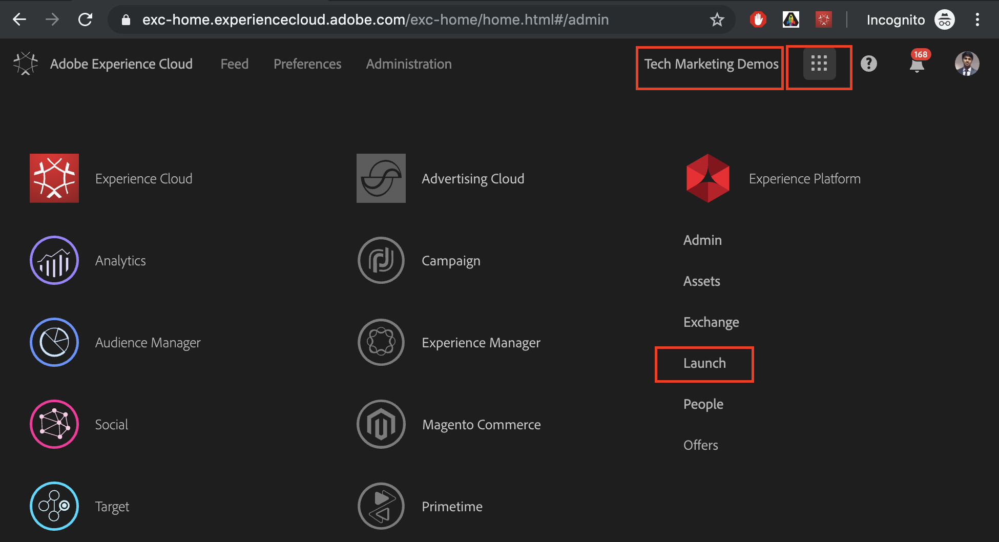

# Utilisation d’Adobe Experience Platform Launch via Adobe I/O Console

## Conditions préalables

* [AEM instance de création et de publication](./implementation.md#set-up-aem) s’exécutant respectivement sur le port localhost 4502 et 4503
* **Experience Cloud**
   * Accès à vos organisations Adobe Experience Cloud - `https://<yourcompany>.experiencecloud.adobe.com`
   * Experience Cloud fourni avec les solutions suivantes
      * [Adobe Experience Platform Launch](https://experiencecloud.adobe.com)
      * [Adobe Target](https://experiencecloud.adobe.com)
      * [Adobe I/O Console](https://console.adobe.io)

     >[!NOTE]
     >Vous devez disposer des autorisations Develop (Développer), Approve (Approuver), Publish (Publier), Manage Extensions (Gérer les extensions) et Manage Environments (Gérer les environnements) dans Launch. Si vous ne parvenez pas à effectuer l’une de ces étapes car les options de l’interface utilisateur ne sont pas disponibles, contactez votre administrateur Experience Cloud pour demander l’accès. Pour plus d’informations sur les autorisations de Launch, [voir la documentation](https://experienceleague.adobe.com/docs/experience-platform/tags/admin/user-permissions.html).

* **Modules externes du navigateur**
   * Débogueur Adobe Experience Cloud ([Chrome](https://chrome.google.com/webstore/detail/adobe-experience-cloud-de/ocdmogmohccmeicdhlhhgepeaijenapj))
   * Launch et DTM Switch ([Chrome](https://chrome.google.com/webstore/detail/launch-and-dtm-switch/nlgdemkdapolikbjimjajpmonpbpmipk))

## Utilisateurs impliqués

Pour cette intégration, les audiences suivantes doivent être impliquées. Pour effectuer certaines tâches, vous devrez peut-être avoir un accès administratif.

* Développeur
* AEM Admin
* Administrateur Experience Cloud

## Présentation

AEM offre une intégration à Experience Platform Launch prête à l’emploi. Cette intégration permet aux administrateurs d’AEM de configurer facilement Experience Platform Launch via une interface conviviale, réduisant ainsi le niveau d’effort et le nombre d’erreurs lors de la configuration de ces deux outils. Et rien qu’en ajoutant l’extension Adobe Target à Experience Platform Launch, nous pourrons utiliser toutes les fonctionnalités d’Adobe Target sur les pages web d’AEM.

Dans cette section, nous allons aborder les étapes d’intégration suivantes :

* Lancement d’
   * Créer une propriété Launch
   * Ajout d’une extension Target
   * Création d’un élément de données
   * Créer une règle de page
   * Configuration d’environnements
   * Concevoir et publier
* AEM
   * Création d’un Cloud Service
   * Création

### Lancement d’

#### Créer une propriété Launch

Une propriété est un conteneur que vous remplissez d’extensions, de règles, d’éléments de données et de bibliothèques lorsque vous déployez des balises sur votre site.

1. Accès à vos organisations [Adobe Experience Cloud](https://experiencecloud.adobe.com/) (`https://<yourcompany>.experiencecloud.adobe.com`)
2. Connectez-vous à l’aide de votre Adobe ID et assurez-vous que vous vous trouvez dans la bonne organisation.
3. Dans le sélecteur de solution, cliquez sur **Launch** puis sélectionnez l’option **Accéder À Launch** bouton .

   

4. Assurez-vous que vous vous trouvez dans la bonne organisation, puis passez à la création d’une propriété Launch.
   

   *Pour plus d’informations sur la création de propriétés, voir [Création d’une propriété](https://experienceleague.adobe.com/docs/experience-platform/tags/admin/companies-and-properties.html?lang=en#create-or-configure-a-property) dans la documentation du produit.*
5. Cliquez sur le bouton **Nouvelle propriété** button
6. Attribuez un nom à votre propriété (par exemple, *Tutoriel sur AEM Target*)
7. En tant que domaine, saisissez *localhost.com* puisqu’il s’agit du domaine sur lequel le site de démonstration WKND est exécuté. Bien que le *Domaine*&quot; est obligatoire, la propriété Launch fonctionne sur n’importe quel domaine où elle est implémentée. L’objectif Principal de ce champ est de préremplir les options de menu du créateur de règles.
8. Cliquez sur le bouton **Enregistrer** bouton .

   

9. Ouvrez la propriété que vous venez de créer, puis cliquez sur l’onglet Extensions .

#### Ajout d’une extension Target

L’extension Adobe Target prend en charge les mises en oeuvre côté client à l’aide du SDK JavaScript Target pour le web moderne, `at.js`. Clients utilisant toujours la bibliothèque obsolète de Target, `mbox.js`, [doit effectuer la mise à niveau vers at.js](https://experienceleague.adobe.com/docs/target/using/implement-target/client-side/at-js-implementation/upgrading-from-atjs-1x-to-atjs-20.html) pour utiliser Launch.

L’extension Target se compose de deux parties principales :

* La configuration de l’extension, qui gère les paramètres de bibliothèque principaux
* Actions de règle pour effectuer les opérations suivantes :
   * Chargement de Target (at.js)
   * Ajout de paramètres à toutes les mbox
   * Ajout de paramètres à la mbox globale
   * Déclencher la mbox globale

1. Sous **Extensions**, vous pouvez voir la liste des extensions déjà installées pour votre propriété Launch. ([Extension Core Experience Platform Launch](https://exchange.adobe.com/experiencecloud.details.100223.adobe-launch-core-extension.html) est installé par défaut)
2. Cliquez sur le bouton **Catalogue d’extensions** et recherchez Target dans le filtre.
3. Sélectionnez la dernière version d’Adobe Target at.js et cliquez sur **Installer** .
   

4. Cliquez sur **Configurer** et vous pouvez remarquer la fenêtre de configuration avec les informations d’identification de votre compte Target importées, ainsi que la version d’at.js de cette extension.
   

   Lorsque Target est déployé via des codes intégrés à Launch asynchrones, vous devez coder en dur un fragment de code de masquage préalable sur vos pages avant les codes incorporés Launch afin de gérer le scintillement de contenu. Nous en apprendrons plus sur le tireur d’élite prémasqué plus tard. Vous pouvez télécharger le fragment de code de masquage préalable. [here](assets/using-launch-adobe-io/prehiding.js)

5. Cliquez sur **Enregistrer** pour terminer l’ajout de l’extension Target à votre propriété Launch. Vous devriez maintenant être en mesure de voir l’extension Target répertoriée sous le **Installé** liste des extensions.

6. Répétez les étapes ci-dessus pour rechercher l’extension &quot;Experience Cloud ID Service&quot; et l’installer.
   

#### Configuration d’environnements

1. Cliquez sur le bouton **Environnement** pour la propriété de votre site. Vous pouvez également voir la liste de l’environnement qui est créé pour la propriété de votre site. Par défaut, une instance est créée pour le développement, l’évaluation et la production.

#### Concevoir et publier

1. Cliquez sur le bouton **Publication** pour la propriété de votre site. Créons une bibliothèque pour créer et déployer nos modifications (éléments de données, règles) dans un environnement de développement.
   >[!VIDEO](https://video.tv.adobe.com/v/28412?quality=12&learn=on)
2. Publiez vos modifications depuis l’environnement de développement vers un environnement d’évaluation.
   >[!VIDEO](https://video.tv.adobe.com/v/28419?quality=12&learn=on)
3. Exécutez la variable **Option Créer pour l’évaluation**.
4. Une fois la génération terminée, exécutez **Approuver pour publication**, qui déplace vos modifications d’un environnement d’évaluation vers un environnement de production.
   
5. Enfin, exécutez le **Créer et publier en production** pour transmettre vos modifications à la production.
   

### Adobe Experience Manager

>[!VIDEO](https://video.tv.adobe.com/v/28416?quality=12&learn=on)

>[!NOTE]
>
> Accordez à l’intégration d’Adobe I/O l’accès pour sélectionner des espaces de travail avec les [rôle permettant à une équipe centrale d’apporter des modifications pilotées par l’API dans quelques espaces de travail uniquement](https://experienceleague.adobe.com/docs/target/using/administer/manage-users/enterprise/configure-adobe-io-integration.html).

1. Créez l&#39;intégration IMS dans AEM à l&#39;aide des informations d&#39;identification d&#39;Adobe I/O. (01:12 à 03:55)
2. Dans Experience Platform Launch, créez une propriété. (couvert) [above](#create-launch-property))
3. À l’aide de l’intégration IMS de l’étape 1, créez une intégration Experience Platform Launch pour importer votre propriété Launch.
4. Dans AEM, mappez l’intégration de l’Experience Platform Launch à un site à l’aide de la configuration du navigateur. (05:28 à 06:14)
5. Validation manuelle de l’intégration. (06:15 à 06:33)
6. Utilisation du module de navigateur Launch/DTM. (06:34 à 06:50)
7. Utilisation du module externe de navigateur Adobe Experience Cloud Debugger. (06:51 à 07:22)

À ce stade, vous avez correctement intégré [AEM avec Adobe Target à l’aide d’Adobe Experience Platform Launch](./using-aem-cloud-services.md#integrating-aem-target-options) comme décrit dans l’Option 1.

Pour utiliser les offres de fragments d’expérience AEM afin d’alimenter vos activités de personnalisation, nous vous proposons de passer au chapitre suivant et d’intégrer AEM à Adobe Target à l’aide des services cloud hérités.
