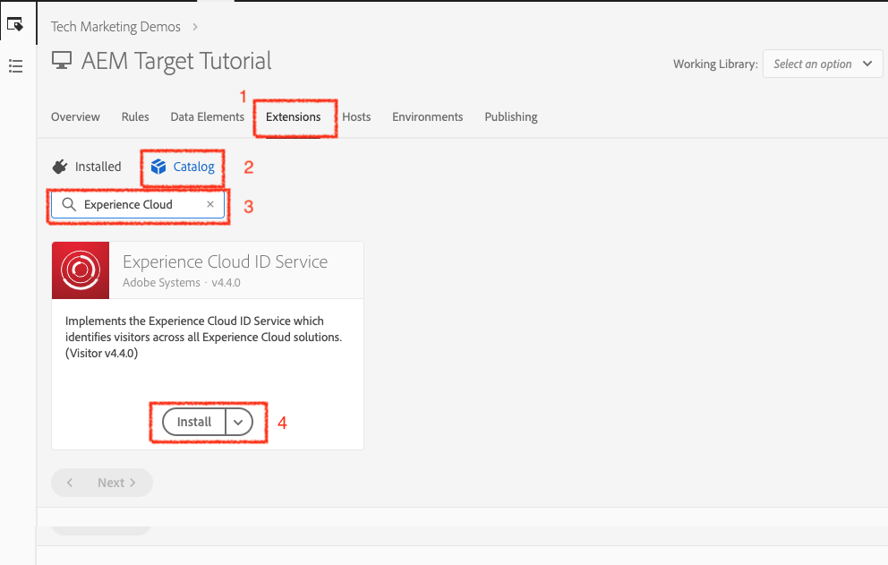
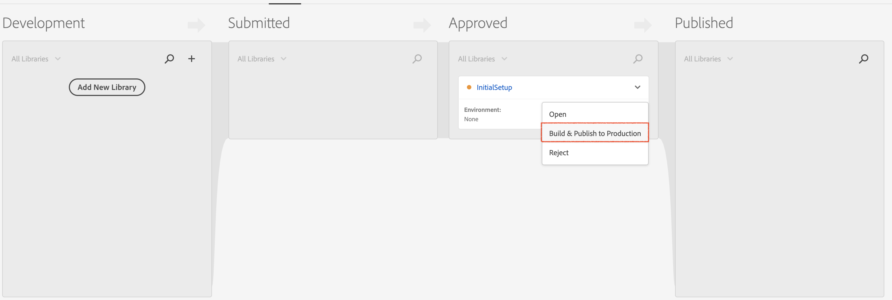

# Utilisation d’Adobe Experience Platform Launch via la console Adobe Developer

## Conditions préalables

* [Instance de création et de publication d’AEM](./implementation.md#set-up-aem) s’exécutant sur les ports localhost 4502 et 4503 respectivement.
* **Experience Cloud**
   * Accéder à la solution Adobe Experience Cloud de votre organisation - `https://<yourcompany>.experiencecloud.adobe.com`
   * Configuration Experience Cloud avec les solutions suivantes
      * [Adobe Experience Platform Launch](https://experiencecloud.adobe.com)
      * [Adobe Target](https://experiencecloud.adobe.com)
      * [Developer Console d’Adobe](https://developer.adobe.com/console/)

     >[!NOTE]
     >Vous devez disposer des autorisations nécessaires pour développer, approuver, publier, gérer des extensions et gérer des environnement dans Launch. Si vous ne parvenez pas à effectuer l’une de ces étapes car les options de l’interface utilisateur ne sont pas disponibles, contactez votre administrateur ou administratrice Experience Cloud pour en demander l’accès. Pour plus d’informations sur les autorisations de Launch, [voir la documentation](https://experienceleague.adobe.com/docs/experience-platform/tags/admin/user-permissions.html?lang=fr).

* **Plug-ins du navigateur**
   * Adobe Experience Cloud Debugger ([Chrome](https://chrome.google.com/webstore/detail/adobe-experience-platform/bfnnokhpnncpkdmbokanobigaccjkpob))
   * Launch et DTM Switch ([Chrome](https://chrome.google.com/webstore/detail/launch-and-dtm-switch/nlgdemkdapolikbjimjajpmonpbpmipk))

## Utilisateurs et utilisatrices impliqués

Pour cette intégration, les audiences suivantes doivent être impliquées. Pour effectuer certaines tâches, vous aurez peut-être besoin d’un accès administratif.

* Développeur ou développeuse
* Administrateur ou administratrice AEM
* Administrateur ou administratrice Experience Cloud

## Présentation

AEM offre une intégration à Experience Platform Launch prête à l’emploi. Cette intégration permet aux administrateurs d’AEM de configurer facilement Experience Platform Launch via une interface conviviale, réduisant ainsi le niveau d’effort et le nombre d’erreurs lors de la configuration de ces deux outils. Et rien que le fait d’ajouter l’extension Adobe Target à Experience Platform Launch permet d’utiliser toutes les fonctionnalités d’Adobe Target sur la ou les pages web d’AEM.

Dans cette section, nous passerons en revue les étapes d’intégration suivantes :

* Launch
   * Créer une propriété Launch
   * Ajouter une extension Target
   * Créer un élément de données
   * Créer une règle de page
   * Configurer des environnements
   * Créer et publier
* AEM
   * Créer un service cloud
   * Créer

### Launch

#### Créer une propriété Launch

Une propriété est un conteneur que vous remplissez d’extensions, de règles, d’éléments de données et de bibliothèques lorsque vous déployez des balises sur votre site.

1. Accéder à vos organisations [Adobe Experience Cloud](https://experiencecloud.adobe.com/) (`https://<yourcompany>.experiencecloud.adobe.com`)
2. Connectez-vous à l’aide de votre Adobe ID et vérifiez que vous vous trouvez dans la bonne organisation.
3. Dans le sélecteur de solution, cliquez sur **Launch** puis sélectionnez le bouton **Accéder à Launch**.

   

4. Vérifiez que vous vous trouvez dans la bonne organisation, puis créez une propriété Launch.
   

   *Pour plus d’informations sur la création de propriétés, consultez [Création d’une propriété](https://experienceleague.adobe.com/docs/experience-platform/tags/admin/companies-and-properties.html?lang=fr) dans la documentation du produit.*
5. Cliquez sur le bouton **Nouvelle propriété**.
6. Attribuez un nom à votre propriété (par exemple, *Tutoriel AEM Target*).
7. En tant que domaine, saisissez *localhost.com* puisqu’il s’agit du domaine sur lequel le site de démonstration WKND est exécuté. Bien que le champ « *Domaine* » soit obligatoire, la propriété Launch fonctionne sur n’importe quel domaine où elle est implémentée. L’objectif principal de ce champ est de préremplir les options de menu du créateur de règles.
8. Cliquez sur le bouton **Enregistrer**.

   

9. Ouvrez la propriété que vous venez de créer, puis cliquez sur l’onglet Extensions.

#### Ajouter une extension Target

L’extension Adobe Target prend en charge les implémentations côté client en utilisant le SDK JavaScript Target pour le web moderne, `at.js`. Les clientes et clients qui utilisent toujours l’ancienne bibliothèque de Target, `mbox.js`, [doivent effectuer la mise à niveau vers at.js](https://experienceleague.adobe.com/docs/target-dev/developer/client-side/at-js-implementation/upgrading-from-atjs-1x-to-atjs-20.html) pour utiliser Launch.

L’extension Target se compose de deux parties principales :

* La configuration de l’extension, qui gère les paramètres de bibliothèque principaux.
* Des actions de règle pour effectuer les opérations suivantes :
   * Chargement de Target (at.js)
   * Ajout de paramètres à toutes les mBox
   * Ajout de paramètres à la mBox globale
   * Déclenchement de la mBox globale

1. Sous **Extensions**, vous pouvez voir la liste des extensions déjà installées pour votre propriété Launch. (l’[extension principale Experience Platform Launch](https://exchange.adobe.com/apps/ec/100223/adobe-launch-core-extension) est installée par défaut).
2. Sélectionnez l’option **Catalogue des extensions**, puis recherchez Target dans le filtre.
3. Sélectionnez la dernière version du fichier at.js d’Adobe Target et cliquez sur **Installer**.
   

4. Cliquez sur le bouton **Configurer** et vous verrez apparaître la fenêtre de configuration avec les informations d’identification de votre compte Target importées, ainsi que la version du fichier at.js de cette extension.
   

   Lorsque Target est déployé via des codes asynchrones intégrés à Launch, vous devez coder en dur un extrait de code de masquage préalable sur vos pages avant les codes intégrés à Launch afin de gérer le scintillement du contenu. Nous aborderons plus en détail l’extrait de code de masquage préalable plus tard. Vous pouvez télécharger l’extrait de code de masquage préalable [ici](assets/using-launch-adobe-io/prehiding.js).

5. Cliquez sur **Enregistrer** pour terminer l’ajout de l’extension Target à votre propriété Launch. Vous devriez maintenant pouvoir voir l’extension Target affichée dans la liste des extensions **Installées**.

6. Répétez les étapes ci-dessus pour rechercher l’extension « Experience Cloud ID Service » et l’installer.
   

#### Configurer des environnements

1. Cliquez sur l’onglet **Environnement** de la propriété de votre site. Vous pouvez également voir la liste de l’environnement créé pour la propriété de votre site. Par défaut, une instance est créée pour le développement, l’évaluation et la production.

#### Créer et publier

1. Cliquez sur l’onglet **Publication** de la propriété de votre site. Créons une bibliothèque pour créer et déployer nos modifications (éléments de données, règles) dans un environnement de développement.
   >[!VIDEO](https://video.tv.adobe.com/v/28412?quality=12&learn=on)
2. Publiez vos modifications depuis l’environnement de développement vers un environnement d’évaluation.
   >[!VIDEO](https://video.tv.adobe.com/v/28419?quality=12&learn=on)
3. Exécutez l’**option Créer pour l’évaluation**.
4. Une fois la création terminée, exécutez **Approuver pour publication**, qui déplace vos modifications d’un environnement d’évaluation vers un environnement de production.
   
5. Enfin, exécutez l’option **Créer et publier dans l’environnement de production** pour transmettre vos modifications à la production.
   

### Adobe Experience Manager

>[!VIDEO](https://video.tv.adobe.com/v/28416?quality=12&learn=on)

>[!NOTE]
>
> Octroyez à l’intégration Adobe Developer l’accès pour sélectionner des espaces de travail avec les [rôle permettant à une équipe centrale d’apporter des modifications pilotées par l’API dans quelques espaces de travail uniquement](https://experienceleague.adobe.com/docs/target/using/administer/manage-users/enterprise/configure-adobe-io-integration.html?lang=fr).

1. Créez l’intégration IMS dans AEM à l’aide des informations d’identification d’Adobe Developer. (01:12 à 03:55)
2. Dans Experience Platform Launch, créez une propriété. (abordé [ci-dessus](#create-launch-property)).
3. À l’aide de l’intégration IMS de l’étape 1, créez une intégration Experience Platform Launch pour importer votre propriété Launch.
4. Dans AEM, mappez l’intégration d’Experience Platform Launch à un site à l’aide de la configuration du navigateur. (05:28 à 06:14)
5. Validez l’intégration manuellement. (06:15 à 06:33)
6. Utilisez le plug-in de navigateur Launch/DTM. (06:34 à 06:50)
7. Utilisez le plug-in externe de navigateur Adobe Experience Cloud Debugger. (06:51 à 07:22)

À ce stade, vous avez correctement intégré [AEM avec Adobe Target à l’aide d’Adobe Experience Platform Launch](./using-aem-cloud-services.md#integrating-aem-target-options) comme décrit dans l’option 1.

Pour utiliser les offres de fragments d’expérience AEM afin d’alimenter vos activités de personnalisation, nous vous proposons de passer au chapitre suivant et d’intégrer AEM à Adobe Target à l’aide des services cloud hérités.
