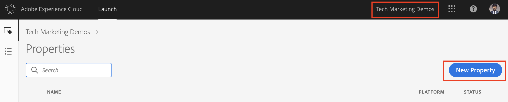
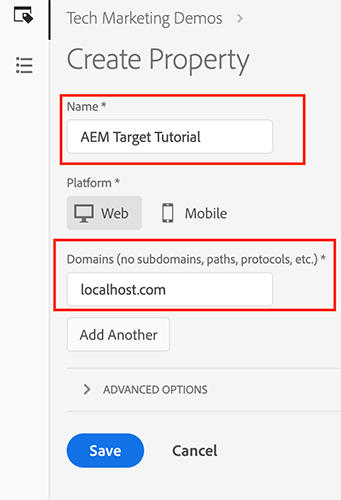
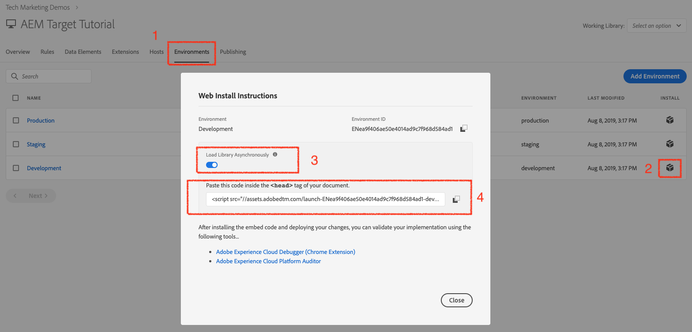

# Utilisation de Adobe Experience Platform Launch via la console Adobe I/O

## Conditions préalables

* [aem création et publication d’](./implementation.md#set-up-aem) instanceronning sur les ports localhost 4502 et 4503, respectivement
* **Experience Cloud**
   * Accès à vos organisations Adobe Experience Cloud - <https://>`<yourcompany>`.experience encecloud.adobe.com
   * Experience Cloud doté des solutions suivantes
      * [Adobe Experience Platform Launch](https://experiencecloud.adobe.com)
      * [Adobe Target](https://experiencecloud.adobe.com)
      * [Console Adobe I/O](https://console.adobe.io)

      >[!NOTE]
      >Vous devez disposer des autorisations nécessaires pour développer, approuver, publier, gérer les extensions et gérer les Environnements au lancement. Si vous ne parvenez pas à effectuer l’une de ces étapes, car les options de l’interface utilisateur ne sont pas disponibles, contactez votre administrateur Experience Cloud pour demander l’accès. Pour plus d’informations sur les autorisations de lancement, [voir la documentation](https://docs.adobelaunch.com/administration/user-permissions).

* **Plug-ins du navigateur**
   * Débogueur Adobe Experience Cloud ([Chrome](https://chrome.google.com/webstore/detail/adobe-experience-cloud-de/ocdmogmohccmeicdhlhhgepeaijenapj))
   * Lancement et commutateur DTM ([Chrome](https://chrome.google.com/webstore/detail/launch-and-dtm-switch/nlgdemkdapolikbjimjajpmonpbpmipk))

## Utilisateurs impliqués

Pour cette intégration, les audiences suivantes doivent être impliquées. Pour exécuter certaines tâches, vous aurez peut-être besoin d’un accès administratif.

* Développeur
* Admin AEM
* Administrateur Experience Cloud

## Présentation

AEM offre une intégration prête à l’emploi à Experience Platform Launch. Cette intégration permet aux administrateurs AEM de configurer facilement l&#39;Experience Platform Launch via une interface facile à utiliser, réduisant ainsi le niveau d&#39;effort et le nombre d&#39;erreurs lors de la configuration de ces deux outils. Et rien qu&#39;en ajoutant l&#39;extension Adobe Target à l&#39;Experience Platform Launch nous aidera à utiliser toutes les fonctionnalités de Adobe Target sur les pages web AEM.

Cette section porte sur les étapes d’intégration suivantes :

* Lancement d’
   * Créer une propriété Launch
   * Ajouter l&#39;Extension de la cible
   * Création d’un élément de données
   * Créer une règle de page
   * Environnements de configuration
   * Concevoir et publier
* AEM
   * Création d’un Cloud Service
   * Créer

### Lancement d’

#### Créer une propriété Launch

Une propriété est un conteneur que vous remplissez d’extensions, de règles, d’éléments de données et de bibliothèques lorsque vous déployez des balises sur votre site.

1. Accédez à vos organisations [Adobe Experience Cloud](https://experiencecloud.adobe.com/) (<https://>`<yourcompany>`.experience encecloud.adobe.com).
2. Connectez-vous à l’aide de votre Adobe ID et assurez-vous que vous êtes dans la bonne organisation.
3. Dans le sélecteur de solution, cliquez sur **Lancer**, puis sélectionnez le bouton **Aller au lancement**.

   

4. Assurez-vous que vous êtes dans la bonne organisation, puis continuez à créer une propriété Launch.
   

   *Pour plus d’informations sur la création de propriétés, voir  [Création d’une ](https://docs.adobelaunch.com/administration/companies-and-properties#create-a-property) propriété dans la documentation du produit.*
5. Cliquez sur le bouton **Nouvelle propriété**.
6. Attribuez un nom à votre propriété (par exemple, *AEM didacticiel sur les Cibles*).
7. En tant que domaine, saisissez *localhost.com*, car il s’agit du domaine sur lequel le site de démonstration WKND est exécuté. Bien que le champ &quot;*Domaine*&quot; soit requis, la propriété Launch fonctionnera sur tout domaine dans lequel elle est implémentée. Ce champ a pour Principal de prérenseigner les options de menu dans le créateur de règles.
8. Cliquez sur le bouton **Enregistrer**.

   

9. Ouvrez la propriété que vous venez de créer, puis cliquez sur l’onglet Extensions.

#### Ajouter l&#39;Extension de la cible

L’extension Adobe Target prend en charge les implémentations côté client à l’aide du SDK JavaScript Cible pour le Web moderne, `at.js`. Les clients qui utilisent toujours une bibliothèque plus ancienne de la Cible, `mbox.js`, [doivent effectuer la mise à niveau vers at.js](https://docs.adobe.com/content/help/en/target/using/implement-target/client-side/upgrading-from-atjs-1x-to-atjs-20.html) pour utiliser Launch.

L&#39;Extension de la cible se compose de deux parties principales :

* Configuration de l’extension, qui gère les paramètres de bibliothèque principaux
* Actions des règles pour effectuer les opérations suivantes :
   * Cible de chargement (at.js)
   * Ajouter des paramètres à toutes les mbox
   * Ajouter des paramètres à une mbox globale
   * Déclencher la mbox globale

1. Sous **Extensions**, vous pouvez voir la liste des extensions qui sont déjà installées pour votre propriété Launch. ([Experience Platform Launch Core Extension](https://exchange.adobe.com/experiencecloud.details.100223.adobe-launch-core-extension.html) est installé par défaut)
2. Cliquez sur l’option **Catalogue d’extensions** et recherchez la Cible dans le filtre.
3. Sélectionnez la dernière version d’Adobe Target at.js et cliquez sur l’option **Installer**.
   

4. Cliquez sur le bouton **Configurer** et vous pouvez remarquer la fenêtre de configuration avec les informations d’identification de votre compte de Cible importées, ainsi que la version at.js de cette extension.
   

   Lorsque la Cible est déployée via des codes incorporés de lancement asynchrones, vous devez coder en dur un fragment de code masqué à l’avance sur vos pages avant le lancement des codes incorporés afin de gérer le scintillement de contenu. Nous en apprendrons plus sur le tireur d&#39;élite qui se cache plus tard. Vous pouvez télécharger le fragment de code prémasqué [ici](assets/using-launch-adobe-io/prehiding.js)

5. Cliquez sur **Enregistrer** pour terminer l&#39;ajout de l&#39;Extension de la cible à votre propriété Launch et vous devriez maintenant voir l&#39;Extension de la cible répertoriée sous la liste des extensions **Installé**.

6. Répétez les étapes ci-dessus pour rechercher l’extension &quot;Experience Cloud ID Service&quot; et l’installer.
   

#### Environnements de configuration

1. Cliquez sur l&#39;onglet **Environnement** pour la propriété de votre site et vous pouvez voir la liste d&#39;environnement qui est créée pour la propriété de votre site. Par défaut, une instance est créée pour le développement, l’évaluation et la production.

#### Concevoir et publier

1. Cliquez sur l&#39;onglet **Publication** de la propriété de votre site, et créons une bibliothèque pour créer et déployer nos modifications (éléments de données, règles) dans un environnement de développement.
   >[!VIDEO](https://video.tv.adobe.com/v/28412?quality=12&learn=on)
2. Publiez vos modifications de Développement vers un environnement d’évaluation.
   >[!VIDEO](https://video.tv.adobe.com/v/28419?quality=12&learn=on)
3. Exécutez l&#39;option **Build for Staging**.
4. Une fois la compilation terminée, exécutez **Approuver pour publication**, ce qui déplace vos modifications d’un environnement intermédiaire vers un environnement de production.
   
5. Enfin, exécutez l&#39;option **Créer et publier en production** pour transmettre vos modifications à la production.
   

### Adobe Experience Manager 

>[!VIDEO](https://video.tv.adobe.com/v/28416?quality=12&learn=on)

>[!NOTE]
>
> Accordez à l’intégration Adobe I/O l’accès à certains espaces de travail avec le rôle [approprié pour permettre à une équipe centrale d’effectuer des modifications pilotées par l’API dans quelques espaces de travail seulement](https://docs.adobe.com/content/help/en/target/using/administer/manage-users/enterprise/configure-adobe-io-integration.html).

1. Créez l&#39;intégration IMS dans AEM à l&#39;aide des informations d&#39;identification de Adobe I/O. (01:12 à 03:55)
2. Dans Experience Platform Launch, créez une propriété. (couvert [au-dessus](#create-launch-property))
3. A l’aide de l’intégration IMS de l’étape 1, créez l’intégration Experience Platform Launch pour importer votre propriété Launch.
4. Dans AEM, mappez l’intégration de l’Experience Platform Launch à un site à l’aide de la configuration du navigateur. (05:28 à 06:14)
5. Validez l’intégration manuellement. (06:15 à 06:33)
6. Utilisation du module externe de navigateur Launch/DTM. (06:34 à 06:50)
7. Utilisation du module externe de navigateur du débogueur Adobe Experience Cloud. (06:51 à 07:22)

À ce stade, vous avez réussi à intégrer [AEM à Adobe Target en utilisant Adobe Experience Platform Launch](./using-aem-cloud-services.md#integrating-aem-target-options) comme indiqué dans l&#39;option 1.

Pour utiliser les offres de fragments d’expérience AEM pour alimenter vos activités de personnalisation, passez au chapitre suivant et intégrez AEM à Adobe Target à l’aide des services cloud hérités.
