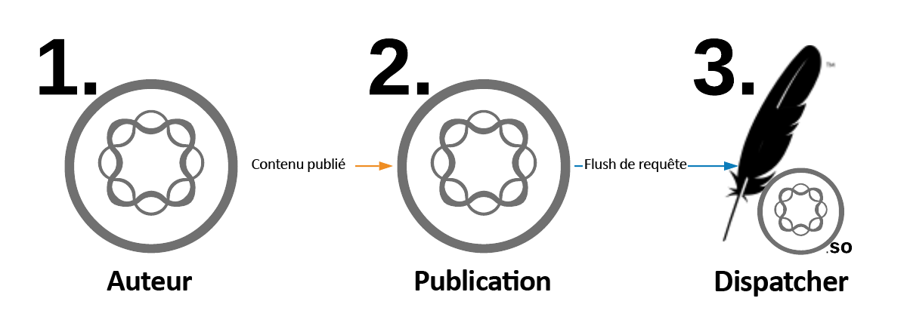
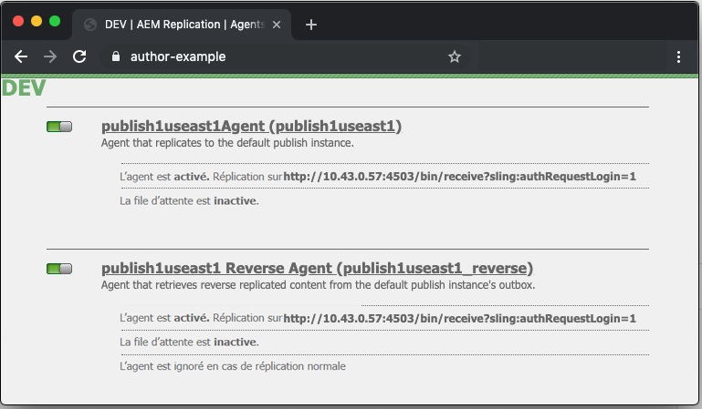
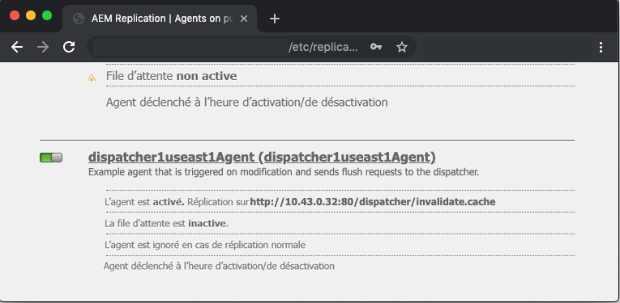
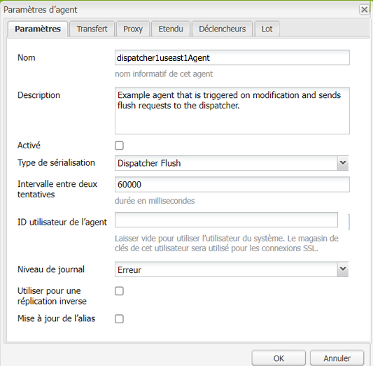
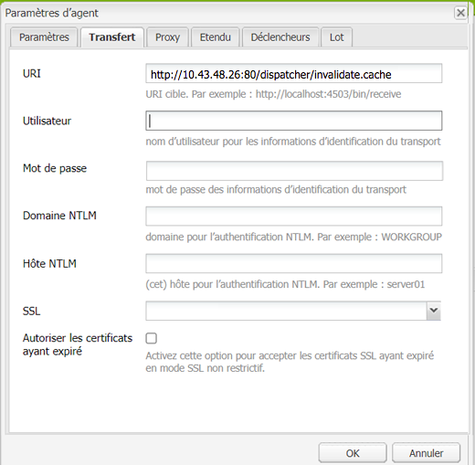
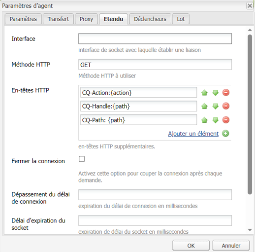
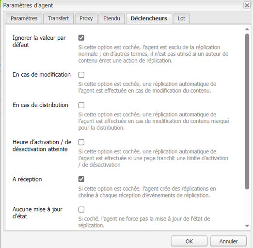
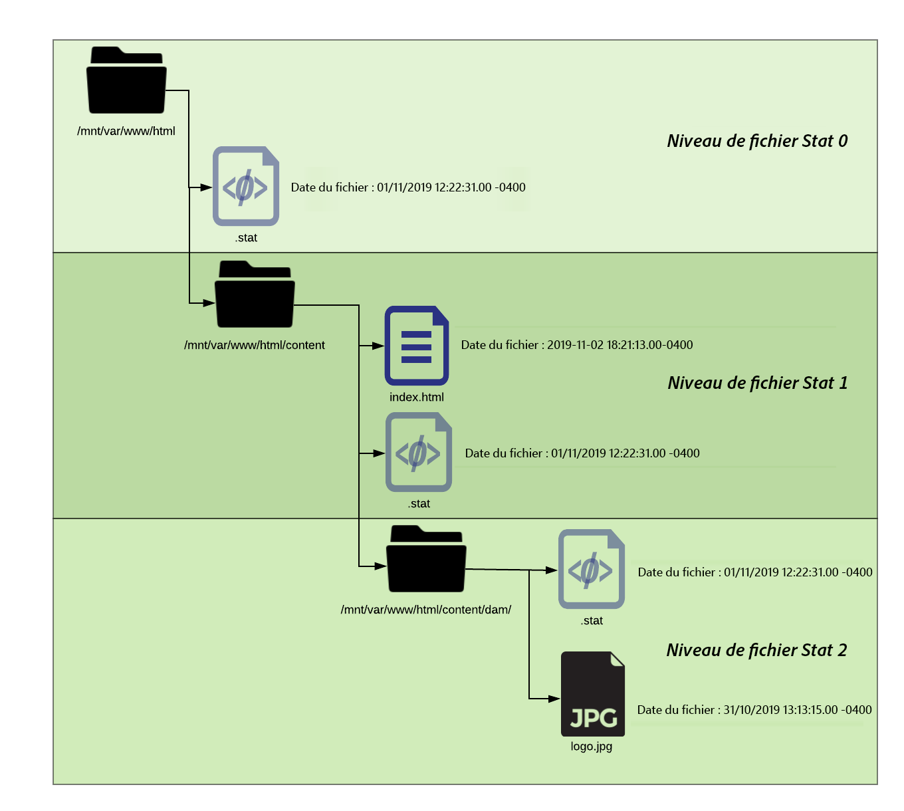

# URL de redirection de Dispatcher

[Table des matières](./overview.md)

[&lt;- Précédent : Utiliser et comprendre les variables](./variables.md)

Ce document fournit des conseils sur la manière dont la purge se produit et explique le mécanisme qui exécute la purge du cache et l’invalidation.


## Fonctionnement

### Ordre de l’opération

Le workflow type est mieux décrit lorsque l’instance de création de contenu active une page et lorsque l’instance de publication reçoit le nouveau contenu. Cela déclenche une demande de purge pour le Dispatcher, comme illustré dans le diagramme suivant :

Cet enchaînement d’événements souligne que nous ne purgeons les éléments que lorsqu’ils sont nouveaux ou qu’ils ont été modifiés.Cela permet de s’assurer que le contenu a été reçu par l’instance de publication avant d’effacer le cache afin d’éviter les conditions de concurrence dans lesquelles la purge peut se produire avant que les modifications puissent être récupérées auprès de l’instance de publication.

## Agents de réplication

Sur l’instance de création, un agent de réplication est configuré pour indiquer à l’instance de publication que lorsqu’un élément est activé, cela déclenche l’envoi du fichier et de toutes ses dépendances à l’instance de publication.

Lorsque l’instance de publication reçoit le fichier, un agent de réplication est configuré pour pointer vers le Dispatcher qui se déclenche au moment de l’événement de réception.Il sérialise ensuite une demande de purge et l’envoie au Dispatcher.

### Agent de réplication de l’instance de création

Voici quelques exemples de copies d’écran d’un agent de réplication standard configuré.


Il existe généralement 1 ou 2 agents de réplication configurés sur l’instance de création pour chaque instance de publication vers laquelle ils répliquent du contenu.

Le premier est l’agent de réplication standard qui transmet les activations de contenu.

Le second est l’agent inverse.Cette option est facultative et configurée pour vérifier dans chaque boîte d’envoi des instances de publication s’il existe un nouveau contenu à extraire dans l’instance de création en tant qu’activité de réplication inverse.

### Agent de réplication de l’instance de publication

Voici un exemple de copies d’écran d’un agent de réplication de purge standard configuré.


### Réplication de flux de Dispatcher recevant un hôte virtuel

Le module de Dispatcher recherche des en-têtes particuliers à connaître lorsqu’une requête POST doit être transmise aux rendus AEM ou s’il s’agit d’une demande sérialisée en tant que demande de purge et qui doit être traitée par le gestionnaire du Dispatcher lui-même.

Voici une copie d’écran de la page de configuration qui affiche ces valeurs :


La page des paramètres par défaut affiche `Serialization Type` comme `Dispatcher Flush` et définit le niveau d’erreur.

.

Sur l’onglet `Transport`, vous pouvez voir l’`URI` défini pour pointer l’adresse IP du Dispatcher qui recevra les demandes de purge.Le chemin d’accès `/dispatcher/invalidate.cache` n’est pas la manière dont le module détermine s’il s’agit d’une purge. Il s’agit uniquement d’un point d’entrée évident que vous pouvez voir dans le journal d’accès pour savoir qu’il s’agissait d’une demande de purge.Sur l’onglet `Extended`, nous allons passer en revue les éléments qui sont présents pour vérifier qu’il s’agit d’une demande de purge envoyée au module de Dispatcher.



La `HTTP Method` pour les demandes de purge est simplement une requête `GET` avec des en-têtes de demande spéciaux :
- CQ-Action
   - Cette opération utilise une variable AEM basée sur la demande et la valeur est généralement *activer ou supprimer*.
- CQ-Handle
   - Cette opération utilise une variable AEM basée sur la demande et la valeur est généralement le chemin complet vers l’élément purgé, par exemple `/content/dam/logo.jpg`.
- CQ-Path
   - Cette opération utilise une variable AEM basée sur la demande et la valeur est généralement le chemin complet vers l’élément en cours de purge, par exemple `/content/dam`.
- Hôte
   - C’est là que l’en-tête `Host` est usurpé pour cibler un `VirtualHost` spécifique qui est configuré sur le serveur web Apache du Dispatcher (`/etc/httpd/conf.d/enabled_vhosts/aem_flush.vhost`).Il s’agit d’une valeur codée en dur qui correspond à une entrée dans le `ServerName` ou le `ServerAlias` du fichier `aem_flush.vhost`.



Sur l’onglet `Triggers`, nous prenons note des déclencheurs activés que nous utilisons et de ce qu’ils sont.

- `Ignore default`
   - Cette option est activée de sorte que l’agent de réplication ne soit pas déclenché lors de l’activation d’une page.Lorsqu’une instance de création modifie une page, cela déclenche une purge.Il s’agit d’une instance de publication, nous ne voulons donc pas déclencher ce type d’événement.
- `On Receive`
   - Lors de la réception d’un nouveau fichier, une purge s’avère nécessaire.Ainsi, lorsque l’instance de création transmet un fichier mis à jour, une demande de purge doit être envoyée à Dispatcher.
- `No Versioning`
   - Nous vérifions cela pour éviter que l’instance de publication ne génère de nouvelles versions, car un nouveau fichier a été reçu.Nous allons simplement remplacer le fichier que nous avons et nous fier à l’instance de création pour garder une trace des versions au lieu de l’instance de publication.

Voici à quoi ressemble une demande de purge standard sous la forme d’une commande `curl`.

```
$ curl \ 
-H "CQ-Action: Activate" \ 
-H "CQ-Handle: /content/dam/logo.jpg" \ 
-H "CQ-Path: /content/dam/" \ 
-H "Content-Length: 0" \  
-H "Content-Type: application/octect-stream" \ 
-H "Host: flush" \ 
http://10.43.0.32:80/dispatcher/invalidate.cache
```

Cet exemple de purge vide le chemin `/content/dam` en mettant à jour le fichier `.stat` du répertoire.

## Le fichier `.stat`

Le mécanisme de purge, simple par nature, est très important, car il permet de générer les fichiers `.stat` à la racine du document où les fichiers cache sont créés.

Dans les fichiers `.vhost` et `_farm.any`, configurez une directive de racine de document pour indiquer les emplacements du cache, du stockage/de la mise à disposition des fichiers lorsqu’une requête d’une personne utilisatrice finale arrive.

Si vous exécutez la commande suivante sur votre serveur Dispatcher, vous trouvez les fichiers `.stat`.

```
$ find /mnt/var/www/html/ -type f -name ".stat"
```

Voici un diagramme de l’apparence de cette structure de fichiers lorsque vous avez des éléments dans le cache et qu’une demande de purge a été envoyée et traitée par le module de Dispatcher.



### Niveau de fichier stat

Notez que dans chaque répertoire, un fichier `.stat` est présent.Sa présence indique qu’une purge a été menée.Dans l’exemple ci-dessus, le paramètre `statfilelevel` a été défini sur `3` dans le fichier de configuration de la batterie correspondante.

Le paramètre `statfilelevel` indique le nombre de dossiers que le module doit parcourir pour mettre à jour un fichier `.stat`.Le fichier .stat est vide. Il ne s’agit plus que d’un nom de fichier avec une date et une heure. Il peut même être créé manuellement en exécutant la commande sur la ligne de commande du serveur Dispatcher.

Si le paramètre de niveau du fichier stat est trop élevé, chaque demande de purge traverse l’arborescence de répertoires pour atteindre les fichiers stat.Cela peut entraîner une réduction drastique des performances de votre Dispatcher en cas d’arborescences de cache volumineuses.

Si le paramètre de ce niveau de fichier est trop bas, la demande de purge peut effacer plus que prévu.Ce qui, à son tour, entraîne l’exécution du cache plus souvent avec moins de demandes traitées à partir du cache, ce qui peut entraîner des problèmes de performances.

<div style="color: #000;border-left: 6px solid #2196F3;background-color:#ddffff;"><b>Remarque :</b>

Définissez le paramètre `statfilelevel` sur une valeur raisonnable.Examinez la structure de vos dossiers et assurez-vous qu’elle est suffisamment légère pour permettre des purges concises.Effectuez une purge de test pour vérifier que les performance du système restent optimales.

Un bon exemple est un site qui prend en charge plusieurs langues.L’arborescence de contenu typique comprend les répertoires suivants.

`/content/brand1/en/us/`

Dans cet exemple, définissez le niveau du fichier stat sur 4.Cela permet de vous assurer que lorsque vous videz le contenu sous le dossier <b>`us`</b>, les dossiers des langues sont épargnés.
</div>

### Établissement de la connexion de la date et de l’heure du fichier stat

Le même scénario se produit à chaque demande de contenu.

1. La date et l’heure du fichier `.stat` est comparée à celle du fichier demandé.
2. Si le fichier `.stat` est plus récent que le fichier demandé, la requête supprime le contenu mis en cache, récupère un nouveau fichier d’AEM et le met en cache.Elle diffuse ensuite le contenu.
3. Si le fichier `.stat` est plus ancien que le fichier demandé, la requête sait alors que le fichier est récent et peut diffuser le contenu.

### Établissement de la connexion de cache - Exemple 1

L’exemple ci-dessus montre une demande du contenu de `/content/index.html`.

La date et heure du fichier `index.html` est 1/11/2019 à 18 h 21.

La date et heure du fichier `.stat` est 1/11/2019 à 12 h 22.

À la lecture de l’heure, on s’aperçoit que le fichier d’index est plus récent que le fichier `.stat`, il sera donc transmis du cache à la personne utilisatrice finale qui l’a demandé.

### Établissement de la connexion de cache - Exemple 2

L’exemple ci-dessus montre une demande du contenu de `/content/dam/logo.jpg`.

La date et heure du fichier `logo.jpg` est 31/10/2019 à 13 h 13.

La date et heure du fichier `.stat` le plus proche est 1/11/2019 à 12 h 22.

Le fichier est donc plus ancien que le fichier `.stat` et il est supprimé. Un nouveau fichier provenant d’AEM le remplacera dans le cache avant d’être transmis à la personne utilisatrice finale qui l’a demandé.

## Paramètres du fichier de batterie

La documentation concernant l’ensemble des options de configuration est disponible à l’adresse suivante : [https://docs.adobe.com/content/help/en/experience-manager-dispatcher/using/configuring/dispatcher-configuration.html?lang=fr#configuring-dispatcher_configuring-the-dispatcher-cache-cache](https://experienceleague.adobe.com/docs/experience-manager-dispatcher/using/configuring/dispatcher-configuration.html?lang=fr).

Nous allons décrire certaines options dédiées à la purge du cache.

### Purger les batteries

Il existe deux répertoires `document root` clés qui mettront en cache les fichiers à partir du trafic de création et de publication.  Pour que ces répertoires soient à jour avec le nouveau contenu, nous devons purger le cache.  Ces demandes de purge ne doivent pas être mêlées à vos configurations normales de batterie de trafic client qui peuvent rejeter la demande ou faire quelque chose d’indésirable.  Au lieu de cela, nous fournissons deux batteries de purge pour cette tâche :

- `/etc/httpd.conf.d/available_farms/001_ams_author_flush_farm.any`
- `/etc/httpd.conf.d/available_farms/001_ams_publish_flush_farm.any`

Ces fichiers de batterie ne font rien d’autre que purger les répertoires racine du document.

```
/publishflushfarm {  
    /virtualhosts {
        "flush"
    }
    /cache {
        /docroot "${PUBLISH_DOCROOT}"
        /statfileslevel "${DEFAULT_STAT_LEVEL}"
        /rules {
            $include "/etc/httpd/conf.dispatcher.d/cache/ams_publish_cache.any"
        }
        /invalidate {
            /0000 {
                /glob "*"
                /type "allow"
            }
        }
        /allowedClients {
            /0000 {
                /glob "*.*.*.*"
                /type "deny"
            }
            $include "/etc/httpd/conf.dispatcher.d/cache/ams_publish_invalidate_allowed.any"
        }
    }
}
```

### Racine du document

Cette entrée de configuration se trouve dans la section suivante du fichier de batterie :

```
/myfarm { 
    /cache { 
        /docroot
```

Vous spécifiez le répertoire dans lequel vous souhaitez que Dispatcher soit renseigné et géré en tant que répertoire de cache.

<div style="color: #000;border-left: 6px solid #2196F3;background-color:#ddffff;"><b>Remarque :</b>
Ce répertoire doit correspondre au paramètre racine du document Apache pour le domaine pour lequel votre serveur web est configuré.

Avoir des dossiers docroot imbriqués pour chaque batterie qui vivent comme sous-dossiers de la racine du document Apache est une mauvaise idée pour de nombreuses raisons.
</div>

### Niveau de fichiers stat

Cette entrée de configuration se trouve dans la section suivante du fichier de batterie :

```
/myfarm { 
    /cache { 
        /statfileslevel
```

Ce paramètre évalue la profondeur à laquelle les fichiers `.stat` devront être générés lorsqu’une demande de purge est formulée.

Le `/statfileslevel` défini sur le nombre suivant avec la racine du document de `/var/www/html/` donnerait les résultats suivants lors de la purge de `/content/dam/brand1/en/us/logo.jpg`.

- 0 : les fichiers stat suivants seraient créés.
   - `/var/www/html/.stat`
- 1 : les fichiers stat suivants seraient créés.
   - `/var/www/html/.stat`
   - `/var/www/html/content/.stat`
- 2 : les fichiers stat suivants seraient créés.
   - `/var/www/html/.stat`
   - `/var/www/html/content/.stat`
   - `/var/www/html/content/dam/.stat`
- 3 : les fichiers stat suivants seraient créés.
   - `/var/www/html/.stat`
   - `/var/www/html/content/.stat`
   - `/var/www/html/content/dam/.stat`
   - `/var/www/html/content/dam/brand1/.stat`
- 4 : les fichiers stat suivants seraient créés.
   - `/var/www/html/.stat`
   - `/var/www/html/content/.stat`
   - `/var/www/html/content/dam/.stat`
   - `/var/www/html/content/dam/brand1/.stat`
   - `/var/www/html/content/dam/brand1/en/.stat`
- 5 : les fichiers stat suivants seraient créés.
   - `/var/www/html/.stat`
   - `/var/www/html/content/.stat`
   - `/var/www/html/content/dam/.stat`
   - `/var/www/html/content/dam/brand1/.stat`
   - `/var/www/html/content/damn/brand1/en/.stat`
   - `/var/www/html/content/damn/brand1/en/us/.stat`


<div style="color: #000;border-left: 6px solid #2196F3;background-color:#ddffff;"><b>Remarque :</b>

Gardez à l’esprit que lorsque l’établissement de la connexion de date et heure se produit, le fichier `.stat` le plus proche est recherché.

Avoir un niveau de fichier `.stat` de 0 et un fichier stat uniquement à l’adresse `/var/www/html/.stat` signifie que le contenu qui vit sous `/var/www/html/content/dam/brand1/en/us/` rechercherait le fichier `.stat` le plus proche et parcourerait 5 dossiers pour trouver le seul fichier `.stat` qui existe au niveau 0 et comparerait les dates à celui-ci.Cela signifie qu’une purge à ce niveau élevé invaliderait essentiellement tous les éléments mis en cache.
</div>

### Invalidation autorisée

Cette entrée de configuration se trouve dans la section suivante du fichier de batterie :

```
/myfarm { 
    /cache { 
        /allowedClients {
```

Dans cette configuration, vous placez une liste d’adresses IP autorisées à envoyer des requêtes de purge.Si une demande de purge arrive dans Dispatcher, elle doit provenir d’une adresse IP de confiance.Si vous avez mal configuré cela ou si vous envoyez une demande de purge à partir d’une adresse IP non approuvée, l’erreur suivante s’affichera dans le fichier journal :

```
[Mon Nov 11 22:43:05 2019] [W] [pid 3079 (tid 139859875088128)] Flushing rejected from 10.43.0.57
```

### Règles d’invalidation

Cette entrée de configuration se trouve dans la section suivante du fichier de batterie :

```
/myfarm { 
    /cache { 
        /invalidate {
```

Ces règles indiquent généralement quels fichiers peuvent être invalidés avec une demande de purge.

Pour éviter que des fichiers importants ne soient invalidés avec l’activation d’une page, vous pouvez appliquer des règles qui spécifient quels fichiers peuvent être invalidés et lesquels doivent être invalidés manuellement.Voici un exemple de configuration qui autorise uniquement l’invalidation des fichiers HTML :

```
/invalidate { 
   /0000 { /glob "*" /type "deny" } 
   /0001 { /glob "*.html" /type "allow" } 
}
```

## Tests/résolution des problèmes

Lorsque vous activez une page et que vous obtenez le feu vert indiquant que l’activation de la page a réussi, vous devez vous attendre à ce que le contenu que vous avez activé soit également supprimé du cache.

Vous actualisez votre page et l’ancien contenu s’affiche. Comment cela est-il possible ? Il y avait pourtant un feu vert.

Suivons quelques étapes manuelles du processus de purge pour avoir une idée de ce qui n’a pas fonctionné.Dans le shell de l’instance de publication, exécutez la demande de purge suivante à l’aide de cURL :

```
$ curl -H "CQ-Action: Activate" \ 
-H "CQ-Handle: /content/<PATH TO ITEM TO FLUSH>" \ 
-H "CQ-Path: /content/<PATH TO ITEM TO FLUSH>" \ 
-H "Content-Length: 0" -H "Content-Type: application/octet-stream" \ 
-H "Host: flush" \ 
http://<DISPATCHER IP ADDRESS>/dispatcher/invalidate.cache
```

Exemple de demande de purge de test

```
$ curl -H "CQ-Action: Activate" \ 
-H "CQ-Handle: /content/customer/en-us" \ 
-H "CQ-Path: /content/customer/en-us" \ 
-H "Content-Length: 0" -H "Content-Type: application/octet-stream" \ 
-H "Host: flush" \ 
http://169.254.196.222/dispatcher/invalidate.cache
```

Une fois que vous avez déclenché la commande de demande vers Dispatcher, vous devriez voir ce qui est effectué dans les journaux et avec le `.stat files`.Suivez le fichier journal et vous devriez voir les entrées suivantes pour confirmer que la demande de purge a atteint le module de Dispatcher.

```
[Wed Nov 13 16:54:12 2019] [I] [pid 19173:tid 140542721578752] Activation detected: action=Activate [/content/dam/logo.jpg] 
[Wed Nov 13 16:54:12 2019] [I] [pid 19173:tid 140542721578752] Touched /mnt/var/www/html/.stat 
[Wed Nov 13 16:54:12 2019] [I] [pid 19173:tid 140542721578752] Touched /mnt/var/www/html/content/.stat 
[Wed Nov 13 16:54:12 2019] [I] [pid 19173:tid 140542721578752] Touched /mnt/var/www/html/content/dam/.stat 
[Wed Nov 13 16:54:12 2019] [I] [pid 19173:tid 140542721578752] "GET /dispatcher/invalidate.cache" 200 purge [publishfarm/-] 0ms
```

Maintenant que le module a récupéré et reconnu la demande de purge, nous devons voir comment les fichiers `.stat` ont été affectés.Exécutez la commande suivante et observez la mise à jour des dates et heures lorsque vous lancez une autre purge :

```
$ watch -n 3 "find /mnt/var/www/html/ -type f -name ".stat" | xargs ls -la $1"
```

Comme vous pouvez le voir dans la sortie de la commande, les dates et heures des fichiers `.stat` actuels sont les suivantes.

```
-rw-r--r--. 1 apache apache 0 Nov 13 16:54 /mnt/var/www/html/content/dam/.stat 
-rw-r--r--. 1 apache apache 0 Nov 13 16:54 /mnt/var/www/html/content/.stat 
-rw-r--r--. 1 apache apache 0 Nov 13 16:54 /mnt/var/www/html/.stat
```

Maintenant, si nous réexécutons la purge, vous verrez la mise à jour des dates et heures.

```
-rw-r--r--. 1 apache apache 0 Nov 13 17:17 /mnt/var/www/html/content/dam/.stat 
-rw-r--r--. 1 apache apache 0 Nov 13 17:17 /mnt/var/www/html/content/.stat 
-rw-r--r--. 1 apache apache 0 Nov 13 17:17 /mnt/var/www/html/.stat
```

Comparons les dates et heures de notre contenu à celles de nos fichiers `.stat`.

```
$ stat /mnt/var/www/html/content/customer/en-us/.stat 
  File: `.stat' 
  Size: 0           Blocks: 0          IO Block: 4096   regular empty file 
Device: ca90h/51856d    Inode: 17154125    Links: 1 
Access: (0644/-rw-r--r--)  Uid: (   48/  apache)   Gid: (   48/  apache) 
Access: 2019-11-13 16:22:31.000000000 -0400 
Modify: 2019-11-13 16:22:31.000000000 -0400 
Change: 2019-11-13 16:22:31.000000000 -0400 
 
$ stat /mnt/var/www/html/content/customer/en-us/logo.jpg 
File: `logo.jpg' 
  Size: 15856           Blocks: 32          IO Block: 4096   regular file 
Device: ca90h/51856d    Inode: 9175290    Links: 1 
Access: (0644/-rw-r--r--)  Uid: (   48/  apache)   Gid: (   48/  apache) 
Access: 2019-11-11 22:41:59.642450601 +0000 
Modify: 2019-11-11 22:41:59.642450601 +0000 
Change: 2019-11-11 22:41:59.642450601 +0000
```

Peu importe les dates et heures que vous observez, vous remarquez que le contenu est plus récent que le fichier `.stat`, ce qui indique au module de servir le fichier à partir du cache, car il est plus récent que le fichier `.stat`.

En clair, quelque chose a mis à jour les dates et heures de ce fichier, ce qui l’empêche d’être « purgé » ou remplacé.

[Suivant -> URL de redirection](./disp-vanity-url.md)
