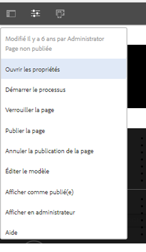
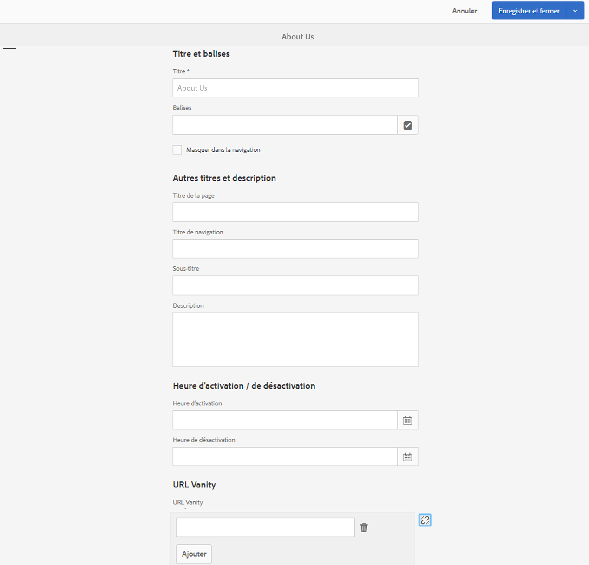
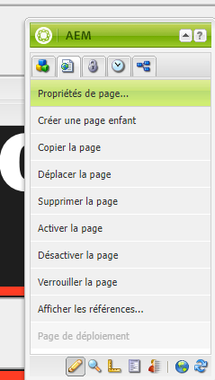
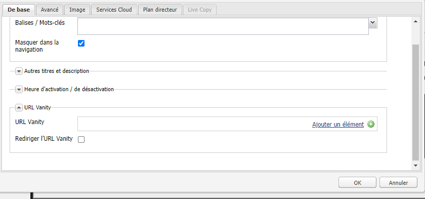

# URL de redirection de Dispatcher

[Table des matières](./overview.md)

[&lt;- Précédent : Purge du Dispatcher](./disp-flushing.md)

## Vue d’ensemble

Ce document vous aidera à comprendre comment AEM gère les URL de redirection et quelques techniques complémentaires utilisant les règles de réécriture pour mapper le contenu plus près de la zone de la diffusion.

## Que sont les URL de redirection ?

Lorsque le contenu se trouve dans une structure de dossiers logique, il ne réside pas toujours dans une URL facile à référencer. Les URL de redirection sont l’équivalent de raccourcis. Des URL plus courtes ou uniques qui référencent l’emplacement du contenu réel.

Exemple : `/aboutus` redirigé sur `/content/we-retail/us/en/about-us.html`.

Les auteurs et autrices AEM ont la possibilité de définir les propriétés de l’URL de redirection sur un élément de contenu dans AEM et de le publier.

Pour que cette fonctionnalité soit opérationnelle, vous devez ajuster les filtres Dispatcher pour autoriser le transfert vers l’URL de redirection. Il devient impossible de le faire en ajustant les fichiers de configuration du Dispatcher au rythme auquel les auteurs et autrices devraient mettre en place ces entrées de page de redirection.

Pour cette raison, le module Dispatcher dispose d’une fonctionnalité permettant d’autoriser automatiquement tout élément répertorié comme une URL de redirection dans l’arborescence de contenu.


## Fonctionnement

### Créer des URL de redirection

L’auteur ou l’autrice consulte une page dans AEM, clique sur les propriétés de la page et ajoute les entrées dans la section _URL de redirection_. Lors de l’enregistrement des modifications et de l’activation de la page, l’URL de redirection est affectée à la page.

Les auteurs et autrices peuvent également cocher la case _Rediriger l’URL de redirection_ lors de l’ajout des entrées _URL de redirection_, les URL de redirection se comportant ainsi comme des redirections 302. Cela signifie que le navigateur est invité à accéder à la nouvelle URL (via l’en-tête de réponse `Location`) et que le navigateur envoie une nouvelle requête à la nouvelle URL.

#### IU tactile :

.

.

#### Outil de recherche de contenu classique :

.

.


>[!NOTE]
>
>Notez que cela peut entraîner des problèmes d’espace de noms. Les entrées de redirection sont globales pour toutes les pages, ce n’est qu’une des lacunes que vous devez anticiper : nous expliquerons ultérieurement quelques unes des solutions permettant d’y remédier.


## Résoudre/mapper des ressources

Chaque entrée de redirection est une entrée de mappage Sling pour une redirection interne.

Ces cartes sont visibles sur la console Felix des instances AEM (`/system/console/jcrresolver`).

Voici une capture d’écran d’une entrée de carte créée par une entrée de redirection :
.

Dans l’exemple ci-dessus, lorsque nous demandons à l’instance AEM de visiter `/aboutus`, la résolution est `/content/we-retail/us/en/about-us.html`.

## Filtres d’autorisation automatique de Dispatcher

Dispatcher dans un état sécurisé filtre les requêtes sur le chemin d’accès `/` via Dispatcher, car il s’agit de la racine de l’arborescence JCR.

Il est important de s’assurer que les personnes chargées de la publication n’autorisent que le contenu de `/content` et d’autres chemins sûrs, et non les chemins tels que `/system`.

Voici le problème : les URL de redirection résident dans le dossier de base de `/`, alors comment leur permettre d’atteindre les personnes en charge de la publication tout en restant en sécurité ?

Le Dispatcher simple dispose d’un mécanisme d’autorisation de filtre automatique. Vous devez installer un package AEM, puis configurer Dispatcher pour qu’il pointe vers cette page de packages.

[https://experience.adobe.com/#/downloads/content/software-distribution/en/aem.html?package=/content/software-distribution/en/details.html/content/dam/aem/public/adobe/packages/granite/vanityurls-components](https://experience.adobe.com/#/downloads/content/software-distribution/en/aem.html?package=/content/software-distribution/en/details.html/content/dam/aem/public/adobe/packages/granite/vanityurls-components)

Dispatcher comporte une section de configuration dans son fichier de batterie :

```
/vanity_urls { 
    /url    "/libs/granite/dispatcher/content/vanityUrls.html" 
    /file   "/tmp/vanity_urls" 
    /delay  300 
}
```

Cette configuration indique à Dispatcher de récupérer cette URL à partir de l’instance AEM qu’il gère toutes les 300 secondes pour récupérer la liste des éléments que nous voulons autoriser.

Il stocke le cache de la réponse dans l’argument `/file` comme le montre cet exemple `/tmp/vanity_urls`.

Ainsi, si vous visitez l’instance AEM au niveau de l’URI, vous voyez ce qu’elle récupère :
.

Il s’agit en fait d’une liste, très simple.

## Réécrire des règles en tant que règles de redirection

Pourquoi mentionnerions-nous l’utilisation de règles de réécriture au lieu du mécanisme par défaut intégré à AEM, comme décrit ci-dessus ?

Tout simplement parce que les problèmes d’espace de noms, de performances et de logique de niveau supérieur peuvent être mieux gérés.

Passons en revue un exemple de l’entrée de redirection `/aboutus` à son contenu `/content/we-retail/us/en/about-us.html` à l’aide du module Apache `mod_rewrite` pour y parvenir.

```
RewriteRule ^/aboutus /content/we-retail/us/en/about-us.html [PT,L,NC]
```

Cette règle recherche l’URL de redirection `/aboutus` et récupère le chemin d’accès complet à partir du rendu avec l’indicateur PT (passthrough).

Elle cessera également le traitement de toutes les autres règles avec un indicateur L (Last), ce qui signifie qu’elle n’aura pas à parcourir une grande liste de règles comme la résolution JCR doit le faire.

En plus du fait qu’il n’est pas nécessaire d’envoyer la requête par proxy et d’attendre la réponse de l’éditeur AEM, les deux éléments de cette méthode la rendent beaucoup plus performante.

Ensuite, la cerise sur le gâteau : l’indicateur NC (non sensible à la casse). Si un client ou une cliente se trompe dans l’URI avec `/AboutUs` au lieu de `/aboutus`, l’URL fonctionne toujours.

Pour créer une règle de réécriture à cet effet, vous devez créer un fichier de configuration sur le Dispatcher (par exemple : `/etc/httpd/conf.d/rewrites/examplevanity_rewrite.rules`) et l’inclure dans le fichier `.vhost` qui gère le domaine nécessitant l’application de ces URL de redirection.

Voici un exemple d’extrait de code d’inclusion dans `/etc/httpd/conf.d/enabled_vhosts/we-retail.vhost`.

```
<VirtualHost *:80> 
 ServerName weretail.com 
 ServerAlias www.weretail.com 
        ........ SNIP ........ 
 <IfModule mod_rewrite.c> 
  ReWriteEngine on 
  LogLevel warn rewrite:info 
  Include /etc/httpd/conf.d/rewrites/examplevanity_rewrite.rules 
 </IfModule> 
        ........ SNIP ........ 
</VirtualHost>
```

## Quelle méthode et où

L’utilisation d’AEM pour contrôler les entrées de redirection présente les avantages suivants.

- Les auteurs et autrices peuvent les créer à la volée.
- Elles vivent avec le contenu et peuvent être conditionnées avec le contenu.

L’utilisation de `mod_rewrite` pour contrôler les entrées de redirection présente les avantages suivants.

- Résolution du contenu plus rapide.
- Plus grande proximité avec les requêtes de contenu des personnes finales.
- Plus d’extensibilité et d’options pour contrôler la manière dont le contenu est mappé sur d’autres conditions.
- Peut ne pas respecter la casse.

Utilisez les deux méthodes, mais voici des conseils et critères à prendre en compte pour savoir laquelle utiliser et à quel moment :

- Si l’URL de redirection est temporaire et a un faible niveau de trafic prévu, utilisez la fonctionnalité intégrée d’AEM.
- Si l’URL de redirection est un point d’entrée de base qui ne change pas souvent et qui est fréquemment utilisé, utilisez une règle `mod_rewrite`.
- Si l’espace de noms de redirection (par exemple : `/aboutus`) doit être réutilisé pour de nombreuses marques sur la même instance AEM, utilisez alors des règles de réécriture.

<div style="color: #000;border-left: 6px solid #2196F3;background-color:#ddffff;"><b>Remarque :</b>

Si vous souhaitez utiliser la fonction AEM de redirection et éviter l’espace de noms, vous pouvez créer une convention de nommage. Utiliser des URL de redirection imbriquées comme `/brand1/aboutus`, `brand2/aboutus`, `brand3/aboutus`.
</div>

[Suivant -> Connexion courante](./common-logs.md)
