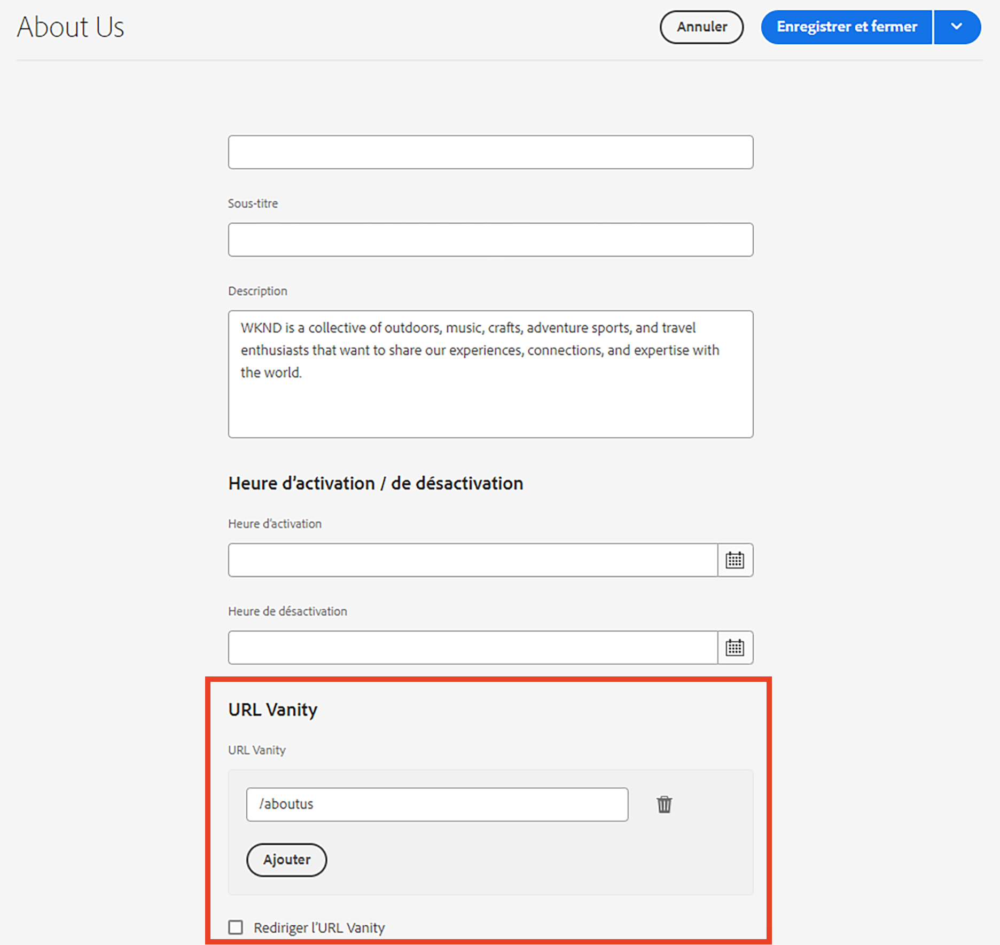

# URL Vanity de Dispatcher

[Table des matières](./overview.md)

[&lt;- Précédent : Purge du Dispatcher](./disp-flushing.md)

## Présentation

Ce document vous aidera à comprendre comment AEM traite les URL de redirection vers un microsite et certaines techniques supplémentaires à l’aide de règles de réécriture pour mapper le contenu plus près de la périphérie de la diffusion.

## Que sont les URL Vanity ?

Lorsque le contenu se trouve dans une structure de dossiers logique, il ne réside pas toujours dans une URL facile à référencer.  Les URL Vanity sont comme des raccourcis.  URL plus courtes ou uniques qui référencent l’emplacement du contenu réel.

Exemple : `/aboutus` pointé `/content/we-retail/us/en/about-us.html`

Les auteurs AEM ont la possibilité de définir les propriétés de l’URL Vanity sur un élément de contenu dans AEM et de le publier.

Pour que cette fonctionnalité fonctionne, vous devrez ajuster les filtres Dispatcher pour autoriser le transfert vers l’URL Vanity.  Cela devient déraisonnable en raison de l’ajustement des fichiers de configuration de Dispatcher à la vitesse à laquelle les auteurs doivent configurer ces entrées de page de redirection vers un microsite.

Pour cette raison, le module Dispatcher dispose d’une fonctionnalité permettant d’autoriser automatiquement tout élément répertorié comme une URL Vanity dans l’arborescence de contenu.


## Fonctionnement

### Création d’URL Vanity

L’auteur visite une page dans AEM et visite les propriétés de la page et ajoute les entrées de l’auteur dans la section URL Vanity.

Une fois les modifications enregistrées et la page activée, l’URL Vanity est désormais affectée à cette page.

#### IU tactile:




#### Classic Content Finder :


<div style="color: #000;border-left: 6px solid #2196F3;background-color:#ddffff;"><b>Remarque :</b>
Veuillez comprendre que ceci est très sujet aux problèmes d'espace.

Les entrées Vanity sont globales pour toutes les pages, ce n&#39;est qu&#39;une des lacunes que vous devez prévoir pour les solutions que nous en expliquerons plus tard.
</div>

## Résolution/mappage des ressources

Chaque entrée de redirection vers un microsite est une entrée de mappage Sling pour une redirection interne.

Ces cartes sont visibles en visitant la console Felix des instances AEM ( `/system/console/jcrresolver` )

Voici une capture d’écran d’une entrée de carte créée par une entrée Vanity :


Dans l’exemple ci-dessus, lorsque nous demandons à l’instance AEM de visiter `/aboutus` il se résoudra à `/content/we-retail/us/en/about-us.html`

## Filtres d’autorisation automatique de Dispatcher

Dispatcher dans un état sécurisé filtre les requêtes sur le chemin d’accès. `/` via Dispatcher, car il s’agit de la racine de l’arborescence JCR.

Il est important de s’assurer que les éditeurs n’autorisent que le contenu de la variable `/content` et autres chemins sûrs etc.  et non les chemins comme `/system` etc.

Voici le problème : les URL Vanity résident dans le dossier de base de `/` alors, comment leur permettre d&#39;atteindre les éditeurs tout en restant en sécurité ?

Le Dispatcher simple dispose d’un mécanisme d’autorisation de filtre automatique. Vous devez installer un module AEM, puis configurer Dispatcher pour qu’il pointe vers cette page de modules.

[https://experience.adobe.com/#/downloads/content/software-distribution/en/aem.html?package=/content/software-distribution/en/details.html/content/dam/aem/public/adobe/packages/granite/vanityurls-components](https://experience.adobe.com/#/downloads/content/software-distribution/en/aem.html?package=/content/software-distribution/en/details.html/content/dam/aem/public/adobe/packages/granite/vanityurls-components)

Dispatcher comporte une section de configuration dans son fichier de ferme :

```
/vanity_urls { 
    /url    "/libs/granite/dispatcher/content/vanityUrls.html" 
    /file   "/tmp/vanity_urls" 
    /delay  300 
}
```

Cette configuration indique à Dispatcher de récupérer cette URL à partir de son instance d’AEM qu’il gère toutes les 300 secondes pour récupérer la liste des éléments que nous voulons autoriser.

Il stocke le cache de la réponse dans la variable `/file` ainsi dans cet exemple `/tmp/vanity_urls`

Ainsi, si vous visitez l’instance AEM à l’URI, vous verrez ce qu’elle récupère :


C&#39;est littéralement une liste, très simple.

## Réécrire des règles en tant que règles Vanity

Pourquoi mentionnerions-nous l’utilisation de règles de réécriture au lieu du mécanisme par défaut intégré à AEM, comme décrit ci-dessus ?

Explication simple : problèmes d’espace de noms, performances et logique de niveau supérieur qui peuvent être mieux gérés.

Passons en revue un exemple de l’entrée Vanity `/aboutus` à son contenu `/content/we-retail/us/en/about-us.html` utilisation des `mod_rewrite` pour ce faire.

```
RewriteRule ^/aboutus /content/we-retail/us/en/about-us.html [PT,L,NC]
```

Cette règle recherche l’URL Vanity `/aboutus` et récupérez le chemin d’accès complet à partir du rendu avec l’indicateur PT (Pass Through).

Il cessera également de traiter tous les autres indicateurs de règles L (Last), ce qui signifie qu’il n’aura pas à parcourir une liste énorme de règles comme JCR Resolving doit le faire.

En plus de ne pas avoir à remplacer la requête et attendre que l’éditeur AEM réponde, ces deux éléments de cette méthode la rendent beaucoup plus performante.

Ensuite, la cerise sur le gâteau ici est l’indicateur NC (non sensible à la casse) qui signifie si un client floue l’URI avec `/AboutUs` au lieu de `/aboutus` il fonctionne toujours et permet à la page appropriée d’être récupérée.

Pour créer une règle de réécriture à cet effet, vous devez créer un fichier de configuration sur Dispatcher (par exemple : `/etc/httpd/conf.d/rewrites/examplevanity_rewrite.rules`) et incluez-le dans la variable `.vhost` fichier qui gère le domaine qui nécessite l’application de ces URL Vanity.

Voici un exemple de fragment de code de l’inclusion dans `/etc/httpd/conf.d/enabled_vhosts/we-retail.vhost`

```
<VirtualHost *:80> 
 ServerName weretail.com 
 ServerAlias www.weretail.com 
        ........ SNIP ........ 
 <IfModule mod_rewrite.c> 
  ReWriteEngine on 
  LogLevel warn rewrite:info 
  Include /etc/httpd/conf.d/rewrites/examplevanity_rewrite.rules 
 </IfModule> 
        ........ SNIP ........ 
</VirtualHost>
```

## Quelle méthode et où

L’utilisation d’AEM pour contrôler les entrées Vanity présente les avantages suivants :
- Les auteurs peuvent les créer à la volée
- Ils vivent avec le contenu et peuvent être conditionnés avec le contenu.

Utilisation `mod_rewrite` pour contrôler les entrées Vanity, les avantages suivants sont apportés :
- Résoudre le contenu plus rapidement
- Plus près du bord des requêtes de contenu de l’utilisateur final
- Plus d’extensibilité et d’options pour contrôler la manière dont le contenu est mappé sur d’autres conditions
- Peut ne pas respecter la casse

Utilisez les deux méthodes, mais voici les conseils et les critères sur lesquels vous pouvez utiliser lorsque :
- Si l’URL Vanity est temporaire et a un faible niveau de trafic prévu, utilisez la fonctionnalité intégrée d’AEM.
- Si la redirection vers un microsite est un point de terminaison de base qui ne change pas souvent et qui est fréquemment utilisé, utilisez une `mod_rewrite` règle.
- Si l’espace de noms Vanity (par exemple : `/aboutus`) doit être réutilisé pour de nombreuses marques sur la même instance AEM puis utiliser des règles de réécriture.

<div style="color: #000;border-left: 6px solid #2196F3;background-color:#ddffff;"><b>Remarque :</b>

Si vous souhaitez utiliser la fonction AEM Vanity et éviter l’espace de noms, vous pouvez créer une convention d’affectation de nom.  Utilisation d’URL Vanity imbriquées comme `/brand1/aboutus`, `brand2/aboutus`, `brand3/aboutus`.
</div>

[Next -> Common Logging](./common-logs.md)