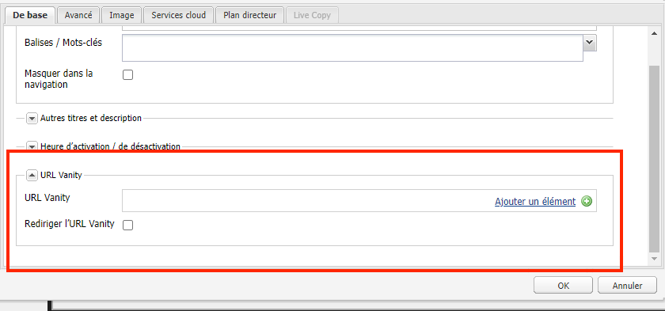

# URL de redirection de Dispatcher

[Table des matières](./overview.md)

[&lt;- Précédent : Purge du Dispatcher](./disp-flushing.md)

## Vue d’ensemble

Ce document vous aide à comprendre comment AEM traite les URL de redirection vers un microsite et certaines techniques supplémentaires à l’aide de règles de réécriture afin de mapper le contenu plus près de la périphérie de la diffusion.

## Que sont les URL de redirection ?

Lorsque le contenu se trouve dans une structure de dossiers logique, il ne réside pas toujours dans une URL facile à référencer. Les URL Vanity sont comme des raccourcis. Des URL plus courtes ou uniques qui référencent l’emplacement du contenu réel.

Exemple : `/aboutus` redirigé sur `/content/we-retail/us/en/about-us.html`.

Les auteurs AEM ont la possibilité de définir les propriétés de l’URL Vanity sur un élément de contenu dans AEM et de le publier.

Pour que cette fonctionnalité fonctionne, vous devez ajuster les filtres Dispatcher pour autoriser le transfert vers un microsite. Cela devient déraisonnable en raison de l’ajustement des fichiers de configuration de Dispatcher à la vitesse à laquelle les auteurs doivent configurer ces entrées de page Vanity.

Pour cette raison, le module Dispatcher dispose d’une fonctionnalité permettant d’autoriser automatiquement tout élément répertorié comme une URL Vanity dans l’arborescence de contenu.


## Fonctionnement

### Créer des URL de redirection

L’auteur visite une page dans AEM, clique sur les propriétés de la page et ajoute des entrées dans la variable _URL Vanity_ . Lors de l’enregistrement des modifications et de l’activation de la page, l’URL Vanity est affectée à la page.

Les auteurs peuvent également sélectionner la variable _Rediriger l’URL Vanity_ case à cocher lors de l’ajout _URL Vanity_ entrées, les URL Vanity se comportent ainsi comme des redirections 302. Cela signifie que le navigateur est invité à accéder à la nouvelle URL (via `Location` en-tête de réponse) et que le navigateur envoie une nouvelle requête à la nouvelle URL.

#### IU tactile :

.

.

#### Outil de recherche de contenu classique :

.

.


>[!NOTE]
>
>Comprenez que cela peut entraîner des problèmes d’espace. Les entrées de redirection sont globales pour toutes les pages, ce n’est qu’une des lacunes que vous devez anticiper : nous expliquerons ultérieurement quelques unes des solutions permettant d’y remédier.


## Résoudre/mapper des ressources

Chaque entrée de redirection est une entrée de mappage Sling pour une redirection interne.

Les cartes sont visibles en visitant la console Felix des instances AEM ( `/system/console/jcrresolver` )

Voici une capture d’écran d’une entrée map créée par une entrée Vanity :


Dans l’exemple ci-dessus, lorsque nous demandons à l’instance AEM de visiter `/aboutus` la résolution est `/content/we-retail/us/en/about-us.html`

## Filtres d’autorisation automatique de Dispatcher

Dispatcher dans un état sécurisé filtre les requêtes sur le chemin d’accès `/` via Dispatcher, car il s’agit de la racine de l’arborescence JCR.

Il est important de s’assurer que les éditeurs n’autorisent que le contenu de la variable `/content` et autres chemins sécurisés, etc., et non des chemins tels que `/system`.

Voici le problème : les URL de redirection résident dans le dossier de base de `/`, alors comment leur permettre d’atteindre les personnes en charge de la publication tout en restant en sécurité ?

Le Dispatcher simple dispose d’un mécanisme d’autorisation de filtre automatique. Vous devez installer un package AEM, puis configurer Dispatcher pour qu’il pointe vers cette page de package.

[https://experience.adobe.com/#/downloads/content/software-distribution/en/aem.html?package=/content/software-distribution/en/details.html/content/dam/aem/public/adobe/packages/granite/vanityurls-components](https://experience.adobe.com/#/downloads/content/software-distribution/en/aem.html?package=/content/software-distribution/en/details.html/content/dam/aem/public/adobe/packages/granite/vanityurls-components)

Dispatcher comporte une section de configuration dans son fichier de ferme :

```
/vanity_urls { 
    /url    "/libs/granite/dispatcher/content/vanityUrls.html" 
    /file   "/tmp/vanity_urls" 
    /delay  300 
}
```

Cette configuration indique à Dispatcher de récupérer cette URL à partir de son instance d’AEM qu’elle devance toutes les 300 secondes pour récupérer la liste des éléments que nous voulons autoriser.

Il stocke son cache de la réponse dans la variable `/file` ainsi dans cet exemple `/tmp/vanity_urls`

Ainsi, si vous visitez l’instance AEM à l’URI, vous verrez ce qu’elle récupère :


Il s’agit en fait d’une liste, très simple.

## Réécrire des règles en tant que règles de redirection

Pourquoi mentionnerions-nous l’utilisation de règles de réécriture au lieu du mécanisme par défaut intégré à AEM, comme décrit ci-dessus ?

Explication simple : problèmes d’espace de noms, performances et logique de niveau supérieur qui peuvent être mieux gérés.

Passons en revue un exemple de l’entrée Vanity `/aboutus` à son contenu `/content/we-retail/us/en/about-us.html` à l’aide des `mod_rewrite` pour ce faire.

```
RewriteRule ^/aboutus /content/we-retail/us/en/about-us.html [PT,L,NC]
```

Cette règle recherche la vanité `/aboutus` et récupérez le chemin d’accès complet à partir du rendu avec l’indicateur PT (Pass Through).

Elle arrête également le traitement de tous les autres indicateurs de règles L (Last), ce qui signifie qu’elle n’a pas à parcourir une liste énorme de règles comme JCR Resolving doit le faire.

En plus de ne pas avoir à remplacer la requête et d’attendre que l’éditeur AEM réponde, ces deux éléments de cette méthode la rendent beaucoup plus performante.

Ensuite, la cerise sur le gâteau ici est l’indicateur NC (non sensible à la casse) qui signifie si un client saisit l’URI avec `/AboutUs` au lieu de `/aboutus` ça marche encore.

Pour créer une règle de réécriture à cet effet, vous devez créer un fichier de configuration sur le Dispatcher (par exemple : `/etc/httpd/conf.d/rewrites/examplevanity_rewrite.rules`) et l’inclure dans le fichier `.vhost` qui gère le domaine nécessitant l’application de ces URL de redirection.

Voici un exemple de fragment de code d’inclusion dans `/etc/httpd/conf.d/enabled_vhosts/we-retail.vhost`

```
<VirtualHost *:80> 
 ServerName weretail.com 
 ServerAlias www.weretail.com 
        ........ SNIP ........ 
 <IfModule mod_rewrite.c> 
  ReWriteEngine on 
  LogLevel warn rewrite:info 
  Include /etc/httpd/conf.d/rewrites/examplevanity_rewrite.rules 
 </IfModule> 
        ........ SNIP ........ 
</VirtualHost>
```

## Quelle méthode et où

L’utilisation d’AEM pour contrôler les entrées de redirection présente les avantages suivants.

- Les auteurs et autrices peuvent les créer à la volée.
- Elles vivent avec le contenu et peuvent être conditionnées avec le contenu.

L’utilisation de `mod_rewrite` pour contrôler les entrées de redirection présente les avantages suivants.

- Résolution du contenu plus rapide.
- Plus près du bord des requêtes de contenu des utilisateurs finaux
- Plus d’extensibilité et d’options pour contrôler la manière dont le contenu est mappé sur d’autres conditions.
- Peut ne pas respecter la casse.

Utilisez les deux méthodes, mais voici des conseils et critères à prendre en compte pour savoir laquelle utiliser et à quel moment :

- Si l’URL Vanity est temporaire et a un faible niveau de trafic prévu, utilisez la fonction intégrée AEM .
- Si l’URL de redirection est un point d’entrée de base qui ne change pas souvent et qui est fréquemment utilisé, utilisez une règle `mod_rewrite`.
- Si l’espace de noms de redirection (par exemple : `/aboutus`) doit être réutilisé pour de nombreuses marques sur la même instance AEM, utilisez alors des règles de réécriture.

<div style="color: #000;border-left: 6px solid #2196F3;background-color:#ddffff;"><b>Remarque :</b>

Si vous souhaitez utiliser la fonction AEM Vanity et éviter l’espace de noms, vous pouvez créer une convention d’affectation de nom. Utiliser des URL de redirection imbriquées comme `/brand1/aboutus`, `brand2/aboutus`, `brand3/aboutus`.
</div>

[Suivant -> Connexion courante](./common-logs.md)
