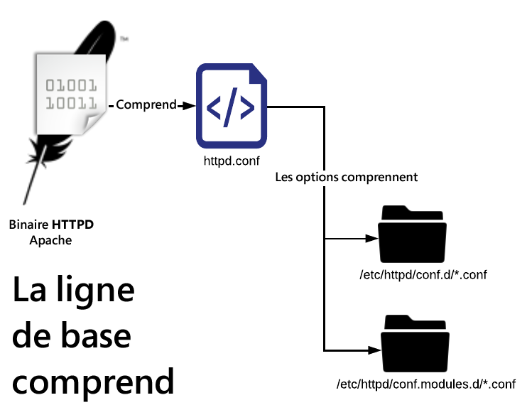
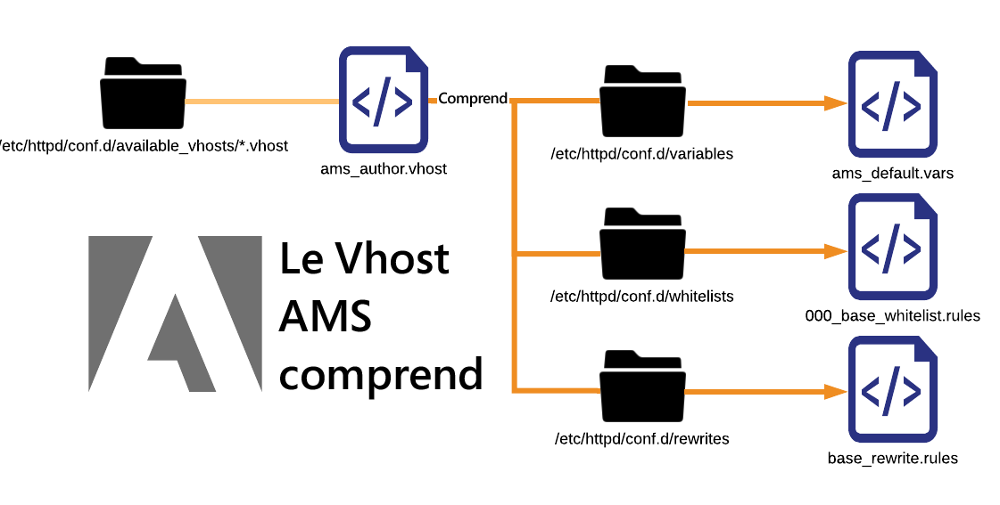

# Explication des fichiers de configuration

[Table des matières](./overview.md)

[&lt;- Précédent : Disposition de base du fichier](./basic-file-layout.md)

Ce document ventile et explique chacun des fichiers de configuration déployés dans un serveur Dispatcher standard configuré dans Adobe Managed Services. Utilisation, convention de nommage, etc.

## Convention de nommage

L’extension de fichier n’a pas réellement d’importance pour un serveur web Apache lorsque le fichier est ciblé avec une instruction `Include` ou `IncludeOptional`.Les nommer correctement avec des noms qui éliminent les conflits et la confusion aide <b>énormément</b>. Les noms utilisés décrivent la portée de l’application du fichier, ce qui facilite la vie. Si tout est nommé `.conf`, la situation devient vraiment confuse. Mieux vaut éviter les fichiers et les extensions mal nommés.Vous trouverez ci-dessous une liste des différentes extensions de fichier personnalisées et des conventions de nommage utilisées dans un Dispatcher classique configuré dans AMS.

## Fichiers contenus dans conf.d/

| Fichier | Destination du fichier | Description |
| ---- | ---------------- | ----------- |
| FILENAME`.conf` | `/etc/httpd/conf.d/` | Une installation Enterprise de Linux par défaut utilise cette extension de fichier et inclut le dossier comme emplacement pour remplacer les paramètres déclarés dans httpd.conf et vous permet d’ajouter des fonctionnalités supplémentaires à un niveau global dans Apache. |
| FILENAME`.vhost` | Intermédiaire : `/etc/httpd/conf.d/available_vhosts/`<br>Actif : `/etc/httpd/conf.d/enabled_vhosts/`<br/><br/><div style="color: #000;border-left: 6px solid #2196F3;background-color:#ddffff;"><b>Remarque :</b> les fichiers .vhost ne doivent pas être copiés dans le dossier enabled_vhosts, ils doivent plutôt utiliser des liens symboliques vers un chemin relatif au fichier available_vhosts/\*.vhost.</div></u><br><br> | Les fichiers \*.vhost (Virtual Host, hôte virtuel) sont des entrées `<VirtualHosts>` correspondant aux noms d’hôtes et permettant à Apache de gérer chaque trafic de domaine avec des règles différentes. Dans le fichier `.vhost`, d’autres fichiers tels que `rewrites`, `whitelisting`, `etc` seront inclus. |
| FILENAME`_rewrite.rules` | `/etc/httpd/conf.d/rewrites/` | Les fichiers `*_rewrite.rules` stockent des règles `mod_rewrite` à inclure et à utiliser explicitement par un fichier `vhost`. |
| FILENAME`_whitelist.rules` | `/etc/httpd/conf.d/whitelists/` | Les fichiers `*_ipwhitelist.rules` sont inclus dans les fichiers `*.vhost`. Ils contiennent une expression régulière d’IP ou des règles d’autorisation et de refus pour permettre l’établissement d’une liste autorisée d’IP. Si vous essayez de restreindre l’affichage d’un hôte virtuel en fonction des adresses IP, vous allez générer l’un de ces fichiers et l’inclure à partir de votre fichier `*.vhost`. |

## Fichiers contenus dans conf.dispatcher.d/

| Fichier | Destination du fichier | Description |
| --- | --- | --- |
| FILENAME`.any` | `/etc/httpd/conf.dispatcher.d/` | Le module Apache de Dispatcher AEM tire ses paramètres des fichiers `*.any`. Le fichier d’inclusion parent par défaut est : `conf.dispatcher.d/dispatcher.any`. |
| FILENAME`_farm.any` | Intermédiaire : `/etc/httpd/conf.dispatcher.d/available_farms/`<br>Actif : `/etc/httpd/conf.dispatcher.d/enabled_farms/`<br><br><div style="color: #000;border-left: 6px solid #2196F3;background-color:#ddffff;"><b>Remarque :</b> ces fichiers de batterie ne doivent pas être copiés dans le dossier `enabled_farms` mais utiliser `symlinks` comme chemin relatif vers le fichier `available_farms/*_farm.any`. </div> Les fichiers <br/>`*_farm.any` sont inclus dans le fichier `conf.dispatcher.d/dispatcher.any`. Ces fichiers de batterie parents sont destinés à contrôler le comportement du module pour chaque type de rendu ou de site web. Les fichiers sont créés dans le répertoire `available_farms` et activés avec un `symlink` dans le répertoire `enabled_farms`.  <br/>Il les inclut automatiquement par leur nom dans le fichier `dispatcher.any`.Les fichiers de batterie <br/><b>de référence</b> commencent par `000_` pour qu’ils soient toujours chargés en premier.Les fichiers de batterie <br><b>personnalisés</b> doivent être chargés ensuite en démarrant leur modèle de nombre à `100_` pour assurer le comportement d’inclusion approprié. |
| FILENAME`_filters.any` | `/etc/httpd/conf.dispatcher.d/filters/` | Les fichiers `*_filters.any` sont inclus dans les fichiers `conf.dispatcher.d/enabled_farms/*_farm.any`. Chaque batterie comporte un ensemble de règles qui indiquent le trafic qui doit être filtré et ne doit pas atteindre les moteurs de rendu. |
| FILENAME`_vhosts.any` | `/etc/httpd/conf.dispatcher.d/vhosts/` | Les fichiers `*_vhosts.any` sont inclus dans les fichiers `conf.dispatcher.d/enabled_farms/*_farm.any`. Ces fichiers sont une liste de noms d’hôtes ou de chemins d’accès URI à mettre en correspondance avec des objets blob pour déterminer le moteur de rendu à utiliser pour diffuser cette requête. |
| FILENAME`_cache.any` | `/etc/httpd/conf.dispatcher.d/cache/` | Les fichiers `*_cache.any` sont inclus dans les fichiers `conf.dispatcher.d/enabled_farms/*_farm.any`. Ces fichiers spécifient les éléments qui sont mis en cache et ceux qui ne le sont pas. |
| FILENAME`_invalidate_allowed.any` | `/etc/httpd/conf.dispatcher.d/cache/` | Les fichiers `*_invalidate_allowed.any` sont inclus dans les fichiers `conf.dispatcher.d/enabled_farms/*_farm.any`. Ils spécifient les adresses IP autorisées à envoyer des demandes de purge et d’invalidation. |
| FILENAME`_clientheaders.any` | `/etc/httpd/conf.dispatcher.d/clientheaders/` | Les fichiers `*_clientheaders.any` sont inclus dans les fichiers `conf.dispatcher.d/enabled_farms/*_farm.any`. Ils spécifient les en-têtes clients à transmettre à chaque moteur de rendu. |
| FILENAME`_renders.any` | `/etc/httpd/conf.dispatcher.d/renders/` | Les fichiers `*_renders.any` sont inclus dans les fichiers `conf.dispatcher.d/enabled_farms/*_farm.any`. Ils spécifient les paramètres d’IP, de port et de délai d’expiration pour chaque moteur de rendu. Un moteur de rendu correct peut être un serveur LiveCycle ou tout système AEM à partir duquel Dispatcher peut récupérer/remplacer les demandes. |

## Problèmes évités

Lorsque vous suivez la convention de nommage, vous pouvez éviter des erreurs courantes qui peuvent avoir des résultats catastrophiques.Nous allons en présenter quelques exemples.

### Exemple de problème

Comme exemple de site pour ExempleCo, deux fichiers de configuration ont été créés par les développeurs et développeuses des configurations du Dispatcher.

<b>/etc/httpd/conf.d/exampleco.conf</b>

```
<VirtualHost *:80> 
    ServerName  "exampleco" 
    ServerAlias "www.exampleco.com" 
    .......... SNIP ............... 
    <IfModule mod_rewrite.c> 
        ReWriteEngine   on 
        LogLevel warn rewrite:trace1 
        Include /etc/httpd/conf.d/rewrites/exampleco.conf 
    </IfModule> 
</VirtualHost>
```

<b>/etc/httpd/conf.d/rewrites/exampleco.conf</b>

```
RewriteRule ^/$ /content/exampleco/en.html [PT,L] 
RewriteRule ^/robots.txt$ /content/dam/exampleco/robots.txt [PT,L]
```

#### `POTENTIAL DANGER - The file names are the same`

Si le fichier `vhost` est accidentellement placé dans le dossier `rewrites` et que le `rewrites file` est placé dans le dossier `vhosts`.Il semblerait qu’il soit déployé correctement par nom de fichier, mais Apache lance une *ERREUR* et le problème ne sera pas évident immédiatement.

<b>Comment cela devient généralement un problème</b>

Si les `two files` sont téléchargés à l’emplacement `same`, ils peuvent `overwrite themselves` ou devenir indissociables, auxquels cas le déploiement devient un cauchemar.

<b>Les extensions de fichier sont identiques et sujettes à l’inclusion automatique</b>

Les extensions de fichier sont identiques et utilisent l’extension d’inclusion automatique qui permet à Apache d’`auto include` tous les fichiers `.conf` dans la plupart de ses dossiers par défaut.

<b>Comment cela devient généralement un problème</b>

Si le fichier vhost avec l’extension `.conf` est placé dans le dossier `/etc/httpd/conf.d/`, il tente de le charger en mémoire sur Apache, ce qui ne pose généralement pas de problème. Mais si le fichier de règles de réécriture avec l’extension `.conf` est placé dans le dossier `/etc/httpd/conf.d/`, il sera inclus automatiquement et appliqué globalement, ce qui provoquera des résultats confus et indésirables.

## Résolution

Nommez les fichiers en fonction de ce qu’ils font et maintenez-les en dehors de l’espace de noms des règles d’inclusion automatique pour une sécurité optimale.

S’il s’agit d’un fichier d’hôte virtuel, nommez-le avec `.vhost` comme extension.

S’il s’agit d’un fichier de règle de réécriture, nommez-le avec site`_rewrite.rules` comme suffixe et extension. Cette convention de nommage indique clairement à quel site il est destiné et qu’il s’agit d’un ensemble de règles de réécriture.

S’il s’agit d’un fichier de règle de liste d’adresses IP autorisées, nommez-le avec description`_whitelist.rules` comme suffixe et extension.Cette convention de nommage indique son utilité et qu’il s’agit d’un ensemble de règles de correspondance d’adresses IP.

L’utilisation de ces conventions de nommage permet d’éviter des problèmes si un fichier est déplacé dans un répertoire d’inclusion automatique auquel il n’appartient pas.

Par exemple, placer un fichier nommé avec `.rules`, `.any`, ou `.vhost` dans le dossier d’inclusion automatique `/etc/httpd/conf.d/` n’aurait aucun effet.

Si une requête de modification de déploiement indique « Veuillez déployer exampleco_rewrite.rules vers les Dispatchers de production », la personne qui déploie les modifications peut déjà savoir qu’elle n’ajoute pas de nouveau site. Au lieu de cela, elle se contente de mettre à jour les règles de réécriture comme indiqué par le nom du fichier.

### Inclure l’ordre

Lors de l’extension des fonctionnalités et des configurations dans le serveur web Apache installé sur Enterprise Linux, il y a des ordres d’inclusion importants à comprendre.

### Inclusions de ligne de base Apache



Comme le montre le diagramme ci-dessus, le binaire httpd ne regarde que le fichier httpd.conf comme fichier de configuration.Ce fichier contient les instructions suivantes :

```
Include conf.modules.d/*.conf 
IncludeOptional conf.d/*.conf
```

### Inclusions de niveau supérieur AMS

Lorsque nous avons appliqué notre norme, nous avons ajouté d’autres types de fichiers et inclus les nôtres.

Voici les répertoires de référence AMS et les inclusions de niveau supérieur.
.

En partant de la ligne de base Apache, nous montrons comment AMS a créé des dossiers supplémentaires et des inclusions de niveau supérieur pour les dossiers `conf.d` ainsi que des répertoires spécifiques aux modules imbriqués sous `/etc/httpd/conf.dispatcher.d/`.

Au chargement d’Apache, ce dernier récupère `/etc/httpd/conf.modules.d/02-dispatcher.conf` et ce fichier inclut le fichier binaire `/etc/httpd/modules/mod_dispatcher.so` dans son état d’exécution.

```
LoadModule dispatcher_module modules /mod_dispatcher .so
```

Pour utiliser le module dans notre `<VirtualHost />`, nous déposons un fichier de configuration dans `/etc/httpd/conf.d/` appelé `dispatcher_vhost.conf` et dans ce fichier, vous verrez la configuration des paramètres de base nécessaires au fonctionnement du module :

```
<IfModule disp_apache2.c> 
    DispatcherConfig conf.dispatcher.d/dispatcher.any 
    ...SNIP... 
</IfModule>
```

Comme vous pouvez le voir ci-dessus, cela inclut le fichier de niveau supérieur `dispatcher.any` pour que notre module Dispatcher récupère ses fichiers de configuration de `/etc/httpd/conf.dispatcher.d/dispatcher.any`.

Prêtez attention au contenu de ce fichier :

```
/farms { 
    $include "enabled_farms/*_farm.any" 
}
```

Le fichier de niveau supérieur `dispatcher.any` comprend tous les fichiers de batterie activés qui se trouvent dans `/etc/httpd/conf.dispatcher.d/enabled_farms/` avec le nom de fichier `FILENAME_farm.any` qui suit notre convention de nommage standard.

Plus tard, dans le fichier `dispatcher_vhost.conf` mentionné précédemment, nous faisons également une instruction d’inclusion pour activer chaque fichier d’hôte virtuel activé qui se trouve dans `/etc/httpd/conf.d/enabled_vhosts/` avec le nom de fichier `FILENAME.vhost` qui suit notre convention de nommage standard.

```
IncludeOptional /etc/httpd/conf.d/enabled_vhosts/*.vhost
```

Dans chacun de nos fichiers .vhost, vous remarquerez que le module de Dispatcher est initialisé en tant que gestionnaire de fichiers par défaut pour un répertoire.Voici un exemple de fichier .vhost pour illustrer la syntaxe :

```
<VirtualHost *:80> 
 ServerName "weretail" 
 ServerAlias www.weretail.com weretail.com 
 <Directory /> 
  <IfModule disp_apache2.c> 
   ....SNIP.... 
   SetHandler dispatcher-handler 
  </IfModule> 
  ....SNIP.... 
 </Directory> 
 ....SNIP.... 
</VirtualHost>
```

Une fois que les inclusions de niveau supérieur sont résolues, elles comportent d’autres sous-inclusions qui méritent d’être mentionnées.Voici un diagramme de haut niveau sur la manière dont les fichiers de batterie de serveurs et vhosts incluent d’autres sous-éléments.

### Inclusions d’hôte virtuel AMS

.

Lorsque des fichiers `.vhost` provenant du référentiel `/etc/httpd/conf.d/availabled_vhosts/` sont liés par un lien symbolique au répertoire `/etc/httpd/conf.d/enabled_vhosts/`, ils sont utilisés dans la configuration en cours d’exécution.

Les fichiers `.vhost` ont des sous-inclusions basées sur des éléments communs que nous avons trouvés.Il s’agit de variables, de listes autorisées et de règles de réécriture.

Le fichier `.vhost` comporte des instructions d’inclusion pour chaque fichier en fonction de l’endroit où ils doivent être inclus dans le fichier `.vhost`.Voici un exemple de syntaxe d’un fichier `.vhost` comme référence :

```
Include /etc/httpd/conf.d/variables/weretail.vars 
<VirtualHost *:80> 
 ServerName "${MAIN_DOMAIN}" 
 <Directory /> 
  Include /etc/httpd/conf.d/whitelists/weretail*_whitelist.rules 
  <IfModule disp_apache2.c> 
   ....SNIP.... 
   SetHandler dispatcher-handler 
  </IfModule> 
  ....SNIP.... 
 </Directory> 
 ....SNIP.... 
 <IfModule mod_rewrite.c> 
  ReWriteEngine   on 
  LogLevel warn rewrite:trace1 
  Include /etc/httpd/conf.d/rewrites/weretail_rewrite.rules 
 </IfModule> 
</VirtualHost>
```

Comme vous pouvez le voir dans l’exemple ci-dessus, il existe une inclusion pour les variables nécessaires dans ce fichier de configuration qui sont utilisées ultérieurement.

Dans le fichier `/etc/httpd/conf.d/variables/weretail.vars`, nous pouvons voir les variables qui sont définies :

```
Define MAIN_DOMAIN dev.weretail.com
```

Vous pouvez également voir une ligne qui comprend une liste de fichiers `_whitelist.rules` qui restreignent qui peut afficher ce contenu en fonction de différents critères de liste autorisée.Examinons le contenu d’un des fichiers de liste autorisée `/etc/httpd/conf.d/whitelists/weretail_mainoffice_whitelist.rules` :

```
<RequireAny> 
  Require ip 192.150.16.0/23 
</RequireAny>
```

Vous pouvez également voir une ligne qui comprend un ensemble de règles de réécriture.Regardons le contenu du fichier `weretail_rewrite.rules` :

```
RewriteRule ^/robots.txt$ /content/dam/weretail/robots.txt [NC,PT] 
RewriteCond %{SERVER_NAME} brand1.weretail.net [NC] 
RewriteRule ^/favicon.ico$ /content/dam/weretail/favicon.ico [NC,PT] 
RewriteCond %{SERVER_NAME} brand2.weretail.com [NC] 
RewriteRule ^/sitemap.xml$ /content/weretail/general/sitemap.xml [NC,PT] 
RewriteRule ^/logo.jpg$ /content/dam/weretail/general/logo.jpg [NC,PT]
```

### Inclusions de la batterie AMS

.

Lorsque des fichiers FILENAME_farm.any du répertoire `/etc/httpd/conf.dispatcher.d/available_farms/` sont liés par un lien symbolique au répertoire `/etc/httpd/conf.dispatcher.d/enabled_farms/`, ils sont utilisés dans la configuration en cours d’exécution.

Les fichiers de batterie comportent des sous-inclusions basées sur les [sections de niveau supérieur de la batterie](https://experienceleague.adobe.com/docs/experience-manager-dispatcher/using/configuring/dispatcher-configuration.html?lang=fr#defining-farms-farms), comme le cache, les en-têtes clients, les filtres, les rendus et les fichiers vhosts.

Les fichiers `FILENAME_farm.any` contiennent des instructions pour chaque fichier en fonction de l’endroit où ils doivent être inclus dans le fichier de batterie.Voici un exemple de syntaxe d’un fichier `FILENAME_farm.any` comme référence :

```
/weretailfarm {   
 /clientheaders { 
  $include "/etc/httpd/conf.dispatcher.d/clientheaders/ams_publish_clientheaders.any" 
  $include "/etc/httpd/conf.dispatcher.d/clientheaders/ams_common_clientheaders.any" 
 } 
 /virtualhosts { 
  $include "/etc/httpd/conf.dispatcher.d/vhosts/weretail_vhosts.any" 
 } 
 /renders { 
  $include "/etc/httpd/conf.dispatcher.d/renders/ams_publish_renders.any" 
 } 
 /filter { 
  $include "/etc/httpd/conf.dispatcher.d/filters/ams_publish_filters.any" 
  $include "/etc/httpd/conf.dispatcher.d/filters/weretail_search_filters.any" 
 } 
 ....SNIP.... 
 /cache { 
  ....SNIP.... 
  /rules { 
   $include "/etc/httpd/conf.dispatcher.d/cache/ams_publish_cache.any" 
  } 
  ....SNIP.... 
  /allowedClients { 
   /0000 { 
    /glob "*.*.*.*" 
    /type "deny" 
   } 
   $include "/etc/httpd/conf.dispatcher.d/cache/ams_publish_invalidate_allowed.any" 
  } 
 ....SNIP.... 
 } 
}
```

Comme vous pouvez le voir, chaque section de la batterie weretail utilise une instruction d’inclusion au lieu de contenir toute la syntaxe nécessaire.

Examinons la syntaxe de quelques-unes de ces inclusions pour avoir une idée de ce à quoi ressemblerait chaque sous-inclusion.

`/etc/httpd/conf.dispatcher.d/vhosts/weretail_publish_vhosts.any` :

```
"brand1.weretail.com" 
"brand2.weretail.com" 
"www.weretail.comf"
```

Comme vous pouvez le constater, il s’agit d’une nouvelle liste de noms de domaine séparés par des lignes qui doivent être rendus à partir de cette batterie plutôt que par les autres.

Regardons ensuite le fichier `/etc/httpd/conf.dispatcher.d/filters/weretail_search_filters.any` :

```
/400 { /type "allow" /method "GET" /path "/bin/weretail/lists/*" /extension "json" } 
/401 { /type "allow" /method "POST" /path "/bin/weretail/search/' /extension "html" }
```

[Suivant -> Présentation du cache](./understanding-cache.md)
