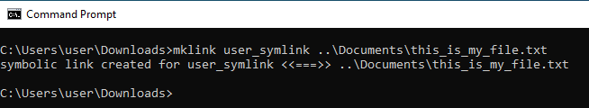

# Ajout de liens symboliques dans GIT

[Table des matières](./overview.md)

[&lt;- Précédent : Contrôle d’intégrité de Dispatcher](./health-check.md)

Dans AMS, vous obtenez un référentiel GIT prérempli contenant le code source de votre Dispatcher, mûr et prêt pour le développement et la personnalisation.

Après avoir créé votre première `.vhost` fichier ou niveau supérieur `farm.any` vous devez créer un lien symbolique à partir de la variable `available_*` vers le répertoire `enabled_*` répertoire . L’utilisation du type de lien approprié est essentielle pour un déploiement réussi via le pipeline Cloud Manager. Cette page vous aidera à savoir comment procéder.

## Archétype de Dispatcher

Le développeur d’AEM démarre généralement son projet à partir du [AEM archetype](https://github.com/adobe/aem-project-archetype)

Voici un exemple de la zone du code source où vous pouvez voir les liens symboliques utilisés :

```
$ tree dispatcher
dispatcher
└── src
   ├── conf.d
.....SNIP.....
    │   └── available_vhosts
    │   │   ├── 000_unhealthy_author.vhost
    │   │   ├── 000_unhealthy_publish.vhost
    │   │   ├── aem_author.vhost
    │   │   ├── aem_flush.vhost
    │   │   ├── aem_health.vhost
    │   │   ├── aem_lc.vhost
    │   │   └── aem_publish.vhost
    └── dispatcher_vhost.conf
    │   └── enabled_vhosts
    │   │   ├── aem_author.vhost -> ../available_vhosts/aem_author.vhost
    │   │   ├── aem_flush.vhost -> ../available_vhosts/aem_flush.vhost
    │   │   ├── aem_health.vhost -> ../available_vhosts/aem_health.vhost
    │   │   └── aem_publish.vhost -> ../available_vhosts/aem_publish.vhost
.....SNIP.....
    └── conf.dispatcher.d
    │   ├── available_farms
    │   │   ├── 000_ams_author_farm.any
    │   │   ├── 001_ams_lc_farm.any
    │   │   └── 002_ams_publish_farm.any
.....SNIP.....
    │   └── enabled_farms
    │   │   ├── 000_ams_author_farm.any -> ../available_farms/000_ams_author_farm.any
    │   │   └── 002_ams_publish_farm.any -> ../available_farms/002_ams_publish_farm.any
.....SNIP.....
17 directories, 60 files
```

À titre d’exemple, la variable `/etc/httpd/conf.d/available_vhosts/` Le répertoire contient le potentiel intermédiaire `.vhost` fichiers que nous pouvons utiliser dans notre configuration en cours d’exécution.

Activé `.vhost` Les fichiers s’affichent sous la forme d’un chemin relatif. `symlinks` à l’intérieur de `/etc/httpd/conf.d/enabled_vhosts/` répertoire .

## Créer un lien symbolique

Nous utilisons des liens symboliques vers le fichier afin que le serveur web Apache traite le fichier de destination comme le même fichier.  Nous ne voulons pas dupliquer le fichier dans les deux répertoires.  Il s’agit simplement d’un raccourci entre un répertoire (lien symbolique) et l’autre.

Reconnaissez que les configurations déployées cibleront un hôte Linux.  La création d’un lien symbolique non compatible avec le système cible entraîne des échecs et des résultats indésirables.

Si votre poste de travail n&#39;est pas une machine Linux, vous vous demanderez probablement quelles commandes utiliser pour créer correctement ces liens afin qu&#39;ils puissent les valider dans GIT.

> `TIP:` Il est important d’utiliser des liens relatifs, car si vous avez installé une copie locale du serveur web Apache et que vous avez une base d’installation différente, les liens fonctionnent toujours.  Si vous utilisez un chemin absolu, votre poste de travail ou d’autres systèmes devront correspondre exactement à la même structure de répertoires.

### OSX / Linux

Les liens symboliques sont natifs de ces systèmes d’exploitation et voici quelques exemples de création de ces liens.  Ouvrez votre application de terminal préférée et utilisez les exemples de commandes suivants pour créer le lien :

```
$ cd <LOCATION OF CLONED GIT REPO>\src\conf.d\enabled_vhosts
$ ln -s ../available_vhosts/<Destination File Name> <Target File Name>
```

Voici un exemple de commande renseigné à titre de référence :

```
$ git clone https://github.com/adobe/aem-project-archetype.git
$ cd aem-project-archetype/src/main/archetype/dispatcher.ams/src/conf.d/enabled_vhosts/
$ ln -s ../available_vhosts/aem_flush.vhost aem_flush.vhost
```

Voici un exemple de lien maintenant, si vous listez le fichier à l’aide de la variable `ls` command :

```
ls -l
total 0
lrwxrwxrwx. 1 root root 35 Oct 13 21:38 aem_flush.vhost -> ../available_vhosts/aem_flush.vhost
```

### Windows

> `Note:` Il s’avère que MS Windows (meilleur, NTFS) prend en charge les liens symboliques depuis... Windows Vista !


> `Warning:` La commande mklink pour créer des liens symboliques nécessite des privilèges d’administrateur pour s’exécuter correctement. Même en tant que compte administrateur, vous devez exécuter l’invite de commandes &quot;En tant qu’administrateur&quot;, sauf si le mode développeur est activé.
> <br/>Autorisations incorrectes :
> 
> <br/>Autorisations adéquates :
> 

Voici la ou les commandes pour créer le lien :

```
C:\<PATH TO SRC>\enabled_vhosts> mklink <Target File Name> ..\available_vhosts\<Destination File Name>
```


Voici un exemple de commande renseigné à titre de référence :

```
C:\> git clone https://github.com/adobe/aem-project-archetype.git
C:\> cd aem-project-archetype\src\main\archetype\dispatcher.ams\src\conf.d\enabled_vhosts\
C:\aem-project-archetype\src\main\archetype\dispatcher.ams\src\conf.d\enabled_vhosts> mklink aem_flush.vhost ..\available_vhost\aem_flush.vhost
symbolic link created for aem_flush.vhost <<===>> ..\available_vhosts\aem_flush.vhost
```

#### Mode Développeur ( Windows 10 )

Lorsqu’elles sont [Mode Développeur](https://docs.microsoft.com/en-us/windows/apps/get-started/enable-your-device-for-development), Windows 10 vous permet de tester plus facilement les applications que vous développez, d’utiliser l’environnement shell Ubuntu Bash, de modifier divers paramètres axés sur les développeurs et d’effectuer d’autres tâches de ce type.

Microsoft semble continuer à ajouter des fonctionnalités au mode Développeur, ou à activer certaines de ces fonctionnalités par défaut une fois qu’elles ont atteint une adoption plus large et qu’elles sont considérées comme stables (par exemple, avec la mise à jour des créateurs, l’environnement de Shell Ubuntu Bash n’a plus besoin du mode Développeur).

Et les liens symboliques ? Lorsque le mode Développeur est activé, il n’est pas nécessaire d’exécuter une invite de commande avec des privilèges élevés pour pouvoir créer des liens symboliques. Par conséquent, une fois que le mode Développeur est activé, tous les utilisateurs peuvent créer des liens symboliques.

> Après avoir activé le mode Développeur, les utilisateurs doivent fermer/se connecter pour que les modifications soient prises en compte.

Vous pouvez maintenant voir que la commande fonctionne sans s’exécuter en tant qu’administrateur.



#### Approche alternative/programmatique

Une stratégie spécifique permet à certains utilisateurs de créer des liens symboliques → [Création de liens symboliques (Windows 10) - Sécurité Windows | Documents Microsoft](https://docs.microsoft.com/en-us/windows/security/threat-protection/security-policy-settings/create-symbolic-links)

PRO :
- Cela peut être exploité par les clients pour permettre la création de liens symboliques par programmation à tous les développeurs de leur organisation (c’est-à-dire Principal Directory) sans avoir à activer le mode Développeur manuellement sur chaque appareil.
- En outre, cette stratégie doit être disponible dans les versions antérieures de MS Windows qui ne proposent pas le mode Développeur.

CON :
- Cette stratégie semble n’avoir aucun effet sur les utilisateurs appartenant au groupe Administrateurs. Les administrateurs doivent toujours exécuter une invite de commande avec des privilèges élevés. Bizarre.

> La fermeture de session/connexion des utilisateurs sera nécessaire pour que les modifications apportées à la stratégie locale/de groupe prennent effet.

Exécuter `gpedit.msc`, ajoutez/modifiez des utilisateurs selon les besoins. Les administrateurs sont là par défaut


#### Activation des liens symboliques dans GIT

Git gère les liens symboliques en fonction de l’option core.symlinks

Source : [Documentation Git - git-config](https://git-scm.com/docs/git-config#Documentation/git-config.txt-coresymlinks)

*Si core.symlinks a la valeur false, les liens symboliques sont extraits sous la forme de petits fichiers simples contenant le texte du lien. `git-update-index[1]` et `git-add[1]` ne modifie pas le type enregistré en fichier normal. Utile pour les systèmes de fichiers tels que FAT qui ne prennent pas en charge les liens symboliques.
La valeur par défaut est true, sauf que `git-clone[1]` ou `git-init[1] will probe and set core.symlinks false if appropriate when the repository is created.` Dans la plupart des cas, Git supposera que Windows ne convient pas aux liens symboliques et définira cette valeur sur false.*

Le comportement de Git sous Windows est bien expliqué ici : Liens symboliques ・ wiki git-for-windows/git ・ GitHub

> `Info`: Les hypothèses répertoriées dans la documentation ci-dessus semblent aller avec une configuration possible d’AEM Developer sous Windows, notamment NTFS et le fait que nous n’avons que des liens symboliques de fichier et des liens symboliques de répertoire.

Voici la bonne nouvelle, puisque [Git pour Windows version 2.10.2](https://github.com/git-for-windows/git/releases/tag/v2.10.2.windows.1) le programme d’installation a une [option explicite pour activer la prise en charge des liens symboliques.](https://github.com/git-for-windows/git/issues/921)

> `Warning`: L’option core.symlink peut être fournie au moment de l’exécution lors du clonage du référentiel ou peut être stockée en tant que configuration globale.


Git pour Windows stocke les préférences globales dans `"C:\Program Files\Git\etc\gitconfig"` . Ces paramètres peuvent ne pas être pris en compte par d’autres applications clientes Git.
Voici la difficulté : tous les développeurs n’utiliseront pas le client natif Git (c’est-à-dire Git Cmd, Git Bash), et certaines des applications de bureau Git (p. ex. GitHub Desktop, Atlassian Sourcetree) peuvent avoir des paramètres/valeurs par défaut différents pour utiliser le système ou un Git intégré.

Voici un échantillon de ce qui se trouve à l’intérieur du `gitconfig` fichier

```
[diff "astextplain"]
    textconv = astextplain
[filter "lfs"]
    clean = git-lfs clean -- %f
    smudge = git-lfs smudge -- %f
    process = git-lfs filter-process
    required = true
[http]
    sslBackend = openssl
    sslCAInfo = C:/Program Files/Git/mingw64/ssl/certs/ca-bundle.crt
[core]
    autocrlf = true
    fscache = true
    symlinks = true
[pull]
    rebase = false
[credential]
    helper = manager-core
[credential "https://dev.azure.com"]
    useHttpPath = true
[init]
    defaultBranch = master
```

#### Conseils de ligne de commande Git

Il peut y avoir des scénarios où vous devez créer de nouveaux liens symboliques (par exemple, ajouter un nouveau hôte ou une nouvelle ferme de serveurs).

La documentation ci-dessus montre que Windows propose une commande &quot;mklink&quot; pour créer des liens symboliques.

Si vous utilisez un environnement Git Bash, vous pouvez utiliser la commande Bash standard à la place. `ln -s` mais il devra être précédé d’une instruction spéciale comme dans l’exemple suivant :

```
MSYS=winsymlinks:nativestrict ln -s test_vhost_symlink ../dispatcher/src/conf.d/available_vhosts/default.vhost
```

#### Résumé

Pour que Git gère correctement les liens symboliques (au moins pour la portée de la ligne de base de configuration Dispatcher d’AEM actuelle) sur un système d’exploitation Windows Microsoft, vous aurez besoin des éléments suivants :

| Élément | Version/configuration minimale | Version/configuration recommandée |
|------|---------------------------------|-------------------------------------|
| Système d’exploitation | Windows Vista ou version ultérieure | Mise à jour de créateur Windows 10 ou version plus récente |
| Système de fichiers | NTFS | NTFS |
| Possibilité de gérer des liens symboliques pour l’utilisateur Windows | `"Create symbolic links"` Groupe/Stratégie locale `under "Group Computer Configuration\Windows Settings\Security Settings\Local Policies\User Rights Assignment"` | Mode développeur Windows 10 activé |
| GIT | Version 1.5.3 du client natif | Version 2.10.2 ou ultérieure du client natif |
| Configuration Git | `--core.symlinks=true` option lors de l’exécution d’un clone git à partir d’une ligne de commande | Configuration globale Git<br/>`[core]`<br/>    symlinks = true <br/> Chemin de configuration du client Git natif : `C:\Program Files\Git\etc\gitconfig` <br/>Emplacement standard pour les clients de bureau Git : `%HOMEPATH%\.gitconfig` |

> `Note:` Si vous disposez déjà d’un référentiel local, vous devrez effectuer une nouvelle duplication à partir de l’origine. Vous pouvez effectuer un clonage vers un nouvel emplacement et fusionner manuellement vos modifications locales non validées/non mises en scène dans le référentiel nouvellement cloné.