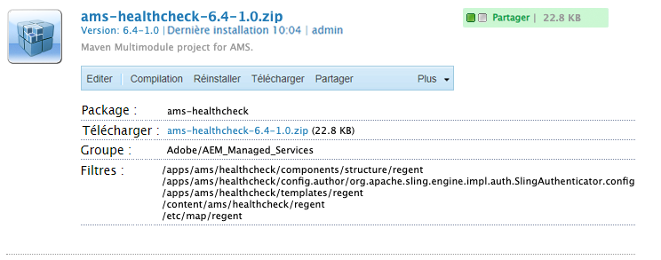

# Contrôler l’intégrité du Dispatcher AMS

[Table des matières](./overview.md)

[&lt;- Précédent : fichiers en lecture seule](./immutable-files.md)

Lorsque Dispatcher est installé sur une ligne de base AMS, il est fourni avec quelques fonctionnalités bonus.  L’une de ces fonctionnalités est un ensemble de scripts de contrôle de l’intégrité.
Ces scripts permettent à l’équilibreur de charge qui soutient la pile AEM de savoir quelles phases sont saines et de les garder en service.

.

## Contrôle de l’intégrité de l’équilibreur de charge de base

Lorsque le trafic client passe par Internet pour atteindre votre instance AEM, il passe par un équilibreur de charge.

.

Chaque requête provenant de l’équilibreur de charge est acheminée vers chaque instance.  L’équilibreur de charge dispose d’un mécanisme de contrôle de l’intégrité intégré pour s’assurer qu’il envoie du trafic vers un hôte sain.

Le contrôle par défaut est généralement un contrôle des ports pour voir si les serveurs ciblés dans l’équilibreur de charge écoutent sur le port du trafic entrant (c’est-à-dire TCP 80 et 443).

> `Note:` bien que cela fonctionne, cela ne permet pas de connaître l’intégrité d’AEM.  Il vérifie uniquement si le Dispatcher (serveur web Apache) fonctionne correctement.

## Contrôle d’intégrité AMS

Pour éviter d’envoyer du trafic à un Dispatcher sain qui fait face à une instance AEM non saine, AMS a créé quelques extras qui évaluent l’intégrité de la phase et pas seulement celle du Dispatcher.

.

Le contrôle de l’intégrité comprend les éléments suivants :
- 1 `Load balancer`
- 1 `Apache web server`
- 3 `Apache *VirtualHost* config files`
- 5 `CGI-Bin scripts`
- 1 `AEM instance`
- 1 `AEM package`

Nous allons décrire le rôle et l’importance de chaque élément.

### Package AEM

Pour indiquer si AEM fonctionne, vous devez procéder à une compilation de page de base et diffuser la page.  Adobe Managed Services a créé un package de base contenant la page de test.  La page teste que le référentiel est opérationnel et que les ressources et le modèle de page peuvent être rendus.

.

Voici la page.  Elle affiche l’ID du référentiel de l’installation.

.

> `Note:` nous nous assurons que la page ne peut pas être mise en cache.  Il serait impossible de contrôler le statut réel si, à chaque fois, il renvoyait une page mise en cache.

C’est le point d’entrée léger que nous pouvons tester pour vérifier qu’AEM fonctionne correctement.

### Configurer l’équilibreur de charge

Nous configurons les équilibreurs de charge pour qu’ils pointent vers un point d’entrée CGI-BIN au lieu d’utiliser un contrôle du port.

.

.

### Hôtes virtuels du contrôle de l’intégrité Apache

#### Hôte virtuel CGI-BIN `(/etc/httpd/conf.d/available_vhosts/ams_health.vhost)`

Il s’agit du fichier de configuration Apache `<VirtualHost>` qui permet l’exécution des fichiers CGI-BIN.

```
Listen 81
<VirtualHost *:81>
    ServerName	"health"
    ...SNIP...
    ScriptAlias /health/ "/var/www/cgi-bin/health/"
</VirtualHost>
```

> `Note:` les fichiers CGI-BIN sont des scripts qui peuvent être exécutés.  Il peut s’agir d’un vecteur d’attaque vulnérable et ces scripts utilisés par AMS ne sont pas publiquement accessibles, uniquement par l’équilibreur de charge à tester.


#### Hôtes virtuels de maintenance non sains

- `/etc/httpd/conf.d/available_vhosts/000_unhealthy_author.vhost`
- `/etc/httpd/conf.d/available_vhosts/000_unhealthy_publish.vhost`

Ces fichiers comportent délibérément le préfixe `000_` dans leur nom.  La configuration est pensée pour utiliser le même nom de domaine que le site actif.  L’idée est que ce fichier soit activé lorsque le contrôle de l’intégrité détecte un problème avec l’un des backends AEM.  Ensuite, proposez une page d’erreur au lieu d’un code de réponse HTTP 503 sans page.  Elle volera le trafic du fichier `.vhost` normal, car elle est chargée avant ce fichier `.vhost` tout en partageant le même `ServerName` ou `ServerAlias`.  Résultat : les pages destinées à un domaine particulier accèdent au vhost non sain au lieu de celui par défaut, ce qui génère un trafic normal.

Lorsque les scripts de contrôle de l’intégrité s’exécutent, ils déconnectent leur statut d’intégrité actuel.  Une fois par minute, une tâche cronjob s’exécutant sur le serveur recherche des entrées non saines dans le journal.  Si elle détecte que l’instance de création d’AEM n’est pas saine, elle active alors le lien symbolique :

Entrée du journal :

```
# grep "ERROR\|publish" /var/log/lb/health_check.log
E, [2022-11-23T20:13:54.984379 #26794] ERROR -- : AUTHOR -- Exception caught: Connection refused - connect(2)
I, [2022-11-23T20:13:54.984403 #26794]  INFO -- : [checkpublish]-author:0-publish:1-[checkpublish]
```

La tâche cron sélectionne l’erreur et réagit :

```
# grep symlink /var/log/lb/health_check_reload.log
I, [2022-11-23T20:34:19.213179 #2275]  INFO -- : ADDING VHOST symlink /etc/httpd/conf.d/available_vhosts/000_unhealthy_author.vhost => /etc/httpd/conf.d/enabled_vhosts/000_unhealthy_author.vhost
```

Vous pouvez contrôler si les sites de création ou de publication peuvent charger cette page d’erreur en configurant le paramètre du mode de rechargement dans `/var/www/cgi-bin/health_check.conf`

```
# grep RELOAD_MODE /var/www/cgi-bin/health_check.conf
RELOAD_MODE='author'
```

Options valides :
- Création
   - Il s’agit de l’option par défaut.
   - Cela affiche une page de maintenance à l’auteur ou l’autrice si il n’est pas saine ou elle n’est pas saine.
- Publication
   - Cette option affiche une page de maintenance à l’éditeur ou l’éditrice si il n’est pas sain ou elle n’est pas saine.
- Toutes
   - Cette option affiche une page de maintenance à l’auteur/l’autrice ou l’éditeur ou l’éditrice ou les deux si ils ou elles ne sont plus sain(e)s.
- Aucune
   - Cette option ignore cette fonctionnalité du contrôle de l’intégrité.

Lorsque vous observez le paramètre `VirtualHost` pour ces options, il charge le même document qu’une page d’erreur pour chaque requête qui entre lorsqu’il est activé :

```
<VirtualHost *:80>
	ServerName	unhealthyauthor
	ServerAlias	${AUTHOR_DEFAULT_HOSTNAME}
	ErrorDocument	503 /error.html
	DocumentRoot	/mnt/var/www/default
	<Directory />
		Options FollowSymLinks
		AllowOverride None
	</Directory>
	<Directory "/mnt/var/www/default">
		AllowOverride None
		Require all granted
	</Directory>
	<IfModule mod_headers.c>
		Header always add X-Dispatcher ${DISP_ID}
		Header always add X-Vhost "unhealthy-author"
	</IfModule>
	<IfModule mod_rewrite.c>
		ReWriteEngine   on
		RewriteCond %{REQUEST_URI} !^/error.html$
		RewriteRule ^/* /error.html [R=503,L,NC]
	</IfModule>
</VirtualHost>
```

Le code de réponse est toujours un `HTTP 503`

```
# curl -I https://we-retail.com/
HTTP/1.1 503 Service Unavailable
X-Dispatcher: dispatcher1useast1
X-Vhost: unhealthy-author
```

Au lieu d’une page vierge, cette page s’affichera à la place.


### Scripts CGI-Bin

Il existe 5 scripts différents qui peuvent être configurés par l’ingénieur(e) du service clientèle dans les paramètres de répartition de charge. Ils modifient le comportement ou les critères lorsque vous souhaitez extraire un Dispatcher de la répartition de charge.

#### /bin/checkauthor

Lorsqu’il est utilisé, ce script vérifie et consigne toutes les instances qu’il dirige, mais ne renvoie une erreur que si l’instance AEM de `author` n’est pas saine.

> `Note:` Gardez à l’esprit que si l’instance AEM de publication n’était pas saine, Dispatcher resterait en service pour autoriser le trafic vers l’instance AEM de création.

#### /bin/checkpublish (par défaut)

Lorsqu’il est utilisé, ce script vérifie et consigne toutes les instances qu’il dirige, mais ne renvoie une erreur que si l’instance AEM de `publish` n’est pas saine.

> `Note:` Gardez à l’esprit que si l’instance AEM de création n’était pas saine, Dispatcher resterait en service pour autoriser le trafic vers l’instance AEM de publication.

#### /bin/checkether

Lorsqu’il est utilisé, ce script vérifie et consigne toutes les instances qu’il dirige, mais ne renvoie une erreur que si l’instance AEM de `author` ou de `publisher` n’est pas saine.

> `Note:` Gardez à l’esprit que si l’instance AEM de publication ou de création n’était pas saine, Dispatcher se retirerait du service.  En d’autres termes, si l’une d’elles était saine, il ne recevrait pas non plus de trafic.

#### /bin/checkboth

Lorsqu’il est utilisé, ce script vérifie et consigne toutes les instances qu’il dirige, mais ne renvoie une erreur que si les instances AEM de `author` et de `publisher` ne sont pas saines.

> `Note:` Gardez à l’esprit que si l’instance AEM de publication ou de création n’était pas saine, Dispatcher ne se retirerait pas du service.  En d’autres termes, si l’une d’elles n’était pas saine, il continuerait à recevoir du trafic et à envoyer des erreurs aux personnes demandant des ressources.

#### /bin/health

Lorsqu’il est utilisé, ce script vérifie et consigne toutes les instances qu’il dirige, mais il renvoie simplement un état sain qu’AEM renvoie ou non une erreur.

> `Note:` Ce script est utilisé lorsque le contrôle de l’intégrité ne fonctionne pas comme vous le souhaitez et permet un remplacement pour conserver les instances AEM dans la répartition de charge.

[Suivant -> Liens symboliques GIT](./git-symlinks.md)
