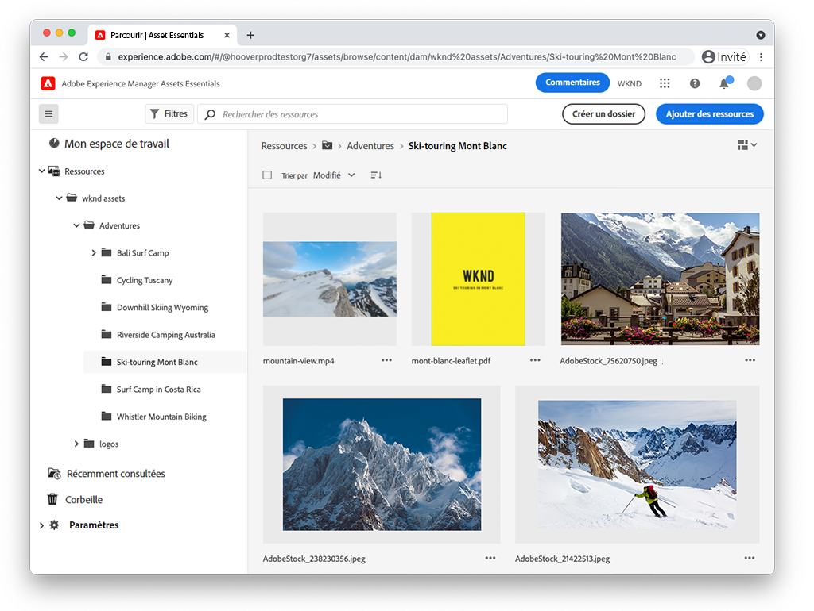

# Vidéos Assets Essentials

Experience Manager Assets Essentials offre une interface utilisateur rationalisée pour une gestion et une collaboration légères des ressources numériques.

Consultez ces vidéos sur l’utilisation d’Assets Essentials pour gérer vos ressources et pour savoir comment procéder à une intégration à Adobe Workfront et à l’orchestrateur d’Adobe Journey.

## En savoir plus sur Assets Essentials.

<table>
<td>
   
   

      <a href="./basics/managing.md">
<strong>Prise en main d’Assets Essentials</strong>
</a>
   

   

      <em>Découvrez les principes de base d’Assets Essentials.</em>
   

</td>
<td>
   
   

      <a href="https://experienceleague.adobe.com/docs/experience-manager-assets-essentials/help/introduction.html?lang=fr">
<strong>Documentation Assets Essentials</strong>
</a>
   

   

      <em>Consultez la documentation du produit Assets Essentials.</em>
   

</td>
<td>
   
   

      <a href="https://experienceleague.adobe.com/docs/journey-optimizer-learn/tutorials/create-messages/create-email-content-with-the-message-editor.html?lang=fr">
<strong>Intégration Adobe Journey Optimizer</strong>
</a>
   

   

      <em>Découvrez comment Assets Essentials s’intègre à Adobe Journey Optimizer.</em>
   

</td>
</table>
