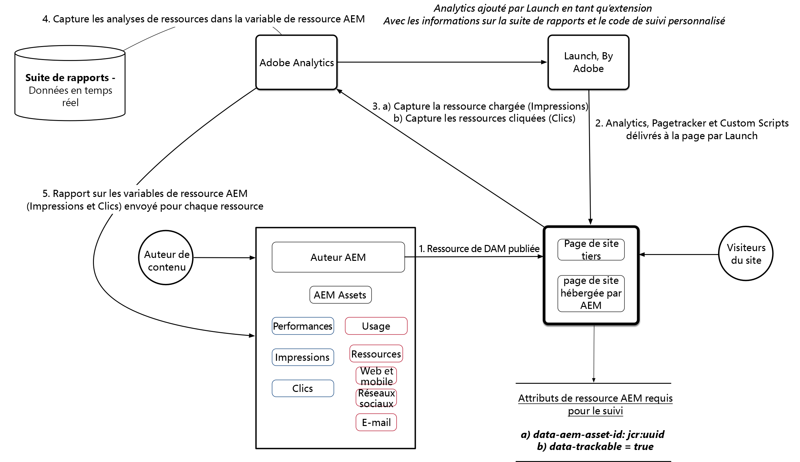

# Configuration des statistiques sur les ressources avec AEM Assets et Adobe Experience Platform Launch

Dans cette série de vidéos en 5 parties, nous passons en revue la configuration et la configuration de Asset Insights pour les Experience Manager déployés via Adobe Launch.

## Partie 1 : Présentation des informations sur les ressources {#overview}

Présentation des statistiques sur les ressources. Installez les composants principaux, l’exemple de composant d’image et d’autres packages de contenu pour préparer votre environnement.

>[!VIDEO](https://video.tv.adobe.com/v/25943/?quality=12&learn=on)

### Schéma d’architecture {#architecture-diagram}



>[!CAUTION]
>
>Veillez à télécharger la [dernière version des composants](https://github.com/adobe/aem-core-wcm-components) principaux pour votre mise en oeuvre.

La vidéo utilise les composants de base v2.2.2 qui ne sont plus la dernière version ; veillez à utiliser la dernière version avant de passer à la section suivante.

* Télécharger [Asset Insights Exemple de contenu d’image](./assets/asset-insights-launch-tutorial/aem-assets-insights-sample.zip)
* Télécharger [les derniers composants principaux de la gestion de contenu Web AEM](https://github.com/adobe/aem-core-wcm-components/releases)

## Partie 2 : Activation du suivi des statistiques des ressources pour un exemple de composant d’image {#sample-image-component-asset-insights}

Améliorations apportées aux composants principaux et utilisation du composant proxy (exemple de composant d’image) pour Asset Insights. Modification des stratégies de modèle de page de contenu pour activer le composant d’image d’exemple pour le site de référence.

>[!VIDEO](https://video.tv.adobe.com/v/25944/?quality=12&learn=on)

>[!NOTE]
>
>Le composant Image Core comprend la possibilité de désactiver le suivi UUID en désactivant le suivi de l’UUID de la ressource (valeur d’identificateur unique pour un noeud créé dans JCR).

Le composant Image de base utilise l’attribut ***data-asset-id*** au sein de l’élément &lt;div> parent d’une balise d’image pour activer/désactiver cette fonction. Le composant proxy remplace le composant principal par les modifications suivantes.

* Supprime l’ID ****** data-assetde la balise div parente d’un élément &lt;img> dans le fichier image.html
* ajoute ***data-aem-asset-id*** directement à l’élément &lt;img> dans image.html
* ajoute ***data-trackable=&#39;true&#39;*** value à l’élément &lt;img> dans image.html
* ***data-aem-asset-id*** et ***data-trackable=&#39;true&#39;*** sont conservés au même niveau de noeud

>[!NOTE]
>
>*data-aem-asset-id=&#39;image.UUID&#39;* et *data-trackable=&#39;true&#39;* sont les attributs clés qui doivent être présents pour les impressions de ressources. Pour Asset Click Insights, en plus des attributs de données ci-dessus présents dans la balise &lt;img>, la balise parent &lt;a> doit avoir une valeur href valide.

## Partie 3 : adobe analytics — Création de Report Suite, activation de la collecte de données en temps réel et du Rapports AEM Assets {#adobe-analytics-asset-insights}

Une suite de rapports avec collecte de données en temps réel est créée pour le suivi des ressources. La configuration d’AEM Assets Insights est configurée à l’aide des informations d’identification Adobe Analytics.

>[!VIDEO](https://video.tv.adobe.com/v/25945/?quality=12&learn=on)

>[!NOTE]
La collecte de données en temps réel et le Rapports des ressources AEM doivent être activés pour votre suite de rapports Adobe Analytics. L’activation du Rapports d’actifs AEM réserve les variables d’analyse pour le suivi des informations sur les actifs.

Pour la configuration AEM Assets Insights, vous avez besoin des informations d’identification suivantes :

* Centre de données
* Nom de la Société Analytics
* Nom d’utilisateur Analytics
* Secret partagé (vous pouvez vous procurer *Adobe Analytics > Admin > Paramètres de Société > Service* Web).
* Report Suite (Veillez à sélectionner la Report Suite appropriée utilisée pour le Rapports des ressources)

## Partie 4 : Utilisation de Adobe Experience Platform Launch pour l’ajout d’une extension Adobe Analytics {#part-using-launch-by-adobe-for-adding-adobe-analytics-extension}

ajouter Adobe Analytics Extension, Création de règles de chargement de page et Intégration d’AEM avec lancement avec un compte technique IMS Adobe.

>[!VIDEO](https://video.tv.adobe.com/v/25946/?quality=12&learn=on)

>[!NOTE]
Veillez à répliquer toutes vos modifications de l’instance d’auteur à l’instance de publication.

### Règle 1 : Suivi de page (pagetracker.js) {#rule-page-tracker-pagetracker-js}

```javascript
//For AEM 6.3
<script type="text/javascript" src="http://localhost:4503/etc/clientlibs/foundation/assetinsights/pagetracker.js"></script>
```

```javascript
//For AEM 6.4
<script type="text/javascript" src="http://localhost:4503/etc.clientlibs/dam/clientlibs/assetinsights/pagetracker.js"></script>
```

Le suivi de page met en oeuvre deux rappels (enregistrés dans le code incorporé de ressource)

* **\&lt;code>assetAnalytics.core.assetLoaded\&lt;code>** : appelé lorsque le événement &quot;load&quot; est distribué pour l’élément asset-DOM.
* **\&lt;code>assetAnalytics.core.assetClicked\&lt;code>** : appelé lorsque le événement &quot;click&quot; est distribué pour l’élément asset-DOM, ceci n’est pertinent que lorsque l’élément asset-DOM-element a une balise d’ancrage en tant que parent avec un attribut href externe valide

Enfin, Pagetracker implémente une fonction d&#39;initialisation en tant que.

* **\&lt;code>assetAnalytics.dispatcher.init()\&lt;code>** : appelé pour initialiser le composant Pagetracker. Ceci DOIT être appelé avant que l’un des événements-statistiques-ressources (impressions et/ou clics) ne soit généré à partir de la page Web.
* **\&lt;code>assetAnalytics.dispatcher.init()\&lt;code>** : accepte facultativement un objet AppMeasurement — s’il est fourni, il ne tente pas de créer une nouvelle instance de l’objet AppMeasurement.

### Règle 2 : Suivi d’images — Action 1 (asset-insights.js) {#rule-image-tracker-action-asset-insights-js}

```javascript
/*
 * AEM Asset Insights
 */

var sObj = window.s;
_satellite.notify('in assetAnalytics customInit');
(function initializeAssetAnalytics() {
 if ((!!window.assetAnalytics) && (!!assetAnalytics.dispatcher)) {
 _satellite.notify('assetAnalytics ready');
 /** NOTE:
  Copy over the call to 'assetAnalytics.dispatcher.init()' from Assets Pagetracker
  Be mindful about changing the AppMeasurement object as retrieved above.
  */
 assetAnalytics.dispatcher.init(
                                "",  /** RSID to send tracking-call to */
                                "",  /** Tracking Server to send tracking-call to */
                                "",  /** Visitor Namespace to send tracking-call to */
                                "",  /** listVar to put comma-separated-list of Asset IDs for Asset Impression Events in tracking-call, e.g. 'listVar1' */
                                "",  /** eVar to put Asset ID for Asset Click Events in, e.g. 'eVar3' */
                                "",  /** event to include in tracking-calls for Asset Impression Events, e.g. 'event8' */
                                "",  /** event to include in tracking-calls for Asset Click Events, e.g. 'event7' */
                                sObj  /** [OPTIONAL] if the webpage already has an AppMeasurement object, please include the object here. If unspecified, Pagetracker Core shall create its own AppMeasurement object */
                                );
 sObj.usePlugins = true;
 sObj.doPlugins = assetAnalytics.core.updateContextData;
}
 else {
 _satellite.notify('assetAnalytics not available. Consider updating the Custom Page Code', 4);
 }
})();
```

### Règle 2 : Suivi d’images — Action 2 (image-tracker.js) {#rule-image-tracker-action-image-tracker-js}

```javascript
/*
 * AEM Asset Insights
 */

document.querySelectorAll('[data-aem-asset-id]').forEach(function(element) {
    assetAnalytics.core.assetLoaded(element);
    var parent = element.parentElement;
    if (parent.nodeName == "A") {
        parent.addEventListener("click", function() {
            assetAnalytics.core.assetClicked(this)
        });
    }
});
```

* assetAnalytics.core.assetLoaded() : est appelé à la fin du chargement de la page et déclenche des impressions de ressources pour toutes les images pouvant faire l’objet d’un suivi.
* Variable Analytics qui transporte la liste de ressources chargée : **contextData[&#39;c.a.assets.idList&#39;]**
* assetAnalytics.core.assetClicked() : est appelé lorsque l’élément DOM de l’actif comporte une balise d’ancrage avec une valeur href valide. Lorsqu’un utilisateur clique sur un fichier, un cookie est créé avec l’ID de fichier sur lequel l’utilisateur a cliqué comme valeur.**(Nom du cookie : a.assets.clickedid)**
* Variable Analytics qui transporte la liste de ressources chargée : **contextData[&#39;c.a.assets.clickedid&#39;]**
* Source de l&#39;Origine : **contextData[&#39;c.a.assets.source&#39;]**

### Instructions de débogage de la console {#console-debug-statements}

```javascript
//Launch Build Info
_satellite.buildInfo

//Enables debug messages
_satellite.setDebug(true);

//Asset Insight JS Object
assetAnalytics

//List of trackable images
document.querySelectorAll(".cmp-image__image");
```

Deux extensions de navigateur Google Chrome sont référencées dans la vidéo comme moyen de déboguer Analytics. Des extensions similaires sont également disponibles pour d’autres navigateurs.

* [Extension Chrome du commutateur de lancement](https://chrome.google.com/webstore/detail/launch-and-dtm-switch/nlgdemkdapolikbjimjajpmonpbpmipk?hl=en)
* [Débogueur Adobe Experience Cloud](https://chrome.google.com/webstore/detail/adobe-experience-cloud-de/ocdmogmohccmeicdhlhhgepeaijenapj?hl=en)

Il est également possible de passer de la gestion dynamique des balises en mode de débogage avec l’extension Chrome suivante : [Lancement et commutateur](https://chrome.google.com/webstore/detail/launch-and-dtm-switch/nlgdemkdapolikbjimjajpmonpbpmipk?hl=en)DTM. Cela permet de vérifier plus facilement s’il existe des erreurs liées au déploiement de la gestion dynamique des balises. En outre, vous pouvez passer manuellement de la gestion dynamique des balises au mode de débogage via n’importe quel outil de *développement de navigateur -> Console* JS en ajoutant le fragment de code suivant :

## Partie 5 : Test du suivi Analytics et de la synchronisation des données Insight{#analytics-tracking-asset-insights}

Configuration de l’état du Planificateur de tâche de synchronisation des Rapports de ressources AEM et du rapport Statistiques des ressources

>[!VIDEO](https://video.tv.adobe.com/v/25947/?quality=12&learn=on)
