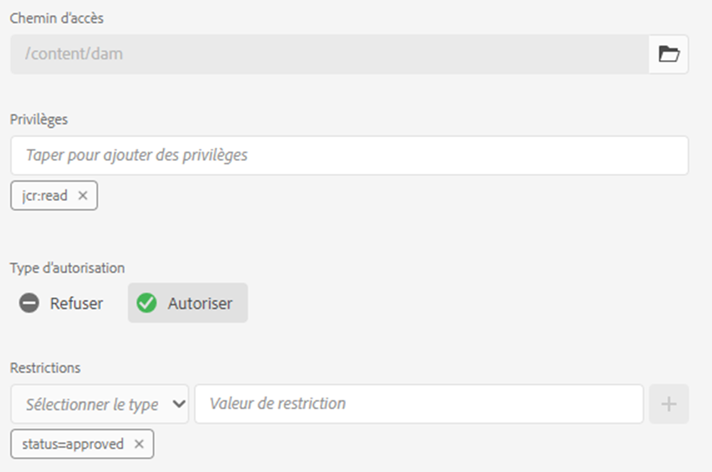
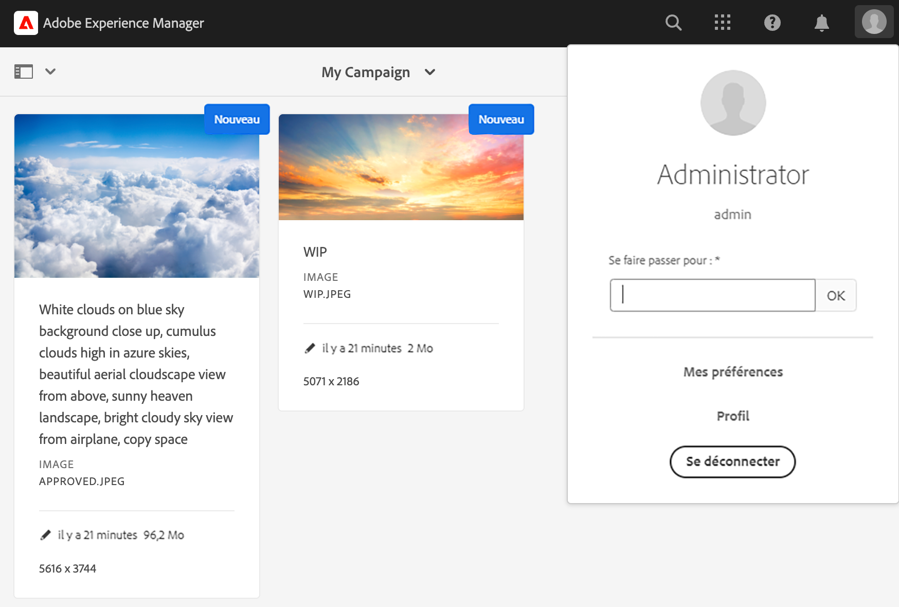
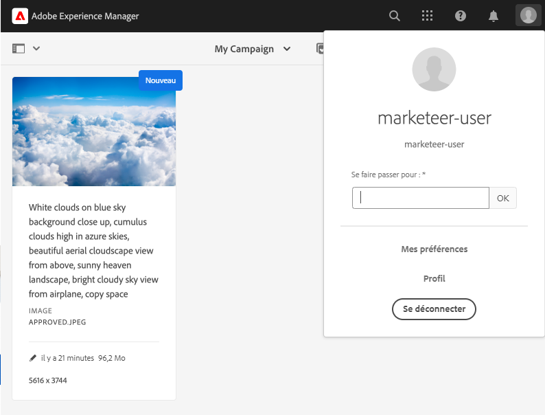
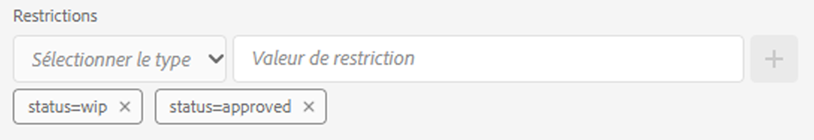
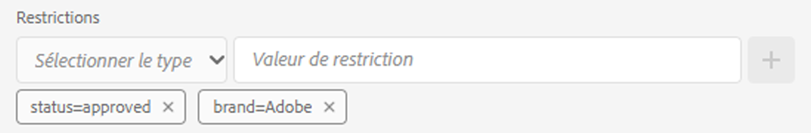
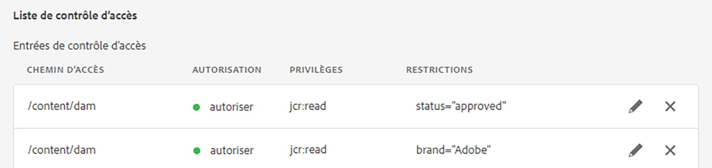

# Autorisations pilotées par les métadonnées{#metadata-driven-permissions}

Les autorisations basées sur les métadonnées sont une fonctionnalité utilisée pour permettre aux décisions de contrôle d’accès sur l’instance de création AEM Assets de se baser sur le contenu des ressources ou les propriétés des métadonnées plutôt que sur la structure des dossiers. Grâce à cette fonctionnalité, vous pouvez définir des politiques de contrôle d’accès qui évaluent des attributs tels que le statut, le type ou toute propriété personnalisée que vous définissez.

Prenons un exemple. Les personnes membres de l’équipe créative chargent leur travail dans AEM Assets vers le dossier associé à la campagne. Il peut s’agir d’une ressource en cours qui n’a pas été approuvée pour utilisation. Nous voulons nous assurer que les personnes spécialisées dans le marketing ne voient que les ressources approuvées pour cette campagne. Nous pouvons utiliser une propriété de métadonnées pour indiquer qu’une ressource a été approuvée et peut être utilisée par les marketeurs.

## Fonctionnement

L’activation des autorisations pilotées par les métadonnées implique de définir le contenu de la ressource ou les propriétés de métadonnées qui génèrent des restrictions d’accès, telles que le « statut » ou la « marque ». Ces propriétés peuvent ensuite être utilisées pour créer des entrées de contrôle d’accès qui spécifient quels groupes d’utilisateurs et d’utilisatrices ont accès aux ressources avec des valeurs de propriété spécifiques.

## Conditions préalables

L’accès à un environnement AEM as a Cloud Service mis à jour vers la dernière version est requis pour configurer des autorisations pilotées par les métadonnées.

## Configuration OSGi {#configure-permissionable-properties}

Pour implémenter des autorisations pilotées par les métadonnées, un développeur doit déployer une configuration OSGi sur AEM as a Cloud Service, qui active un contenu de ressource ou des propriétés de métadonnées spécifiques pour alimenter les autorisations pilotées par les métadonnées.

1. Déterminez le contenu de ressource ou les propriétés de métadonnées à utiliser pour le contrôle d’accès. Les noms des propriétés sont les noms des propriétés JCR de la ressource `jcr:content` ou `jcr:content/metadata`. Dans notre cas, il s’agira d’une propriété appelée `status`.
1. Créez une configuration OSGi `com.adobe.cq.dam.assetmetadatarestrictionprovider.impl.DefaultRestrictionProviderConfiguration.cfg.json` dans votre projet AEM Maven.
1. Collez le JSON suivant dans le fichier créé :

   ```json
   {
     "restrictionPropertyNames":[
       "status",
       "brand"
     ],
     "restrictionContentPropertyNames":[],
     "enabled":true
   }
   ```

1. Remplacez les noms des propriétés par les valeurs requises.  La propriété de configuration `restrictionContentPropertyNames` permet d’activer des autorisations sur les propriétés de ressource `jcr:content`, tandis que la propriété de configuration `restrictionPropertyNames` permet d’activer des autorisations sur les propriétés de ressource `jcr:content/metadata`.

## Réinitialiser les autorisations des ressources de base

Avant d’ajouter des entrées de contrôle d’accès basées sur des restrictions, une nouvelle entrée de niveau supérieur doit être ajoutée pour refuser l’accès en lecture à tous les groupes soumis à une évaluation des autorisations pour les ressources (par exemple, « contributeurs et contributrices » ou similaire) :

1. Accédez à l’écran __Outils → Sécurité → Autorisations__.
1. Sélectionnez le groupe __Contributeurs et contributrices__ (ou tout autre groupe personnalisé auquel tous les groupes d’utilisateurs et d’utilisatrices appartiennent).
1. Cliquez sur __Ajouter une entrée de contrôle d’accès__ dans le coin supérieur droit de l’écran.
1. Sélectionnez `/content/dam` pour le __chemin__.
1. Saisissez `jcr:read` pour les __privilèges__.
1. Sélectionnez `Deny` pour le __type d’autorisation__.
1. Sous Restrictions, sélectionnez `rep:ntNames` et saisissez `dam:Asset` comme __Valeur de restriction__.
1. Cliquez sur __Enregistrer__.


## Accorder l’accès aux ressources par métadonnées

Il est désormais possible d’ajouter des entrées de contrôle d’accès afin d’accorder un accès en lecture aux groupes d’utilisateurs et d’utilisatrices en fonction des [valeurs des propriétés de métadonnées de ressource configurées](#configure-permissionable-properties).

1. Accédez à l’écran __Outils → Sécurité → Autorisations__.
1. Sélectionner les groupes d’utilisateurs et d’utilisatrices qui doivent avoir accès aux ressources.
1. Cliquez sur __Ajouter une entrée de contrôle d’accès__ dans le coin supérieur droit de l’écran.
1. Sélectionnez `/content/dam` (ou un sous-dossier) pour le __chemin__.
1. Saisissez `jcr:read` pour les __privilèges__.
1. Sélectionnez `Allow` pour le __type d’autorisation__.
1. Sous __Restrictions__, sélectionnez l’un des [noms de propriétés de métadonnées de ressource configurées dans la configuration OSGi](#configure-permissionable-properties).
1. Saisissez la valeur de propriété de métadonnées requise dans le champ __Valeur de restriction__.
1. Cliquez sur l’icône __+__ pour ajouter la restriction à l’entrée de contrôle d’accès.
1. Cliquez sur __Enregistrer__.



## Autorisations pilotées par les métadonnées en vigueur

Le dossier d’exemple contient quelques ressources.



Une fois que vous avez configuré les autorisations et défini les propriétés de métadonnées de la ressource en conséquence, les utilisateurs (dans notre cas, l’utilisateur ou utilisatrice marketing) verront uniquement la ressource approuvée.



## Avantages et considérations

Les avantages des autorisations pilotées par les métadonnées sont les suivants :

- Contrôle précis de l’accès aux ressources en fonction d’attributs spécifiques.
- Découplage des politique de contrôle d’accès de la structure de dossiers, ce qui permet une organisation des ressources plus flexible.
- Possibilité de définir des règles de contrôle d’accès complexes basées sur plusieurs propriétés de contenu ou de métadonnées.

>[!NOTE]
>
> Il est important de noter :
> 
> - Les propriétés sont évaluées par rapport aux restrictions à l’aide de __égalité des chaînes__ (`=`) (les autres types de données ou opérateurs ne sont pas encore pris en charge, pour les propriétés supérieures à (`>`) ou Date)
> - Pour autoriser plusieurs valeurs pour une propriété de restriction, vous pouvez ajouter des restrictions supplémentaires à l’entrée de contrôle d’accès en sélectionnant la même propriété dans la liste déroulante « Sélectionner un type » et en saisissant une nouvelle valeur de restriction (par exemple, `status=approved`, `status=wip`) et cliquez sur « + » pour ajouter la restriction à l’entrée.
> 
> - Les __restrictions AND__ sont prises en charge via plusieurs restrictions dans une seule entrée de contrôle d’accès avec différents noms de propriété (par exemple, `status=approved`, `brand=Adobe`) qui seront évaluées en tant que condition AND, c’est-à-dire que le groupe d’utilisateurs et d’utilisatrices sélectionné se verra accorder un accès en lecture aux ressources avec `status=approved AND brand=Adobe`.
> 
> - Les __restrictions OR__ sont prises en charges en ajoutant une nouvelle entrée de contrôle d’accès avec une restriction de propriété de métadonnées qui établit une condition OR pour les entrées, par exemple une seule entrée avec la restriction `status=approved` et une seule entrée avec `brand=Adobe` seront évaluées comme `status=approved OR brand=Adobe`.
> 
