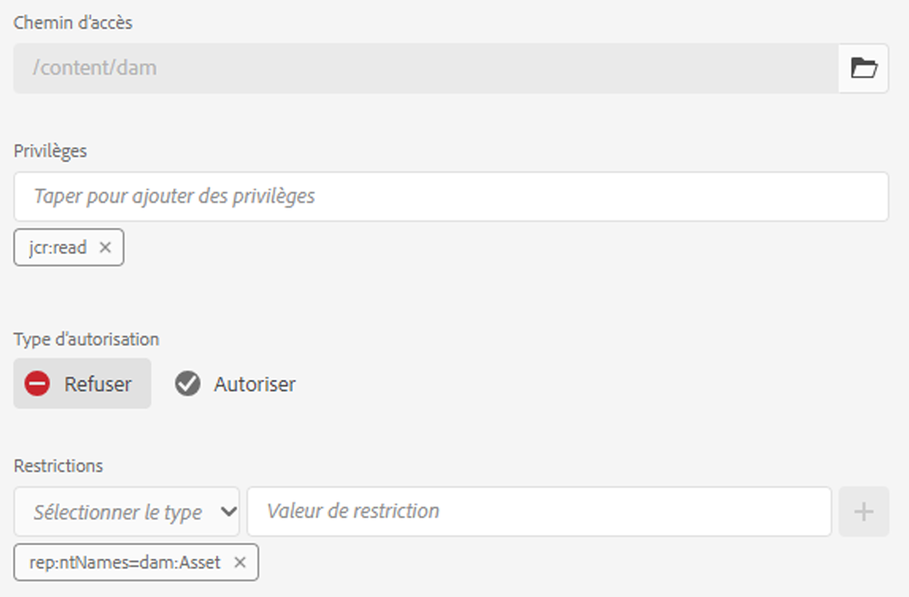

# Autorisations pilotées par les métadonnées{#metadata-driven-permissions}

Les autorisations pilotées par les métadonnées sont une fonctionnalité utilisée pour permettre aux décisions de contrôle d’accès sur l’auteur AEM Assets d’être basées sur les propriétés de métadonnées des ressources plutôt que sur la structure de dossiers. Grâce à cette fonctionnalité, vous pouvez définir des stratégies de contrôle d’accès qui évaluent des attributs tels que l’état, le type ou toute propriété de métadonnées personnalisée que vous définissez.

Voyons un exemple. Les créatifs téléchargent leur travail dans AEM Assets vers le dossier associé à la campagne. Il peut s’agir d’une ressource de travail en cours qui n’a pas été approuvée pour utilisation. Nous voulons nous assurer que les marketeurs ne voient que les ressources approuvées pour cette campagne. Nous pouvons utiliser la propriété de métadonnées pour indiquer qu’une ressource a été approuvée et peut être utilisée par les marketeurs.

## Fonctionnement

L’activation des autorisations pilotées par les métadonnées implique de définir quelles propriétés de métadonnées de ressource vont générer des restrictions d’accès, telles que &quot;status&quot; ou &quot;brand&quot;. Ces propriétés peuvent ensuite être utilisées pour créer des entrées de contrôle d’accès qui spécifient quels groupes d’utilisateurs ont accès aux ressources avec des valeurs de propriété spécifiques.

## Conditions préalables

L’accès à un environnement as a Cloud Service AEM mis à jour vers la dernière version est requis pour configurer des autorisations pilotées par les métadonnées.


## Étapes de développement

Pour mettre en oeuvre les autorisations pilotées par les métadonnées :

1. Déterminez quelles propriétés de métadonnées de ressource seront utilisées pour le contrôle d’accès. Dans notre cas, il s’agira d’une propriété appelée `status`.
1. Créer une configuration OSGi `com.adobe.cq.dam.assetmetadatarestrictionprovider.impl.DefaultRestrictionProviderConfiguration.cfg.json` dans votre projet.
1. Collez le fichier JSON suivant dans le fichier créé.

   ```json
   {
     "restrictionPropertyNames":[
       "status"
     ],
     "restrictionPaths":[
       "/content/dam"
     ]
   }
   ```

1. Remplacez les noms des propriétés et les chemins d’accès aux restrictions par les valeurs requises.


Avant d’ajouter des entrées de contrôle d’accès basées sur des restrictions, une nouvelle entrée de niveau supérieur doit être ajoutée pour empêcher l’accès en lecture à tous les groupes qui font l’objet d’une évaluation des autorisations pour les ressources (par exemple, &quot;contributeurs&quot; ou similaire) :

1. Accédez à l’écran Outils → Sécurité → Autorisations
1. Sélectionnez le groupe &quot;Contributeurs&quot; (ou tout autre groupe personnalisé auquel tous les groupes d’utilisateurs appartiennent).
1. Cliquez sur &quot;Ajouter ACE&quot; dans le coin supérieur droit de l’écran.
1. Sélectionnez /content/dam pour Path
1. Saisissez jcr:read pour Privilèges
1. Sélectionnez Refuser pour le type d’autorisation
1. Sous Restrictions, sélectionnez rep:ntNames et saisissez dam:Asset comme valeur de restriction.
1. Cliquez sur Enregistrer.



Il est désormais possible d’ajouter des entrées de contrôle d’accès afin d’accorder un accès en lecture aux groupes d’utilisateurs en fonction des valeurs des propriétés de métadonnées de ressource.

1. Accédez à l’écran Outils → Sécurité → Autorisations
1. Sélectionnez le groupe souhaité.
1. Cliquez sur &quot;Ajouter ACE&quot; dans le coin supérieur droit de l’écran.
1. Sélectionnez /content/dam (ou un sous-dossier) pour Path
1. Saisissez jcr:read pour Privilèges
1. Sélectionnez Autoriser pour le type d’autorisation
1. Sous Restrictions, sélectionnez l’un des noms de propriétés de métadonnées de ressource configurés (les propriétés définies dans la configuration OSGi seront incluses ici).
1. Saisissez la valeur de propriété de métadonnées requise dans le champ Valeur de restriction .
1. Cliquez sur l’icône &quot;+&quot; pour ajouter la restriction à l’entrée de contrôle d’accès.
1. Cliquez sur Enregistrer.


Le dossier d’exemples contient quelques ressources.


Une fois que vous avez configuré les autorisations et défini les propriétés de métadonnées de la ressource en conséquence, les utilisateurs (dans notre cas, l’utilisateur du marketeur) ne verront que la ressource approuvée.


## Avantages et considérations

Les avantages des autorisations pilotées par les métadonnées sont les suivants :

- Contrôle précis de l’accès aux ressources en fonction d’attributs spécifiques.
- Découplage des stratégies de contrôle d’accès de la structure de dossiers, ce qui permet une organisation des ressources plus flexible.
- Possibilité de définir des règles de contrôle d’accès complexes basées sur plusieurs propriétés de métadonnées.

>[!NOTE]
>
> Il est important de noter :
> 
> - Les propriétés des métadonnées sont évaluées par rapport aux restrictions à l’aide de l’égalité des chaînes (autres types de données non encore pris en charge, par exemple date).
> - Pour autoriser plusieurs valeurs pour une propriété de restriction, vous pouvez ajouter des restrictions supplémentaires à l’entrée de contrôle d’accès en sélectionnant la même propriété dans la liste déroulante &quot;Sélectionner un type&quot; et en saisissant une nouvelle valeur de restriction (par exemple, `status=approved`, `status=wip`) et cliquez sur &quot;+&quot; pour ajouter la restriction à l’entrée.
> 
> - Plusieurs restrictions dans une seule entrée de contrôle d’accès avec différents noms de propriété (par exemple, `status=approved`, `brand=Adobe`) sera évalué en tant que condition ET, c’est-à-dire que le groupe d’utilisateurs sélectionné se verra accorder un accès en lecture aux ressources comportant la variable `status=approved AND brand=Adobe`
> 
> - L’ajout d’une nouvelle entrée de contrôle d’accès avec une restriction de propriété de métadonnées établit une condition OU pour les entrées, par exemple une seule entrée avec restriction. `status=approved` et une seule entrée avec `brand=Adobe` est évalué comme `status=approved OR brand=Adobe`
> 
