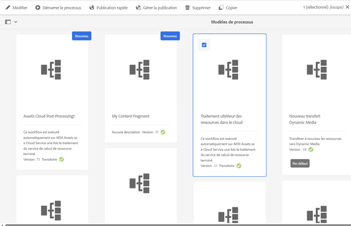
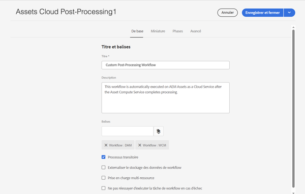
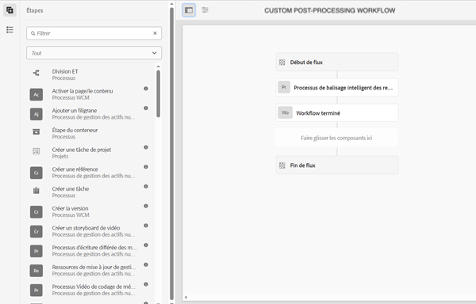
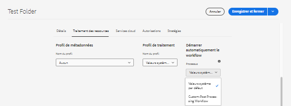

# Workflows à démarrage automatique

Les workflows à démarrage automatique étendent le traitement des ressources dans AEM as a Cloud Service en appelant automatiquement un workflow personnalisé lors du chargement ou d’un nouveau traitement, une fois que le traitement des ressources est terminé.

>[!VIDEO](https://video.tv.adobe.com/v/37323?quality=12&learn=on)

>[!NOTE]
>
>Utilisez des workflows à démarrage automatique pour personnaliser le post-traitement des ressources plutôt que d’utiliser des lanceurs de workflow. Les workflows à démarrage automatique sont _uniquement_ appelés lorsque le traitement d’une ressource est achevé, à la place des lanceurs, qui peuvent être appelés plusieurs fois pendant le traitement de la ressource.

## Personnaliser le workflow de post-traitement

Pour personnaliser le workflow de post-traitement, copiez le [modèle de workflow](../../foundation/workflow/use-the-workflow-editor.md) de post-traitement des ressources cloud par défaut.

1. Démarrez dans l’écran Modèles de workflow en accédant à _Outils_ > _Workflow_ > _Modèles_.
2. Recherchez et sélectionnez le modèle de workflow _Post-traitement des ressources cloud_. 
   
3. Cliquez sur le bouton _Copier_ pour créer votre workflow personnalisé.
4. Sélectionnez votre nouveau modèle de workflow (qui sera appelé _Assets Cloud Post-Processing1_), puis cliquez sur le bouton _Modifier_ pour modifier le workflow.
5. Dans les propriétés du workflow, attribuez un nom significatif à votre workflow de post-traitement personnalisé. 
   
6. Ajoutez les étapes nécessaires pour répondre aux besoins de votre entreprise, ici en ajoutant une tâche lorsque le traitement des ressources est terminé. Assurez-vous que la dernière étape du workflow est toujours l’étape _workflow terminé_ .
   

   >[!NOTE]
   >
   >Les workflows à démarrage automatique s’exécutent à chaque chargement ou nouveau traitement de ressources. Vous devez donc envisager soigneusement l’implication de l’évolution des étapes du workflow, en particulier pour les opérations en bloc telles que les [Imports en bloc](../../cloud-service/migration/bulk-import.md) ou les migrations.

7. Cliquez sur le bouton _Synchronisation_ pour enregistrer vos modifications et synchroniser le modèle de workflow.

## Utiliser un workflow de post-traitement personnalisé

Le post-traitement personnalisé est configuré sur des dossiers. Pour configurer un workflow de post-traitement personnalisé sur un dossier, procédez comme suit :

1. Sélectionnez le dossier pour lequel vous souhaitez configurer le workflow et modifiez ses propriétés.
2. Basculez sur l’onglet _Traitement des ressources_.
3. Sélectionnez votre workflow de post-traitement personnalisé dans la zone de sélection _Workflow à démarrage automatique_ .
   .
4. Enregistrez vos modifications.

Désormais, votre workflow de post-traitement personnalisé sera exécuté pour toutes les ressources chargées ou traitées à nouveau dans ce dossier.
