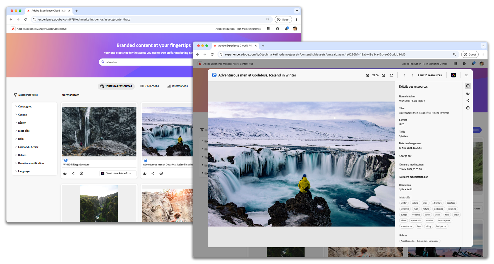

# AEM Assets Content Hub

{align=center}

Découvrez comment charger des ressources, appliquer des balises et comprendre le workflow d’approbation dans Adobe Experience Manager Assets as a Cloud Service Content Hub.

## En savoir plus sur les fonctionnalités de Content Hub

Ces vidéos présentent les principales fonctionnalités d’AEM Assets Content Hub : de la gestion des ressources à la collaboration avec votre équipe, chaque vidéo fournit des étapes claires et des conseils pratiques pour vous aider à tirer le meilleur parti d’AEM Assets Content Hub dans votre travail quotidien.

<!-- CARDS

* https://experienceleague.adobe.com/fr/docs/experience-manager-learn/assets/content-hub/set-up {title = Set up}
* https://experienceleague.adobe.com/fr/docs/experience-manager-learn/assets/content-hub/configure {title = Configure}
* https://experienceleague.adobe.com/fr/docs/experience-manager-learn/assets/content-hub/add-assets {title = Add assets}
* https://experienceleague.adobe.com/fr/docs/experience-manager-learn/assets/content-hub/download-assets {title = Download assets}
* https://experienceleague.adobe.com/fr/docs/experience-manager-learn/assets/content-hub/image-variants {title = Create image variants}
* https://experienceleague.adobe.com/fr/docs/experience-manager-learn/assets/content-hub/collections {title = Collections}
* https://experienceleague.adobe.com/fr/docs/experience-manager-learn/assets/content-hub/share {title = Sharing}

-->
<!-- START CARDS HTML - DO NOT MODIFY BY HAND -->

    

        

            

                <figure class="image x-is-16by9">
                    
                </figure>
            

            

                

                    

                        <a href="https://experienceleague.adobe.com/fr/docs/experience-manager-learn/assets/content-hub/set-up" target="_blank" rel="referrer" title="Configurer">Configurer</a>
                    

                    
Découvrez comment configurer Adobe Experience Manager Assets Content Hub sur AEM as a Cloud Service.

                

                <a href="https://experienceleague.adobe.com/fr/docs/experience-manager-learn/assets/content-hub/set-up" target="_blank" rel="referrer" class="spectrum-Button spectrum-Button--outline spectrum-Button--primary spectrum-Button--sizeM" style="align-self: flex-start; margin-top: 1rem;">
                    Regarder
                </a>
            

        

    

    

        

            

                <figure class="image x-is-16by9">
                    
                </figure>
            

            

                

                    

                        <a href="https://experienceleague.adobe.com/fr/docs/experience-manager-learn/assets/content-hub/configure" target="_blank" rel="referrer" title="Configurer">Configurer</a>
                    

                    
Découvrez comment naviguer dans les onglets disponibles et personnaliser les options de configuration pour répondre aux besoins de votre entreprise.

                

                <a href="https://experienceleague.adobe.com/fr/docs/experience-manager-learn/assets/content-hub/configure" target="_blank" rel="referrer" class="spectrum-Button spectrum-Button--outline spectrum-Button--primary spectrum-Button--sizeM" style="align-self: flex-start; margin-top: 1rem;">
                    Regarder
                </a>
            

        

    

    

        

            

                <figure class="image x-is-16by9">
                    
                </figure>
            

            

                

                    

                        <a href="https://experienceleague.adobe.com/fr/docs/experience-manager-learn/assets/content-hub/add-assets" target="_blank" rel="referrer" title="Ajouter des ressources">Ajouter des ressources</a>
                    

                    
Découvrez comment charger des ressources, appliquer des balises et comprendre le workflow d’approbation dans Adobe Experience Manager Assets Content Hub.

                

                <a href="https://experienceleague.adobe.com/fr/docs/experience-manager-learn/assets/content-hub/add-assets" target="_blank" rel="referrer" class="spectrum-Button spectrum-Button--outline spectrum-Button--primary spectrum-Button--sizeM" style="align-self: flex-start; margin-top: 1rem;">
                    En savoir plus
                </a>
            

        

    

    

        

            

                <figure class="image x-is-16by9">
                    
                </figure>
            

            

                

                    

                        <a href="https://experienceleague.adobe.com/fr/docs/experience-manager-learn/assets/content-hub/download-assets" target="_blank" rel="referrer" title="Télécharger des ressources">Télécharger des ressources</a>
                    

                    
Découvrez comment naviguer, rechercher des ressources, filtrer les ressources et les télécharger dans Adobe Experience Manager Assets Content Hub.

                

                <a href="https://experienceleague.adobe.com/fr/docs/experience-manager-learn/assets/content-hub/download-assets" target="_blank" rel="referrer" class="spectrum-Button spectrum-Button--outline spectrum-Button--primary spectrum-Button--sizeM" style="align-self: flex-start; margin-top: 1rem;">
                    Regarder
                </a>
            

        

    

    

        

            

                <figure class="image x-is-16by9">
                    
                </figure>
            

            

                

                    

                        <a href="https://experienceleague.adobe.com/fr/docs/experience-manager-learn/assets/content-hub/image-variants" target="_blank" rel="referrer" title="Créer des variations d’image">Créer des variations d’image</a>
                    

                    
Découvrez comment créer et modifier des variations d’image à l’aide d’Adobe Express dans Experience Manager Assets Content Hub.

                

                <a href="https://experienceleague.adobe.com/fr/docs/experience-manager-learn/assets/content-hub/image-variants" target="_blank" rel="referrer" class="spectrum-Button spectrum-Button--outline spectrum-Button--primary spectrum-Button--sizeM" style="align-self: flex-start; margin-top: 1rem;">
                    Regarder
                </a>
            

        

    

    

        

            

                <figure class="image x-is-16by9">
                    
                </figure>
            

            

                

                    

                        <a href="https://experienceleague.adobe.com/fr/docs/experience-manager-learn/assets/content-hub/collections" target="_blank" rel="referrer" title="Collections">Collections</a>
                    

                    
Découvrez comment créer et utiliser des collections dans AEM Assets Content Hub afin de rationaliser l’accès aux ressources et de promouvoir le partage collaboratif des ressources, en assurant un travail d’équipe efficace et organisé dans divers projets.

                

                <a href="https://experienceleague.adobe.com/fr/docs/experience-manager-learn/assets/content-hub/collections" target="_blank" rel="referrer" class="spectrum-Button spectrum-Button--outline spectrum-Button--primary spectrum-Button--sizeM" style="align-self: flex-start; margin-top: 1rem;">
                    Regarder
                </a>
            

        

    

    

        

            

                <figure class="image x-is-16by9">
                    
                </figure>
            

            

                

                    

                        <a href="https://experienceleague.adobe.com/fr/docs/experience-manager-learn/assets/content-hub/share" target="_blank" rel="referrer" title="Partage">Partage</a>
                    

                    
Découvrez comment partager des ressources et des collections avec les personnes membres de l’équipe dans AEM Assets Content Hub, en promouvant un travail d’équipe efficace et un partage sécurisé des ressources.

                

                <a href="https://experienceleague.adobe.com/fr/docs/experience-manager-learn/assets/content-hub/share" target="_blank" rel="referrer" class="spectrum-Button spectrum-Button--outline spectrum-Button--primary spectrum-Button--sizeM" style="align-self: flex-start; margin-top: 1rem;">
                    Regarder
                </a>
            

        

    

<!-- END CARDS HTML - DO NOT MODIFY BY HAND -->

## Content Hub en action

Explorez les cas et scénarios d’utilisation qui montrent comment AEM Assets Content Hub peut être utilisé efficacement dans divers contextes. Ces exemples fournissent des informations sur les applications pratiques de Content Hub, en montrant sa polyvalence et son adaptabilité aux différents besoins de gestion des ressources.

<!-- CARDS
* ./use-cases/manage-assets.md
-->

<!-- START CARDS HTML - DO NOT MODIFY BY HAND -->

    

        

            

                <figure class="image x-is-16by9">
                    
                </figure>
            

            

                

                    

                        <a href="./use-cases/manage-assets.md" target="_blank" rel="referrer" title="Gestion des ressources avec AEM Assets Content Hub">Comment gérer des ressources avec AEM Assets Content Hub </a>
                    

                    
Découvrez comment utiliser AEM Assets Content Hub pour gérer et partager facilement des ressources de marque approuvées, ce qui permet à vos équipes d’exécuter des campagnes marketing plus rapidement que jamais.

                

                <a href="./use-cases/manage-assets.md" target="_blank" rel="referrer" class="spectrum-Button spectrum-Button--outline spectrum-Button--primary spectrum-Button--sizeM" style="align-self: flex-start; margin-top: 1rem;">
                    Regarder
                </a>
            

        

    

<!-- END CARDS HTML - DO NOT MODIFY BY HAND -->

## Documentation Content Hub

Explorez la documentation du produit Content Hub pour vous aider à comprendre et à utiliser pleinement AEM Assets Content Hub. Ces ressources fournissent des conseils détaillés sur l’utilisation de ses fonctions et fonctionnalités, en vous assurant de la prise en charge dont vous avez besoin pour une gestion efficace des ressources.

<!-- CARDS

* https://experienceleague.adobe.com/fr/docs/experience-manager-cloud-service/content/assets/content-hub/product-overview {title=Content Hub documentation} {description=This documentation serves as your entry point to learn about Content Hub's key benefits, access methods, and how to provide feedback on the available options.}
* https://experienceleague.adobe.com/fr/docs/experience-manager-cloud-service/content/assets/content-hub/deploy-content-hub {description=Learn how to deploy and activate Content Hub, providing users with various privileges, including asset uploads and administrator access.}
* https://experienceleague.adobe.com/fr/docs/experience-manager-cloud-service/content/assets/content-hub/frequently-asked-questions-content-hub {title = Content Hub FAQs}

-->
<!-- START CARDS HTML - DO NOT MODIFY BY HAND -->

    

        

            

                <figure class="image x-is-16by9">
                    
                </figure>
            

            

                

                    

                        <a href="https://experienceleague.adobe.com/fr/docs/experience-manager-cloud-service/content/assets/content-hub/product-overview" target="_blank" rel="referrer" title="Documentation Content Hub">Documentation Content Hub</a>
                    

                    
Cette documentation sert de point d’entrée pour en savoir plus sur les principaux avantages de Content Hub, les méthodes d’accès et la manière de fournir des commentaires sur les options disponibles.

                

                <a href="https://experienceleague.adobe.com/fr/docs/experience-manager-cloud-service/content/assets/content-hub/product-overview" target="_blank" rel="referrer" class="spectrum-Button spectrum-Button--outline spectrum-Button--primary spectrum-Button--sizeM" style="align-self: flex-start; margin-top: 1rem;">
                    En savoir plus
                </a>
            

        

    

    

        

            

                <figure class="image x-is-16by9">
                    
                </figure>
            

            

                

                    

                        <a href="https://experienceleague.adobe.com/fr/docs/experience-manager-cloud-service/content/assets/content-hub/deploy-content-hub" target="_blank" rel="referrer" title="Déployer Content Hub">Déployer Content Hub</a>
                    

                    
Découvrez comment déployer et activer Content Hub, en accordant aux utilisateurs et utilisatrices divers privilèges, notamment des chargements de ressources et des droits d’administration.

                

                <a href="https://experienceleague.adobe.com/fr/docs/experience-manager-cloud-service/content/assets/content-hub/deploy-content-hub" target="_blank" rel="referrer" class="spectrum-Button spectrum-Button--outline spectrum-Button--primary spectrum-Button--sizeM" style="align-self: flex-start; margin-top: 1rem;">
                    En savoir plus
                </a>
            

        

    

    

        

            

                <figure class="image x-is-16by9">
                    
                </figure>
            

            

                

                    

                        <a href="https://experienceleague.adobe.com/fr/docs/experience-manager-cloud-service/content/assets/content-hub/frequently-asked-questions-content-hub" target="_blank" rel="referrer" title="Questions fréquentes sur Content Hub">Questions fréquentes sur Content Hub</a>
                    

                    
Obtenez des réponses à certaines des questions les plus fréquentes (FAQ) pour Content Hub.

                

                <a href="https://experienceleague.adobe.com/fr/docs/experience-manager-cloud-service/content/assets/content-hub/frequently-asked-questions-content-hub" target="_blank" rel="referrer" class="spectrum-Button spectrum-Button--outline spectrum-Button--primary spectrum-Button--sizeM" style="align-self: flex-start; margin-top: 1rem;">
                    En savoir plus
                </a>
            

        

    

<!-- END CARDS HTML - DO NOT MODIFY BY HAND -->

 
 
&gt;
