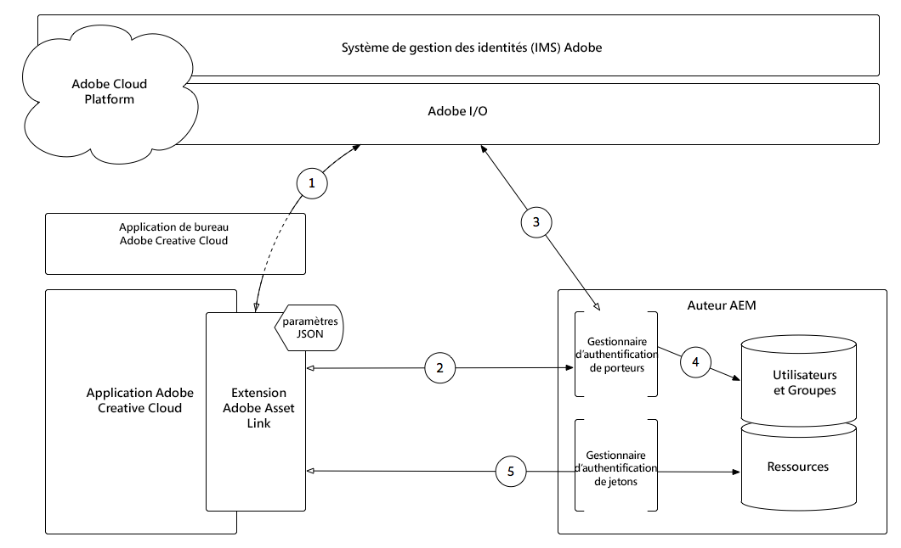

# Utilisation de l’extension de lien de ressource Adobe avec AEM Assets{#using-adobe-asset-link-extension-with-aem-assets}

Les ressources Adobe Experience Manager peuvent désormais être utilisées par les concepteurs et les utilisateurs créatifs dans leurs applications de bureau Adobe Creative Cloud préférées. L’extension Adobe Asset Link pour Adobe Creative Cloud Enterprise étend la fonctionnalité de recherche et de navigation, de tri, de prévisualisation, de téléchargement de ressources, d’extraction, de modification, d’archivage et de vue de métadonnées de ressources d’AEM dans des outils Creative Cloud tels que Adobe Photoshop, InDesign,  et Illustrator.

## Lien d’actif Adobe 1.1

La version 1.1 de Adobe Asset Link fournit désormais une prise en charge des liens directs InDesigns entre Adobe Asset Link et AEM Assets. Grâce à la prise en charge des liens directs d’InDesign, vous pouvez désormais placer (Importer lié ou Importer une copie) ou faire glisser des ressources numériques vers l’InDesign à partir de AEM Assets via le panneau Adobe de lien d’actif. De plus, introduit le rendu FPO ( *For Placement Only* ).

>[!VIDEO](https://video.tv.adobe.com/v/28988/?quality=12&learn=on)

>[!NOTE]
>
>N’utilisez que votre Enterprise ID ou votre Federated ID Adobe Creative Cloud. Assurez-vous de [configurer AEM pour Adobe Asset Link](https://helpx.adobe.com/enterprise/using/configure-aem-for-aal-prerelease.html).

### Fonctionnalités des liens de ressources d’Adobe

* adobe Asset Link est une extension qui fonctionne avec PS, AI, ID et fournit un accès direct aux ressources numériques résidant dans AEM Assets.
* Les créatifs seront automatiquement connectés à AEM à l&#39;aide de leur Enterprise ID ou Federated ID IMS Adobe
* Les créatifs peuvent parcourir les ressources numériques résidant en AEM Assets, en plus de rechercher des ressources AEM Assets et Creative Cloud
* Les créatifs peuvent accéder aux détails des fichiers pour les ressources résidant à AEM Assets ; miniature, métadonnées de base et versions du panneau
* Les créatifs peuvent placer, télécharger ou faire glisser des ressources dans leur mise en page
* Les créatifs peuvent modifier des ressources en les extrayant d’AEM Assets et en les utilisant dans leur compte Creative Cloud Assets
* Les créatifs peuvent réarchiver un fichier après l’avoir modifié, et la nouvelle version sera répercutée dans AEM Assets
* Prend en charge les InDesigns Creative Cloud 2020, 2019 et 2018, Photoshop et Illustrator pour les applications de bureau
* Un utilisateur peut effectuer une recherche de ressources à partir du panneau In-App Lien de ressources d’Adobe et les trier selon leur taille, leur ordre alphabétique et leur pertinence.
* Les utilisateurs peuvent accéder aux collections AEM Assets et aux collections dynamiques et les parcourir directement à partir du panneau Lien d’actif.
* ajouter directement à AEM Assets les ressources nouvellement créées à partir du panneau
* Un utilisateur peut faire glisser des fichiers directement dans des cadres d’InDesign.

### Placement de AEM Assets dans un InDesign

Vous pouvez placer un fichier dans votre disposition d’InDesign à l’aide de l’une des options suivantes :

* **Importer une copie** : l&#39;incorporation d&#39;une ressource (à l&#39;aide de l&#39;option Importer une copie) place une copie de la ressource d&#39;origine dans la mise en page de votre InDesign après le téléchargement des fichiers binaires sur votre système local. Lien de ressource d’Adobe ne conserve aucun lien entre la copie incorporée et la ressource d’origine. Si la ressource d’origine est modifiée en AEM Assets, vous devez supprimer la ressource incorporée du fichier d’InDesign et réincorporer la ressource de AEM Assets.

* **Placer lié** : lorsque vous travaillez avec des documents d&#39;InDesign, vous avez désormais la possibilité de référencer les ressources de AEM Assets en plus de les incorporer directement (à l&#39;aide de l&#39;option Importer copie du menu contextuel). Le référencement des ressources vous permet de collaborer avec d’autres utilisateurs et d’incorporer toute mise à jour apportée à la ressource d’origine dans AEM Assets. Pour référencer un fichier d’AEM Assets, utilisez l’option Placer lié dans le menu contextuel.

### Résolution pour positionnement uniquement (FPO)

Lorsque des fichiers volumineux sont placés dans des Documents d’InDesign à partir de AEM Assets à l’aide de Adobe Asset Link, les utilisateurs créatifs doivent patienter quelques secondes après avoir lancé l’opération de placement. Cela a un impact sur l’expérience globale de l’utilisateur. Grâce à Adobe Asset Link, vous pouvez maintenant temporairement placer une image à basse résolution de la ressource d’origine à partir d’AEM Assets, ce qui réduit le temps nécessaire à la création d’une image. Dans le même temps, elle augmente l’expérience globale des utilisateurs et leur productivité. L’image de résolution inférieure est placée temporairement et lorsque la sortie finale est requise pour l’impression ou la publication, vous devez remplacer les rendus FPO par les originaux. Si vous souhaitez remplacer plusieurs images FPO par les images d’origine respectives, accédez au panneau **_Windows > Liens_** , puis téléchargez les fichiers d’origine. Une fois les images d’origine téléchargées, choisissez Remplacer toutes les images FPO par les originaux.

>[!NOTE]
>
> *Dans le cas d’un rendu FPO (Placement uniquement)* , le rendu fonctionne uniquement avec l’option Importer lié. Vous devez également activer la prise en charge des rendus FPO dans le flux de travaux de mise à jour des ressources *du* barrage de AEM Assets.

Les rendus FPO sont des substituts légers des ressources d’origine. Elles ont les mêmes proportions, mais sont plus petites que les images d&#39;origine. Actuellement, InDesign ne prend en charge l’importation de rendus FPO que pour les types d’image suivants :

* JPEG
* GIF
* PNG
* TIFF
* PSD
* BMP

Si un rendu FPO n’est pas disponible pour une ressource spécifique en AEM Assets, la ressource haute résolution d’origine est référencée à la place. Pour les images FPO, l’état FPO s’affiche dans le panneau Liens d’InDesign.

## Présentation de l’authentification des liens de ressources d’Adobe avec AEM Assets{#understanding-adobe-asset-link-authentication-with-aem-assets}

Fonctionnement de l’authentification par lien d’actif d’Adobe dans le contexte des services Identity Management d’Adobe (IMS) et de Adobe Experience Manager Author.

Téléchargement de l’architecture de liens de ressources [d’Adobe](assets/adobe-asset-link-article-understand-1.png)

1. L&#39;extension de lien d&#39;actif d&#39;Adobe effectue une demande d&#39;autorisation, via l&#39;application de bureau Adobe Creative Cloud, au service IMS (Adobe Identity Manager Service) et, en cas de succès, reçoit un jeton de porteur.
2. L’extension de lien d’actif d’Adobe se connecte à AEM Author via HTTP(S), y compris le jeton de porteur obtenu à l’ **étape 1**, en utilisant le schéma (HTTP/HTTPS), l’hôte et le port fournis dans les paramètres JSON de l’extension.
3. Le gestionnaire d’authentification du porteur d’AEM extrait le jeton du porteur de la requête et le valide par rapport à l’Adobe IMS.
4. Une fois que l&#39;Adobe IMS valide le jeton du porteur, un utilisateur est créé dans AEM (s&#39;il n&#39;existe pas déjà) et synchronise les données de profil et de groupe/adhésions de l&#39;Adobe IMS. L’utilisateur AEM reçoit un jeton de connexion AEM standard, qui est renvoyé à l’extension de lien d’actif d’Adobe sous la forme d’un cookie dans la réponse HTTP(S).
5. Interactions suivantes (c.-à-d. navigation, recherche, archivage/extraction de fichiers, etc.) avec l’extension Adobe Asset Link, les requêtes HTTP(S) envoyées à l’auteur AEM sont validées à l’aide du jeton de connexion AEM, à l’aide du gestionnaire standard AEM Token Authentication Handler.

>[!NOTE]
>
>A l’expiration du jeton de connexion, les **étapes 1 à 5** appellent automatiquement, authentifient l’extension de lien de ressource de l’Adobe à l’aide du jeton de garde et réémettent un nouveau jeton de connexion valide.

## Ressources supplémentaires{#additional-resources}

* [Site Web de lien de ressource Adobe](https://www.adobe.com/creativecloud/business/enterprise/adobe-asset-link.html)