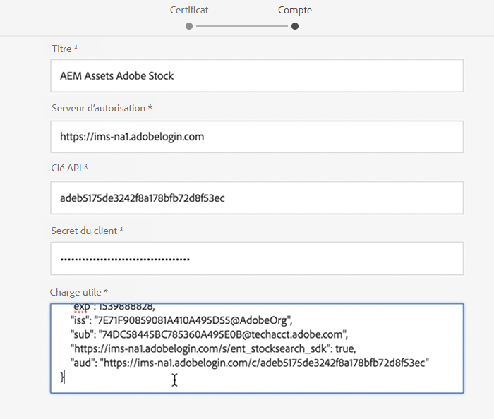

# Utilisation de Adobe Stock avec AEM Assets{#using-adobe-stock-assets-with-aem-assets}

aem 6.4.2 permet aux utilisateurs de rechercher, de prévisualisation, d’enregistrer et de mettre sous licence des ressources Adobe Stock directement à partir d’AEM. Les entreprises peuvent désormais intégrer leur plan Adobe Stock Enterprise à AEM Assets pour s’assurer que les ressources sous licence sont désormais largement disponibles pour leurs projets créatifs et marketing, avec les puissantes capacités de gestion d’actifs de AEM.

>[!VIDEO](https://video.tv.adobe.com/v/24678/?quality=9&learn=on)

>[!NOTE]
>
>Pour que l’intégration soit possible, l’[abonnement Adobe Stock entreprise](https://landing.adobe.com/en/na/products/creative-cloud/ctir-4625-stock-for-enterprise/index.html) est requis et AEM 6.4 (Service Pack 2 minimum) doit être déployé. Pour plus d’informations sur les formules de service AEM 6.4, consultez ces [notes de mise à jour](https://helpx.adobe.com/fr/experience-manager/6-4/release-notes/sp-release-notes.html).

L’intégration Adobe Stock et AEM Assets permet aux auteurs de contenu et aux marketeurs d’accorder facilement des licences et d’utiliser des ressources en stock à des fins de création ou de marketing. Vous pouvez effectuer une recherche de ressources Stock à l’aide de la recherche Omni, en ajoutant le filtre d’emplacement en tant qu’Adobe Stock ou en naviguant dans la navigation principale d’AEM Assets et en cliquant sur l’icône de l’interface utilisateur de Search Adobe Stock Coral.

## Fonctionnalités

### Recherche et enregistrement

* Effectuez une recherche de ressources Adobe Stock sans quitter AEM espace de travail.
* Enregistrez les ressources Adobe Stock pour prévisualisation, sans accorder de licence à la ressource.
* Possibilité de licence et d’enregistrer des ressources Adobe Stock dans AEM Assets
* Possibilité de rechercher des ressources similaires à partir d’Adobe Stock dans l’interface utilisateur AEM Assets
* Vue d’une ressource sélectionnée à partir du site Web Stock Search dans AEM Assets on Adobe Stock
* Les fichiers de ressources sous licence sont marqués d&#39;un badge bleu sous licence pour faciliter leur identification.

### Métadonnées de la ressource

* Les ressources sous licence sont stockées dans AEM Assets. Les propriétés de fichier contiennent des métadonnées Stock sous un onglet de métadonnées de fichier distinct.
* Possibilité d’ajouter des références de licence aux métadonnées de ressources

### Profil de stock d’actifs

* Un utilisateur peut sélectionner profil Adobe Stock sous *Utilisateur > Mes préférences > Configuration du stock*
* Les références obligatoires et facultatives peuvent être ajoutées à la fenêtre de gestion des ressources.
* Possibilité de choisir les préférences de langue pour la fenêtre de gestion des licences des fichiers en fonction de la région.

### Filtrer

* Un utilisateur peut filtrer les actifs boursiers en fonction du type de ressource, de l’orientation et de la Vue similaires.
* Le type de ressource inclut les photos, les illustrations, les vecteurs, les vidéos, les modèles, les 3D, les Premium, les éditions
* L’orientation comprend les options Horizontal, Vertical et Carré.
* Vue Un filtre similaire requiert un numéro de fichier Adobe Stock

### Contrôle d’accès

* Les administrateurs peuvent accorder à certains utilisateurs/groupes l’autorisation d’octroyer des licences pour les ressources de stock lors de la configuration du service Adobe Stock Cloud.
* Si un utilisateur ou un groupe spécifique n&#39;est pas autorisé à activer la licence des actifs boursiers, la fonctionnalité *Recherche d&#39;actifs boursiers / Licence d&#39;actifs* est désactivée.

## Configurez Adobe Stock avec AEM Assets{#set-up-adobe-stock-with-aem-assets}

aem 6.4.2 permet aux utilisateurs de rechercher, de prévisualisation, d’enregistrer et de mettre sous licence des ressources Adobe Stock directement à partir d’AEM. Cette vidéo décrit comment configurer des stocks d&#39;Adobe avec AEM Assets à l&#39;aide de Adobe I/O Console.

>[!VIDEO](https://video.tv.adobe.com/v/25043/?quality=12&learn=on)

>[!NOTE]
>
>Pour la configuration du service Adobe Stock Cloud, vous devez sélectionner le point de chemin d&#39;Environnement et de fichier sous licence de PROD11 sur /content/dam. Le champ Environnement sera supprimé dans la prochaine version AEM et le chemin d’accès à la ressource sous licence fait partie d’une fonctionnalité à venir et la prise en charge de ce champ sera introduite dans la prochaine version AEM.

>[!NOTE]
>
>Pour que l’intégration soit possible, l’[abonnement Adobe Stock entreprise](https://landing.adobe.com/en/na/products/creative-cloud/ctir-4625-stock-for-enterprise/index.html) est requis et AEM 6.4 (Service Pack 2 minimum) doit être déployé.  Pour plus d’informations sur les Service Packs d’AEM 6.4, consultez ces [notes de mise à jour](https://helpx.adobe.com/experience-manager/6-4/release-notes/sp-release-notes.html). Vous devez également disposer d’autorisations d’administrateur pour [Adobe I/O Console](https://console.adobe.io/), [Adobe Admin Console](https://adminconsole.adobe.com/) et Adobe Experience Manager pour configurer l’intégration.

### Installation {#installations}

* Pour AEM 6.4, vous devez installer le [AEM Service Pack 2](https://www.adobeaemcloud.com/content/marketplace/marketplaceProxy.html?packagePath=/content/companies/public/adobe/packages/cq640/servicepack/AEM-6.4.2.0), puis réinstaller le fichier cq-dam-integration-content-1.0.4.zip.
* Vérifiez que vous disposez des autorisations d’administrateur sur [Adobe I/O Console](https://console.adobe.io/), [Adobe Admin Console](https://adminconsole.adobe.com/) et Adobe Experience Manager pour configurer l’intégration.

#### Configuration de l’Adobe IMS à l’aide de Adobe I/O Console {#set-up-adobe-ims-configuration-using-adobe-i-o-console}

1. Créez un Adobe de configuration de compte technique IMS sous **Outils > Sécurité**
2. Sélectionnez *Cloud Solution* comme *Adobe Stock* et créez un nouveau certificat ou réutilisez un certificat existant pour la configuration.
3. Accédez à Adobe I/O Console et créez une nouvelle intégration Service Account pour *Adobe Stock*.
4. Téléchargez le certificat de l’étape 2 vers votre intégration de compte de service Adobe Stock.
5. Sélectionnez la configuration de profil Adobe Stock requise et terminez l’intégration du service.
6. Utiliser les détails de l&#39;intégration pour terminer la configuration du compte technique IMS Adobe
7. Assurez-vous que vous pouvez recevoir le jeton d&#39;accès en utilisant le compte technique IMS Adobe.

#### Configurer les Cloud Services Adobe Stock {#set-up-adobe-stock-cloud-services}

1. Créez une nouvelle configuration de service cloud pour Adobe Stock sous **Outils > Cloud Services.**
2. Sélectionnez l’*Adobe de configuration IMS* créé dans la section ci-dessus pour votre configuration *Adobe Stock Cloud*.

3. Veillez à sélectionner l&#39;**ENVIRONNEMENT** comme PROD. L’environnement d’évaluation n’est pas pris en charge et sera supprimé dans la prochaine version de AEM.
4. **Le** chemin d’accès aux ressources sous licence peut être pointé vers n’importe quel répertoire sous /content/dam. La prise en charge des fonctionnalités de ce champ sera ajoutée dans la prochaine version de AEM
5. Sélectionnez vos paramètres régionaux et terminez la configuration.
6. Vous pouvez également ajouter des utilisateurs/groupes à votre service Adobe Stock Cloud afin d’activer l’accès pour des utilisateurs ou des groupes spécifiques.

### Ressources supplémentaires

* [Plan d&#39;entreprise](https://landing.adobe.com/en/na/products/creative-cloud/ctir-4625-stock-for-enterprise/index.html)
* [Notes de mise à jour AEM 6.4 Service Pack 2](https://helpx.adobe.com/experience-manager/6-4/release-notes/sp-release-notes.html)
* [Intégration d’AEM et d’Adobe Stock](https://helpx.adobe.com/experience-manager/6-5/assets/using/aem-assets-adobe-stock.html#IntegrateAEMandAdobeStock)
* [API d’intégration de la console Adobe I/O](https://www.adobe.io/apis/cloudplatform/console/authentication/gettingstarted.html)
* [Documentation de l’API Adobe Stock](https://www.adobe.io/apis/creativecloud/stock/docs.html)