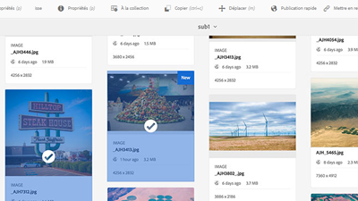

# Présentation {#overview}

Adobe Experience Manager Assets est un outil de gestion d’actifs numériques sur la plateforme AEM qui permet aux utilisateurs de créer, gérer et partager leurs actifs numériques (images, vidéos, documents et clips audio) dans un référentiel Web. Ce guide d&#39;utilisation contient des vidéos et des didacticiels sur les nombreuses fonctionnalités et fonctionnalités d&#39;AEM Assets.

## Nouveautés

* **[Filigranes (vidéo)](./advanced/watermarks.md)**

   *Découvrez comment mettre en filigrane les rendus de ressources dans AEM en tant que Cloud Service*

* **[Autorisations de base (vidéo)](./configuring/baseline-permissions.md)**

   *Découvrez comment et pourquoi il est important de configurer AEM Assets avec des autorisations de base.*

* **[Workflows de début automatique (vidéo)](./configuring/auto-start-workflows.md)**

   *Découvrez comment appeler automatiquement AEM flux de travaux sur les ressources téléchargées ou retraitées*

* **[Profils de traitement (vidéo)](./configuring/processing-profiles.md)**

   *Découvrez comment appeler des microservices Ressources pour des ressources de rendu*

* **[Utilisation des collections de ressources (vidéo)](./search-and-discovery/collections.md)**

   *Découvrez comment les collections dans AEM Assets offrent de nouvelles méthodes pour organiser et découvrir des ressources*

## Sélection du personnel

<table>
<td>
   
   

      <a href="./creative-workflows/aem-desktop-app.md">
      <strong>Utilisation de l’application de bureau AEM</strong>
      </a>
   

   

      <em>Accédez directement aux ressources dans AEM depuis le bureau</em>
   

</td>
<td>
   
   

      <a href="./advanced/asset-insights-launch-tutorial.md">
      <strong>Utilisation de AEM Asset Insights avec le lancement</strong>
      </a>
   

   

      <em>Obtenir des informations sur l’utilisation des ressources</em>
   

</td>
<td>
   
   

      <a href="./dynamic-media/dynamic-media-overview-feature-video-use.md">
      <strong>Présentation des médias dynamiques</strong>
      </a>
   

   

      <em>Gestion et accès au contenu multimédia à l’aide de Contenu multimédia dynamique</em>
   

</td>
</table>

## Ressources supplémentaires

* [Experience League - Explorez AEM](https://experienceleague.adobe.com/#recommended/solutions/experience-manager)
* [Documentation de l’AEM Assets](https://helpx.adobe.com/fr/experience-manager/6-5/assets/user-guide.html)
* [Tutoriels d’AEM as a Cloud Service](/help/cloud-service/overview.md)
* [Tutoriels AEM Sites](/help/sites/overview.md)
* [Tutoriels AEM Forms](/help/forms/overview.md)
* [Tutoriels d’AEM Foundation](/help/foundation/overview.md)
