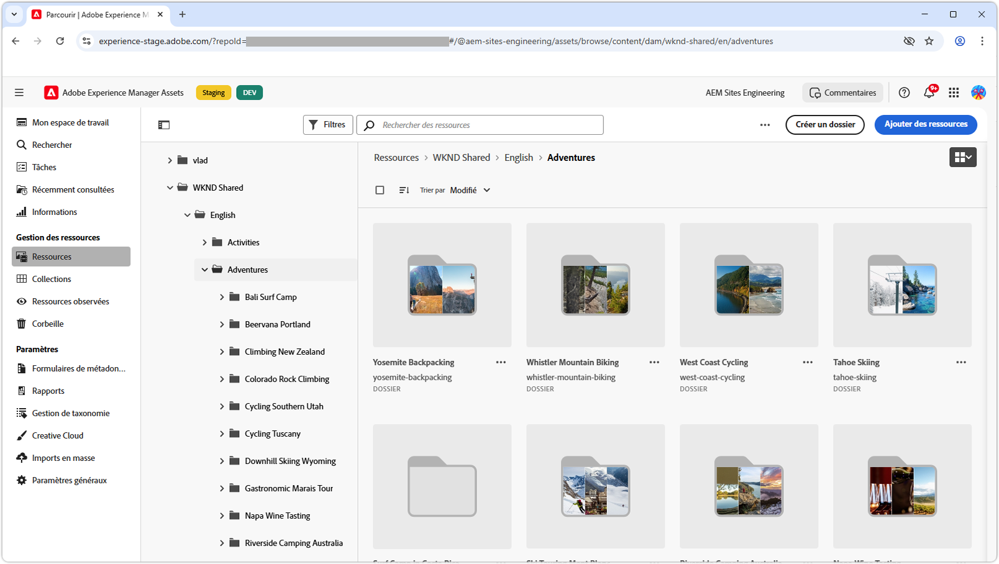

# Listes de lecture vidéo pour la vue Assets

{align="center"}

Explorez ces listes de lecture pour maîtriser la vue Assets d’AEM Assets as a Cloud Service, qui couvre la configuration, l’optimisation, l’utilisation et l’intégration transparente aux workflows créatifs. Obtenez les informations dont vous avez besoin pour réussir avec AEM Assets as a Cloud Service.

## Configurer la vue Assets

Commencez avec les configurations et les paramétrages essentiels pour qu’AEM Assets as a Cloud Service fonctionne de manière fluide pour votre équipe et vos projets.

<!-- CARDS

* https://experienceleague.adobe.com/fr/playlists/experience-manager-all-configure-administrative-access
* https://experienceleague.adobe.com/fr/playlists/experience-manager-assets-get-started-assets-essentials {title=Get started with Assets view}

-->
<!-- START CARDS HTML - DO NOT MODIFY BY HAND -->

    

        

            

                <figure class="image x-is-16by9">
                    
                </figure>
            

            

                

                    

                        <a href="https://experienceleague.adobe.com/fr/playlists/experience-manager-all-configure-administrative-access" target="_blank" rel="referrer" title="Configurer l’accès administratif à Experience Manager">Configurer l’accès administratif à Experience Manager</a>
                    

                    
Découvrez comment les utilisateurs et utilisatrices s’authentifient à l’aide d’Adobe IMS pour AEM as a Cloud Service et comment les utilisateurs et utilisatrices, groupes d’utilisateurs et d’utilisatrices et profils de produits Adobe IMS sont utilisés pour contrôler l’accès à AEM et à ses fonctionnalités.

                

                <a href="https://experienceleague.adobe.com/fr/playlists/experience-manager-all-configure-administrative-access" target="_blank" rel="referrer" class="spectrum-Button spectrum-Button--outline spectrum-Button--primary spectrum-Button--sizeM" style="align-self: flex-start; margin-top: 1rem;">                     Regarder                 </a>
            

        

    

    

        

            

                <figure class="image x-is-16by9">
                    
                </figure>
            

            

                

                    

                        <a href="https://experienceleague.adobe.com/fr/playlists/experience-manager-assets-get-started-assets-essentials" target="_blank" rel="referrer" title="Commencer avec la vue Assets">Commencer avec la vue Assets</a>
                    

                    
Découvrez comment AEM Assets Essentials peut rationaliser la gestion des ressources numériques pour votre service.

                

                <a href="https://experienceleague.adobe.com/fr/playlists/experience-manager-assets-get-started-assets-essentials" target="_blank" rel="referrer" class="spectrum-Button spectrum-Button--outline spectrum-Button--primary spectrum-Button--sizeM" style="align-self: flex-start; margin-top: 1rem;">                     Regarder                 </a>
            

        

    

<!-- END CARDS HTML - DO NOT MODIFY BY HAND -->

## Commencer avec la vue Assets

Naviguez dans l’interface de la vue Assets de manière professionnelle : découvrez les outils et les techniques permettant de gérer efficacement les ressources.

<!-- CARDS

* https://experienceleague.adobe.com/fr/playlists/experience-manager-assets-generate-image-assets-with-adobe-firefly
* https://experienceleague.adobe.com/fr/playlists/experience-manager-assets-assets-view-search-use

-->
<!-- START CARDS HTML - DO NOT MODIFY BY HAND -->

    

        

            

                <figure class="image x-is-16by9">
                    
                </figure>
            

            

                

                    

                        <a href="https://experienceleague.adobe.com/fr/playlists/experience-manager-assets-generate-image-assets-with-adobe-firefly" target="_blank" rel="referrer" title="Générer des ressources d’image à l’aide d’Adobe Firefly">Générer des ressources d’image à l’aide d’Adobe Firefly</a>
                    

                    
Découvrez comment AEM Assets peut augmenter la vitesse du contenu à l’aide d’Adobe Firefly et de l’IA générative.

                

                <a href="https://experienceleague.adobe.com/fr/playlists/experience-manager-assets-generate-image-assets-with-adobe-firefly" target="_blank" rel="referrer" class="spectrum-Button spectrum-Button--outline spectrum-Button--primary spectrum-Button--sizeM" style="align-self: flex-start; margin-top: 1rem;">                     Regarder                 </a>
            

        

    

    

        

            

                <figure class="image x-is-16by9">
                    
                </figure>
            

            

                

                    

                        <a href="https://experienceleague.adobe.com/fr/playlists/experience-manager-assets-assets-view-search-use" target="_blank" rel="referrer" title="Rechercher dans la vue Assets d’AEM Assets pour trouver des ressources">Rechercher dans la vue Assets d’AEM Assets pour trouver des ressources</a>
                    

                    
Découvrez comment la recherche dans la vue Assets d’AEM Assets peut vous aider à trouver rapidement et facilement des ressources.

                

                <a href="https://experienceleague.adobe.com/fr/playlists/experience-manager-assets-assets-view-search-use" target="_blank" rel="referrer" class="spectrum-Button spectrum-Button--outline spectrum-Button--primary spectrum-Button--sizeM" style="align-self: flex-start; margin-top: 1rem;">
Regarder
</a>
            

        

    

<!-- END CARDS HTML - DO NOT MODIFY BY HAND -->

## Connecter des workflows créatifs à AEM Assets

Bénéficiez d’une collaboration fluide en intégrant AEM Assets as a Cloud Service à vos outils de création, pour des workflows cohérents et efficaces.

<!-- CARDS

* https://experienceleague.adobe.com/fr/playlists/experience-manager-assets-manage-creative-workflows-with-workfront-and-assets-essentials
  { title = Manage Creative Workflows Using Workfront and AEM Assets }
  { description = Learn how Adobe Workfront and AEM Assets help your organization manage the creative workflow. }

-->
<!-- START CARDS HTML - DO NOT MODIFY BY HAND -->

    

        

            

                <figure class="image x-is-16by9">
                    
                </figure>
            

            

                

                    

                        <a href="https://experienceleague.adobe.com/fr/playlists/experience-manager-assets-manage-creative-workflows-with-workfront-and-assets-essentials" target="_blank" rel="referrer" title="Gérer des workflows créatifs à l’aide de Workfront et d’Assets Essentials">Gérer des workflows créatifs à l’aide de Workfront et d’AEM Assets</a>
                    

                    
Découvrez comment Adobe Workfront et AEM Assets aident votre entreprise à gérer le workflow créatif.

                

                <a href="https://experienceleague.adobe.com/fr/playlists/experience-manager-assets-manage-creative-workflows-with-workfront-and-assets-essentials" target="_blank" rel="referrer" class="spectrum-Button spectrum-Button--outline spectrum-Button--primary spectrum-Button--sizeM" style="align-self: flex-start; margin-top: 1rem;">
                    Regarder
                </a>
            

        

    

<!-- END CARDS HTML - DO NOT MODIFY BY HAND -->

