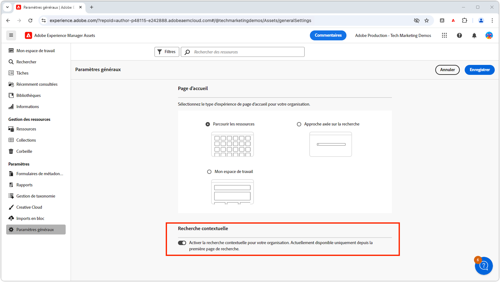

# Recherche contextuelle

Découvrez comment utiliser la recherche contextuelle dans Adobe Experience Manager Assets pour rechercher efficacement des ressources avec des requêtes de langue naturelle.

>[!VIDEO](https://video.tv.adobe.com/v/3428667/?learn=on)

## Activation/désactivation de la recherche contextuelle

Pour activer ou désactiver la recherche contextuelle pour l’ensemble des utilisateurs et des utilisatrices, les administrateurs et les administratrices AEM doivent accéder aux __Paramètres généraux__ et placer le bouton bascule de l’option __Recherche contextuelle__ sur le paramètre de leur choix.

Par défaut, la recherche contextuelle est activée pour l’ensemble des utilisateurs et des utilisatrices.

