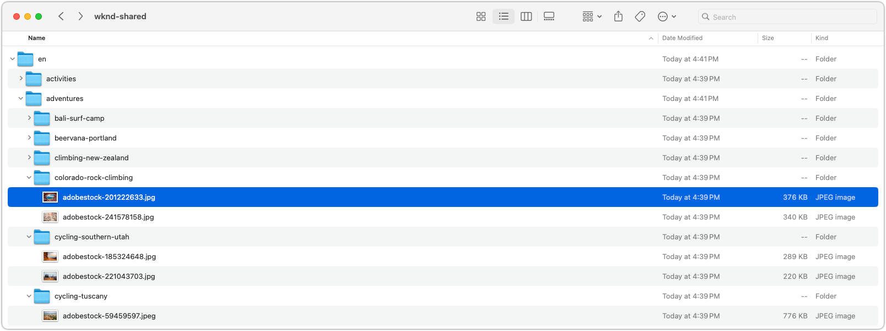

# Exporter des ressources

Découvrez comment exporter des ressources vers votre ordinateur local à l’aide d’un script Node.js personnalisable. Ce script d’export fournit un exemple de téléchargement de ressources par programmation à partir d’AEM à l’aide des [API HTTP AEM Assets](https://experienceleague.adobe.com/fr/docs/experience-manager-cloud-service/content/assets/admin/mac-api-assets), en se concentrant spécifiquement sur les rendus originaux pour garantir la meilleure qualité. Il est conçu pour répliquer la structure de dossiers d’AEM Assets sur votre disque local, ce qui facilite la sauvegarde ou la migration des ressources.

Le script télécharge uniquement les rendus originaux de la ressource, sans métadonnées associées, sauf si ces métadonnées ont été incorporées comme XMP dans la ressource. Cela signifie que les informations descriptives, les catégories ou les balises stockées dans AEM, mais non intégrées dans les fichiers de ressources ne sont pas incluses dans le téléchargement. D’autres rendus peuvent également être téléchargés en modifiant le script afin de les inclure. Assurez-vous que vous disposez de suffisamment d’espace pour stocker les ressources exportées.

Le script est généralement exécuté par l’instance de création AEM, mais peut également être exécuté par l’instance de publication, à condition que les points d’entrée de l’API HTTP AEM Assets et les rendus de ressources soient accessibles via le Dispatcher.

Avant d’exécuter le script, vous devez le configurer avec l’URL de votre instance AEM, les informations d’identification de la personne (jeton d’accès) et le chemin d’accès au dossier que vous souhaitez exporter.

## Exporter le script

Le script, écrit en tant que module JavaScript, fait partie d’un projet Node.js, car il dépend de `node-fetch`. Vous pouvez [télécharger le projet sous la forme d’un fichier zip](./assets/export/export-aem-assets-script.zip) ou copier le script ci-dessous dans un projet Node.js vide de type `module`, puis exécuter `npm install node-fetch` pour installer la dépendance.

Ce script décrit l’arborescence de dossiers AEM Assets, en téléchargeant les ressources et les dossiers vers un dossier local de votre ordinateur. Il utilise l’[API HTTP AEM ASSETS](https://experienceleague.adobe.com/fr/docs/experience-manager-cloud-service/content/assets/admin/mac-api-assets) pour récupérer les données de dossier et de ressource, puis télécharge les rendus originaux des ressources.

```javascript
// export-assets.js

import fetch from 'node-fetch';
import { promises as fs } from 'fs';
import path from 'path';

// Do not process the contents of these well-known AEM system folders
const SKIP_FOLDERS = ['/content/dam/appdata', '/content/dam/projects', '/content/dam/_CSS', '/content/dam/_DMSAMPLE' ];

/**
 * Determine if the folder should be processed based on the entity and AEM path.
 * 
 * @param {Object} entity the AEM entity that should represent a folder returned from AEM Assets HTTP API
 * @param {String} aemPath the path in AEM of this source
 * @returns true if the entity should be processed, false otherwise
 */
function isValidFolder(entity, aemPath) {
    if (aemPath === '/content/dam') {
        // Always allow processing /content/dam 
        return true;
    } else if (!entity.class.includes('assets/folder')) {
        return false;
    } if (SKIP_FOLDERS.find((path) => path === aemPath)) {
        return false;
    } else if (entity.properties.hidden) {
        return false;
    }
    
    return true;
}

/**
 * Determine if the entity is downloadable.
 * @param {Object} entity the AEM entity that should represent an asset returned from AEM Assets HTTP API
 * @returns true if the entity is downloadable, false otherwise
 */
function isDownloadable(entity) {
    if (entity.class.includes('assets/folder')) {
        return false;
    } else if (entity.properties.contentFragment) {
        return false;
    }

    return true;
}

/**
 * Helper function to get the link from the entity based on the relationship name.
 * @param {Object} entity the entity from the AEM Assets HTTP API
 * @param {String} rel the relationship name
 * @returns 
 */
function getLink(entity, rel) {
    return entity.links.find(link => link.rel.includes(rel));
}

/**
 * Helper function to fetch JSON data from the AEM Assets HTTP API.
 * @param {String} url the AEM Assets HTTP API URL to fetch data from
 * @returns the JSON response of the AEM Assets HTTP API
 */
async function fetchJSON(url) {
    const response = await fetch(url, {
        method: 'GET',
        headers: {
            'Authorization': `Bearer ${AEM_ACCESS_TOKEN}`,
            'Content-Type': 'application/json'
        }
    });

    if (!response.ok) {
        throw new Error(`Error: ${response.status}`);
    }

    return response.json();
}

/**
 * Helper function to download a file from AEM Assets.
 * @param {String} url the URL of the asset rendition to download
 * @param {String} outputPath the local path to save the downloaded file
 */
async function downloadFile(url, outputPath) {
    const response = await fetch(url, {
        method: 'GET',
        headers: {
            'Authorization': `Bearer ${AEM_ACCESS_TOKEN}`,
        }
    });

    if (!response.ok) {
        throw new Error(`Failed to download file: ${response.statusText}`);
    }

    const arrayBuffer = await response.arrayBuffer();
    await fs.writeFile(outputPath, Buffer.from(arrayBuffer));

    console.log(`Downloaded asset: ${outputPath}`);
}

/**
 * Main entry
 * @param {Object} options the options for downloading assets
 * @param {String} options.folderUrl the URL of the AEM folder to download
 * @param {String} options.localPath the local path to save the downloaded assets
 * @param {String} options.aemPath the AEM path of the folder to download
 */
async function downloadAssets({apiUrl, localPath = LOCAL_DOWNLOAD_FOLDER, aemPath = '/content/dam'}) {    
    if (!apiUrl) {
        // Handle the initial call to the script, which should just provide the AEM path
        // Construct the proper AEM Assets HTTP API URL as it uses a truncated AEM path
        const prefix = "/content/dam/";
        let apiPath = aemPath.startsWith(prefix) ? aemPath.substring(prefix.length) : aemPath;    

        if (!apiPath.startsWith('/')) {
            apiPath = '/' + apiPath;
        }

        apiUrl = `${AEM_HOST}/api/assets.json${apiPath}`
    }
    
    const data = await fetchJSON(apiUrl);
    const entities = data.entities || [];

    // Process folders first
    for (const folder of entities.filter(entity => entity.class.includes('assets/folder'))) {
        const newLocalPath = path.join(localPath, folder.properties.name);
        const newAemPath = path.join(aemPath, folder.properties.name);

        if (!isValidFolder(folder, newAemPath)) {
            continue;
        }

        await fs.mkdir(newLocalPath, { recursive: true });
    
        await downloadAssets({
            apiUrl: getLink(folder, 'self')?.href, 
            localPath: newLocalPath, 
            aemPath: newAemPath
        });
    }

    let downloads = [];

    // Process assets
    for (const asset of entities.filter(entity => entity.class.includes('assets/asset'))) {
        const assetLocalPath = path.join(localPath, asset.properties.name);
        if (isDownloadable(asset)) {
            downloads.push(downloadFile(getLink(asset, 'content')?.href, assetLocalPath));
        }

        // Process in batches of MAX_CONCURRENT_DOWNLOADS
        if (downloads.length >= MAX_CONCURRENT_DOWNLOADS) {
            await Promise.all(downloads);
            downloads = [];
        }
    }

    // Wait for the remaining downloads to finish
    await Promise.all(downloads);
    downloads = [];

    // Handle pagination
    const nextUrl = getLink(data, 'next');
    if (nextUrl) {
        await downloadAssets({
            apiUrl: nextUrl?.href,
            localPath,
            aemPath
        });
    }
}

/***** SCRIPT CONFIGURATION *****/

// AEM host is the URL of the AEM environment to download the assets from
const AEM_HOST = 'https://author-p123-e456.adobeaemcloud.com';

// AEM access token used to access the AEM host. 
// This access token must have read access to the folders and assets to download.
const AEM_ACCESS_TOKEN = "eyJhbGciOiJS...zCprYZD0rSjg6g";

// The root folder in AEM to download assets from.
const AEM_ASSETS_FOLDER = '/content/dam/wknd-shared';

// The local folder to save the downloaded assets.
const LOCAL_DOWNLOAD_FOLDER = './exported-assets';

// The number of maximum concurrent downloads to avoid overwhelming the client or server. 10 is typically a good value.
const MAX_CONCURRENT_DOWNLOADS = 10;

/***** SCRIPT ENTRY POINT *****/

console.time('Download AEM assets');

await downloadAssets({
    aemPath: AEM_ASSETS_FOLDER, 
    localPath: LOCAL_DOWNLOAD_FOLDER
}).catch(console.error);

console.timeEnd('Download AEM assets');
```

## Configurer l’export

Une fois le script téléchargé, mettez à jour les variables de configuration au bas du script.

Le `AEM_ACCESS_TOKEN` peut être obtenu en suivant les étapes du tutoriel [Authentification basée sur les jetons à AEM as a Cloud Service](https://experienceleague.adobe.com/fr/docs/experience-manager-learn/getting-started-with-aem-headless/authentication/overview). Le jeton de développement de 24 heures est souvent suffisant, tant que l’export prend moins de 24 heures et que la personne générant le jeton dispose d’un accès en lecture aux ressources à exporter.

```javascript
...
/***** SCRIPT CONFIGURATION *****/

// AEM host is the URL of the AEM environment to download the assets from
const AEM_HOST = 'https://author-p123-e456.adobeaemcloud.com';

// AEM access token used to access the AEM host. 
// This access token must have read access to the folders and assets to download.
const AEM_ACCESS_TOKEN = "eyJhbGciOiJS...zCprYZD0rSjg6g";

// The root folder in AEM to download assets from.
const AEM_ASSETS_FOLDER = '/content/dam/wknd-shared';

// The local folder to save the downloaded assets.
const LOCAL_DOWNLOAD_FOLDER = './export-assets';

// The number of maximum concurrent downloads to avoid overwhelming the client or server. 10 is typically a good value.
const MAX_CONCURRENT_DOWNLOADS = 10;
```

## Exporter les ressources

Exécutez le script à l’aide de Node.js pour exporter les ressources vers votre ordinateur local.

Selon le nombre de ressources et leur taille, l’exécution du script peut prendre un certain temps. Lorsque le script s’exécute, il [consigne la progression](#output) dans la console.

```shell
$ node export-assets.js
```

## Exporter la sortie

Le script d’export consigne la progression dans la console, indiquant les ressources en cours de téléchargement. Une fois le script terminé, les ressources sont enregistrées dans le dossier local spécifié dans la configuration, et le journal se termine par le temps total nécessaire au téléchargement des ressources.

```plaintext
...
Downloaded asset: exported-assets/wknd-shared/en/magazine/skitouring/skitouring3sjoeberg.jpg
Downloaded asset: exported-assets/wknd-shared/en/magazine/skitouring/skitouring5sjoeberg.jpg
Downloaded asset: exported-assets/wknd-shared/en/magazine/skitouring/skitouring6sjoeberg.jpg
Downloaded asset: exported-assets/wknd-shared/en/magazine/western-australia/wa_camping_adobe.pdf
Downloaded asset: exported-assets/wknd-shared/en/magazine/western-australia/adobestock-156407519.jpeg
Downloaded asset: exported-assets/wknd-shared/en/magazine/western-australia/adobe-waadobe-wa-mg-3094.jpg
Downloaded asset: exported-assets/wknd-shared/en/magazine/western-australia/adobe-waadobe-wa-mg-3851.jpg
Downloaded asset: exported-assets/wknd-shared/en/magazine/western-australia/adobe-waadobe-wa-b6a7083.jpg
Downloaded asset: exported-assets/wknd-shared/en/magazine/western-australia/adobe-waadobe-wa-b6a6978.jpg
Download AEM assets: 24.770s
```

Les ressources exportées se trouvent dans le dossier local spécifié dans le `LOCAL_DOWNLOAD_FOLDER` de la configuration. La structure de dossiers reflète la structure de dossiers AEM Assets, avec les ressources téléchargées dans les sous-dossiers appropriés. Ces fichiers peuvent être chargés dans les [fournisseurs d’espace de stockage pris en charge](https://experienceleague.adobe.com/fr/docs/experience-manager-cloud-service/content/assets/assets-view/bulk-import-assets-view), afin de les [importer en masse](https://experienceleague.adobe.com/fr/docs/experience-manager-learn/cloud-service/migration/bulk-import) dans d’autres instances AEM ou à des fins de sauvegarde.


