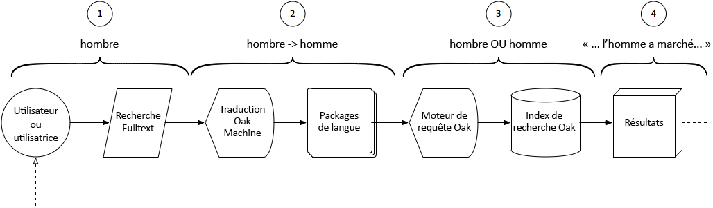

# Utilisation de la recherche de traduction intelligente avec AEM Assets{#using-smart-translation-search-with-aem-assets}

La recherche de traduction intelligente permet la recherche et la découverte inter-langues automatiquement à travers AEM contenu, à la fois les ressources et les pages, prenant en charge plus de 50 langues et réduisant le besoin de traduction manuelle du contenu.

>[!VIDEO](https://video.tv.adobe.com/v/21297/?quality=9&learn=on)

aem Smart Translation Search permet aux utilisateurs d’effectuer des recherches de contenu en AEM utilisant des termes non anglais, afin de faire correspondre les ressources en AEM qui contiennent des termes anglais équivalents.

Smart Translation Search est un parfait complément aux balises actives AEM appliquées aux ressources en anglais.

Cette vidéo suppose que [AEM Smart Translation Search](smart-translation-search-technical-video-setup.md) a été configuré.

## Fonctionnement de la recherche Smart Translation {#how-smart-translation-search-works}

1. aem utilisateur effectue une recherche de texte intégral, fournissant un terme de recherche localisé (ex. le terme espagnol pour &quot;homme&quot;, &quot;hombre&quot;).
2. La recherche Smart Translation Search, fournie par le lot Apache Oak Machine Translation OSGi, est engagée et évalue si les termes de recherche fournis peuvent être traduits à l&#39;aide des modules linguistiques enregistrés.
3. Tous les termes traduits de l’étape 2 sont collectés et la requête est augmentée en interne pour les inclure comme termes de recherche. Cet ensemble augmenté de termes de recherche s&#39;ils sont évalués normalement par rapport à AEM index de recherche qui localisent les correspondances pertinentes.
4. Les résultats de la recherche qui correspondent au terme d&#39;origine (&#39;hombre&#39;) ou au terme traduit (&#39;man&#39;) sont collectés et renvoyés à l&#39;utilisateur comme résultats de la recherche.

## Ressources supplémentaires{#additional-resources}

* [Configuration de la recherche de traduction intelligente avec AEM Assets](smart-translation-search-technical-video-setup.md)
* [Apache Joshua](https://cwiki.apache.org/confluence/display/JOSHUA/Language+Packs)