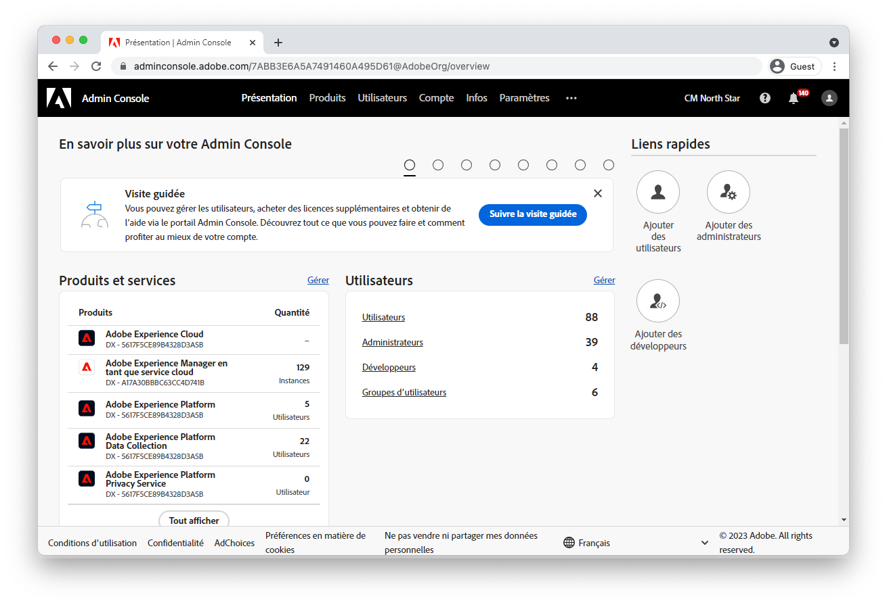

# Configurer l’accès à AEM as a Cloud Service {#configuring-access-to-aem-as-a-cloud-service}

>[!CONTEXTUALHELP]
>id="aemcloud_adobeims_overview"
>title="Présentation d’Adobe IMS"
>abstract="AEM as a Cloud Service exploite Adobe IMS (Identity Management System) pour faciliter la connexion de tous les utilisateurs et utilisatrices, ayant des droits d’administration ou non, au service de création AEM. Découvrez comment les utilisateurs et utilisatrices, groupes d’utilisateurs et d’utilisatrices et profils de produits d’Adobe IMS sont tous utilisés conjointement avec les groupes et les autorisations d’AEM, afin de fournir un accès affiné au service de création AEM."

AEM as a Cloud Service est la méthode native du cloud qui permet d’exploiter les applications AEM. Elle utilise Adobe IMS (Identity Management System) pour faciliter la connexion de tous les utilisateurs et utilisatrices, ayant des droits d’administration ou non, au service de création AEM.

Découvrez comment les utilisateurs et utilisatrices, groupes d’utilisateurs et d’utilisatrices et profils de produits d’Adobe IMS sont tous utilisés conjointement avec les groupes et les autorisations d’AEM, afin de fournir un accès affiné au service de création AEM.

## Utilisateurs Adobe IMS

Les utilisateurs et utilisatrices nécessitant l’accès au service de création AEM sont gérés en tant qu’[Utilisateurs Adobe IMS](https://helpx.adobe.com/fr/enterprise/using/set-up-identity.html) dans l’[Admin Console d’Adobe](https://adminconsole.adobe.com). Découvrez la fonction des utilisateurs et utilisatrices d’Adobe IMS, ainsi que leur mode d’accessibilité et de gestion dans l’Admin Console.

>[!NOTE]
>
>Lorsqu’une personne utilisatrice IMS est supprimée de l’Admin Console, elle n’est pas automatiquement supprimée d’AEM ; mais une fois la session (jeton) AEM expirée, elle ne peut PLUS se connecter à AEM.

[En savoir plus sur les utilisateurs et utilisatrices d’Adobe IMS.](./adobe-ims-users.md)

## Groupes d’utilisateurs Adobe IMS

Les utilisateurs et utilisatrices accédant au service de création AEM doivent être organisés en groupes logiques à l’aide des [Groupes d’utilisateurs Adobe IMS](https://helpx.adobe.com/fr/enterprise/using/user-groups.html) dans l’[Admin Console d’Adobe](https://adminconsole.adobe.com). Les groupes d’utilisateurs et d’utilisatrices d’Adobe IMS ne fournissent pas d’autorisations directes ni d’accès à AEM, puisque c’est la tâche des [Profils de produit Adobe IMS](#adobe-ims-product-profiles). Cependant, ils constituent un excellent moyen de définir des regroupements logiques d’utilisateurs et d’utilisatrices qui peuvent à leur tour être traduits en niveaux d’accès spécifiques dans le service de création AEM, à l’aide de groupes et d’autorisations AEM.

[En savoir plus sur les groupes d’utilisateurs et d’utilisatrices d’Adobe IMS.](./adobe-ims-user-groups.md)

## Profils de produit Adobe IMS

Les [Profils de produit Adobe IMS](https://helpx.adobe.com/fr/enterprise/using/manage-permissions-and-roles.html), gérés dans l’[Admin Console d’Adobe](https://adminconsole.adobe.com), sont le mécanisme qui fournit aux [utilisateurs et utilisatrices d’Adobe IMS](#adobe-ims-users) l’accès nécessaire pour se connecter au service de création AEM avec un niveau d’accès de base.

+ Le profil de produit __Utilisateurs AEM__ permet aux utilisateurs et utilisatrices d’accéder à AEM en lecture seule via leur appartenance au groupe de contribution d’AEM.
+ Le profil de produit __Administrateurs AEM__ donne aux utilisateurs et utilisatrices un accès administratif complet à AEM.

[En savoir plus sur les profils de produit d’Adobe IMS.](./adobe-ims-product-profiles.md)

## Groupes d’utilisateurs et autorisations AEM

Adobe Experience Manager s’appuie sur les utilisateurs et utilisatrices, groupes d’utilisateurs et d’utilisatrices, et profils de produit d’Adobe IMS pour offrir aux utilisateurs et utilisatrices un accès personnalisable à AEM. Découvrez comment créer des groupes et autorisations AEM, puis comprenez comment ils fonctionnent de concert avec les abstractions d’Adobe IMS afin de fournir un accès transparent et personnalisable à AEM.

[En savoir plus sur les utilisateurs et utilisatrices, les groupes et les autorisations AEM.](./aem-users-groups-and-permissions.md)

## Présentation de l’accès et des autorisations

Présentation rapide de la configuration des utilisateurs et utilisatrices, groupes d’utilisateurs et d’utilisatrices, et profils de produit d’Adobe IMS dans l’Adobe Admin Console et de la manière d’exploiter ces abstractions d’Adobe IMS dans l’instance de création AEM pour définir et gérer des autorisations spécifiques basées sur des groupes.

[Présentation de l’accès et des autorisations AEM](./walk-through.md)

## Ressources Adobe Admin Console supplémentaires

La documentation suivante couvre les détails et préoccupations spécifiques à [Adobe Admin Console](https://adminconsole.adobe.com), afin de vous aider à mieux comprendre Adobe Admin Console et à l’utiliser pour gérer les utilisateurs et utilisatrices et accéder à l’ensemble des produits Experience Cloud.

+ [Présentation de l’identité Adobe Admin Console](https://helpx.adobe.com/fr/enterprise/using/identity.html)
+ [Rôles d’administration Adobe Admin Console](https://helpx.adobe.com/fr/enterprise/using/admin-roles.html)
+ [Rôles de développement Adobe Admin Console](https://helpx.adobe.com/fr/enterprise/using/manage-developers.html)
