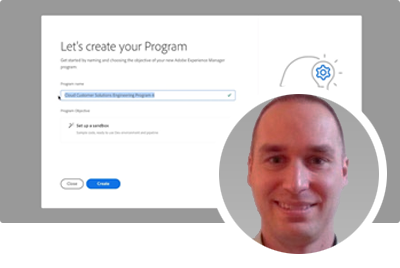
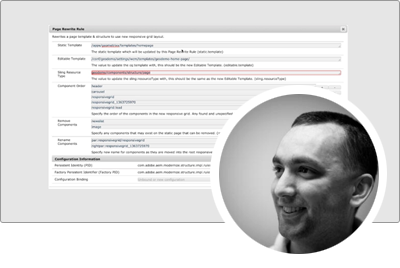

# Série d’experts Adobe Experience Manager as a Cloud Service

Découvrez Adobe Experience Manager (AEM) as a Cloud Service d’ingénieurs experts d’Adobe qui le construisent, ainsi que l’équipe de services professionnels qui le diffusent. Rejoignez les experts de l&#39;Adobe pour explorer ce qu&#39;est AEM as a Cloud Service, en quoi c&#39;est identique et différent d&#39;AEM 6, et comment passer de l&#39; 6 à l&#39;as a Cloud Service.

  
 

## Prise en main d’AEM as a Cloud Service

Découvrez les principes de base d’AEM en tant que Cloud Services et comment cela diffère d’AEM 6, des architectes Cloud senior de l’ingénierie d’Adobe.

<table>
  <tr>
   <td>
      
      

         <a href="./migration/moving-to-aem-as-a-cloud-service/introduction.md"><strong>Penser différemment</strong></a>         
          <em>avec Darin Kuntze, architecte senior du cloud</em>
      

      

         
         Un coup d’oeil à l’architecture d’AEM as a Cloud Service et à la manière de penser différemment aux implémentations as a Cloud Service.
      

     </td>   
     <td>
      
      

         <a href="./migration/moving-to-aem-as-a-cloud-service/onboarding.md"><strong>Intégration à AEM as a Cloud Service</strong></a>
          <em>avec Damian Langsweirdt, architecte senior du cloud</em>
      

      

         
         Découvrez comment intégrer à AEM as a Cloud Service, en commençant par la phase de contrat pour configurer des environnements en libre-service à l’aide de Cloud Manager.
      

   </td>     
   </td>   
     <td>
      
      

         <a href="./migration/moving-to-aem-as-a-cloud-service/cloud-manager.md"><strong>Cloud Manager pour AEM as a Cloud Service</strong></a>
          <em>avec Bryan Stopp, architecte senior du cloud</em>
      

      

         
         Découvrez Cloud Manager pour AEM as a Cloud Service et ses différences avec Cloud Manager pour AEM sur Adobe Manage Services (AMS).
      

   </td> 
  </tr>
</table>

## Transition vers AEM as a Cloud Service?

Prévoyez de passer de AEM 6 à AEM as a Cloud Service ? Découvrez la méthodologie de l’Adobe pour passer à AEM as a Cloud Service, ainsi que les divers outils et fonctionnalités qui font de cette transition un processus fluide.

<table>
  <tr>
   <td>
      
      

         <a href="./migration/moving-to-aem-as-a-cloud-service/bpa-and-cam.md" target="_aem-experts-series-video"><strong>Méthodologie de migration</strong></a>
          <em>avec Roger Blanton, architecte technique des services de conseil en Adobe</em>
      

      

         
        Examinez la méthodologie de migration des bonnes pratiques pour passer d’AEM 6 à AEM as a Cloud Service à l’aide d’Adobe BPA (Best Practices Analyzer) et de la gestion de l’accélération du cloud (CAM).
      

   </td>   
     <td>
      
      

         <a href="./migration/moving-to-aem-as-a-cloud-service/aem-modernization-tools.md" target="_aem-experts-series-video"><strong>Moderniser le contenu</strong></a>
          <em>avec Bryan Stopp, architecte senior du cloud</em>
      

      

         
         Découvrez comment moderniser automatiquement votre contenu AEM pour tirer parti des dernières fonctionnalités AEM as a Cloud Service.
      

   </td>     
   </td>   
     <td>
      
      

         <a href="./migration/moving-to-aem-as-a-cloud-service/repository-modernization.md" target="_aem-experts-series-video"><strong>Modernisation de votre projet AEM Maven</strong></a>
          <em>avec Varun Mitra, architecte du cloud</em>
      

      

         
         Découvrez comment moderniser automatiquement la structure de projet et l’organisation de votre application AEM personnalisée pour qu’elle soit AEM as a Cloud Service et conforme aux dernières pratiques recommandées d’Adobe.
      

   </td> 
  </tr>
  <tr>
   <td>
      
      

         <a href="./migration/moving-to-aem-as-a-cloud-service/search-and-indexing.md" target="_aem-experts-series-video"><strong>Modernisation de vos index Oak</strong></a>
          <em>avec Darin Kuntze, architecte senior du cloud</em>
      

      

         
        Découvrez comment convertir automatiquement les définitions d’index Oak AEM 6 pour qu’elles soient AEM compatibles as a Cloud Service, ainsi que comment gérer les index Oak pour que les définitions d’index as a Cloud Service soient ultérieurement .
      

   </td>   
     <td>
      
      

         <a href="./migration/moving-to-aem-as-a-cloud-service/dispatcher.md" target="_aem-experts-series-video"><strong>Modernisation de la configuration de Dispatcher</strong></a>
          <em>avec Bryan Stopp, architecte senior du cloud</em>
      

      

         
         Découvrez AEM Dispatcher pour AEM as a Cloud Service, en vous concentrant sur les modifications notables apportées par Dispatcher pour la version 6, l’outil de conversion de Dispatcher et sur l’utilisation du SDK des outils Dispatcher.
      

   </td>     
   </td>   
     <td>
      
      

         <a href="./migration/moving-to-aem-as-a-cloud-service/content-migration/content-transfer-tool.md" target="_aem-experts-series-video"><strong>Transfert de votre contenu vers AEM as a Cloud Service</strong></a>
          <em>avec Kiran Murugulla, architecte senior du cloud</em>
      

      

         
         Découvrez comment l’outil de transfert de contenu vous aide à migrer le contenu vers AEM as a Cloud Service à partir d’AEM 6.3+.
      

   </td> 
  </tr>  
</table>

## AEM en tant que capacités Cloud Services

Découvrez les capacités uniques d’AEM as a Cloud Service grâce aux experts de l’Adobe.

<table>
  <tr>
   <td>
      
      

         <a href="./migration/moving-to-aem-as-a-cloud-service/asset-compute-microservices.md" target="_aem-experts-series-video"><strong>Microservices Asset compute</strong></a>
          <em>avec Amol Anand, Principal Cloud Architect</em>
      

      

         
        Découvrez les microservices d’Asset compute d’AEM Assets, comment ils remplacent AEM traitement des ressources 6 et comment ils peuvent être étendus pour générer des rendus de ressources personnalisés.
      

   </td>   
   <td>
      
      

         <a href="./migration/moving-to-aem-as-a-cloud-service/content-migration/bulk-import-service.md" target="_aem-experts-series-video"><strong>Importer du contenu en bloc</strong></a>
          <em>avec Kiran Murugulla, architecte senior du cloud</em>
      

      

         
        Découvrez comment importer du contenu en bloc de manière sécurisée et efficace pour AEM as a Cloud Service à l’aide du service d’importation en bloc et d’AEM Package Manager.
      

   </td> 
    <td></td>
  </tr>
</table>

## Besoin d’aide pour AEM en tant que Cloud Services ?

Découvrez comment déboguer et dépanner AEM as a Cloud Service et le SDK AEM des experts !

<table>
  <tr>
   <td>
      
      

         <a href="./migration/moving-to-aem-as-a-cloud-service/troubleshooting.md" 
         target="_aem-experts-series-video"><strong>Dépannage AEM as a Cloud Service</strong></a>
          <em>avec Kunwar Saluja, l'architecte de Cloud</em>
      

      

         
        Découvrez comment résoudre différents aspects d’AEM as a Cloud Service, allant du débogage du SDK AEM et de l’as a Cloud Service aux échecs de création et de déploiement de Cloud Manager.
      

   </td>   
    <td></td>
    <td></td>
  </tr>
</table>
