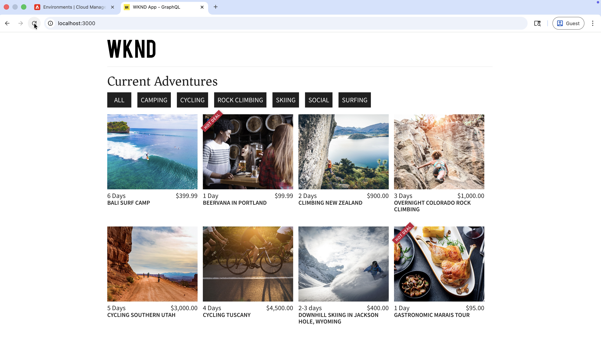

# Accélérer les opérations de contenu AEM à l’aide du serveur Content MCP

Utilisez le **serveur Content MCP** à partir d’un IDE optimisé par l’IA tel que [IDE Cursor](https://www.cursor.com/) pour travailler avec du contenu AEM en langage naturel, sans code API de bas niveau ni navigation dans l’interface utilisateur.

Dans ce tutoriel, vous _examiner_ les détails du fragment de contenu Adventure, _mettre à jour_ un fragment (par exemple, le prix d’une Adventure) et _vérifier_ la modification dans l’application React [WKND Adventures](https://github.com/adobe/aem-guides-wknd-graphql/tree/main/react-app) le tout à partir de votre IDE par rapport à un _environnement AEM inférieur_ (RDE ou développement) sans quitter le flux MCP.

>[!VIDEO](https://video.tv.adobe.com/v/3480895/?learn=on&enablevpops)

## Vue d’ensemble

AEM as a Cloud Service fournit des _serveurs MCP_ afin que votre IDE ou votre application de chat puisse fonctionner avec AEM en toute sécurité. Le **serveur Content MCP** prend en charge les pages, les fragments et les ressources. Voir [Serveurs MCP dans AEM](./overview.md) pour plus d’informations.

## Comment les développeurs peuvent-ils l’utiliser ?

Connectez l’IDE [Cursor](https://www.cursor.com/) au serveur Content MCP et exécutez le scénario ci-dessous.

### Configuration - Serveur Content MCP dans le curseur

Configurez le serveur Content MCP dans Cursor en procédant comme suit.

1. Ouvrez Cursor sur votre ordinateur.

1. Accédez à **Paramètres** > **Paramètres du curseur** à partir du menu Curseur pour ouvrir la fenêtre des paramètres.
   

1. Dans la barre latérale gauche, cliquez sur **Outils et MCP** pour ouvrir ce panneau.
   

1. Cliquez sur **Ajouter un MCP personnalisé** ou **Nouveau serveur MCP** pour ouvrir le `mcp.json`, puis collez cette configuration :

   ```json
   {
       "mcpServers": {
           // Use this for create, read, update, and delete operations
           "AEM-RDE-Content": {
               "url": "https://mcp.adobeaemcloud.com/adobe/mcp/content"
           },
           //Use this for read-only operations
           "AEM-RDE-Content-Read-Only": {
               "url": "https://mcp.adobeaemcloud.com/adobe/mcp/content-readonly"
           }
       }
   }
   ```

   >[!CAUTION]
   >
   > À des fins de tutoriel, la configuration ci-dessus ajoute à la fois **Contenu** et **Contenu (lecture seule)** pour ce tutoriel. En pratique, **Contenu** inclut déjà tout ce qui est **Contenu (lecture seule)** offres, ainsi que des outils de création, de mise à jour et de suppression.
   >
   >
   > Pour éviter toute possibilité de création, de modification ou de suppression de contenu, configurez uniquement **Contenu (lecture seule)** (`/content-readonly`) et omettez **Contenu** (`/content`). Vous éviterez ainsi les changements accidentels.

   

1. Dans la fenêtre Paramètres du curseur , cliquez sur **Connexion** pour lancer le processus d’authentification. Il utilise le flux PKCE OAuth 2.0 pour obtenir le **jeton d’accès spécifique à l’utilisateur** pour accéder au serveur MCP AEM.
   

1. Connectez-vous avec votre Adobe ID, puis revenez à la fenêtre Paramètres du curseur .
   

1. Vérifiez que **AEM-RDE-Content-Read-Only** et **AEM-RDE-Content** s’affichent comme connectés. Vous pouvez développer chaque serveur pour afficher ses outils.

   

### Configuration - Application React WKND Adventures.

Configurez ensuite l’application React [WKND Adventures](https://github.com/adobe/aem-guides-wknd-graphql/tree/main/react-app) dans le curseur.

1. Clonez ces deux référentiels sur votre ordinateur :

   ```bash
   ## WKND GraphQL repo, the `react-app` folder is the WKND Adventures app
   $ git clone git@github.com:adobe/aem-guides-wknd-graphql.git
   
   ## WKND Site repo, you deploy this to RDE so the app can use its content fragments data via GraphQL
   $ git clone git@github.com:adobe/aem-guides-wknd.git
   ```

1. Déployez le projet [WKND Site](https://github.com/adobe/aem-guides-wknd) sur votre RDE. Pour obtenir des instructions détaillées, voir [Utilisation de l’environnement de développement rapide](https://experienceleague.adobe.com/en/docs/experience-manager-learn/cloud-service/developing/rde/how-to-use#deploy-aem-artifacts-using-the-aem-rde-plugin).

1. Ouvrez le dossier `react-app` dans votre IDE.

1. Modifiez le `.env.development` et définissez :
   - `REACT_APP_HOST_URI` : votre URL d’auteur RDE
   - `REACT_APP_AUTH_METHOD` : à `basic`
   - `REACT_APP_BASIC_AUTH_USER` et `REACT_APP_AEM_AUTH_PASSWORD` : à `aem-headless` (créez cet utilisateur dans le RDE et ajoutez-le au groupe `administrators`)

1. À partir du terminal IDE, exécutez :

   ```bash
   $ cd aem-guides-wknd-graphql/react-app
   $ npm install
   $ npm start
   ```

1. Dans votre navigateur, accédez à [http://localhost:3000](http://localhost:3000) pour afficher l’application WKND Adventures.

   

### Scénario de productivité - Révision et mise à jour du contenu AEM

Supposons que vous deviez afficher une bannière _HOT DEAL_ sur les cartes Adventure lorsqu’une règle simple est remplie. L’approche habituelle serait la suivante :

- Examinez le code du composant Cartes d’Adventure .
- Ajoutez la logique pour savoir quand afficher la bannière
- Vérifier le modèle de fragment de contenu Adventure dans AEM
- Modifier une ou plusieurs propriétés de fragment d’Adventure pour tester la règle

Pour garder les choses simples, affichons la bannière _HOT DEAL_ lorsque le prix de l’aventure est inférieur à 100 $.

Comme l’application React récupère ses données de votre environnement RDE, vous devez connaître le modèle de fragment de contenu Adventure, puis mettre à jour les propriétés de fragment appropriées. C’est exactement ce à quoi le serveur AEM Content MCP peut répondre. Voici comment procéder.

1. Dans Cursor, ouvrez une nouvelle conversation et saisissez :

   ```text
   I want to review my Content Fragment Models from AEM RDE, can you list the Adventure Content Fragment details.
   ```

   


   Avant d’appeler le serveur MCP de contenu, il demande confirmation pour continuer. Vous gardez ainsi le contrôle des opérations de contenu.

   L’IA utilise Content MCP Server pour récupérer les données, puis les présente de manière claire et structurée. Il comprend des détails sur le modèle de fragment de contenu, le nombre de fragments et des informations récapitulatives.

1. Pour déclencher la bannière _HOT DEAL_, mettez à jour le prix d’une Adventure. Dans la même conversation, essayez :

   ```text
   Can you update adventure Beervana in Portland's price to 99.99
   ```

   

   De même, l’IA demande confirmation avant de mettre à jour le contenu. Il résume également l’opération de contenu avant et après la mise à jour.

1. Dans l’application React, vérifiez que la carte Beervana affiche désormais la bannière _HOT DEAL_.

   

### Invites supplémentaires

Essayez ces invites axées sur le contenu dans votre IDE (avec le serveur Content MCP connecté) pour explorer d’autres workflows et fonctionnalités.

- Découvrir le contenu :

  ```text
  List all content fragments in the WKND Adventures folder
  
  List all WKND Site pages from US English site
  
  Can you give me page metadata for Tahoe Skiing English page? 
  
  List assets of Bali Surf camp
  
  What Content Fragment models are available in this environment?
  ```

- Recherche de contenu :

  ```text
  Search for content fragments that mention 'cycling'
  
  Do we have a magazine page in US English site with "Camping" in it
  ```

- Mettre à jour le contenu :

  ```text
  In WKND US English create a copy of Downhill Skiing Wyoming as "Test Downhill Skiing Wyoming"
  
  In newly created "Test Downhill Skiing Wyoming" please change title to "Duplicated Page"
  ```

- Publier ou dépublier :

  ```text
  Can you publish the page at /us/en/adventures/test-downhill-skiing-wyoming and give me publish page URL
  
  Can you unpublish the test-downhill-skiing-wyoming page
  ```

## Résumé

Vous configurez le serveur AEM Content MCP dans le curseur et vous le connectez à votre environnement RDE (ou de développement). Vous avez ensuite utilisé l’application React WKND Adventures et discuté en langage naturel pour consulter les détails du fragment de contenu d’Adventure. Vous avez également mis à jour le prix d’un fragment avec l’API vous demandant une confirmation avant chaque opération de contenu. Vous avez vérifié la modification dans l’application active. Vous pouvez utiliser le même flux orienté humain à partir de votre IDE pour réviser, mettre à jour et créer du contenu AEM sans passer par l’interface utilisateur d’AEM ni écrire de code d’API de bas niveau.
