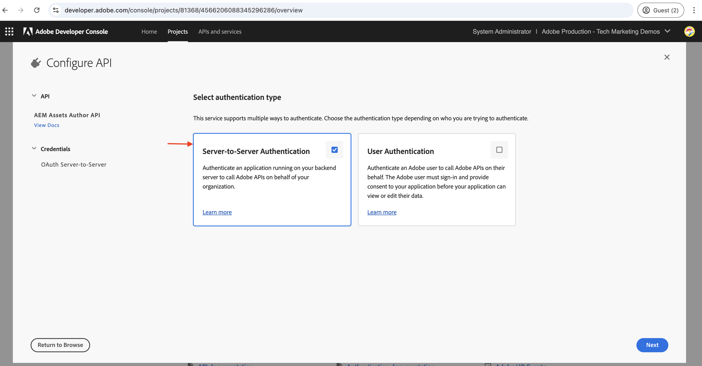

# Appeler les API AEM basées sur OpenAPI pour l’authentification de serveur à serveur{#invoke-openapi-based-aem-apis}

Découvrez comment configurer et appeler les API AEM basées sur OpenAPI sur AEM as a Cloud Service à partir d’applications personnalisées à l’aide de l’authentification _OAuth de serveur à serveur_.

L’authentification de serveur à serveur OAuth est idéale pour les services principaux nécessitant un accès à l’API sans interaction de l’utilisateur. Il utilise le type d’octroi OAuth 2.0 _client_credentials_ pour authentifier l’application cliente.

>[!AVAILABILITY]
>
>Les API AEM basées sur OpenAPI sont disponibles dans le cadre d’un programme d’accès anticipé. Si vous souhaitez y accéder, nous vous encourageons à envoyer un e-mail à l’adresse [aem-apis@adobe.com](mailto:aem-apis@adobe.com) avec une description de votre cas d’utilisation.

Dans ce tutoriel, vous apprendrez à :

- Activez l’accès aux API AEM basées sur OpenAPI pour votre environnement AEM as a Cloud Service.
- Créez et configurez un projet Adobe Developer Console (ADC) pour accéder aux API AEM à l’aide de l’authentification _OAuth de serveur à serveur_.
- Développez un exemple d’application NodeJS qui appelle l’API de création Assets pour récupérer les métadonnées d’une ressource spécifique.

Avant de commencer, veillez à consulter la section [ Accès aux API Adobe et concepts associés ](overview.md#accessing-adobe-apis-and-related-concepts).

## Conditions préalables

Les éléments suivants sont requis afin de terminer ce tutoriel :

- Environnement AEM as a Cloud Service modernisé avec les éléments suivants :
   - Version AEM `2024.10.18459.20241031T210302Z` ou ultérieure.
   - Nouveaux profils de produit de style (si l’environnement a été créé avant novembre 2024)

- L’exemple de projet [Sites WKND](https://github.com/adobe/aem-guides-wknd?#aem-wknd-sites-project) doit y être déployé.

- Accès à [Adobe Developer Console](https://developer.adobe.com/developer-console/docs/guides/getting-started/).

- Installez [Node.js](https://nodejs.org/fr/) sur votre ordinateur local pour exécuter l’exemple d’application NodeJS.

## Étapes de développement

Les étapes de développement générales sont les suivantes :

1. Modernisation de l’environnement AEM as a Cloud Service.
1. Activez l’accès aux API AEM.
1. Créez un projet Adobe Developer Console (ADC).
1. Configurer le projet ADC
   1. Ajouter les API AEM souhaitées
   1. Configurer son authentification
   1. Associer le profil de produit à la configuration d’authentification
1. Configuration de l’instance AEM pour activer la communication de projet ADC
1. Développement d’un exemple d’application NodeJS
1. Vérifier le flux de bout en bout

## Modernisation de l’environnement AEM as a Cloud Service

Commençons par moderniser l’environnement AEM as a Cloud Service. Cette étape n’est nécessaire que si l’environnement n’est pas modernisé.

La modernisation de l’environnement AEM as a Cloud Service est un processus en deux étapes :

- Mise à jour vers la dernière version d’AEM
- Ajoutez-y de nouveaux profils de produit.

### Mise à jour de l’instance AEM

Pour mettre à jour l’instance AEM, dans la section _Environnements_ d’Adobe [Cloud Manager](https://my.cloudmanager.adobe.com/), sélectionnez l’icône _points de suspension_ en regard du nom de l’environnement, puis sélectionnez l’option **Mettre à jour**.


Cliquez ensuite sur le bouton **Envoyer** et exécutez le pipeline full stack suggéré.


Dans mon cas, le nom du pipeline Fullstack est _Dev :: Fullstack-Deploy_ et le nom de l’environnement AEM est _wknd-program-dev_ il peut varier dans votre cas.

### Ajouter de nouveaux profils de produit

Pour ajouter de nouveaux profils de produit à l’instance AEM, dans la section _Environnements_ d’Adobe [Cloud Manager](https://my.cloudmanager.adobe.com/), sélectionnez l’icône _points de suspension_ en regard du nom de l’environnement, puis sélectionnez l’option **Ajouter des profils de produit**.


Vous pouvez examiner les profils de produit nouvellement ajoutés en cliquant sur l’icône _points de suspension_ à côté du nom de l’environnement et en sélectionnant **Gérer l’accès** > **Créer des profils**.

La fenêtre _Admin Console_ affiche les nouveaux profils de produit ajoutés.


Les étapes ci-dessus complètent la modernisation de l’environnement AEM as a Cloud Service.

## Activer l’accès aux API AEM

Les nouveaux profils de produit activent l’accès à l’API AEM basée sur OpenAPI dans Adobe Developer Console (ADC).

Les nouveaux profils de produit sont associés aux _Services_ qui représentent des groupes d’utilisateurs AEM avec des listes de contrôle d’accès (ACL) prédéfinies. Les _Services_ sont utilisés pour contrôler le niveau d’accès aux API d’AEM.

Vous pouvez également sélectionner ou désélectionner le _Services_ associé au profil de produit pour réduire ou augmenter le niveau d’accès.

Vérifiez l’association en cliquant sur l’icône _Afficher les détails_ à côté du nom du profil de produit.


Par défaut, le service **Utilisateurs de l’API AEM Assets** n’est associé à aucun profil de produit. Associons-le au profil de produit **Administrateurs AEM - auteur - Programme XXX - Environnement XXX** nouvellement ajouté. Après cette association, l’_API de création de ressources_ du projet ADC peut configurer l’authentification de serveur à serveur OAuth et associer le compte d’authentification au profil de produit.


Il est important de noter qu’avant la modernisation, dans l’instance d’auteur AEM, deux profils de produit étaient disponibles : **Administrateurs AEM-XXX** et **Utilisateurs AEM-XXX**. Il est également possible d’associer ces profils de produit existants aux nouveaux services.

## Créer un projet Adobe Developer Console (ADC)

Créez ensuite un projet ADC pour accéder aux API d’AEM.

1. Connectez-vous à [Adobe Developer Console](https://developer.adobe.com/console) à l’aide de votre Adobe ID.

   

1. Dans la section _Démarrage rapide_, cliquez sur le bouton **Créer un projet**.

   

1. Un projet portant le nom par défaut est créé.

   

1. Modifiez le nom du projet en cliquant sur le bouton **Modifier le projet** dans le coin supérieur droit. Indiquez un nom significatif et cliquez sur **Enregistrer**.

   

## Configurer le projet ADC

Configurez ensuite le projet ADC pour ajouter des API AEM, configurer son authentification et associer le profil de produit.

1. Pour ajouter des API AEM, cliquez sur le bouton **Ajouter une API**.

   

1. Dans la boîte de dialogue _Ajouter une API_, filtrez par _Experience Cloud_ et sélectionnez la vignette **API de création AEM Assets** puis cliquez sur **Suivant**.

   

1. Ensuite, dans la boîte de dialogue _Configurer l’API_, sélectionnez l’option d’authentification **Serveur à serveur** et cliquez sur **Suivant**. L’authentification de serveur à serveur est idéale pour les services principaux nécessitant un accès à l’API sans interaction de l’utilisateur.

   

1. Renommez les informations d’identification pour une identification plus facile (si nécessaire), puis cliquez sur **Suivant**. À des fins de démonstration, le nom par défaut est utilisé.

   

1. Sélectionnez le profil de produit **Administrateurs AEM - auteur - Programme XXX - Environnement XXX** et cliquez sur **Enregistrer**. Comme vous pouvez le constater, seul le profil de produit associé au service Utilisateurs de l’API AEM Assets peut être sélectionné.

   

   >[!CAUTION]
   >
   >    Notez que l’utilisateur du compte de service (ou compte technique) obtient l’accès COMPLET, car il est associé au profil de produit **Administrateurs AEM - XX - XX**.


1. Examinez l’API AEM et la configuration de l’authentification.

   

   

## Configurer l’instance AEM pour activer la communication de projet ADC

Pour permettre à l’ID client des informations d’identification OAuth de serveur à serveur du projet ADC de communiquer avec l’instance AEM, vous devez configurer l’instance AEM.

Pour ce faire, définissez la configuration dans le fichier `config.yaml` du projet AEM. Déployez ensuite le fichier `config.yaml` à l’aide du pipeline de configuration dans le Cloud Manager.

1. Dans AEM Project, recherchez ou créez le fichier `config.yaml` à partir du dossier `config` .

   

1. Ajoutez la configuration suivante au fichier `config.yaml`.

   ```yaml
   kind: "API"
   version: "1.0"
   metadata: 
       envTypes: ["dev", "stage", "prod"]
   data:
       allowedClientIDs:
           author:
           - "<ADC Project's OAuth Server-to-Server credential ClientID>"
   ```

   Remplacez `<ADC Project's OAuth Server-to-Server credential ClientID>` par l’ID client réel des informations d’identification OAuth de serveur à serveur du projet ADC. Le point d’entrée d’API utilisé dans ce tutoriel est disponible uniquement au niveau création, mais pour les autres API, la configuration yaml peut également avoir un nœud _publication_ ou _aperçu_.

   >[!CAUTION]
   >
   > À des fins de démonstration, le même ClientID est utilisé pour tous les environnements. Il est recommandé d’utiliser des ID client distincts par environnement (développement, évaluation, production) pour une meilleure sécurité et un meilleur contrôle.

1. Validez les modifications de configuration dans le référentiel Git et transmettez les modifications au référentiel distant.

1. Déployez les modifications ci-dessus à l’aide du pipeline de configuration dans le Cloud Manager. Notez que le fichier `config.yaml` peut également être installé dans un RDE à l’aide de l’outil de ligne de commande.

   

## Développement d’un exemple d’application NodeJS

Développons un exemple d’application NodeJS qui appelle l’API de création Assets.

Vous pouvez utiliser d’autres langages de programmation tels que Java, Python, etc., pour développer l’application.

À des fins de test, vous pouvez utiliser [Postman](https://www.postman.com/), [curl](https://curl.se/) ou tout autre client REST pour appeler les API AEM.

### Vérifier l’API

Avant de développer l’application, examinons [diffuser le point d’entrée des métadonnées de la ressource spécifiée](https://developer.adobe.com/experience-cloud/experience-manager-apis/api/experimental/assets/author/#operation/getAssetMetadata) à partir de l’API de création _Assets_. La syntaxe API est la suivante :

```http
GET https://{bucket}.adobeaemcloud.com/adobe/assets/{assetId}/metadata
```

Pour récupérer les métadonnées d’une ressource spécifique, vous avez besoin des valeurs `bucket` et `assetId`. Le `bucket` est le nom de l’instance AEM sans le nom de domaine Adobe (.adobeaemcloud.com), par exemple `author-p63947-e1420428`.

L’`assetId` est l’UUID JCR de la ressource avec le préfixe `urn:aaid:aem:`, par exemple `urn:aaid:aem:a200faf1-6d12-4abc-bc16-1b9a21f870da`. Il existe plusieurs façons d’obtenir le `assetId` :

- Ajoutez l’extension de `.json` Chemin d’accès à la ressource AEM pour obtenir les métadonnées de la ressource. Par exemple, `https://author-p63947-e1420429.adobeaemcloud.com/content/dam/wknd-shared/en/adventures/cycling-southern-utah/adobestock-221043703.jpg.json` et recherchez la propriété `jcr:uuid` .

- Vous pouvez également obtenir le `assetId` en examinant la ressource dans l’inspecteur d’éléments du navigateur. Recherchez l’attribut `data-id="urn:aaid:aem:..."` .

  

### Appeler l’API à l’aide du navigateur

Avant de développer l’application, appelons l’API à l’aide de la fonctionnalité **Essayer** de la documentation de l’API [](https://developer.adobe.com/experience-cloud/experience-manager-apis/api/experimental/assets/author/#operation/getAssetMetadata).

1. Ouvrez la documentation de l’API de création [Assets](https://developer.adobe.com/experience-cloud/experience-manager-apis/api/experimental/assets/author) dans le navigateur.

1. Développez la section _Métadonnées_ et cliquez sur l’option **Diffuse les métadonnées de la ressource spécifiée**.

1. Dans le volet de droite, cliquez sur le bouton **Essayer**.
   

1. Saisissez les valeurs suivantes :
   1. La valeur `bucket` est le nom de l’instance AEM sans le nom de domaine Adobe (.adobeaemcloud.com), par exemple `author-p63947-e1420428`.

   1. Les valeurs de `Bearer Token` et de `X-Api-Key` de la section **Sécurité** sont obtenues à partir des informations d&#39;identification OAuth de serveur à serveur du projet ADC. Cliquez sur **Générer un jeton d’accès** pour obtenir la valeur `Bearer Token` et utiliser la valeur `ClientID` comme `X-Api-Key`.
      

   1. La section **Paramètres** relative `assetId` valeur est l’identifiant unique de la ressource dans AEM. La `X-Adobe-Accept-Experimental` est définie sur 1.

      

1. Cliquez sur **Envoyer** pour appeler l’API.

1. Consultez l’onglet **Réponse** pour afficher la réponse de l’API.

   

Les étapes ci-dessus confirment la modernisation de l’environnement AEM as a Cloud Service en permettant l’accès aux API AEM. Elle confirme également la réussite de la configuration du projet ADC et de la communication des informations d’identification de serveur à serveur ClientID OAuth avec l’instance d’auteur AEM.

### Exemple d’application NodeJS

Développons un exemple d’application NodeJS.

Pour développer l’application, vous pouvez utiliser les instructions _Run-the-sample-application_ ou _Step-by-development_.


>[!BEGINTABS]

>[!TAB Exécuter-l’-exemple-d’application]

1. Téléchargez l’exemple de fichier zip de l’application [demo-nodejs-app-to-invoke-aem-openapi](assets/demo-nodejs-app-to-invoke-aem-openapi.zip) et extrayez-le.

1. Accédez au dossier extrait et installez les dépendances.

   ```bash
   $ npm install
   ```

1. Remplacez les espaces réservés dans le fichier `.env` par les valeurs réelles des informations d’identification OAuth de serveur à serveur du projet ADC.

1. Remplacez les `<BUCKETNAME>` et les `<ASSETID>` du fichier `src/index.js` par les valeurs réelles.

1. Exécutez l’application NodeJS.

   ```bash
   $ node src/index.js
   ```

>[!TAB Développement détaillé]

1. Créez un projet NodeJS.

   ```bash
   $ mkdir demo-nodejs-app-to-invoke-aem-openapi
   $ cd demo-nodejs-app-to-invoke-aem-openapi
   $ npm init -y
   ```

1. Installez la bibliothèque _fetch_ et _dotenv_ pour effectuer respectivement des requêtes HTTP et lire les variables d’environnement.

   ```bash
   $ npm install node-fetch
   $ npm install dotenv
   ```

1. Ouvrez le projet dans votre éditeur de code préféré et mettez à jour le fichier `package.json` pour ajouter le `type` à `module`.

   ```json
   {
       ...
       "version": "1.0.0",
       "type": "module",
       "main": "index.js",
       ...
   }
   ```

1. Créez `.env` fichier et ajoutez la configuration suivante. Remplacez les espaces réservés par les valeurs réelles des informations d’identification de serveur à serveur OAuth du projet ADC.

   ```properties
   CLIENT_ID=<ADC Project OAuth Server-to-Server credential ClientID>
   CLIENT_SECRET=<ADC Project OAuth Server-to-Server credential Client Secret>
   SCOPES=<ADC Project OAuth Server-to-Server credential Scopes>
   ```

1. Créez `src/index.js` fichier et ajoutez le code suivant, puis remplacez les `<BUCKETNAME>` et `<ASSETID>` par les valeurs réelles.

   ```javascript
   // Import the dotenv configuration to load environment variables from the .env file
   import "dotenv/config";
   
   // Import the fetch function to make HTTP requests
   import fetch from "node-fetch";
   
   // REPLACE THE FOLLOWING VALUES WITH YOUR OWN
   const bucket = "<BUCKETNAME>"; // Bucket name is the AEM instance name (e.g. author-p63947-e1420428)
   const assetId = "<ASSETID>"; // Asset ID is the unique identifier for the asset in AEM (e.g. urn:aaid:aem:a200faf1-6d12-4abc-bc16-1b9a21f870da). You can get it by inspecting the asset in browser's element inspector, look for data-id="urn:aaid:aem:..."
   
   // Load environment variables for authentication
   const clientId = process.env.CLIENT_ID; // Adobe IMS client ID
   const clientSecret = process.env.CLIENT_SECRET; // Adobe IMS client secret
   const scopes = process.env.SCOPES; // Scope for the API access
   
   // Adobe IMS endpoint for obtaining an access token
   const adobeIMSV3TokenEndpointURL =
   "https://ims-na1.adobelogin.com/ims/token/v3";
   
   // Function to obtain an access token from Adobe IMS
   const getAccessToken = async () => {
       console.log("Getting access token from IMS"); // Log process initiation
       //console.log("Client ID: " + clientId); // Display client ID for debugging purposes
   
       // Configure the HTTP POST request to fetch the access token
       const options = {
           method: "POST",
           headers: {
           "Content-Type": "application/x-www-form-urlencoded", // Specify form data content type
           },
           // Send client ID, client secret, and scopes as the request body
           body: `grant_type=client_credentials&client_id=${clientId}&client_secret=${clientSecret}&scope=${scopes}`,
       };
   
       // Make the HTTP request to fetch the access token
       const response = await fetch(adobeIMSV3TokenEndpointURL, options);
   
       //console.log("Response status: " + response.status); // Log the HTTP status for debugging
   
       const responseJSON = await response.json(); // Parse the JSON response
   
       console.log("Access token received"); // Log success message
   
       // Return the access token
       return responseJSON.access_token;
   };
   
   // Function to retrieve metadata for a specific asset from AEM
   const getAssetMetadat = async () => {
       // Fetch the access token using the getAccessToken function
       const accessToken = await getAccessToken();
   
       console.log("Getting asset metadata from AEM");
   
       // Invoke the Assets Author API to retrieve metadata for a specific asset
       const resp = await fetch(
           `https://${bucket}.adobeaemcloud.com/adobe/assets/${assetId}/metadata`, // Construct the URL with bucket and asset ID
           {
           method: "GET",
           headers: {
               "If-None-Match": "string", // Header to handle caching (not critical for this tutorial)
               "X-Adobe-Accept-Experimental": "1", // Header to enable experimental Adobe API features
               Authorization: "Bearer " + accessToken, // Provide the access token for authorization
               "X-Api-Key": clientId, // Include the OAuth S2S ClientId for identification
           },
           }
       );
   
       const data = await resp.json(); // Parse the JSON response
   
       console.log("Asset metadata received"); // Log success message
       console.log(data); // Display the retrieved metadata
   };
   
   // Call the getAssets function to start the process
   getAssetMetadat();
   ```

1. Exécutez l’application NodeJS.

   ```bash
   $ node src/index.js
   ```

>[!ENDTABS]

### Réponse de l’API

Une fois l’exécution réussie, la réponse de l’API s’affiche dans la console. La réponse contient les métadonnées de la ressource spécifiée.

```json
{
  "assetId": "urn:aaid:aem:9c09ff70-9ee8-4b14-a5fa-ec37baa0d1b3",
  "assetMetadata": {    
    ...
    "dc:title": "A Young Mountain Biking Couple Takes A Minute To Take In The Scenery",
    "xmp:CreatorTool": "Adobe Photoshop Lightroom Classic 7.5 (Macintosh)",
    ...
  },
  "repositoryMetadata": {
    ...
    "repo:name": "adobestock-221043703.jpg",
    "repo:path": "/content/dam/wknd-shared/en/adventures/cycling-southern-utah/adobestock-221043703.jpg",
    "repo:state": "ACTIVE",
    ...
  }
}
```

Félicitations. Vous avez correctement appelé les API AEM basées sur OpenAPI à partir de votre application personnalisée à l’aide de l’authentification de serveur à serveur OAuth.

### Vérifier le code de l’application

Les principales légendes de l’exemple de code d’application NodeJS sont les suivantes :

1. **Authentification IMS** : récupère un jeton d’accès à l’aide des informations d’identification OAuth de serveur à serveur configurées dans le projet ADC.

   ```javascript
   // Function to obtain an access token from Adobe IMS
   const getAccessToken = async () => {
   
       // Configure the HTTP POST request to fetch the access token
       const options = {
           method: "POST",
           headers: {
           "Content-Type": "application/x-www-form-urlencoded", // Specify form data content type
           },
           // Send client ID, client secret, and scopes as the request body
           body: `grant_type=client_credentials&client_id=${clientId}&client_secret=${clientSecret}&scope=${scopes}`,
       };
   
       // Make the HTTP request to fetch the access token from Adobe IMS token endpoint https://ims-na1.adobelogin.com/ims/token/v3
       const response = await fetch(adobeIMSV3TokenEndpointURL, options);
   
       const responseJSON = await response.json(); // Parse the JSON response
   
       // Return the access token
       return responseJSON.access_token;
   };
   ...
   ```

1. **Appel de l’API** : appelle l’API de création Assets pour récupérer les métadonnées d’une ressource spécifique en fournissant le jeton d’accès pour l’autorisation.

   ```javascript
   // Function to retrieve metadata for a specific asset from AEM
   const getAssetMetadat = async () => {
       // Fetch the access token using the getAccessToken function
       const accessToken = await getAccessToken();
   
       console.log("Getting asset metadata from AEM");
   
       // Invoke the Assets Author API to retrieve metadata for a specific asset
       const resp = await fetch(
           `https://${bucket}.adobeaemcloud.com/adobe/assets/${assetId}/metadata`, // Construct the URL with bucket and asset ID
           {
           method: "GET",
           headers: {
               "If-None-Match": "string", // Header to handle caching (not critical for this tutorial)
               "X-Adobe-Accept-Experimental": "1", // Header to enable experimental Adobe API features
               Authorization: "Bearer " + accessToken, // Provide the access token for authorization
               "X-Api-Key": clientId, // Include the OAuth S2S ClientId for identification
           },
           }
       );
   
       const data = await resp.json(); // Parse the JSON response
   
       console.log("Asset metadata received"); // Log success message
       console.log(data); // Display the retrieved metadata
   };
   ...
   ```

## Résumé

Dans ce tutoriel, vous avez appris à appeler des API AEM basées sur OpenAPI à partir d’applications personnalisées. Vous avez activé l’accès aux API AEM, créé et configuré un projet Adobe Developer Console (ADC).
Dans le projet ADC, vous avez ajouté les API AEM, configuré son type d’authentification et associé le profil de produit. Vous avez également configuré l’instance AEM pour activer la communication de projet ADC et développé un exemple d’application NodeJS qui appelle l’API de création Assets.
