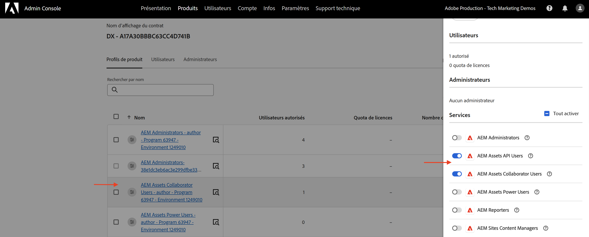
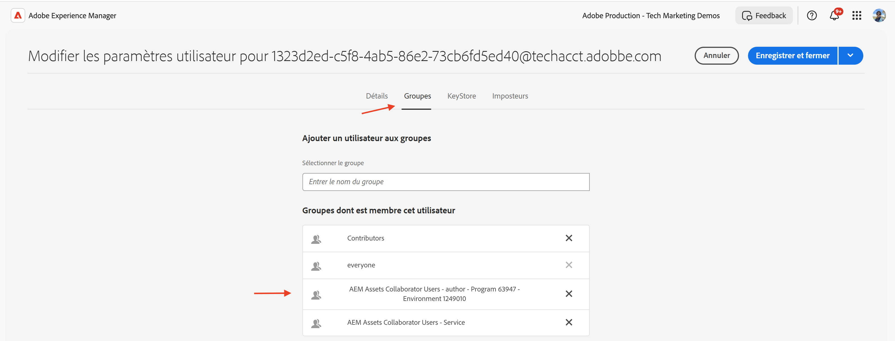
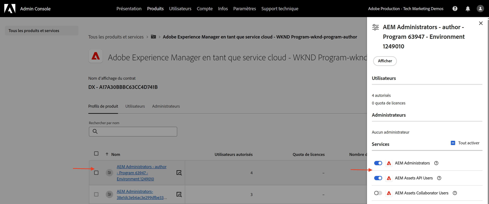

# Gestion des informations d’identification d’API et des profils de produit

Découvrez comment gérer les _informations d’identification et les profils de produit_ pour les API AEM basées sur OpenAPI.

Dans ce tutoriel, vous apprendrez à ajouter ou à supprimer les éléments suivants :

- _Informations d’identification_ : fournissez une authentification pour une API AEM.
- _Profils de produit_ : fournissez des autorisations (ou permissions) pour les informations d’identification afin d’accéder aux ressources AEM.

## Contexte

Lorsque vous utilisez une API AEM, vous devez définir les _informations d’identification_ et le _Profil de produit_ dans le projet Adobe Developer Console (ou ADC). Dans la capture d’écran suivante, vous pouvez voir les _Informations d’identification_ et le _Profil de produit_ pour une API de création AEM Assets :

Les _informations d’identification_ fournissent le mécanisme d’authentification pour l’API. Le _Profil de produit_ accorde des _autorisations (ou permissions)_ aux informations d’identification, ce qui permet d’accéder aux ressources AEM. La requête d’API peut être effectuée au nom d’une application ou d’une personne.

Un profil de produit est associé à un ou plusieurs _services_. Dans AEM as a Cloud Service, un _Service_ représente les groupes d’utilisateurs et d’utilisatrices dotés de listes de contrôle d’accès (ACL) prédéfinies pour les nœuds du référentiel, ce qui permet une gestion des autorisations granulaire.

Une fois l’appel de l’API réussi, un profil utilisateur représentant les informations d’identification du projet ADC est créé dans le service de création AEM, avec les groupes d’utilisateurs et d’utilisatrices correspondant à la configuration du profil de produit et des services.

Dans le scénario ci-dessus, le profil utilisateur `1323d2...` est créé dans le service de création AEM et est membre des groupes d’utilisateurs et d’utilisatrices `AEM Assets Collaborator Users - Service` et `AEM Assets Collaborator Users - author - Program XXX - Environment XXX`.

## Ajouter ou supprimer des informations d’identification

Les API AEM prennent en charge les types d’informations d’identification suivants pour l’authentification :

1. **OAuth serveur à serveur** : option conçue pour les interactions de machine à machine.
1. **Application Web OAuth** : option conçue pour les interactions pilotées par l’utilisateur ou l’utilisatrice avec un serveur principal dans votre application cliente.
1. **Application d’une seule page OAuth** : option conçue pour les interactions pilotées par l’utilisateur ou l’utilisatrice sans serveur principal dans votre application cliente.

Vous pouvez prendre en charge divers cas d’utilisation à l’aide de différents types d’informations d’identification.

Toutes les informations d’identification sont gérées dans votre projet ADC.

>[!BEGINTABS]

>[!TAB Ajouter des informations d’identification]

Pour ajouter des informations d’identification pour une API AEM, accédez à la section **API** de votre projet ADC et cliquez sur **Connecter d’autres informations d’identification**. Suivez ensuite les instructions correspondant à votre type d’informations d’identification.

>[!TAB Supprimer des informations d’identification]

Pour supprimer des informations d’identification d’API AEM, sélectionnez-les dans la section **API** de votre projet ADC, puis cliquez sur **Supprimer des informations d’identification**.

>[!ENDTABS]

## Ajouter ou supprimer des profils de produit

Le _Profil de produit_ fournit les _autorisations (ou permissions)_ aux informations d’identification pour accéder aux ressources AEM. Les autorisations fournies par le _Profil de produit_ sont basées sur les _Services_ associés au _Profil de produit_. La plupart des _Services_ fournissent l’autorisation _LIRE_ aux ressources AEM, via les groupes d’utilisateurs et d’utilisatrices de l’instance AEM qui portent le même nom que le _Service_.

Il arrive que les informations d’identification (ou l’utilisateur ou l’utilisatrice du compte technique) aient besoin d’autorisations supplémentaires, telles que _Créer, Mettre à jour, Supprimer_ (CUD) pour les ressources AEM. Dans ce cas, vous devez ajouter un nouveau _Profil produit_ associé aux _Services_ qui fournissent les autorisations requises.

Par exemple, lorsque l’appel de l’API de création AEM Assets reçoit une [erreur 403 pour les requêtes autres que GET](../use-cases/invoke-api-using-oauth-s2s.md#403-error-for-non-get-requests), vous pouvez ajouter le _Profil de produit_ **Administrateurs et administratrices AEM - Création - Programme XXX - Environnement XXX** pour résoudre le problème.

>[!CAUTION]
>
>Le service **Administrateurs et administratrices AEM** fournit un accès administratif _COMPLET_ à Experience Manager. Vous pouvez également mettre à jour les [autorisations des services](./services-user-group-permission-management.md) pour qu’elles ne fournissent que les autorisations requises.

>[!BEGINTABS]

>[!TAB Ajouter des profils de produit]

Pour ajouter des profils de produit pour une API AEM, cliquez sur **Modifier les profils de produit** dans la section **API** du projet ADC, sélectionnez le profil de produit souhaité dans la boîte de dialogue **Configurer l’API** et enregistrez vos modifications.

Sélectionnez le profil de produit souhaité (par exemple, **Administrateurs et administratrices AEM - Création - Programme XXX - Environnement XXX**) associé aux services requis, puis enregistrez vos modifications.

Notez que le profil de produit **Administrateurs et administratrices AEM - Création - Programme XXX - Environnement XXX** est associé au service **Administrateurs et administratrices AEM** et au service **Utilisateurs et utilisatrices de l’API AEM Assets**. Sans ce dernier, le profil de produit n’apparaîtra pas dans la liste des profils de produit disponibles.

La requête **PATCH** de mise à jour des métadonnées de la ressource devrait maintenant fonctionner sans problème.

>[!TAB Supprimer des profils de produit]

Pour supprimer les profils de produit d’une API AEM, cliquez sur **Modifier les profils de produit** dans la section **API** du projet ADC, désélectionnez le profil de produit souhaité dans la boîte de dialogue **Configurer l’API** et enregistrez vos modifications.

>[!ENDTABS]

## Résumé

Vous avez appris à modifier le mécanisme d’authentification et les autorisations pour les API AEM à l’aide des _informations d’identification et du profil de produit_ dans le projet Adobe Developer Console (ADC).
