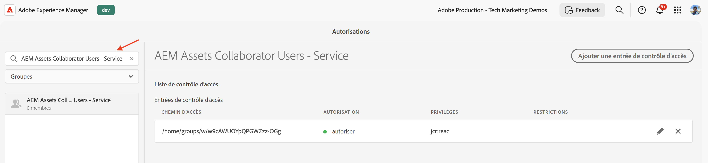

# Gestion des autorisations des groupes d’utilisateurs et d’utilisatrices Profil de produit et Services

Découvrez comment gérer les autorisations des groupes d’utilisateurs et d’utilisatrices Profil de produit et Services dans AEM as a Cloud Service.

Dans ce tutoriel, vous apprenez ce qui suit :

- Profil de produit et son association aux Services.
- Mise à jour des autorisations du groupe d’utilisateurs et d’utilisatrices Services.

## Contexte

Lorsque vous utilisez une API AEM, vous devez affecter le _profil de produit_ aux _informations d’identification_ dans le projet Adobe Developer Console (ou ADC). Le _Profil de produit_ (et le Service associé) fournit les _autorisations ou permissions_ aux informations d’identification pour accéder aux ressources AEM. Dans la capture d’écran suivante, vous pouvez voir les _Informations d’identification_ et _Profil de produit_ pour une API de création AEM Assets :


Un profil de produit est associé à un ou plusieurs _Services_. Dans AEM as a Cloud Service, un _Service_ représente les groupes d’utilisateurs et d’utilisatrices dotés de listes de contrôle d’accès (ACL) prédéfinies pour les nœuds du référentiel, ce qui permet une gestion des autorisations granulaire.


Une fois l’appel de l’API réussi, un profil utilisateur représentant les informations d’identification du projet ADC est créé dans le service de création AEM, avec les groupes d’utilisateurs et d’utilisatrices correspondant à la configuration du profil de produit et des services.


Dans le scénario ci-dessus, le profil utilisateur `1323d2...` est créé dans le service de création AEM et est membre des groupes d’utilisateurs et d’utilisatrices `AEM Assets Collaborator Users - Service` et `AEM Assets Collaborator Users - author - Program XXX - Environment XXX`.

## Mettre à jour les autorisations du groupe d’utilisateurs et d’utilisatrices Services

La plupart des _Services_ fournissent l’autorisation _LIRE_ aux ressources AEM, via les groupes d’utilisateurs et d’utilisatrices de l’instance AEM qui portent le même nom que le _Service_.

Il arrive que les informations d’identification (ou l’utilisateur ou l’utilisatrice du compte technique) aient besoin d’autorisations supplémentaires, telles que _Créer, Mettre à jour, Supprimer_ (CUD) des ressources AEM. Dans ce cas, vous pouvez mettre à jour les autorisations des groupes d’utilisateurs et d’utilisatrices _Services_ dans l’instance AEM.

Par exemple, lorsque l’appel d’API de création d’AEM Assets reçoit une [erreur 403 pour les requêtes autres que GET](../use-cases/invoke-api-using-oauth-s2s.md#403-error-for-non-get-requests), vous pouvez mettre à jour les autorisations du groupe d’utilisateurs et d’utilisatrices _Utilisateurs et utilisatrices collaborateurs AEM Assets - Service_ dans l’instance AEM.

À l’aide de l’interface d’utilisation des autorisations ou du script [Sling Repository Initialization](https://sling.apache.org/documentation/bundles/repository-initialization.html), vous pouvez mettre à jour les autorisations des groupes d’utilisateurs et d’utilisatrices prêts à l’emploi dans l’instance AEM.

### Mettre à jour les autorisations à l’aide de l’interface d’utilisation des autorisations

Pour mettre à jour les autorisations du groupe d’utilisateurs et d’utilisatrices de services (par exemple, `AEM Assets Collaborator Users - Service`) à l’aide de l’interface d’utilisation des autorisations, procédez comme suit :

- Accédez à **Outils** > **Sécurité** > **Autorisations** dans l’instance AEM.

- Recherchez le groupe d’utilisateurs et d’utilisatrices des services (par exemple, `AEM Assets Collaborator Users - Service`).

  

- Cliquez sur **Ajouter une entrée de contrôle d’accès** pour ajouter une nouvelle entrée de contrôle d’accès (ACE) pour le groupe d’utilisateurs et d’utilisatrices.

  

### Mettre à jour les autorisations à l’aide du script d’initialisation du référentiel

Pour mettre à jour les autorisations du groupe d’utilisateurs et d’utilisatrices des services (par exemple, `AEM Assets Collaborator Users - Service`) à l’aide du script d’initialisation du référentiel, procédez comme suit :

- Ouvrez le projet AEM dans votre IDE favori.

- Accédez au module `ui.config`.

- Créez un fichier nommé `org.apache.sling.jcr.repoinit.RepositoryInitializer-services-group-acl-update.cfg.json` sous `ui.config/src/main/content/jcr_root/apps/<PROJECT-NAME>/osgiconfig/config.author`, avec le contenu suivant :

  ```json
  {
      "scripts": [
          "set ACL for \"AEM Assets Collaborator Users - Service\" (ACLOptions=ignoreMissingPrincipal)",
          "    allow jcr:read,jcr:versionManagement,crx:replicate,rep:write on /content/dam",
          "end"
      ]
  }
  ```

- Validez et envoyez les modifications au référentiel.

- Déployez les modifications dans l’instance AEM à l’aide du [pipeline full-stack de Cloud Manager](https://experienceleague.adobe.com/fr/docs/experience-manager-cloud-service/content/implementing/using-cloud-manager/cicd-pipelines/introduction-ci-cd-pipelines#full-stack-pipeline).

- Vous pouvez également vérifier les autorisations du groupe d’utilisateurs et d’utilisatrices à l’aide de la vue **Autorisations**. Accédez à **Outils** > **Sécurité** > **Autorisations** dans l’instance AEM.

  

### Vérifier les autorisations

Après avoir mis à jour les autorisations à l’aide de l’une des méthodes ci-dessus, la requête PATCH de mise à jour des métadonnées de la ressource doit maintenant fonctionner sans problème.


## Résumé

Vous avez appris à gérer les autorisations pour les groupes d’utilisateurs et d’utilisatrices Profil de produit et Services dans AEM as a Cloud Service. Vous pouvez mettre à jour les autorisations des groupes d’utilisateurs et d’utilisatrices des services dans l’instance AEM à l’aide de l’interface d’utilisation des autorisations ou du script d’initialisation du référentiel.
