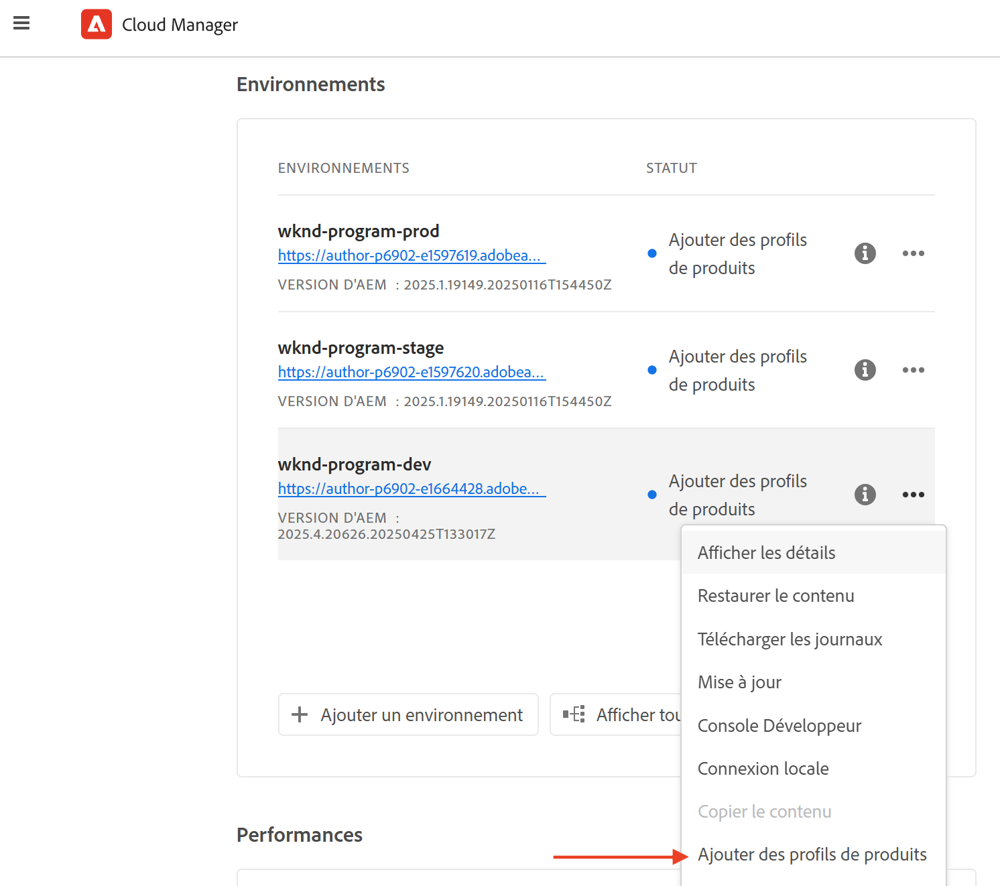
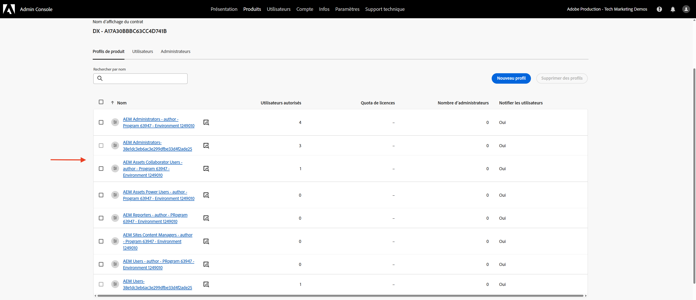
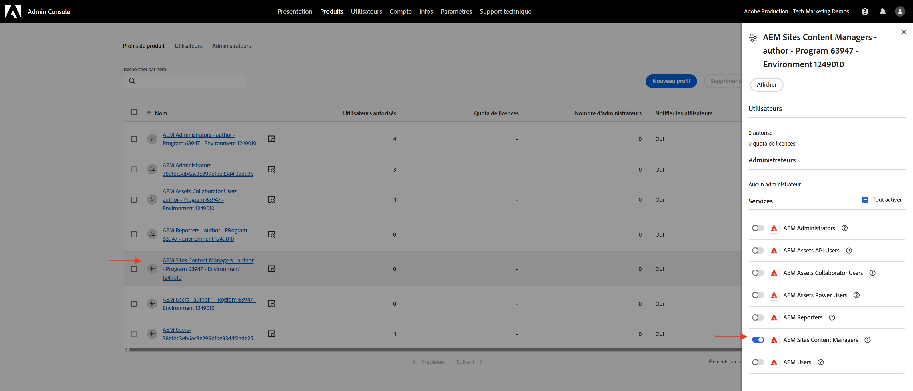
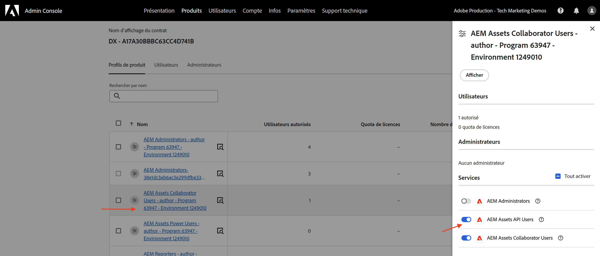
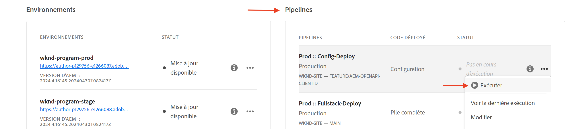
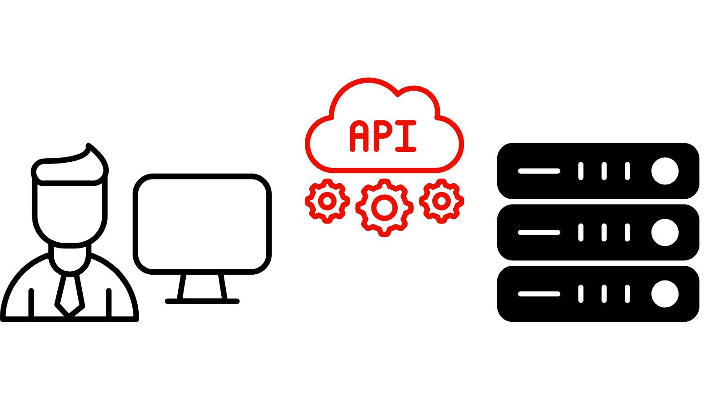

# Configurer les API AEM basées sur OpenAPI

Découvrez comment configurer votre environnement AEM as a Cloud Service pour activer l’accès aux API AEM basées sur OpenAPI.

>[!AVAILABILITY]
>
>Les API AEM basées sur OpenAPI sont disponibles dans le cadre d’un programme d’accès anticipé. Si vous souhaitez y accéder, nous vous encourageons à envoyer un e-mail à l’adresse [aem-apis@adobe.com](mailto:aem-apis@adobe.com) avec une description de votre cas d’utilisation.

Le processus de configuration de haut niveau comprend les étapes suivantes :

1. Modernisation de l’environnement AEM as a Cloud Service.
1. Activez l’accès aux API AEM.
1. Créez un projet Adobe Developer Console (ADC).
1. Configurer le projet ADC
1. Configurez l’instance AEM pour activer la communication de projet ADC.

## Modernisation de l’environnement AEM as a Cloud Service

La modernisation de l’environnement AEM as a Cloud Service est une activité unique par environnement qui comprend les étapes suivantes :

- Mise à jour de la version **2024.10.18459.20241031T210302Z d’AEM ou ultérieure**.
- Ajoutez-y de nouveaux profils de produit, si l’environnement a été créé avant la version 2024.10.18459.20241031T210302Z.

### Mise à jour de l’instance AEM

Pour mettre à jour l’instance AEM, dans la section _Environnements_ d’Adobe [Cloud Manager](https://my.cloudmanager.adobe.com/), sélectionnez l’icône _points de suspension_ en regard du nom de l’environnement, puis sélectionnez l’option **Mettre à jour**.


Cliquez ensuite sur le bouton **Envoyer** et exécutez le pipeline full stack _suggéré_.


Dans mon cas, le pipeline Fullstack est nommé **Dev :: Fullstack-Deploy** et l’environnement AEM est appelé **wknd-program-dev**. Vos noms peuvent être différents.

### Ajouter de nouveaux profils de produit

Pour ajouter de nouveaux profils de produit à l’instance AEM, dans la section _Environnements_ d’Adobe [Cloud Manager](https://my.cloudmanager.adobe.com/), sélectionnez l’icône _points de suspension_ en regard du nom de l’environnement, puis sélectionnez l’option **Ajouter des profils de produit**.



Vous pouvez examiner les profils de produit nouvellement ajoutés en cliquant sur l’icône _points de suspension_ à côté du nom de l’environnement et en sélectionnant **Gérer l’accès** > **Créer des profils**.

La fenêtre _Admin Console_ affiche les nouveaux profils de produit ajoutés.



Les étapes ci-dessus complètent la modernisation de l’environnement AEM as a Cloud Service.

## Activer l’accès aux API AEM

La présence du _nouveaux profils de produit_ permet d’activer l’accès à l’API AEM basée sur OpenAPI dans Adobe Developer Console (ADC). Rappelez-vous que [Adobe Developer Console (ADC)](./overview.md#accessing-adobe-apis-and-related-concepts) est le hub de développement pour accéder aux API, aux SDK, aux événements en temps réel, aux fonctions sans serveur d’Adobe, etc.

Les profils de produit nouvellement ajoutés sont associés aux _Services_ qui représentent _les groupes d’utilisateurs AEM avec des listes de contrôle d’accès (ACL)_ prédéfinies.
Les _Services_ sont utilisés pour contrôler le niveau d’accès aux API d’AEM.

Vous pouvez également sélectionner ou désélectionner le _Services_ associé au profil de produit pour réduire ou augmenter le niveau d’accès.

Vérifiez l’association en cliquant sur l’icône _Afficher les détails_ à côté du nom du profil de produit.



Par défaut, le service **Utilisateurs de l’API AEM Assets** n’est associé à aucun profil de produit. Associons-le au profil de produit **Utilisateurs AEM Assets Collaborator - auteur - Programme XXX - Environnement XXX** nouvellement ajouté. Après cette association, l’_API de création de ressources_ du projet ADC peut configurer l’authentification souhaitée et associer le compte d’authentification au profil de produit.



## Créer un projet Adobe Developer Console (ADC)

Le projet ADC permet d’ajouter les API souhaitées, de configurer son authentification et d’associer le compte d’authentification au profil de produit.

Pour créer un projet ADC, procédez comme suit :

1. Connectez-vous à [Adobe Developer Console](https://developer.adobe.com/console) à l’aide de votre Adobe ID.

   

1. Dans la section _Démarrage rapide_, cliquez sur le bouton **Créer un projet**.

   

1. Un projet portant le nom par défaut est créé.

   

1. Modifiez le nom du projet en cliquant sur le bouton **Modifier le projet** dans le coin supérieur droit. Indiquez un nom significatif et cliquez sur **Enregistrer**.

   

## Configurer le projet ADC

Après avoir créé le projet ADC, vous devez ajouter les API AEM souhaitées, configurer son authentification et associer le compte d’authentification au profil de produit.

1. Pour ajouter des API AEM, cliquez sur le bouton **Ajouter une API**.

   

1. Dans la boîte de dialogue _Ajouter une API_, filtrez par _Experience Cloud_ et sélectionnez l’API AEM souhaitée. Par exemple, dans ce cas, l’API _Asset Author_ est sélectionnée.

   

1. Ensuite, dans la boîte de dialogue _Configurer l’API_, sélectionnez l’option d’authentification souhaitée. Par exemple, dans ce cas, l’option d’authentification **serveur à serveur** est sélectionnée.

   

   L’authentification de serveur à serveur est idéale pour les services principaux nécessitant un accès à l’API sans interaction de l’utilisateur. Les options d’authentification Application web et Application d’une seule page sont adaptées aux applications nécessitant un accès API pour le compte des utilisateurs. Consultez [ Différence entre les informations d’identification OAuth de serveur à serveur et OAuth Web App/Application d’une seule page ](./overview.md#difference-between-oauth-server-to-server-and-oauth-web-app-single-page-app-credentials) pour plus d’informations.

1. Si nécessaire, vous pouvez renommer l’API pour une identification plus facile. À des fins de démonstration, le nom par défaut est utilisé.

   

1. Dans ce cas, la méthode d’authentification est **OAuth serveur à serveur** vous devez donc associer le compte d’authentification au profil de produit. Sélectionnez le profil de produit **Utilisateurs AEM Assets Collaborator - auteur - Programme XXX - Environnement XXX** et cliquez sur **Enregistrer**.

   

1. Examinez l’API AEM et la configuration de l’authentification.

   

   

Si vous choisissez la méthode d’authentification **OAuth Web App** ou **OAuth Single Page App**, l’association de profil de produit n’est pas demandée, mais l’URI de redirection de l’application est requise. L’URI de redirection d’application est utilisé pour rediriger l’utilisateur vers l’application après authentification avec un code d’autorisation. Les tutoriels de cas d’utilisation pertinents décrivent ces configurations spécifiques à l’authentification.

## Configuration de l’instance AEM pour activer la communication de projet ADC

Pour permettre à l’ID client du projet ADC de communiquer avec l’instance AEM, vous devez configurer l’instance AEM.

Pour ce faire, définissez la configuration de l’API dans le fichier `config.yaml` de .
le projet AEM et son déploiement à l’aide du pipeline de configuration dans Cloud Manager.

1. Dans AEM Project, recherchez ou créez le fichier `config.yaml` à partir du dossier `config` .

   

1. Ajoutez la configuration suivante au fichier `config.yaml`.

   ```yaml
   kind: "API"
   version: "1.0"
   metadata: 
       envTypes: ["dev", "stage", "prod"]
   data:
       allowedClientIDs:
           author:
           - "<ADC Project's Credentials ClientID>"
   ```

   Remplacez `<ADC Project's Credentials ClientID>` par l’ID client réel de la valeur des informations d’identification du projet ADC. Le point d’entrée d’API utilisé dans ce tutoriel est disponible uniquement au niveau création, mais pour les autres API, la configuration yaml peut également avoir un nœud _publication_ ou _aperçu_.

   >[!CAUTION]
   >
   > À des fins de démonstration, le même ClientID est utilisé pour tous les environnements. Il est recommandé d’utiliser des ID client distincts par environnement (développement, évaluation, production) pour une meilleure sécurité et un meilleur contrôle.

1. Validez les modifications de configuration et envoyez les modifications au référentiel Git distant auquel le pipeline Cloud Manager est connecté.

1. Déployez les modifications ci-dessus à l’aide du pipeline de configuration dans le Cloud Manager. Notez que le fichier `config.yaml` peut également être installé dans un RDE à l’aide de l’outil de ligne de commande.

   

## Étapes suivantes

Une fois l’instance AEM configurée pour activer la communication de projet ADC, vous pouvez commencer à utiliser les API AEM basées sur OpenAPI. Découvrez comment utiliser les API AEM basées sur OpenAPI à l’aide de différentes méthodes d’authentification OAuth :

<!-- CARDS
{target = _self}

* ./use-cases/invoke-api-using-oauth-s2s.md
  {title = Invoke API using Server-to-Server authentication}
  {description = Learn how to invoke OpenAPI-based AEM APIs from a custom NodeJS application using OAuth Server-to-Server authentication.}
  {image = ./assets/s2s/OAuth-S2S.png}
* ./use-cases/invoke-api-using-oauth-web-app.md
  {title = Invoke API using Web App authentication}
  {description = Learn how to invoke OpenAPI-based AEM APIs from a custom web application using OAuth Web App authentication.}
  {image = ./assets/web-app/OAuth-WebApp.png}  
-->
<!-- START CARDS HTML - DO NOT MODIFY BY HAND -->
<div class="columns">
    <div class="column is-half-tablet is-half-desktop is-one-third-widescreen" aria-label="Invoke API using Server-to-Server authentication">
        <div class="card" style="height: 100%; display: flex; flex-direction: column; height: 100%;">
            <div class="card-image">
                <figure class="image x-is-16by9">
                    <a href="./use-cases/invoke-api-using-oauth-s2s.md" title="Appeler l’API à l’aide de l’authentification de serveur à serveur" target="_self" rel="referrer">
                        
                    </a>
                </figure>
            </div>
            <div class="card-content is-padded-small" style="display: flex; flex-direction: column; flex-grow: 1; justify-content: space-between;">
                <div class="top-card-content">
                    <p class="headline is-size-6 has-text-weight-bold">
                        <a href="./use-cases/invoke-api-using-oauth-s2s.md" target="_self" rel="referrer" title="Appeler l’API à l’aide de l’authentification de serveur à serveur">Appeler l’API à l’aide de l’authentification de serveur à serveur</a>
                    </p>
                    <p class="is-size-6">Découvrez comment appeler les API AEM basées sur OpenAPI à partir d’une application NodeJS personnalisée à l’aide de l’authentification de serveur à serveur OAuth.</p>
                </div>
                <a href="./use-cases/invoke-api-using-oauth-s2s.md" target="_self" rel="referrer" class="spectrum-Button spectrum-Button--outline spectrum-Button--primary spectrum-Button--sizeM" style="align-self: flex-start; margin-top: 1rem;">
                    <span class="spectrum-Button-label has-no-wrap has-text-weight-bold">En savoir plus</span>
                </a>
            </div>
        </div>
    </div>
    <div class="column is-half-tablet is-half-desktop is-one-third-widescreen" aria-label="Invoke API using Web App authentication">
        <div class="card" style="height: 100%; display: flex; flex-direction: column; height: 100%;">
            <div class="card-image">
                <figure class="image x-is-16by9">
                    <a href="./use-cases/invoke-api-using-oauth-web-app.md" title="Appeler l’API à l’aide de l’authentification de l’application web" target="_self" rel="referrer">
                        
                    </a>
                </figure>
            </div>
            <div class="card-content is-padded-small" style="display: flex; flex-direction: column; flex-grow: 1; justify-content: space-between;">
                <div class="top-card-content">
                    <p class="headline is-size-6 has-text-weight-bold">
                        <a href="./use-cases/invoke-api-using-oauth-web-app.md" target="_self" rel="referrer" title="Appeler l’API à l’aide de l’authentification de l’application web">Appeler l’API à l’aide de l’authentification des applications web</a>
                    </p>
                    <p class="is-size-6">Découvrez comment appeler les API AEM basées sur OpenAPI à partir d’une application web personnalisée à l’aide de l’authentification par application web OAuth.</p>
                </div>
                <a href="./use-cases/invoke-api-using-oauth-web-app.md" target="_self" rel="referrer" class="spectrum-Button spectrum-Button--outline spectrum-Button--primary spectrum-Button--sizeM" style="align-self: flex-start; margin-top: 1rem;">
                    <span class="spectrum-Button-label has-no-wrap has-text-weight-bold">En savoir plus</span>
                </a>
            </div>
        </div>
    </div>
</div>
<!-- END CARDS HTML - DO NOT MODIFY BY HAND -->

