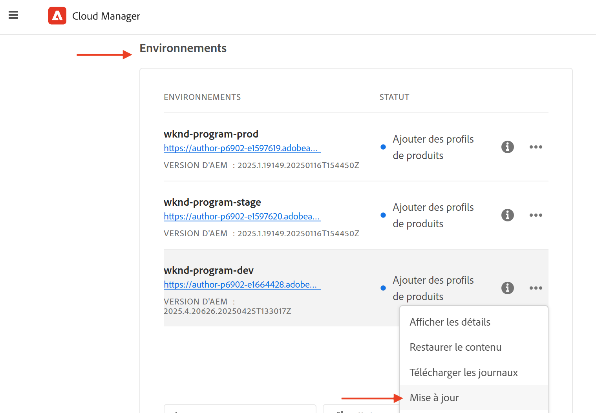
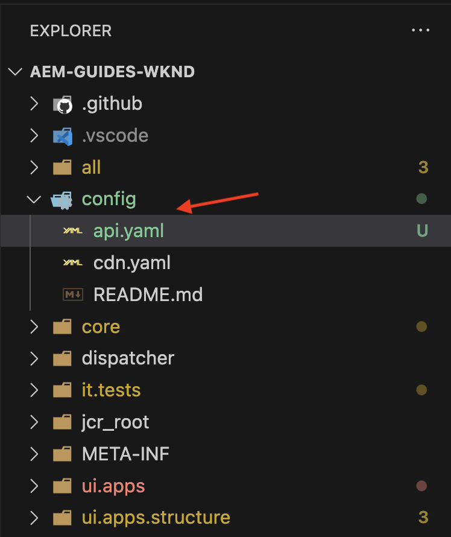

# Configurer les API AEM basées sur OpenAPI

Découvrez comment configurer votre environnement AEM as a Cloud Service pour activer l’accès aux API AEM basées sur OpenAPI.

Dans cet exemple, l’API **AEM Assets** utilisant la méthode d’authentification **serveur à serveur** est utilisée pour démontrer le processus de configuration des API AEM basées sur OpenAPI. Vous pouvez suivre les mêmes étapes pour configurer [d’autres API AEM basées sur OpenAPI](https://developer.adobe.com/experience-cloud/experience-manager-apis/#openapi-based-apis).

>[!VIDEO](https://video.tv.adobe.com/v/3457510?quality=12&learn=on)

Le processus général de configuration comprend les étapes suivantes :

1. Modernisation de l’environnement AEM as a Cloud Service.
1. Activez l’accès aux API AEM.
1. Créez un projet Adobe Developer Console (ADC).
1. Configurez le projet ADC.
1. Configurez l’instance AEM pour activer la communication du projet ADC.

## Conditions préalables

- Accès à l’environnement Cloud Manager et AEM as a Cloud Service
- Accès à Adobe Developer Console (ADC).
- Projet AEM pour ajouter ou mettre à jour la configuration de l’API dans le fichier `api.yaml`.

## Modernisation de l’environnement AEM as a Cloud Service{#modernization-of-aem-as-a-cloud-service-environment}

La modernisation de l’environnement AEM as a Cloud Service est une **activité unique par environnement** qui comprend les étapes suivantes. Si vous avez déjà modernisé votre environnement AEM as a Cloud Service, vous pouvez ignorer cette étape.

- Mettez à jour vers AEM version **2024.10.18459.20241031T210302Z** ou une version ultérieure.
- Ajoutez-y de nouveaux profils de produit, si l’environnement a été créé avant la version 2024.10.18459.20241031T210302Z.

### Mettre à jour l’instance AEM{#update-aem-instance}

- Pour mettre à jour l’instance AEM, après vous être connecté à Adobe [Cloud Manager](https://my.cloudmanager.adobe.com/), accédez à la section _Environnements_, sélectionnez l’icône _points de suspension_ en regard du nom de l’environnement, puis sélectionnez l’option **Mettre à jour**.



- Cliquez ensuite sur le bouton **Envoyer** et exécutez le pipeline full stack _suggéré_.


Dans mon cas, le pipeline full stack est nommé **Dev :: Fullstack-Deploy** et l’environnement AEM est appelé **wknd-program-dev**. Vos noms peuvent être différents.

### Ajouter de nouveaux profils de produit{#add-new-product-profiles}

- Pour ajouter de nouveaux profils de produit à l’instance AEM, dans la section _Environnements_ d’Adobe [Cloud Manager](https://my.cloudmanager.adobe.com/), sélectionnez l’icône _points de suspension_ en regard du nom de l’environnement, puis sélectionnez l’option **Ajouter des profils de produit**.


- Passez en revue les profils de produit nouvellement ajoutés en cliquant sur l’icône _points de suspension_ à côté du nom de l’environnement et en sélectionnant **Gérer l’accès** > **Créer des profils**.

- La fenêtre _Admin Console_ affiche les nouveaux profils de produit ajoutés. Selon vos droits AEM, tels qu’AEM Assets, AEM Sites, AEM Forms, etc., différents profils de produit peuvent s’afficher. Par exemple, dans mon cas, j’ai des droits AEM Assets et Sites. Je vois donc les profils de produit suivants.


- Les étapes ci-dessus complètent la modernisation de l’environnement AEM as a Cloud Service.

## Activer l’accès aux API AEM{#enable-aem-apis-access}

La présence des _nouveaux profils de produit_ permet d’activer l’accès à l’API AEM basée sur OpenAPI dans [Adobe Developer Console (ADC)](https://developer.adobe.com/). Sans ces profils de produit, vous ne pouvez pas configurer les API AEM basées sur OpenAPI dans Adobe Developer Console (ADC).

Les profils de produit nouvellement ajoutés sont associés aux _Services_ qui représentent _les groupes d’utilisateurs et d’utilisatrices AEM avec des listes de contrôle d’accès (ACL) prédéfinies_. Les _Services_ sont utilisés pour contrôler le niveau d’accès aux API d’AEM. Vous pouvez également sélectionner ou désélectionner les _Services_ associés au profil de produit pour réduire ou augmenter le niveau d’accès.

Vérifiez l’association en cliquant sur l’icône _Afficher les détails_ à côté du nom du profil de produit. Dans la capture d’écran suivante, vous pouvez voir l’association du profil de produit **AEM Sites Content Managers - author - Program XXX - Environment XXX** avec le service **AEM Sites Content Managers**. Passez en revue les autres profils de produit et leurs associations avec les services.


### Activer l’accès aux API AEM Assets{#enable-aem-assets-apis-access}

Dans cet exemple, l’API **AEM Assets** est utilisée pour démontrer le processus de configuration des API AEM basées sur OpenAPI. Cependant, par défaut, le service **Utilisateurs de l’API AEM Assets** n’est associé à aucun profil de produit. Vous devez l’associer au profil de produit souhaité.

Associons-le au profil de produit **Utilisateurs et utilisatrices collaborateurs d’AEM Assets - Création - Programme XXX - Environnement XXX** nouvellement ajouté ou à tout autre profil de produit que vous souhaitez utiliser pour l’accès à l’API AEM Assets.


### Activer l’authentification de serveur à serveur

Pour activer l’authentification de serveur à serveur pour les API AEM basées sur OpenAPI souhaitées, l’utilisateur configurant l’intégration à l’aide de Adobe Developer Console (ADC) doit être ajouté en tant que développeur au _profil de produit_ auquel le _service_ est associé.

Par exemple, pour activer l’authentification de serveur à serveur pour l’API AEM Assets, l’utilisateur doit être ajouté en tant que développeur au **profil de produit**&#x200B;_Utilisateurs collaborateurs AEM Assets - auteur - Programme XXX - Environnement XXX_.


Après cette association, l’_API de création Asset_ du projet ADC peut configurer l’authentification de serveur à serveur souhaitée et associer le compte d’authentification du projet ADC (créé à l’étape suivante) au profil de produit.

>[!IMPORTANT]
>
>L’étape ci-dessus est essentielle pour activer l’authentification de serveur à serveur pour l’API AEM souhaitée. Sans cette association, l’API AEM ne peut pas être utilisée avec la méthode d’authentification de serveur à serveur.

En effectuant toutes les étapes ci-dessus, vous avez préparé l’environnement AEM as a Cloud Service pour activer l’accès aux API AEM basées sur OpenAPI. Vous devez ensuite créer le projet Adobe Developer Console (ADC) pour configurer les API AEM basées sur OpenAPI.

## Créer un projet Adobe Developer Console (ADC){#adc-project}

Le projet Adobe Developer Console (ADC) permet de configurer les API AEM basées sur OpenAPI. Rappelez-vous qu’[Adobe Developer Console (ADC)](./overview.md#accessing-adobe-apis-and-related-concepts) est le hub de développement pour accéder aux API, aux SDK, aux événements en temps réel, aux fonctions sans serveur d’Adobe, etc.

Le projet ADC permet d’ajouter les API souhaitées, de configurer son authentification et d’associer le compte d’authentification au profil de produit.

Pour créer un projet ADC, procédez comme suit :

1. Connectez-vous à [Adobe Developer Console](https://developer.adobe.com/console) à l’aide de votre Adobe ID.

   

1. Dans la section _Démarrage rapide_, cliquez sur le bouton **Créer un projet**.

   

1. Un projet portant le nom par défaut est créé.

   

1. Modifiez le nom du projet en cliquant sur le bouton **Modifier le projet** dans le coin supérieur droit. Indiquez un nom significatif et cliquez sur **Enregistrer**.

   

## Configurer le projet ADC{#configure-adc-project}

Après avoir créé le projet ADC, vous devez ajouter les API AEM souhaitées, configurer son authentification et associer le compte d’authentification au profil de produit.

Dans ce cas, l’**API AEM Assets** est utilisée pour démontrer le processus de configuration des API AEM basées sur OpenAPI. Cependant, vous pouvez suivre les mêmes étapes pour ajouter d’autres API AEM basées sur OpenAPI telles que **l’API AEM Sites**, **l’API AEM Forms** etc. Les droits d’AEM déterminent les API disponibles dans Adobe Developer Console (ADC).

1. Pour ajouter des API AEM, cliquez sur le bouton **Ajouter une API**.

   

1. Dans la boîte de dialogue _Ajouter une API_, filtrez par _Experience Cloud_ et sélectionnez l’API AEM souhaitée. Par exemple, dans ce cas, l’_API de création Asset_ est sélectionnée.

   

   >[!TIP]
   >
   >    Si la **carte d’API AEM** souhaitée est désactivée et les informations _Pourquoi est-ce désactivé ?_ indiquent le message **Licence requise**, l’une des raisons peut être que vous n’avez PAS modernisé votre environnement AEM as a Cloud Service. Pour plus d’informations, consultez [Modernisation de l’environnement AEM as a Cloud Service](#modernization-of-aem-as-a-cloud-service-environment).

1. Ensuite, dans la boîte de dialogue _Configurer l’API_, sélectionnez l’option d’authentification souhaitée. Par exemple, dans ce cas, l’option d’authentification **Serveur à serveur** est sélectionnée.

   

   L’authentification de serveur à serveur est idéale pour les services principaux nécessitant un accès à l’API sans interaction avec l’utilisateur ou l’utilisatrice. Les options d’authentification Application web et Application d’une seule page sont adaptées aux applications nécessitant un accès API au nom des utilisateurs et utilisatrices. Consultez [Différence entre les informations d’identification OAuth de serveur à serveur et les informations d’identification d’application web et d’application d’une seule page](./overview.md#difference-between-oauth-server-to-server-vs-web-app-vs-single-page-app-credentials) pour plus d’informations.

   >[!TIP]
   >
   >Si vous ne voyez pas l’option d’authentification de serveur à serveur, cela signifie que la personne qui configure l’intégration n’est pas ajoutée en tant que développeur ou développeuse au profil de produit auquel le service est associé. Consultez [Activer l’authentification de serveur à serveur](#enable-server-to-server-authentication) pour plus d’informations.


1. Si nécessaire, vous pouvez renommer l’API pour une identification plus facile. À des fins de démonstration, le nom par défaut est utilisé.

   

1. Dans ce cas, la méthode d’authentification est **OAuth serveur à serveur**, vous devez donc associer le compte d’authentification au profil de produit. Sélectionnez le profil de produit **Utilisateurs et utilisatrices collaborateurs d’AEM Assets - Création - Programme XXX - Environnement XXX** et cliquez sur **Enregistrer**.

   

1. Examinez l’API AEM et la configuration de l’authentification.

   

   

Si vous choisissez la méthode d’authentification **Application Web OAuth** ou **application d’une seule page OAuth**, l’association de profil de produit n’est pas demandée, mais l’URI de redirection de l’application est requis. L’URI de redirection d’application est utilisé pour rediriger la personne vers l’application après authentification avec un code d’autorisation. Les tutoriels de cas d’utilisation pertinents décrivent ces configurations spécifiques à l’authentification.

## Configurer l’instance AEM pour activer la communication du projet ADC{#configure-aem-instance}

Ensuite, vous devez configurer l’instance AEM pour activer la communication de projet ADC ci-dessus. Avec cette configuration, le ClientID du projet ADC ne peut PAS communiquer avec l’instance AEM et génère une erreur 403 Forbidden . Considérez cette configuration comme une règle de pare-feu permettant uniquement aux ID client autorisés de communiquer avec l’instance AEM.

Suivons les étapes de configuration de l’instance AEM pour activer la communication de projet ADC ci-dessus.

1. Sur votre ordinateur local, accédez au projet AEM (ou clonez-le si ce n’est pas déjà fait) et localisez le dossier `config`.

1. Dans AEM Project, recherchez ou créez le fichier `api.yaml` à partir du dossier `config` . Dans mon cas, le projet [AEM WKND Sites](https://github.com/adobe/aem-guides-wknd) est utilisé pour démontrer le processus de configuration des API AEM basées sur OpenAPI.

   

1. Ajoutez la configuration suivante au fichier `api.yaml` pour permettre à l’ID client du projet ADC de communiquer avec l’instance AEM.

   ```yaml
   kind: "API"
   version: "1.0"
   metadata: 
       envTypes: ["dev", "stage", "prod"]
   data:
       allowedClientIDs:
           author:
           - "<ADC Project's Credentials ClientID>"
   ```

   Remplacez `<ADC Project's Credentials ClientID>` par l’ID client réel de la valeur des informations d’identification du projet ADC. Le point d’entrée d’API utilisé dans ce tutoriel est disponible uniquement au niveau création, mais pour les autres API, la configuration YAML peut également avoir un nœud _publication_ ou _aperçu_.

   >[!CAUTION]
   >
   > À des fins de démonstration, le même ID client est utilisé pour tous les environnements. Il est recommandé d’utiliser des ID clients distincts par environnement (développement, évaluation, production) pour une meilleure sécurité et un meilleur contrôle.

1. Validez les modifications de configuration et envoyez les modifications au référentiel Git distant auquel le pipeline Cloud Manager est connecté.

1. Déployez les modifications ci-dessus à l’aide du [Pipeline de configuration](https://experienceleague.adobe.com/fr/docs/experience-manager-cloud-service/content/implementing/using-cloud-manager/cicd-pipelines/introduction-ci-cd-pipelines#config-deployment-pipeline) dans le Cloud Manager.

   

Notez que le fichier `api.yaml` peut également être installé dans un [RDE](https://experienceleague.adobe.com/fr/docs/experience-manager-learn/cloud-service/developing/rde/overview), [à l’aide de l’outil de ligne de commande](https://experienceleague.adobe.com/en/docs/experience-manager-learn/cloud-service/developing/rde/how-to-use#deploy-configuration-yaml-files). Cela s’avère utile pour tester les modifications de configuration avant de les déployer dans l’environnement de production.

## Étapes suivantes

Une fois l’instance AEM configurée pour activer la communication de projet ADC, vous pouvez commencer à utiliser les API AEM basées sur OpenAPI. Découvrez comment utiliser les API AEM basées sur OpenAPI à l’aide de différentes méthodes d’authentification OAuth :

<!-- CARDS
{target = _self}

* ./use-cases/invoke-api-using-oauth-s2s.md
  {title = Invoke API using Server-to-Server authentication}
  {description = Learn how to invoke OpenAPI-based AEM APIs from a custom NodeJS application using OAuth Server-to-Server authentication.}
  {image = ./assets/s2s/OAuth-S2S.png}
* ./use-cases/invoke-api-using-oauth-web-app.md
  {title = Invoke API using Web App authentication}
  {description = Learn how to invoke OpenAPI-based AEM APIs from a custom web application using OAuth Web App authentication.}
  {image = ./assets/web-app/OAuth-WebApp.png}
* ./use-cases/invoke-api-using-oauth-single-page-app.md
  {title = Invoke API using Single Page App authentication}
  {description = Learn how to invoke OpenAPI-based AEM APIs from a custom Single Page App (SPA) using OAuth 2.0 PKCE flow.}
  {image = ./assets/spa/OAuth-SPA.png}  
-->
<!-- START CARDS HTML - DO NOT MODIFY BY HAND -->
<div class="columns">
    <div class="column is-half-tablet is-half-desktop is-one-third-widescreen" aria-label="Invoke API using Server-to-Server authentication">
        <div class="card" style="height: 100%; display: flex; flex-direction: column; height: 100%;">
            <div class="card-image">
                <figure class="image x-is-16by9">
                    <a href="./use-cases/invoke-api-using-oauth-s2s.md" title="Appeler l’API à l’aide de l’authentification de serveur à serveur" target="_self" rel="referrer">
                        
                    </a>
                </figure>
            </div>
            <div class="card-content is-padded-small" style="display: flex; flex-direction: column; flex-grow: 1; justify-content: space-between;">
                <div class="top-card-content">
                    <p class="headline is-size-6 has-text-weight-bold">
                        <a href="./use-cases/invoke-api-using-oauth-s2s.md" target="_self" rel="referrer" title="Appeler l’API à l’aide de l’authentification de serveur à serveur">Appeler l’API à l’aide de l’authentification de serveur à serveur</a>
                    </p>
                    <p class="is-size-6">Découvrez comment appeler les API AEM basées sur OpenAPI à partir d’une application NodeJS personnalisée à l’aide de l’authentification de serveur à serveur OAuth.</p>
                </div>
                <a href="./use-cases/invoke-api-using-oauth-s2s.md" target="_self" rel="referrer" class="spectrum-Button spectrum-Button--outline spectrum-Button--primary spectrum-Button--sizeM" style="align-self: flex-start; margin-top: 1rem;">
<span class="spectrum-Button-label has-no-wrap has-text-weight-bold">En savoir plus</span>
</a>
            </div>
        </div>
    </div>
    <div class="column is-half-tablet is-half-desktop is-one-third-widescreen" aria-label="Invoke API using Web App authentication">
        <div class="card" style="height: 100%; display: flex; flex-direction: column; height: 100%;">
            <div class="card-image">
                <figure class="image x-is-16by9">
                    <a href="./use-cases/invoke-api-using-oauth-web-app.md" title="Appeler l’API à l’aide de l’authentification de l’application web" target="_self" rel="referrer">
                        
                    </a>
                </figure>
            </div>
            <div class="card-content is-padded-small" style="display: flex; flex-direction: column; flex-grow: 1; justify-content: space-between;">
                <div class="top-card-content">
                    <p class="headline is-size-6 has-text-weight-bold">
                        <a href="./use-cases/invoke-api-using-oauth-web-app.md" target="_self" rel="referrer" title="Appeler l’API à l’aide de l’authentification de l’application web">Appeler l’API à l’aide de l’authentification d’application web</a>
                    </p>
                    <p class="is-size-6">Découvrez comment appeler les API AEM basées sur OpenAPI à partir d’une application web personnalisée à l’aide de l’authentification de l’application Web OAuth.</p>
                </div>
                <a href="./use-cases/invoke-api-using-oauth-web-app.md" target="_self" rel="referrer" class="spectrum-Button spectrum-Button--outline spectrum-Button--primary spectrum-Button--sizeM" style="align-self: flex-start; margin-top: 1rem;">
<span class="spectrum-Button-label has-no-wrap has-text-weight-bold">En savoir plus</span>
</a>
            </div>
        </div>
    </div>
    <div class="column is-half-tablet is-half-desktop is-one-third-widescreen" aria-label="Invoke API using Single Page App authentication">
        <div class="card" style="height: 100%; display: flex; flex-direction: column; height: 100%;">
            <div class="card-image">
                <figure class="image x-is-16by9">
                    <a href="./use-cases/invoke-api-using-oauth-single-page-app.md" title="Appeler l’API à l’aide de l’authentification par application d’une seule page" target="_self" rel="referrer">
                        
                    </a>
                </figure>
            </div>
            <div class="card-content is-padded-small" style="display: flex; flex-direction: column; flex-grow: 1; justify-content: space-between;">
                <div class="top-card-content">
                    <p class="headline is-size-6 has-text-weight-bold">
                        <a href="./use-cases/invoke-api-using-oauth-single-page-app.md" target="_self" rel="referrer" title="Appeler l’API à l’aide de l’authentification par application d’une seule page">Appeler l’API à l’aide de l’authentification par application d’une seule page</a>
                    </p>
                    <p class="is-size-6">Découvrez comment appeler les API AEM basées sur OpenAPI à partir d’une application d’une seule page (SPA) personnalisée à l’aide du flux PKCE OAuth 2.0.</p>
                </div>
                <a href="./use-cases/invoke-api-using-oauth-single-page-app.md" target="_self" rel="referrer" class="spectrum-Button spectrum-Button--outline spectrum-Button--primary spectrum-Button--sizeM" style="align-self: flex-start; margin-top: 1rem;">
<span class="spectrum-Button-label has-no-wrap has-text-weight-bold">En savoir plus</span>
</a>
            </div>
        </div>
    </div>
</div>
<!-- END CARDS HTML - DO NOT MODIFY BY HAND -->
