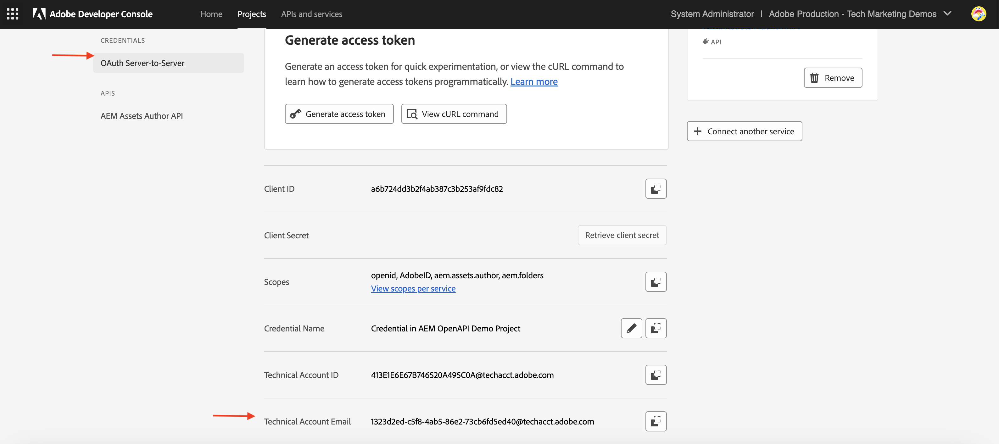
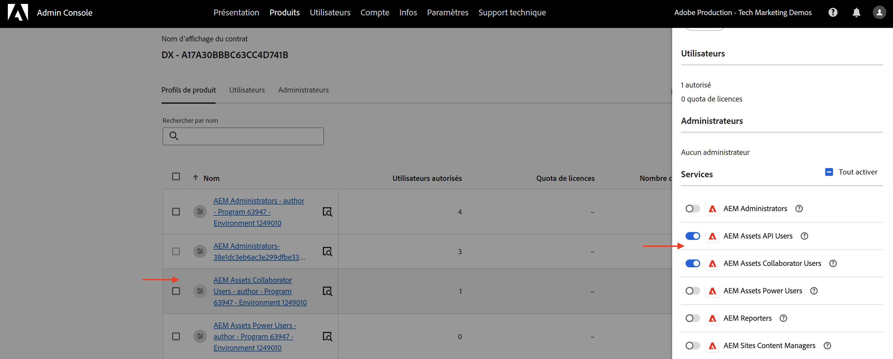

# Appeler des API AEM basées sur OpenAPI à l’aide de l’authentification de serveur à serveur OAuth

Découvrez comment appeler les API AEM basées sur OpenAPI sur AEM as a Cloud Service à partir d’applications personnalisées à l’aide de l’authentification _OAuth serveur à serveur_.

L’authentification OAuth serveur à serveur est idéale pour les services principaux nécessitant un accès à l’API sans interaction avec l’utilisateur ou l’utilisatrice. Elle utilise le type d’octroi OAuth 2.0 _client_credentials_ pour authentifier l’application cliente.

## Ce que vous apprenez{#what-you-learn}

Dans cet article, vous apprenez ce qui suit :

- Configurez un projet Adobe Developer Console (ADC) pour accéder à l’API de création Assets à l’aide de l’authentification _OAuth serveur à serveur_.

- Développez un exemple d’application NodeJS qui appelle l’API de création Assets pour récupérer les métadonnées d’une ressource spécifique.

Avant de commencer, vérifiez les points suivants :

- Section [Accès aux API Adobe et concepts associés](../overview.md#accessing-adobe-apis-and-related-concepts).
- Article [Configuration des API AEM basées sur OpenAPI](../setup.md).

## Prérequis

Les éléments suivants sont requis afin de terminer ce tutoriel :

- Environnement AEM as a Cloud Service modernisé avec les éléments suivants :
   - AEM version `2024.10.18459.20241031T210302Z` ou version ultérieure.
   - Profils de produit avec un nouveau style (si l’environnement a été créé avant novembre 2024)

  Consultez l’article [Configuration d’API AEM basées sur OpenAPI](../setup.md) pour plus d’informations.

- L’exemple de projet [WKND Sites](https://github.com/adobe/aem-guides-wknd?#aem-wknd-sites-project) doit être déployé dessus.

- Accédez à [Adobe Developer Console](https://developer.adobe.com/developer-console/docs/guides/getting-started).

- Installez [Node.js](https://nodejs.org/fr/) sur votre ordinateur local pour exécuter l’exemple d’application NodeJS.

## Étapes de développement

Les étapes de développement générales sont les suivantes :

1. Configurer le projet ADC
   1. Ajouter l’API de création Assets
   1. Configurer sa méthode d’authentification sur OAuth serveur à serveur
   1. Associer le profil de produit à la configuration d’authentification
1. Configurer l’instance AEM pour activer la communication du projet ADC
1. Développer un exemple d’application NodeJS
1. Vérifier le flux de bout en bout

## Configurer le projet ADC

L’étape Configurer le projet ADC est _répétée_ à partir de [Configurer les API AEM basées sur OpenAPI](../setup.md). Elle est répétée pour ajouter l’API de création Assets et configurer sa méthode d’authentification sur OAuth serveur à serveur.

>[!TIP]
>
>Assurez-vous d’avoir terminé l’étape **Activer l’accès aux API AEM** de l’article [Configurer les API AEM basées sur OpenAPI](../setup.md#enable-aem-apis-access). Sans cela, l’option d’authentification de serveur à serveur n’est pas disponible.


1. Ouvrez le projet souhaité à partir d’[Adobe Developer Console](https://developer.adobe.com/console/projects).

1. Pour ajouter des API AEM, cliquez sur le bouton **Ajouter une API**.

   

1. Dans la boîte de dialogue _Ajouter une API_, filtrez par _Experience Cloud_ et sélectionnez la vignette **API de création AEM Assets** puis cliquez sur **Suivant**.

   

1. Ensuite, dans la boîte de dialogue _Configurer l’API_, sélectionnez l’option d’authentification **Serveur à serveur** et cliquez sur **Suivant**. L’authentification de serveur à serveur est idéale pour les services principaux nécessitant un accès à l’API sans interaction avec l’utilisateur ou l’utilisatrice.

   

   >[!TIP]
   >
   >Si vous ne voyez pas l’option d’authentification de serveur à serveur, cela signifie que la personne qui configure l’intégration n’est pas ajoutée en tant que développeur ou développeuse au profil de produit auquel le service est associé. Consultez [Activer l’authentification de serveur à serveur](../setup.md#enable-server-to-server-authentication) pour plus d’informations.

1. Renommez les informations d’identification pour une identification plus facile (si nécessaire), puis cliquez sur **Suivant**. À des fins de démonstration, le nom par défaut est utilisé.

   

1. Sélectionnez le profil de produit **Utilisateurs et utilisatrices collaborateurs AEM Assets - Création - Programme XXX - Environnement XXX** et cliquez sur **Enregistrer**. Comme vous pouvez le constater, seul le profil de produit associé au service Utilisateurs et utilisatrices de l’API AEM Assets peut être sélectionné.

   

1. Examinez l’API AEM et la configuration de l’authentification.

   

   

## Configurer l’instance AEM pour activer la communication du projet ADC

Suivez les instructions de l’article [Configurer les API AEM basées sur OpenAPI](../setup.md#configure-the-aem-instance-to-enable-adc-project-communication) pour configurer l’instance AEM afin d’activer la communication de projet ADC.

## Développer un exemple d’application NodeJS

Développons un exemple d’application NodeJS qui appelle l’API de création Assets.

Vous pouvez utiliser d’autres langages de programmation, comme Java, Python, etc., pour développer l’application.

À des fins de test, vous pouvez utiliser [Postman](https://www.postman.com/), [curl](https://curl.se/) ou tout autre client REST pour appeler les API AEM.

### Vérifier l’API

Avant de développer l’application, examinons le point d’entrée [diffuser les métadonnées de la ressource spécifiée](https://developer.adobe.com/experience-cloud/experience-manager-apis/api/experimental/assets/author/#operation/getAssetMetadata) à partir de l’_API de création Assets_. La syntaxe d’API est la suivante :

```http
GET https://{bucket}.adobeaemcloud.com/adobe/../assets/{assetId}/metadata
```

Pour récupérer les métadonnées d’une ressource spécifique, vous avez besoin des valeurs `bucket` et `assetId`. La valeur `bucket` est le nom de l’instance AEM sans le nom de domaine Adobe (.adobeaemcloud.com), par exemple `author-p63947-e1420428`.

La valeur `assetId` est l’UUID JCR de la ressource avec le préfixe `urn:aaid:aem:`, par exemple `urn:aaid:aem:a200faf1-6d12-4abc-bc16-1b9a21f870da`. Il existe plusieurs façons d’obtenir la valeur `assetId` :

- Ajoutez l’extension `.json` de chemin d’accès à la ressource AEM pour obtenir les métadonnées de la ressource. Par exemple, `https://author-p63947-e1420429.adobeaemcloud.com/content/dam/wknd-shared/en/adventures/cycling-southern-utah/adobestock-221043703.jpg.json` et recherchez la propriété `jcr:uuid`.

- Vous pouvez également obtenir la valeur `assetId` en examinant la ressource dans l’inspecteur d’éléments du navigateur. Recherchez l’attribut `data-id="urn:aaid:aem:..."`.

  

### Appeler l’API à l’aide du navigateur

Avant de développer l’application, appelons l’API à l’aide de la fonctionnalité **Essayer** de la [documentation de l’API](https://developer.adobe.com/experience-cloud/experience-manager-apis/api/stable/assets/author/).

1. Ouvrez la [documentation de l’API de création Assets](https://developer.adobe.com/experience-cloud/experience-manager-apis/api/stable/assets/author/) dans le navigateur.

1. Développez la section _Métadonnées_ et cliquez sur l’option **Diffuse les métadonnées de la ressource spécifiée**.

1. Dans le volet de droite, cliquez sur le bouton **Essayer**.
   

1. Saisissez les valeurs suivantes :

   | Section | Paramètre | Valeur |
   | --- | --- | --- |
   |  | compartiment | Le nom de l’instance AEM sans le nom de domaine Adobe (.adobeaemcloud.com), par exemple `author-p63947-e1420428`. |
   | **Sécurité** | Jeton porteur | Utilisez le jeton d’accès à partir des informations d’identification OAuth serveur à serveur du projet ADC. |
   | **Sécurité** | X-Api-Key | Utilisez la valeur `ClientID` des informations d’identification OAuth serveur à serveur du projet ADC. |
   | **Paramètres** | assetId | L’identifiant unique de la ressource dans AEM, par exemple `urn:aaid:aem:a200faf1-6d12-4abc-bc16-1b9a21f870da` |
   | **Paramètres** | X-Adobe-Accept-Experimental | 1 |

   

   

1. Cliquez sur **Envoyer** pour appeler l’API et passez en revue la réponse dans l’onglet **Réponse**.

   

Les étapes ci-dessus confirment la modernisation de l’environnement AEM as a Cloud Service, ce qui permet l’accès aux API AEM. Cela confirme également la réussite de la configuration du projet ADC et de la communication des informations d’identification OAuth serveur à serveur ClientID avec l’instance de création AEM.

### Exemple d’application NodeJS

Développons un exemple d’application NodeJS.

Pour développer l’application, vous pouvez utiliser les instructions _Run-the-sample-application_ ou _Step-by-step-development_.

>[!BEGINTABS]

>[!TAB Run-the-sample-application]

1. Téléchargez l’exemple de fichier zip de l’application [demo-nodejs-app-to-invoke-aem-openapi](../assets/s2s/demo-nodejs-app-to-invoke-aem-openapi.zip) et extrayez-le.

1. Accédez au dossier extrait et installez les dépendances.

   ```bash
   $ npm install
   ```

1. Remplacez les espaces réservés dans le fichier `.env` par les valeurs réelles des informations d’identification OAuth serveur à serveur du projet ADC.

1. Remplacez les éléments `<BUCKETNAME>` et `<ASSETID>` dans le fichier `src/index.js` par les valeurs réelles.

1. Exécutez l’application NodeJS.

   ```bash
   $ node src/index.js
   ```

>[!TAB Step-by-step-development]

1. Créez un projet NodeJS.

   ```bash
   $ mkdir demo-nodejs-app-to-invoke-aem-openapi
   $ cd demo-nodejs-app-to-invoke-aem-openapi
   $ npm init -y
   ```

1. Installez la bibliothèque _fetch_ et _dotenv_ pour effectuer des requêtes HTTP et lire les variables d’environnement, respectivement.

   ```bash
   $ npm install node-fetch
   $ npm install dotenv
   ```

1. Ouvrez le projet dans votre éditeur de code préféré et mettez à jour le fichier `package.json` pour ajouter la valeur `type` à `module`.

   ```json
   {
       ...
       "version": "1.0.0",
       "type": "module",
       "main": "index.js",
       ...
   }
   ```

1. Créez le fichier `.env` et ajoutez la configuration suivante. Remplacez les espaces réservés par les valeurs réelles des informations d’identification OAuth serveur à serveur du projet ADC.

   ```properties
   CLIENT_ID=<ADC Project OAuth Server-to-Server credential ClientID>
   CLIENT_SECRET=<ADC Project OAuth Server-to-Server credential Client Secret>
   SCOPES=<ADC Project OAuth Server-to-Server credential Scopes>
   ```

1. Créez le fichier `src/index.js` et ajoutez le code suivant, puis remplacez les valeurs `<BUCKETNAME>` et `<ASSETID>` par les valeurs réelles.

   ```javascript
   // Import the dotenv configuration to load environment variables from the .env file
   import "dotenv/config";
   
   // Import the fetch function to make HTTP requests
   import fetch from "node-fetch";
   
   // REPLACE THE FOLLOWING VALUES WITH YOUR OWN
   const bucket = "<BUCKETNAME>"; // Bucket name is the AEM instance name (e.g. author-p63947-e1420428)
   const assetId = "<ASSETID>"; // Asset ID is the unique identifier for the asset in AEM (e.g. urn:aaid:aem:a200faf1-6d12-4abc-bc16-1b9a21f870da). You can get it by inspecting the asset in browser's element inspector, look for data-id="urn:aaid:aem:..."
   
   // Load environment variables for authentication
   const clientId = process.env.CLIENT_ID; // Adobe IMS client ID
   const clientSecret = process.env.CLIENT_SECRET; // Adobe IMS client secret
   const scopes = process.env.SCOPES; // Scope for the API access
   
   // Adobe IMS endpoint for obtaining an access token
   const adobeIMSV3TokenEndpointURL =
   "https://ims-na1.adobelogin.com/ims/token/v3";
   
   // Function to obtain an access token from Adobe IMS
   const getAccessToken = async () => {
       console.log("Getting access token from IMS"); // Log process initiation
       //console.log("Client ID: " + clientId); // Display client ID for debugging purposes
   
       // Configure the HTTP POST request to fetch the access token
       const options = {
           method: "POST",
           headers: {
           "Content-Type": "application/x-www-form-urlencoded", // Specify form data content type
           },
           // Send client ID, client secret, and scopes as the request body
           body: `grant_type=client_credentials&client_id=${clientId}&client_secret=${clientSecret}&scope=${scopes}`,
       };
   
       // Make the HTTP request to fetch the access token
       const response = await fetch(adobeIMSV3TokenEndpointURL, options);
   
       //console.log("Response status: " + response.status); // Log the HTTP status for debugging
   
       const responseJSON = await response.json(); // Parse the JSON response
   
       console.log("Access token received"); // Log success message
   
       // Return the access token
       return responseJSON.access_token;
   };
   
   // Function to retrieve metadata for a specific asset from AEM
   const getAssetMetadat = async () => {
       // Fetch the access token using the getAccessToken function
       const accessToken = await getAccessToken();
   
       console.log("Getting asset metadata from AEM");
   
       // Invoke the Assets Author API to retrieve metadata for a specific asset
       const resp = await fetch(
           `https://${bucket}.adobeaemcloud.com/adobe/../assets/${assetId}/metadata`, // Construct the URL with bucket and asset ID
           {
           method: "GET",
           headers: {
               "If-None-Match": "string", // Header to handle caching (not critical for this tutorial)
               "X-Adobe-Accept-Experimental": "1", // Header to enable experimental Adobe API features
               Authorization: "Bearer " + accessToken, // Provide the access token for authorization
               "X-Api-Key": clientId, // Include the OAuth S2S ClientId for identification
           },
           }
       );
   
       const data = await resp.json(); // Parse the JSON response
   
       console.log("Asset metadata received"); // Log success message
       console.log(data); // Display the retrieved metadata
   };
   
   // Call the getAssets function to start the process
   getAssetMetadat();
   ```

1. Exécutez l’application NodeJS.

   ```bash
   $ node src/index.js
   ```

>[!ENDTABS]

### Réponse API

Une fois l’exécution réussie, la réponse de l’API s’affiche dans la console. La réponse contient les métadonnées de la ressource spécifiée.

```json
{
  "assetId": "urn:aaid:aem:9c09ff70-9ee8-4b14-a5fa-ec37baa0d1b3",
  "assetMetadata": {    
    ...
    "dc:title": "A Young Mountain Biking Couple Takes A Minute To Take In The Scenery",
    "xmp:CreatorTool": "Adobe Photoshop Lightroom Classic 7.5 (Macintosh)",
    ...
  },
  "repositoryMetadata": {
    ...
    "repo:name": "adobestock-221043703.jpg",
    "repo:path": "/content/dam/wknd-shared/en/adventures/cycling-southern-utah/adobestock-221043703.jpg",
    "repo:state": "ACTIVE",
    ...
  }
}
```

Félicitations. Vous avez correctement appelé les API AEM basées sur OpenAPI à partir de votre application personnalisée à l’aide de l’authentification OAuth serveur à serveur.

### Vérifier le code d’application

Les éléments clés de l’exemple de code d’application NodeJS sont les suivants :

1. **Authentification IMS** : récupère un jeton d’accès à l’aide des informations d’identification OAuth serveur à serveur configurées dans le projet ADC.

   ```javascript
   // Function to obtain an access token from Adobe IMS
   const getAccessToken = async () => {
   
       // Configure the HTTP POST request to fetch the access token
       const options = {
           method: "POST",
           headers: {
           "Content-Type": "application/x-www-form-urlencoded", // Specify form data content type
           },
           // Send client ID, client secret, and scopes as the request body
           body: `grant_type=client_credentials&client_id=${clientId}&client_secret=${clientSecret}&scope=${scopes}`,
       };
   
       // Make the HTTP request to fetch the access token from Adobe IMS token endpoint https://ims-na1.adobelogin.com/ims/token/v3
       const response = await fetch(adobeIMSV3TokenEndpointURL, options);
   
       const responseJSON = await response.json(); // Parse the JSON response
   
       // Return the access token
       return responseJSON.access_token;
   };
   ...
   ```

1. **Appel de l’API** : appelle l’API de création Assets pour récupérer les métadonnées d’une ressource spécifique en fournissant le jeton d’accès pour l’autorisation.

   ```javascript
   // Function to retrieve metadata for a specific asset from AEM
   const getAssetMetadat = async () => {
       // Fetch the access token using the getAccessToken function
       const accessToken = await getAccessToken();
   
       console.log("Getting asset metadata from AEM");
   
       // Invoke the Assets Author API to retrieve metadata for a specific asset
       const resp = await fetch(
           `https://${bucket}.adobeaemcloud.com/adobe/../assets/${assetId}/metadata`, // Construct the URL with bucket and asset ID
           {
           method: "GET",
           headers: {
               "If-None-Match": "string", // Header to handle caching (not critical for this tutorial)
               "X-Adobe-Accept-Experimental": "1", // Header to enable experimental Adobe API features
               Authorization: "Bearer " + accessToken, // Provide the access token for authorization
               "X-Api-Key": clientId, // Include the OAuth S2S ClientId for identification
           },
           }
       );
   
       const data = await resp.json(); // Parse the JSON response
   
       console.log("Asset metadata received"); // Log success message
       console.log(data); // Display the retrieved metadata
   };
   ...
   ```

## Ce qui se passe.

Une fois l’appel de l’API réussi, un profil utilisateur représentant les informations d’identification OAuth de projet ADC est créé dans le service de création AEM, avec les groupes d’utilisateurs et d’utilisatrices correspondant à la configuration du profil de produit et des services. Le profil _utilisateur du compte technique_ est associé au groupe d’utilisateurs et d’utilisatrices Profil de produit et _Services_, qui dispose des autorisations nécessaires pour _LIRE_ les métadonnées de la ressource.

Pour vérifier la création de l’utilisateur ou de l’utilisatrice du compte technique et du groupe d’utilisateurs et d’utilisatrices, procédez comme suit :

- Dans le projet ADC, accédez à la configuration des informations d’identification **OAuth serveur à serveur**. Notez la valeur **E-mail du compte technique**.

  

- Dans le service de création AEM, accédez à **Outils** > **Sécurité** > **Utilisateurs et utilisatrices** et recherchez la valeur **E-mail du compte technique**.

  

- Cliquez sur l’utilisateur ou l’utilisatrice du compte technique pour afficher ses détails, tels que l’appartenance à des **Groupes**. Comme illustré ci-dessous, le profil utilisateur du compte technique est associé aux groupes d’utilisateurs et d’utilisatrices **Utilisateurs et utilisatrices collaborateurs AEM Assets - Création - Programme XXX - Environnement XXX** et **Utilisateurs et utilisatrices collaborateurs AEM Assets - Service**.

  

- Notez que le profil utilisateur du compte technique est associé au profil de produit **Utilisateurs et utilisatrices collaborateurs AEM Assets - Création - Programme XXX - Environnement XXX**. Le profil de produit est associé aux services **Utilisateurs et utilisatrices de l’API AEM Assets** et **Utilisateurs et utilisatrices collaborateurs AEM Assets**.

  

- Le profil de produit et l’association des utilisateurs et utilisatrices du compte technique peuvent être vérifiés dans l’onglet **Informations d’identification de l’API** des **Profils de produit**.

  

## Erreur 403 pour les requêtes non GET

Pour _LIRE_ les métadonnées de la ressource, le profil utilisateur du compte technique créé pour les informations d’identification OAuth serveur à serveur dispose des autorisations nécessaires via le groupe d’utilisateurs et d’utilisatrices Services (par exemple, Utilisateurs et utilisatrices collaborateurs AEM Assets - Service).

Toutefois, pour _Créer, mettre à jour, supprimer_ (CUD) les métadonnées de la ressource, l’utilisateur ou l’utilisatrice du compte technique a besoin d’autorisations supplémentaires. Vous pouvez vérifier cela en appelant l’API avec une requête non GET (par exemple, PATCH, DELETE) et en observant la réponse d’erreur 403.

Appelons la requête _PATCH_ pour mettre à jour les métadonnées de la ressource et observons la réponse d’erreur 403.

- Ouvrez la [documentation de l’API de création Assets](https://developer.adobe.com/experience-cloud/experience-manager-apis/api/experimental/assets/author/) dans le navigateur.

- Saisissez les valeurs suivantes :

  | Section | Paramètre | Valeur |
  | --- | --- | --- |
  | **Compartiment** |  | Le nom de l’instance AEM sans le nom de domaine Adobe (.adobeaemcloud.com), par exemple `author-p63947-e1420428`. |
  | **Sécurité** | Jeton porteur | Utilisez le jeton d’accès à partir des informations d’identification OAuth serveur à serveur du projet ADC. |
  | **Sécurité** | X-Api-Key | Utilisez la valeur `ClientID` des informations d’identification OAuth serveur à serveur du projet ADC. |
  | **Corps** |  | `[{ "op": "add", "path": "foo","value": "bar"}]` |
  | **Paramètres** | assetId | L’identifiant unique de la ressource dans AEM, par exemple `urn:aaid:aem:a200faf1-6d12-4abc-bc16-1b9a21f870da` |
  | **Paramètres** | X-Adobe-Accept-Experimental | * |
  | **Paramètres** | X-Adobe-Accept-Experimental | 1 |

- Cliquez sur **Envoyer** pour appeler la requête _PATCH_ et observer la réponse d’erreur 403.

  

Pour corriger l’erreur 403, vous disposez de deux options :

- Dans le projet ADC, mettez à jour le profil de produit associé aux informations d’identification OAuth serveur à serveur avec un profil de produit approprié disposant des autorisations nécessaires pour _Créer, mettre à jour, supprimer_ (CUD) les métadonnées de la ressource, par exemple **Administrateurs et administratrices AEM - Création - Programme XXX - Environnement XXX**. Pour plus d’informations, consultez l’article [Procédure : informations d’identification connectées de l’API et gestion des profils de produit](../how-to/credentials-and-product-profile-management.md).

- À l’aide du projet AEM, mettez à jour les autorisations du groupe d’utilisateurs et d’utilisatrices du service AEM associé (par exemple, Utilisateurs et utilisatrices collaborateurs AEM Assets - Service) dans l’instance de création AEM pour autoriser _Créer, Mettre à jour, Supprimer_ (CUD) des métadonnées de la ressource. Pour plus d’informations, consultez l’article [Procédure : gestion des autorisations des groupes d’utilisateurs et d’utilisatrices de service AEM](../how-to/services-user-group-permission-management.md).

## Résumé

Dans ce tutoriel, vous avez appris à appeler des API AEM basées sur OpenAPI à partir d’applications personnalisées. Vous avez activé l’accès aux API AEM, créé et configuré un projet Adobe Developer Console (ADC).
Dans le projet ADC, vous avez ajouté les API AEM, configuré son type d’authentification et associé le profil de produit. Vous avez également configuré l’instance AEM pour activer la communication de projet ADC et développé un exemple d’application NodeJS qui appelle l’API de création Assets.

## Ressources supplémentaires

- [Guide de mise en œuvre des informations d’identification OAuth serveur à serveur](https://developer.adobe.com/developer-console/docs/guides/authentication/ServerToServerAuthentication/implementation)
