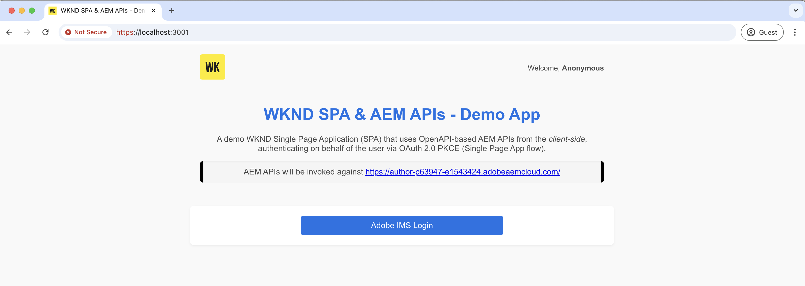

# Appeler des API AEM basées sur OpenAPI à l’aide de l’application monopage OAuth

Découvrez comment appeler les API AEM basées sur OpenAPI sur AEM as a Cloud Service à l’aide de l’authentification par application d’une seule page **OAuth**. Elle suit le flux PKCE (Proof Key for Code Exchange) OAuth 2.0 pour l’authentification basée sur les utilisateurs dans une application d’une seule page (SPA).

L’authentification par application d’une seule page OAuth est idéale pour les applications JavaScript exécutées dans le navigateur. S’il manque un serveur principal ou s’il doit récupérer des jetons d’accès pour interagir avec les API d’AEM au nom d’un utilisateur.

Le flux PKCE étend le type d’octroi OAuth 2.0 _authorization_code_, ce qui renforce la sécurité en empêchant l’interception du code d’autorisation. Pour plus d’informations, voir la [Différence entre les informations d’identification OAuth de serveur à serveur et OAuth Web App/Single Page App](../overview.md#difference-between-oauth-server-to-server-and-oauth-web-appsingle-page-app-credentials).

>[!AVAILABILITY]
>
>Les API AEM basées sur OpenAPI sont disponibles dans le cadre d’un programme d’accès anticipé. Si vous souhaitez y accéder, nous vous encourageons à envoyer un e-mail à l’adresse [aem-apis@adobe.com](mailto:aem-apis@adobe.com) avec une description de votre cas d’utilisation.

## Ce que vous apprenez.{#what-you-learn}

Dans ce tutoriel, vous apprendrez à :

- Configurez un projet Adobe Developer Console (ADC) pour accéder aux API AEM basées sur OpenAPI à l’aide de l’authentification _Application d’une seule page OAuth_ ou du flux PKCE _OAuth 2.0_.

- Implémentez le flux d’authentification d’application d’une seule page OAuth dans une SPA personnalisée.
   - Authentification de l’utilisateur IMS et autorisation de l’application.
   - Récupération du jeton d’accès à l’aide du flux PKCE OAuth 2.0.
   - Utilisez le jeton d’accès pour appeler les API AEM basées sur OpenAPI.

Avant de commencer, vérifiez les points suivants :

- [Accès aux API Adobe et aux concepts associés](../overview.md#accessing-adobe-apis-and-related-concepts) section.
- Article [Configuration des API AEM basées sur OpenAPI](../setup.md).

## Présentation et flux fonctionnel de la SPA WKND{#wknd-spa-overview-and-functional-flow}

Examinons ce qu’est la SPA WKND, comment elle est créée et comment elle fonctionne.

La SPA WKND est une **application d’une seule page basée sur React** qui montre comment obtenir en toute sécurité un jeton d’accès spécifique à l’utilisateur et interagir avec les API d’AEM directement du côté client. Il implémente le flux d’authentification PKCE OAuth 2.0 via Adobe IMS et s’intègre à deux API AEM essentielles :

1. **API Sites** : pour accéder aux modèles de fragment de contenu
1. **API Assets** : pour la gestion des dossiers de gestion des ressources numériques

Le projet Adobe Developer Console (ADC) est configuré pour activer l’authentification de l’application d’une seule page OAuth, fournissant l’**client_id** requis pour lancer le flux PKCE OAuth 2.0.

>[!IMPORTANT]
>
>Le projet ADC ne fournit PAS de _client_secret_. Au lieu de cela, la SPA génère un _code_verifier_ et un _code_challenge_ pour échanger en toute sécurité le code d’autorisation contre un _jeton d’accès_. Il n’est plus nécessaire de stocker un secret client côté client, ce qui renforce la sécurité.

Le diagramme suivant illustre le flux fonctionnel de la SPA WKND _obtention d’un jeton d’accès spécifique à l’utilisateur pour appeler les API AEM basées sur OpenAPI_ :


1. La SPA lance le flux d’authentification en dirigeant l’utilisateur vers le système Adobe Identity Management (IMS) via une demande d’autorisation.
1. Dans le cadre de la demande d’autorisation, la SPA envoie les _client_id_, _redirect_uri_ et _code_challenge_ à IMS, en suivant le flux PKCE OAuth 2.0. La SPA génère un _code_verifier_ aléatoire, le hache à l’aide de SHA-256 et Base64 code le résultat pour créer le _code_challenge_.
1. L’IMS authentifie l’utilisateur et, une fois l’authentification réussie, émet un _authorization_code_, qui est renvoyé à la SPA via _redirect_uri_.
1. La SPA échange le _code_autorisation_ contre un _jeton d’accès_ en envoyant une requête POST au point d’entrée du jeton IMS. Il inclut le _code_verifier_ dans la requête de validation du _code_challenge_ envoyée précédemment. Cela permet de s’assurer que la demande d’autorisation (étape 2) et la demande de jeton (étape 4) sont liées au même flux d’authentification, empêchant les attaques d’interception.
1. L’IMS valide le _code_verifier_ et renvoie le _jeton d’accès_ spécifique à l’utilisateur.
1. La SPA inclut le _jeton d’accès_ dans les requêtes API à AEM pour authentifier et récupérer le contenu spécifique à l’utilisateur.

La SPA WKND est une application basée sur [React](https://react.dev/) qui utilise le contexte [ React](https://react.dev/reference/react/createContext) pour la gestion de l’état d’authentification et le [React Router](https://reactrouter.com/home) pour la navigation.

D’autres frameworks SPA telles qu’Angular, Vue ou Vanilla JavaScript peuvent être utilisées pour créer des SPA qui s’intègrent aux API Adobe à l’aide des approches illustrées dans ce tutoriel.

## Utilisation de ce tutoriel{#how-to-use-this-tutorial}

Vous pouvez aborder ce tutoriel de deux manières :

- [Vérification des fragments de code de clé SPA](#review-spa-key-code-snippets) : comprenez le flux d’authentification de l’application d’une seule page OAuth et explorez les implémentations d’appels d’API clés dans la SPA WKND.
- [Configurer et exécuter la SPA](#setup-and-run-the-spa) : suivez les instructions détaillées pour configurer et exécuter la SPA WKND sur votre ordinateur local.

Choisissez le chemin qui correspond le mieux à vos besoins !

## Vérification des fragments de code de clé SPA{#review-spa-key-code-snippets}

Examinons les fragments de code clés de la SPA WKND qui montrent comment :

- Obtenez un jeton d’accès spécifique à l’utilisateur à l’aide du flux d’authentification d’application d’une seule page OAuth.

- Appelez les API AEM basées sur OpenAPI directement du côté client.

Ces extraits vous aident à comprendre le processus d’authentification et les interactions d’API dans la SPA.

### Télécharger le code SPA{#download-the-spa-code}

1. Téléchargez le fichier zip [SPA WKND et API AEM - Application de démonstration](../assets/spa/wknd-spa-with-aemapis-demo.zip) et extrayez-le.

1. Accédez au dossier extrait et ouvrez le fichier `.env.example` dans votre éditeur de code préféré. Vérifiez les paramètres de configuration requis.

   ```plaintext
   ########################################################################
   # Adobe IMS, Adobe Developer Console (ADC), and AEM as a Cloud Service Information
   ########################################################################
   # Adobe IMS OAuth endpoints
   REACT_APP_ADOBE_IMS_AUTHORIZATION_ENDPOINT=https://ims-na1.adobelogin.com/ims/authorize/v2
   REACT_APP_ADOBE_IMS_TOKEN_ENDPOINT=https://ims-na1.adobelogin.com/ims/token/v3
   
   # Adobe Developer Console (ADC) Project's OAuth Single-Page App credential
   REACT_APP_ADC_CLIENT_ID=<ADC Project OAuth Single-Page App credential ClientID>
   REACT_APP_ADC_SCOPES=<ADC Project OAuth Single-Page App credential Scopes>
   
   # AEM Assets Information
   REACT_APP_AEM_ASSET_HOSTNAME=<AEMCS Hostname, e.g., https://author-p63947-e1502138.adobeaemcloud.com/>
   
   ################################################
   # Single Page Application Information
   ################################################
   
   # Enable HTTPS for local development
   HTTPS=true
   PORT=3001
   
   # SSL Certificate and Key for local development 
   SSL_CRT_FILE=./ssl/server.crt
   SSL_KEY_FILE=./ssl/server.key
   
   # The URL to which the user will be redirected after the OAuth flow is complete
   REACT_APP_REDIRECT_URI=https://localhost:3000/callback
   ```

   Vous devez remplacer les espaces réservés par les valeurs réelles du projet Adobe Developer Console (ADC) et de l’instance AEM as a Cloud Service Assets.

### Authentification de l’utilisateur IMS et autorisation SPA{#ims-user-authentication-and-spa-authorization}

Explorons le code qui gère l’authentification des utilisateurs IMS et l’autorisation SPA. Pour récupérer les modèles de fragment de contenu et les dossiers de gestion des ressources numériques, l’utilisateur doit s’authentifier auprès d’Adobe IMS et accorder à la SPA WKND l’autorisation d’accéder aux API d’AEM en son nom.

Lors de la connexion initiale, l’utilisateur est invité à donner son consentement, ce qui permet à la SPA WKND d’accéder en toute sécurité aux ressources requises.


1. Dans `src/context/IMSAuthContext.js` fichier , la fonction `login` lance l’authentification de l’utilisateur IMS et le flux d’autorisation de l’application. Il génère un `code_verifier` aléatoire et `code_challenge` d’échanger en toute sécurité le `code` contre un jeton d’accès. Le `code_verifier` est stocké dans le stockage local pour une utilisation ultérieure. Comme mentionné précédemment, la SPA ne stocke pas et n’utilise pas les `client_secret`. Elle en génère un à la volée et l’utilise en deux étapes : les requêtes `authorize` et `token`.

   ```javascript
   ...
   const login = async () => {
       try {
           const codeVerifier = generateCodeVerifier();
           const codeChallenge = generateCodeChallenge(codeVerifier);
   
           localStorage.setItem(STORAGE_KEYS.CODE_VERIFIER, codeVerifier);
   
           const params = new URLSearchParams(
               getAuthParams(AUTH_METHODS.S256, codeChallenge, codeVerifier)
           );
   
           window.location.href = `${
               APP_CONFIG.adobe.ims.authorizationEndpoint //https://ims-na1.adobelogin.com/ims/authorize/v2
           }?${params.toString()}`;
       } catch (error) {
           console.error("Login initialization failed:", error);
           throw error;
       }
   };
   ...
   
   // Generate a random code verifier
   export function generateCodeVerifier() {
       const array = new Uint8Array(32);
       window.crypto.getRandomValues(array);
       const wordArray = CryptoJS.lib.WordArray.create(array);
       return base64URLEncode(wordArray);
   }
   
   // Generate code challenge using SHA-256
   export function generateCodeChallenge(codeVerifier) {
       const hash = CryptoJS.SHA256(codeVerifier);
       return base64URLEncode(hash);
   }
   
   // Get authorization URL parameters
   const getAuthParams = useCallback((method, codeChallenge, codeVerifier) => {
       const baseParams = {
           client_id: APP_CONFIG.adobe.adc.clientId, // ADC Project OAuth Single-Page App credential ClientID
           scope: APP_CONFIG.adobe.adc.scopes, // ADC Project OAuth Single-Page App credential Scopes
           response_type: "code",
           redirect_uri: APP_CONFIG.adobe.spa.redirectUri, // SPA redirect URI https://localhost:3000/callback
           code_challenge_method: method, // S256 or plain
       };
   
       return {
           ...baseParams,
           code_challenge:
               method === AUTH_METHODS.S256 ? codeChallenge : codeVerifier,
           };
   }, []);    
   ...
   ```

   Si l’utilisateur n’est pas authentifié sur l’IMS d’Adobe, la page de connexion d’Adobe ID s’affiche et demande à l’utilisateur de s’authentifier.

   Si l’utilisateur est déjà authentifié, il est redirigé vers l’URI _redirect_uri_ spécifié de la SPA WKND avec un code d’_autorisation_code_.

### Récupération du jeton d’accès à l’aide du flux PKCE OAuth 2.0{#access-token-retrieval-using-oauth-20-pkce-flow}

La SPA WKND échange en toute sécurité le _code_d’autorisation_ avec l’IMS d’Adobe contre un jeton d’accès spécifique à l’utilisateur à l’aide des _client_id_ et _code_verifier_.

1. Dans le fichier `src/context/IMSAuthContext.js`, la fonction `exchangeCodeForToken` échange le _authorization_code_ contre un jeton d&#39;accès spécifique à l&#39;utilisateur.

   ```javascript
   ...
   // Handle the callback from the Adobe IMS authorization endpoint
   const handleCallback = async (code) => {
       if (authState.isProcessingCallback) return;
   
       try {
           updateAuthState({ isProcessingCallback: true });
   
           const data = await exchangeCodeForToken(code);
   
           if (data.access_token) {
               handleStorageToken(data.access_token);
               localStorage.removeItem(STORAGE_KEYS.CODE_VERIFIER);
           }
       } catch (error) {
           console.error("Error exchanging code for token:", error);
           throw error;
       } finally {
           updateAuthState({ isProcessingCallback: false });
       }
   };
   
   ...
   // Exchange the authorization code for an access token
   const exchangeCodeForToken = useCallback(async (code) => {
       const codeVerifier = localStorage.getItem(STORAGE_KEYS.CODE_VERIFIER);
   
       if (!codeVerifier) {
           throw new Error("No code verifier found");
       }
   
       //https://ims-na1.adobelogin.com/ims/token/v3
       const response = await fetch(APP_CONFIG.adobe.ims.tokenEndpoint, {
           method: "POST",
           headers: { "Content-Type": "application/x-www-form-urlencoded" },
           body: new URLSearchParams({
               grant_type: "authorization_code",
               client_id: APP_CONFIG.adobe.adc.clientId, // ADC Project OAuth Single-Page App credential ClientID
               code_verifier: codeVerifier, // Code verifier generated during login
               code, // Authorization code received from the IMS
               redirect_uri: `${window.location.origin}/callback`,
           }),
       });
   
       if (!response.ok) {
           throw new Error("Token request failed");
       }
   
       return response.json();
   }, []);
   
   const handleStorageToken = useCallback(
       (token) => {
           if (token) {
               localStorage.setItem(STORAGE_KEYS.ACCESS_TOKEN, token);
               updateAuthState({ isLoggedIn: true, accessToken: token });
           }
       },
       [updateAuthState]
   );
   ...
   ```

   Le jeton d’accès est stocké dans le stockage local du navigateur et utilisé dans les appels d’API suivants aux API AEM.

### Accès aux API AEM basées sur OpenAPI à l’aide du jeton d’accès{#accessing-openapi-based-aem-apis-using-the-access-token}

La SPA WKND utilise le jeton d’accès spécifique à l’utilisateur pour appeler les modèles de fragment de contenu et les points d’entrée de l’API des dossiers de gestion des ressources numériques.

Dans le fichier `src/components/InvokeAemApis.js`, la fonction `fetchContentFragmentModels` explique comment utiliser le jeton d’accès pour appeler les API AEM basées sur OpenAPI à partir du côté client.

```javascript
    ...
  // Fetch Content Fragment Models
  const fetchContentFragmentModels = useCallback(async () => {
    try {
      updateState({ isLoading: true, error: null });
      const data = await makeApiRequest({
        endpoint: `${API_PATHS.CF_MODELS}?cursor=0&limit=10&projection=summary`,
      });
      updateState({ cfModels: data.items });
    } catch (err) {
      updateState({ error: err.message });
      console.error("Error fetching CF models:", err);
    } finally {
      updateState({ isLoading: false });
    }
  }, [makeApiRequest, updateState]);

  // Common API request helper
  const makeApiRequest = useCallback(
    async ({ endpoint, method = "GET", passAPIKey = false, body = null }) => {
    
      // Get the access token from the local storage
      const token = localStorage.getItem("adobe_ims_access_token");
      if (!token) {
        throw new Error("No access token available. Please login again.");
      }

      const headers = {
        Authorization: `Bearer ${token}`,
        "Content-Type": "application/json",
        ...(passAPIKey && { "x-api-key": APP_CONFIG.adobe.adc.clientId }),
      };

      const response = await fetch(
        `${APP_CONFIG.adobe.aem.hostname}${endpoint}`,
        {
          method,
          headers,
          ...(body && { body: JSON.stringify(body) }),
        }
      );

      if (!response.ok) {
        throw new Error(`API request failed: ${response.statusText}`);
      }

      return method === "DELETE" ? null : response.json();
    },
    []
  );
  ...
```

## Configuration et exécution de la SPA{#setup-and-run-the-spa}

Configurez et exécutez la SPA WKND sur votre ordinateur local pour comprendre le flux d’authentification de l’application d’une seule page OAuth et les appels API.

### Conditions préalables{#prerequisites}

Les éléments suivants sont requis afin de terminer ce tutoriel :

- Environnement AEM as a Cloud Service modernisé avec les éléments suivants :
   - Version AEM `2024.10.18459.20241031T210302Z` ou ultérieure.
   - Nouveaux profils de produit de style (si l’environnement a été créé avant novembre 2024)

  Consultez l’article [Configurer des API AEM basées sur OpenAPI](../setup.md) pour plus d’informations.

- L’exemple de projet [Sites WKND](https://github.com/adobe/aem-guides-wknd?#aem-wknd-sites-project) doit y être déployé.

- Accès à [Adobe Developer Console](https://developer.adobe.com/developer-console/docs/guides/getting-started/).

- Installez [Node.js](https://nodejs.org/fr/) sur votre ordinateur local pour exécuter l’exemple d’application NodeJS.

### Étapes de développement{#development-steps}

Les étapes de développement générales sont les suivantes :

1. Configurer le projet ADC
   1. Ajoutez les API Assets et Sites.
   1. Configurez les informations d’identification de l’application monopage OAuth.
1. Configuration de l’instance AEM
   1. Pour activer la communication de projet ADC
   1. Pour autoriser la SPA à accéder aux API AEM en configurant les paramètres CORS.
1. Configurer et exécuter la SPA WKND sur votre ordinateur local
1. Vérifier le flux de bout en bout

### Configurer le projet ADC{#configure-adc-project}

L’étape Configurer le projet ADC est _répétée_ à partir de l’[Configurer les API AEM basées sur OpenAPI](../setup.md). Il est répété pour ajouter l’API Assets Sites et configurer sa méthode d’authentification en tant qu’application d’une seule page OAuth.

1. Ouvrez le projet souhaité à partir de [Adobe Developer Console](https://developer.adobe.com/console/projects).

1. Pour ajouter des API AEM, cliquez sur le bouton **Ajouter une API**.

   

1. Dans la boîte de dialogue _Ajouter une API_, filtrez par _Experience Cloud_ et sélectionnez la carte **Gestion de contenu AEM CS Sites** et cliquez sur **Suivant**.

   

1. Ensuite, dans la boîte de dialogue _Configurer l’API_, sélectionnez l’option d’authentification **Authentification de l’utilisateur** et cliquez sur **Suivant**.

   

1. Dans la boîte de dialogue suivante _Configurer l’API_, sélectionnez l’option d’authentification **Application d’une seule page OAuth** et cliquez sur **Suivant**.

   

1. Dans la boîte de dialogue _Configurer l’application d’une seule page OAuth_, saisissez les détails suivants, puis cliquez sur **Suivant**.
   - URI de redirection par défaut : `https://localhost:3001/callback`
   - Modèle d’URI de redirection : `https://localhost:3001/callback`

   

1. Vérifiez les portées disponibles et cliquez sur **Enregistrer l’API configurée**.

   

1. Répétez les étapes ci-dessus pour ajouter l’API de création AEM Assets ****.

1. Examinez l’API AEM et la configuration de l’authentification.

   

   

### Configurer l’instance AEM pour activer la communication de projet ADC{#configure-aem-instance-to-enable-adc-project-communication}

Suivez les instructions de l’article [Configurer les API AEM basées sur OpenAPI](../setup.md#configure-the-aem-instance-to-enable-adc-project-communication) pour configurer l’instance AEM afin d’activer la communication de projet ADC.

### Configuration CORS d’AEM{#aem-cors-configuration}

Le partage des ressources entre origines multiples (CORS) d’AEM as a Cloud Service aide les propriétés web autres qu’AEM à effectuer des appels côté client basés sur un navigateur vers les API AEM.

1. Dans AEM Project, recherchez ou créez le fichier `com.adobe.granite.cors.impl.CORSPolicyImpl~wknd-graphql.cfg.json` à partir du dossier `/ui.config/src/main/content/jcr_root/apps/wknd/osgiconfig/config.author/` .

   

1. Ajoutez la configuration suivante au fichier .

   ```json
   {
       "alloworigin":[
         ""
       ],
       "alloworiginregexp":[
         "https://localhost:.*",
         "http://localhost:.*"
       ],
       "allowedpaths": [
         "/adobe/sites/.*",
         "/graphql/execute.json.*",
         "/content/_cq_graphql/wknd-shared/endpoint.json",
         "/content/experience-fragments/.*"
       ],
       "supportedheaders": [
         "Origin",
         "Accept",
         "X-Requested-With",
         "Content-Type",
         "Access-Control-Request-Method",
         "Access-Control-Request-Headers",
         "Authorization"
       ],
       "supportedmethods":[
         "GET",
         "HEAD",
         "POST"
       ],
       "maxage:Integer": 1800,
       "supportscredentials": true,
       "exposedheaders":[ "" ]
   }
   ```

1. Validez les modifications de configuration et envoyez les modifications au référentiel Git distant auquel le pipeline Cloud Manager est connecté.

1. Déployez les modifications ci-dessus à l’aide du pipeline FullStack dans le Cloud Manager.

### Configuration et exécution de la SPA{#configure-and-run-the-spa}

1. Téléchargez le fichier zip [SPA WKND et API AEM - Application de démonstration](../assets/spa/wknd-spa-with-aemapis-demo.zip) et extrayez-le.

1. Accédez au dossier extrait et copiez le fichier `.env.example` vers `.env`.

1. Mettez à jour le fichier `.env` avec les paramètres de configuration requis à partir du projet Adobe Developer Console (ADC) et de l’environnement AEM as a Cloud Service. Par exemple :

   ```plaintext
   ########################################################################
   # Adobe IMS, Adobe Developer Console (ADC), and AEM as a Cloud Service Information
   ########################################################################
   # Adobe IMS OAuth endpoints
   REACT_APP_ADOBE_IMS_AUTHORIZATION_ENDPOINT=https://ims-na1.adobelogin.com/ims/authorize/v2
   REACT_APP_ADOBE_IMS_TOKEN_ENDPOINT=https://ims-na1.adobelogin.com/ims/token/v3
   REACT_APP_ADOBE_IMS_USERINFO_ENDPOINT=https://ims-na1.adobelogin.com/ims/userinfo/v2
   
   # Adobe Developer Console (ADC) Project's OAuth Single-Page App credential
   REACT_APP_ADC_CLIENT_ID=ddsfs455a4a440c48c7474687c96945d
   REACT_APP_ADC_SCOPES=AdobeID,openid,aem.folders,aem.assets.author,aem.fragments.management
   
   # AEM Assets Information
   REACT_APP_AEM_ASSET_HOSTNAME=https://author-p69647-e1453424.adobeaemcloud.com/
   
   ################################################
   # Single Page Application Information
   ################################################
   
   # Enable HTTPS for local development
   HTTPS=true
   PORT=3001
   
   # SSL Certificate and Key for local development 
   SSL_CRT_FILE=./ssl/server.crt
   SSL_KEY_FILE=./ssl/server.key
   
   # The URL to which the user will be redirected after the OAuth flow is complete
   REACT_APP_REDIRECT_URI=https://localhost:3000/callback
   ```

1. Ouvrez un terminal et accédez au dossier extrait. Installez les dépendances requises et démarrez la SPA WKND à l’aide de la commande suivante.

   ```bash
   $ npm install
   $ npm start
   ```

### Vérifier le flux de bout en bout{#verify-the-end-to-end-flow}

1. Ouvrez un navigateur et accédez à `https://localhost:3001` pour accéder à la SPA WKND. Acceptez l’avertissement de certificat auto-signé.

   

1. Cliquez sur le bouton **Connexion Adobe IMS** pour lancer le flux d’authentification de l’application d’une seule page OAuth.

1. Authentifiez-vous auprès de l’IMS d’Adobe et autorisez la SPA WKND à accéder aux ressources en votre nom.

1. Une fois l’authentification réussie, vous êtes redirigé vers l’itinéraire `/invoke-aem-apis` de la SPA WKND et le jeton d’accès est stocké dans l’espace de stockage local du navigateur.

   

1. Dans l’itinéraire `https://localhost:3001/invoke-aem-apis`, cliquez sur le bouton **Récupérer des modèles de fragment de contenu** pour appeler l’API des modèles de fragment de contenu. La SPA affiche la liste des modèles de fragment de contenu.

   

1. De même, dans l’onglet **Assets - API Folders**, vous pouvez répertorier, créer et supprimer des dossiers de gestion des ressources numériques.

   

1. Dans les outils de développement du navigateur, vous pouvez examiner les requêtes et les réponses du réseau pour comprendre les appels API.

   

>[!IMPORTANT]
>
>Si l’utilisateur authentifié ne dispose pas des autorisations nécessaires pour répertorier, créer ou supprimer des ressources AEM, les appels API échouent avec une erreur 403 Interdit. Ainsi, même si l’utilisateur est authentifié et possède un jeton d’accès IMS valide, il ne peut pas accéder aux ressources AEM sans les autorisations requises.

### Vérifier le code SPA{#review-the-spa-code}

Examinons la structure de code de haut niveau et les points d’entrée principaux de la SPA WKND. La SPA est créée à l’aide du framework React et utilise l’API React Context pour l’authentification et la gestion des états.

1. Le fichier `src/App.js` est le point d’entrée principal de la SPA WKND. Le composant Application enveloppe l’ensemble de l’application et initialise le contexte `IMSAuthProvider`.

1. L’`src/context/IMSAuthContext.js` crée l’IMSAuthContext Adobe pour fournir l’état d’authentification aux composants enfants. Il comprend les fonctions de connexion, de déconnexion et handleCallback pour lancer le flux d’authentification de l’application d’une seule page OAuth.

1. Le dossier `src/components` contient différents composants pour démontrer les appels d’API aux API AEM. Le composant `InvokeAemApis.js` montre comment utiliser le jeton d’accès pour appeler les API AEM.

1. Le fichier `src/config/config.js` charge les variables d’environnement à partir du fichier `.env` et les exporte en vue de les utiliser dans l’application.

1. Le fichier `src/utils/auth.js` contient des fonctions utilitaires pour générer le code_verifier et le code_challenge pour le flux PKCE OAuth 2.0.

1. Le dossier `ssl` contient le certificat autosigné et les fichiers de clé pour exécuter le proxy HTTP SSL local.

Vous pouvez développer ou intégrer la SPA existante avec les API d’Adobe à l’aide des approches illustrées dans ce tutoriel.

## Résumé{#summary}

Dans ce tutoriel, vous avez appris à appeler les API AEM basées sur OpenAPI sur AEM as a Cloud Service à l’aide de l’authentification utilisateur à partir d’une application d’une seule page (SPA) via le flux PKCE OAuth 2.0.

## Ressources supplémentaires{#additional-resources}

- [Guide de mise en œuvre de l’authentification des utilisateurs](https://developer.adobe.com/developer-console/docs/guides/authentication/UserAuthentication/implementation/)
- [Autoriser la demande](https://developer.adobe.com/developer-console/docs/guides/authentication/UserAuthentication/IMS/#authorize-request)
- [Récupération des jetons d’accès](https://developer.adobe.com/developer-console/docs/guides/authentication/UserAuthentication/IMS/#fetching-access-tokens)