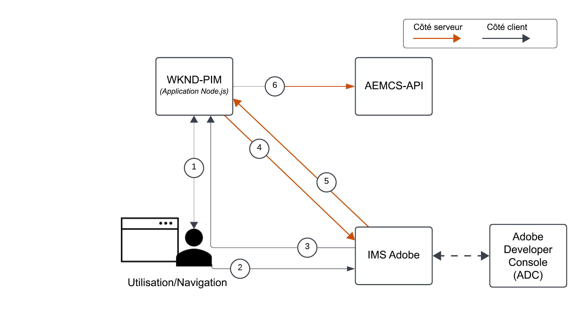
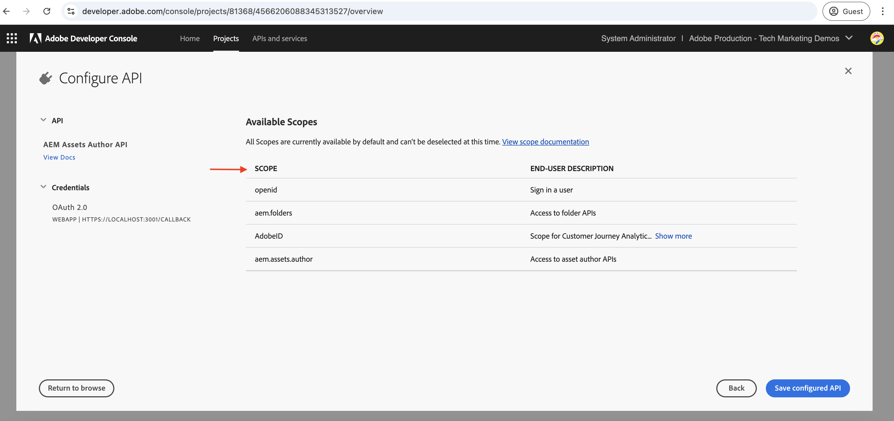
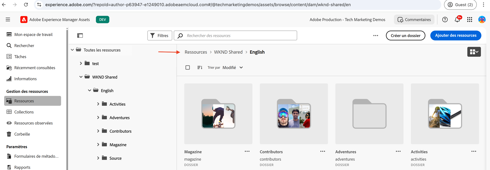
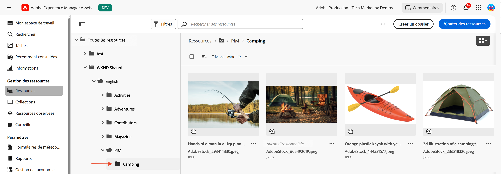
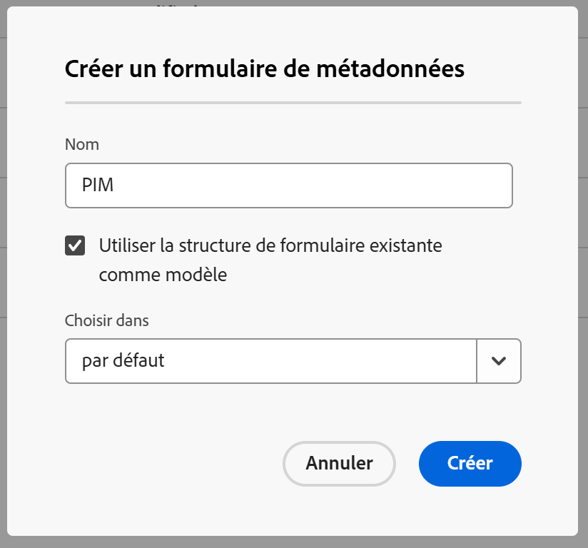
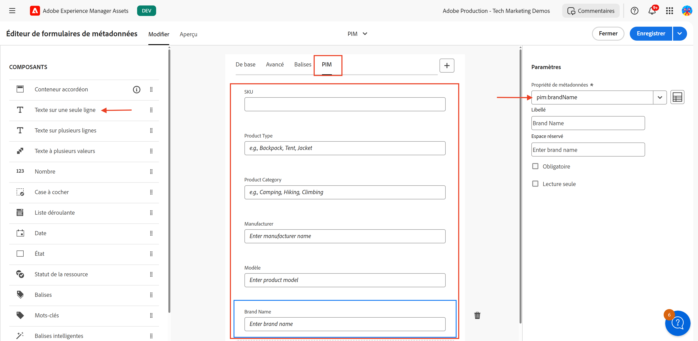
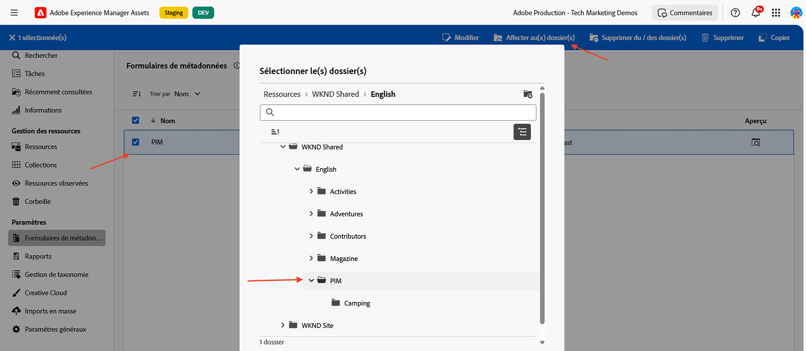
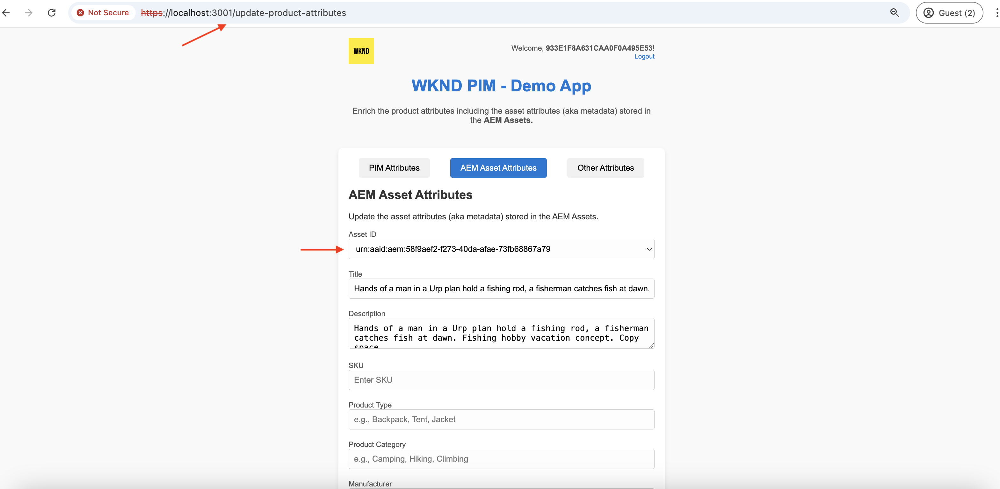

# Appeler des API AEM basées sur OpenAPI à l’aide de l’authentification des applications Web OAuth

Découvrez comment appeler les API AEM basées sur OpenAPI sur AEM as a Cloud Service à l’aide de l’authentification basée sur l’utilisateur ou l’utilisatrice à partir d’une application web personnalisée qui utilise l’application Web OAuth.

L’authentification des applications Web OAuth est idéale pour les applications web avec des composants front-end et _back-end_ qui doivent **accéder aux API AEM au nom d’une personne**. Elle utilise le type d’octroi OAuth 2.0 _authorization_code_ pour obtenir un jeton d’accès au nom de la personne afin d’accéder aux API AEM. Pour plus d’informations, consultez [Différence entre les informations d’identification OAuth de serveur à serveur, d’application web et d’application d’une seule page](../overview.md#difference-between-oauth-server-to-server-vs-web-app-vs-single-page-app-credentials).

## Ce que vous apprenez{#what-you-learn}

Dans cet article, vous apprenez ce qui suit :

- Configurer un projet Adobe Developer Console (ADC) pour accéder à l’API de création Assets à l’aide de l’authentification des _applications Web OAuth_.

- Implémenter le flux d’authentification des applications Web OAuth dans une application web personnalisée.
   - Authentification de l’utilisateur ou de l’utilisatrice IMS et autorisation de l’application.
   - Récupération du jeton d’accès spécifique à l’utilisateur ou à l’utilisatrice.
   - Accès aux API AEM basées sur OpenAPI à l’aide du jeton d’accès spécifique à l’utilisateur ou à l’utilisatrice.

Avant de commencer, vérifiez les points suivants :

- Section [Accès aux API Adobe et concepts associés](../overview.md#accessing-adobe-apis-and-related-concepts).
- Article [Configuration des API AEM basées sur OpenAPI](../setup.md).

## Exemple d’application web : vue d’ensemble et flux fonctionnel de WKND-PIM

Examinons l’exemple d’application web, la gestion des informations sur les produits (PIM) WKND et son flux fonctionnel.

L’application WKND PIM est un exemple d’application web conçue pour gérer les attributs de produit et les métadonnées de ses ressources stockées dans AEM as a Cloud Service. Cet exemple montre comment les applications web peuvent s’intégrer de manière transparente aux API Adobe pour fournir des workflows efficaces et axés sur l’utilisateur ou l’utilisatrice.

Le projet Adobe Developer Console (ADC) est configuré pour accéder à l’API de création Assets à l’aide de l’authentification de l’application web OAuth. Il fournit les _client_id_ et _client_secret_ nécessaires à l’application web WKND-PIM pour lancer le flux d’octroi _authorization_code_.

>[!VIDEO](https://video.tv.adobe.com/v/3442759?quality=12&learn=on&captions=fre_fr)


Le diagramme suivant illustre le flux fonctionnel de l’application web WKND-PIM _obtention de jetons d’accès spécifiques à l’utilisateur ou à l’utilisatrice pour interagir avec l’API de création Assets_.



1. L’application web lance le processus en redirigeant l’utilisateur ou l’utilisatrice vers le système de gestion des identités (IMS) Adobe pour l’authentification.
1. Avec la redirection, l’application web transmet les _client_id_ et _redirect_uri_ requis à IMS.
1. IMS authentifie l’utilisateur ou l’utilisatrice et le renvoie à l’URI _redirect_uri_ spécifié avec un _authorization_code_.
1. L’application web échange l’_authorization_code_ avec IMS contre un jeton d’accès spécifique à l’utilisateur ou à l’utilisatrice, à l’aide de ses _client_id_ et _client_secret_.
1. Une fois la validation réussie, IMS émet le _jeton d’accès_ spécifique à l’utilisateur ou à l’utilisatrice.
1. L’application web utilise en toute sécurité le _jeton d’accès_ pour interagir avec l’API de création Assets, ce qui permet à la personne de récupérer ou de mettre à jour les métadonnées des ressources de produit.

L’application web WKND-PIM est développée à l’aide de [Node.js](https://nodejs.org/fr) et [Express](https://expressjs.com/). Express agit comme le serveur qui gère en toute sécurité les secrets privés et les jetons d’accès spécifiques à l’utilisateur ou à l’utilisatrice.

D’autres piles web (Java, Python, basées sur .NET, etc.) peuvent être utilisées pour créer des applications web qui s’intègrent aux API Adobe à l’aide des approches illustrées dans ce tutoriel.

## Comment utiliser ce tutoriel{#how-to-use-this-tutorial}

Vous pouvez consulter la section [Fragments de code de clé d’application web](#review-web-app-key-code-snippets) pour comprendre le flux d’authentification des applications web OAuth et les fragments de code d’appels API utilisés dans l’application web WKND-PIM. Ou passez directement à la section [Configuration et exécution de l’application web](#setup-run-web-app) pour configurer et exécuter l’application web WKND-PIM sur votre ordinateur local afin de comprendre le flux d’authentification de l’application web OAuth et les appels API.

## Vérifier les fragments de code de clé d’application web{#review-web-app-key-code-snippets}

Examinons les fragments de code de clé utilisés dans l’application web WKND-PIM pour comprendre le flux d’authentification de l’application Web OAuth et les appels API.

### Télécharger le code d’application web WKND-PIM

1. Téléchargez le fichier zip [application web WKND-PIM](../assets/web-app/wknd-pim-demo-web-app.zip) et extrayez-le.

1. Accédez au dossier extrait et ouvrez le fichier `.env.example` dans votre éditeur de code préféré. Vérifiez les paramètres de configuration requis.

   ```plaintext
   ########################################################################
   # Adobe IMS, Adobe Developer Console (ADC), and AEM Assets Information
   ########################################################################
   # Adobe IMS OAuth endpoints
   ADOBE_IMS_AUTHORIZATION_ENDPOINT=https://ims-na1.adobelogin.com/ims/authorize/v2
   ADOBE_IMS_TOKEN_ENDPOINT=https://ims-na1.adobelogin.com/ims/token/v3
   ADOBE_IMS_USERINFO_ENDPOINT=https://ims-na1.adobelogin.com/ims/userinfo/v2
   
   # Adobe Developer Console (ADC) Project's OAuth Web App credential
   ADC_CLIENT_ID=<ADC Project OAuth Web App credential ClientID>
   ADC_CLIENT_SECRET=<ADC Project OAuth Web App credential Client Secret>
   ADC_SCOPES=<ADC Project OAuth Web App credential credential Scopes>
   
   # AEM Assets Information
   AEM_ASSET_HOSTNAME=<AEM Assets Hostname, e.g., https://author-p63947-e1502138.adobeaemcloud.com/>
   AEM_ASSET_IDS=< AEM Asset IDs Comma Seperated, e.g., urn:aaid:aem:9f20a8ce-934a-4560-8720-250e529fbb17,urn:aaid:aem:6e0123cd-8a67-4d1f-b721-1b3da987d831>
   
   ################################################
   # Web App Information
   ################################################
   # The port number on which this server (web app) will run
   PORT = 3000
   
   # The URL to which the user will be redirected after the OAuth flow is complete
   REDIRECT_URI=https://localhost:3001/callback
   
   # The Express (express-session) uses this secret to encrypt and verify the authenticity of that cookie
   EXPRESS_SESSION_SECRET=<Express Session Secret>
   ```

   Vous devez remplacer les espaces réservés par les valeurs réelles du projet Adobe Developer Console (ADC) et de l’instance AEM as a Cloud Service Assets.

### Authentification des utilisateurs et utilisatrices IMS et autorisation des applications

Examinons le code qui lance l’authentification des utilisateurs et utilisatrices IMS et l’autorisation des applications. Pour vérifier ou mettre à jour les métadonnées de la ressource, la personne doit s’authentifier auprès d’Adobe IMS et autoriser l’application web WKND-PIM à accéder à l’API de création Assets en son nom.

Lors de la toute première tentative de connexion, la personne doit fournir le consentement pour permettre à l’application web WKND-PIM d’accéder à l’API de création Assets en son nom.


1. Le fichier `routes/update-product-attributes.js` vérifie si la session [Express](https://www.npmjs.com/package/express-session) de l’utilisateur ou de l’utilisatrice dispose d’un jeton d’accès. Dans le cas contraire, il redirige la personne vers l’itinéraire `/auth`.

   ```javascript
   ...
   // The update-product-attributes route, shows the product attributes form with tabs
   router.get("/update-product-attributes", async (req, res) => {
     // Check if the user is authenticated, if not redirect to the auth route
     if (!req.session.accessToken) {
         return res.redirect("/auth");
     }
     ...
   });
   ```

1. Dans le fichier `routes/adobe-ims-auth.js`, l’itinéraire `/auth` lance l’authentification de l’utilisateur ou de l’utilisatrice IMS et le flux d’autorisation de l’application. Notez que les paramètres _client_id_, _redirect_uri_ et _response_type_ sont transmis au point d’entrée d’autorisation Adobe IMS.

   ```javascript
   ...
   // Route to initiate Adobe IMS user authentication
   router.get("/auth", (req, res) => {
     // Redirect user to Adobe IMS authorization endpoint
     try {
         // Constructing the authorization URL
         const params = new URLSearchParams({
         client_id: adobeADCConfig.clientId,
         redirect_uri: redirectUri,
         response_type: "code",
         });
   
         // Append scopes if defined in configuration
         if (adobeADCConfig?.scopes) params.append("scope", adobeADCConfig.scopes);
   
         // Redirect user to Adobe IMS authorization URL
         const imsAuthorizationUrl = `${
         adobeIMSConfig.authorizationEndpoint
         }?${params.toString()}`;
   
         res.redirect(imsAuthorizationUrl);
     } catch (error) {
         console.error("Error initiating Adobe IMS authentication:", error);
         res.status(500).send("Unable to initiate authentication");
     }
   });
   ...
   ```

Si la personne n’est pas authentifiée sur Adobe IMS, la page de connexion d’Adobe ID s’affiche et demande à la personne de s’authentifier.

Si la personne est déjà authentifiée, elle est redirigée vers l’URI _redirect_uri_ spécifié de l’application web WKND-PIM avec un code d’autorisation _authorization_code_.

### Récupération de jeton d’accès

L’application web WKND-PIM échange en toute sécurité le code _authorization_code_ avec Adobe IMS contre un jeton d’accès spécifique à l’utilisateur ou à l’utilisatrice à l’aide des _client_id_ et _client_secret_ des informations d’identification de l’application Web OAuth du projet ADC.

Dans le fichier `routes/adobe-ims-auth.js`, l’itinéraire `/callback` échange le code _authorization_code_ avec Adobe IMS contre un jeton d’accès spécifique à l’utilisateur ou à l’utilisatrice.

```javascript
...
// Callback route to exchange authorization code for access token
router.get("/callback", async (req, res) => {
  // Extracting authorization code from the query parameters
  const authorizationCode = req.query.code;

  if (!authorizationCode) {
    return res.status(400).send("Missing authorization code");
  }

  // Exchange authorization code for access token
  try {
    // Fetch access token from Adobe IMS token endpoint
    const response = await fetch(adobeIMSConfig.tokenEndpoint, {
      method: "POST",
      headers: {
        "Content-Type": "application/x-www-form-urlencoded",
        Authorization: `Basic ${Buffer.from(
          `${adobeADCConfig.clientId}:${adobeADCConfig.clientSecret}`
        ).toString("base64")}`,
      },
      body: new URLSearchParams({
        code: authorizationCode,
        grant_type: "authorization_code",
      }),
    });

    if (!response.ok) {
      console.error("Failed to fetch access token:", response.statusText);
      return res.status(500).send("Failed to fetch access token");
    }

    const data = await response.json();

    if (!data.access_token) {
      console.error("Access token missing in the response:", data);
      return res.status(500).send("Invalid response from token endpoint");
    }

    // For debugging purposes
    console.log("Access token:", data.access_token);

    // Store the access token in the session
    req.session.accessToken = data.access_token;

    // Redirect user to update product attributes
    res.redirect("/update-product-attributes");
  } catch (error) {
    console.error("Error exchanging authorization code:", error);
    res.status(500).send("Error during token exchange");
  }
});
```

Le jeton d’accès est stocké dans la [session Express](https://www.npmjs.com/package/express-session) pour les requêtes suivantes à l’API de création Assets.

### Accès aux API AEM basées sur OpenAPI à l’aide du jeton d’accès

L’application web WKND-PIM utilise en toute sécurité le jeton d’accès spécifique à l’utilisateur ou à l’utilisatrice pour interagir avec l’API de création Assets, ce qui permet à la personne de récupérer ou de mettre à jour les métadonnées des ressources de produit.

Dans le fichier `routes/invoke-aem-apis.js`, les itinéraires `/api/getAEMAssetMetadata` et `/api/updateAEMAssetMetadata` appellent les API de création Assets à l’aide du jeton d’accès.

```javascript
...
// API Route: Get AEM Asset Metadata
router.get("/api/getAEMAssetMetadata", async (req, res) => {
  const assetId = req.query.assetId;
  const bucketName = getBucketName(aemAssetsConfig.hostname);

  if (!assetId || !bucketName) {
    return res.status(400).json({ error: "Missing AEM Information" });
  }

  // Get the access token from the session
  const accessToken = req.session.accessToken;

  if (!accessToken) {
    return res.status(401).json({ error: "Not Authenticated with Adobe IMS" });
  }

  try {
    const assetMetadata = await invokeGetAssetMetadataAPI(
      bucketName,
      assetId,
      accessToken
    );

    const filteredMetadata = getFilteredMetadata(JSON.parse(assetMetadata));
    res.status(200).json(filteredMetadata);
  } catch (error) {
    console.error("Error getting asset metadata:", error.message);
    res.status(500).json({ error: `Internal Server Error: ${error.message}` });
  }
});

// Helper function to invoke the AEM API to get asset metadata
async function invokeGetAssetMetadataAPI(bucketName, assetId, accessToken) {
  const apiUrl = `https://${bucketName}.adobeaemcloud.com/adobe/assets/${assetId}/metadata`;


  // For debugging purposes
  console.log("API URL:", apiUrl);
  console.log("Access Token:", accessToken);
  console.log("API Key:", adobeADCConfig.clientId);

  try {
    const response = await fetch(apiUrl, {
      method: "GET",
      headers: {
        "If-None-Match": "string",
        "X-Adobe-Accept-Experimental": "1",
        Authorization: `Bearer ${accessToken}`,
        "X-Api-Key": adobeADCConfig.clientId,
      },
    });

    console.log("Response Status:", response.status);

    if (!response.ok) {
      throw new Error(`AEM API Error: ${response.statusText}`);
    }

    return await response.text();
  } catch (error) {
    throw new Error(`Failed to fetch asset metadata: ${error.message}`);
  }
}

// Helper function to filter the metadata properties like pim: and dc:
function getFilteredMetadata(data) {
  if (!data || !data.assetMetadata) {
    throw new Error("Invalid metadata structure received from API");
  }

  const properties = data.assetMetadata;
  return Object.keys(properties).reduce((filtered, key) => {
    if (
      key.startsWith("pim:") ||
      key === "dc:title" ||
      key === "dc:description"
    ) {
      filtered[key] = properties[key];
    }
    return filtered;
  }, {});
}

// API Route: Update AEM Asset Metadata
router.post("/api/updateAEMAssetMetadata", async (req, res) => {
  const { assetId, metadata } = req.body;

  if (!assetId || !metadata || typeof metadata !== "object") {
    return res.status(400).json({ error: "Invalid or Missing Metadata" });
  }

  const bucketName = getBucketName(aemAssetsConfig.hostname);
  if (!bucketName) {
    return res.status(400).json({ error: "Missing AEM Information" });
  }

  const accessToken = req.session.accessToken;
  if (!accessToken) {
    return res.status(401).json({ error: "Not Authenticated with Adobe IMS" });
  }

  try {
    const updatedMetadata = await invokePatchAssetMetadataAPI(
      bucketName,
      assetId,
      metadata,
      accessToken
    );
    res.status(200).json(updatedMetadata);
  } catch (error) {
    console.error("Error updating asset metadata:", error.message);
    res.status(500).json({ error: `Internal Server Error: ${error.message}` });
  }
});

// Helper function to invoke the AEM API to update asset metadata
async function invokePatchAssetMetadataAPI(
  bucketName,
  assetId,
  metadata,
  accessToken
) {
  const apiUrl = `https://${bucketName}.adobeaemcloud.com/adobe/assets/${assetId}/metadata`;
  const headers = {
    "Content-Type": "application/json-patch+json",
    "If-Match": "*",
    "X-Adobe-Accept-Experimental": "1",
    Authorization: `Bearer ${accessToken}`,
    "X-Api-Key": adobeADCConfig.clientId,
  };

  try {
    const response = await fetch(apiUrl, {
      method: "PATCH",
      headers,
      body: JSON.stringify(getTransformedMetadata(metadata)),
    });

    if (!response.ok) {
      throw new Error(`AEM API Error: ${response.statusText}`);
    }

    return await response.json();
  } catch (error) {
    throw new Error(`Failed to update asset metadata: ${error.message}`);
  }
}

// Helper function to transform metadata into JSON Patch format, e.g. [{ op: "add", path: "dc:title", value: "New Title" }]
function getTransformedMetadata(metadata) {
  return Object.keys(metadata).map((key) => ({
    op: "add",
    path: `/${key}`,
    value: metadata[key],
  }));
}
```

Les appels API AEM basés sur OpenAPI sont effectués côté serveur (middleware Express) et non directement côté client (navigateur) afin de s’assurer que le jeton d’accès est géré en toute sécurité et non exposé côté client.

### Actualisation du jeton d’accès

Pour actualiser le jeton d’accès avant son expiration, vous pouvez implémenter le flux de jeton d’actualisation. Toutefois, pour que le tutoriel reste simple, l’application web WKND-PIM n’implémente pas le flux de jeton d’actualisation.


>[!TIP]
>
>Vous pouvez suivre la section suivante pour tester l’application web WKND-PIM sur votre ordinateur local et acquérir une expérience pratique du flux d’authentification de l’application Web OAuth et des appels API.

## Configurer et exécuter l’application web

Configurez et exécutez l’application web WKND-PIM sur votre ordinateur local pour comprendre le flux d’authentification de l’application Web OAuth et les appels API.

### Prérequis

Les éléments suivants sont requis afin de terminer ce tutoriel :

- Environnement AEM as a Cloud Service modernisé avec les éléments suivants :
   - AEM version `2024.10.18459.20241031T210302Z` ou version ultérieure.
   - Profils de produit avec un nouveau style (si l’environnement a été créé avant novembre 2024)

  Consultez l’article [Configuration d’API AEM basées sur OpenAPI](../setup.md) pour plus d’informations.

- L’exemple de projet [WKND Sites](https://github.com/adobe/aem-guides-wknd?#aem-wknd-sites-project) doit être déployé dessus.

- Accédez à [Adobe Developer Console](https://developer.adobe.com/developer-console/docs/guides/getting-started).

- Installez [Node.js](https://nodejs.org/fr/) sur votre ordinateur local pour exécuter l’exemple d’application NodeJS.

- Installez un [local-ssl-proxy](https://www.npmjs.com/package/local-ssl-proxy#local-ssl-proxy) sur votre ordinateur local pour créer un proxy HTTP SSL local à l’aide d’un certificat autosigné.


### Étapes de développement

Les étapes de développement générales sont les suivantes :

1. Configurer le projet ADC
   1. Ajouter l’API de création Assets
   1. Configurer les informations d’identification de l’application Web OAuth
1. Configurer l’instance AEM pour activer la communication du projet ADC
1. Dans AEM, créer et appliquer un schéma de métadonnées de ressource
1. Configurer et exécuter l’application web WKND-PIM
1. Vérifier le flux de bout en bout

### Configurer le projet ADC

L’étape Configurer le projet ADC est _répétée_ à partir de la [Configuration des API AEM basées sur OpenAPI](../setup.md). Elle est répétée pour ajouter l’API de création Assets et configurer sa méthode d’authentification en tant qu’application Web OAuth.

1. Ouvrez le projet souhaité à partir d’[Adobe Developer Console](https://developer.adobe.com/console/projects).

1. Pour ajouter des API AEM, cliquez sur le bouton **Ajouter une API**.

   

1. Dans la boîte de dialogue _Ajouter une API_, filtrez par _Experience Cloud_ et sélectionnez la vignette **API de création AEM Assets** puis cliquez sur **Suivant**.

   

   >[!TIP]
   >
   >Si la carte d’API AEM **souhaitée est désactivée** et _Pourquoi est-ce désactivé ?_ informations indiquent le message **Licence requise** l’une des raisons peut être que vous n’avez PAS modernisé votre environnement AEM as a Cloud Service. Pour plus d’informations, consultez [Modernisation de l’environnement AEM as a Cloud Service](../setup.md#modernization-of-aem-as-a-cloud-service-environment).

1. Ensuite, dans la boîte de dialogue _Configurer l’API_, sélectionnez l’option d’authentification **Authentification de l’utilisateur ou de l’utilisatrice** et cliquez sur **Suivant**.

   

1. Dans la boîte de dialogue _Configurer l’API_ suivante, sélectionnez l’option d’authentification **Application Web OAuth** et cliquez sur **Suivant**.

   

1. Dans la boîte de dialogue _Configurer l’application Web OAuth_, saisissez les informations suivantes, puis cliquez sur **Suivant**.
   - URI de redirection par défaut : `https://localhost:3001/callback`
   - Modèle d’URI de redirection : `https://localhost:3001/callback`

   

1. Vérifiez les portées disponibles et cliquez sur **Enregistrer l’API configurée**.

   

1. Examinez l’API AEM et la configuration de l’authentification.

   

   

### Configurer l’instance AEM pour activer la communication du projet ADC

Suivez les instructions de l’article [Configurer les API AEM basées sur OpenAPI](../setup.md#configure-the-aem-instance-to-enable-adc-project-communication) pour configurer l’instance AEM afin d’activer la communication de projet ADC.

### Créer et appliquer un schéma de métadonnées de ressource

Par défaut, le projet WKND Sites ne dispose pas du schéma de métadonnées de ressource requis pour afficher les attributs du produit. Créons et appliquons le schéma de métadonnées de la ressource à un dossier de ressources dans l’instance AEM.

1. Connectez-vous à l’instance Asset AEM as a Cloud Service. À l’aide de la [vue Asset](https://experienceleague.adobe.com/fr/docs/experience-manager-learn/assets/authoring/switch-views), accédez au dossier `/content/dam/wknd-shared/en`.

   

1. Créez un dossier **PIM** et, à l’intérieur de celui-ci, créez le dossier **Camping**, puis chargez des [exemples d’images](../assets/web-app/camping-gear-imgs.zip) dans le dossier **Camping**.

   

Créons ensuite le schéma de métadonnées spécifique à l’attribut PIM et appliquons-le au dossier **PIM**.

1. Accédez à l’option **Paramètres** > **Formulaires de métadonnées** dans le rail de gauche, puis cliquez sur le bouton **Créer**.

1. Dans la boîte de dialogue **Créer un formulaire de métadonnées**, saisissez les détails suivants, puis cliquez sur **Créer**.
   - Nom : `PIM`
   - Utiliser la structure de formulaire existante comme modèle : `Check`
   - Choisir dans : `default`

   

1. Cliquez sur l’icône **+** pour ajouter un nouvel onglet **PIM** et ajoutez-y des composants **Une seule ligne de texte**. Les noms des propriétés de métadonnées doivent commencer par le préfixe `pim:`.

   

   | Libellé | Espace réservé | Propriété de métadonnées |
   | --- | --- | --- |
   | SKU | Saisir l’ID de SKU | `pim:sku` |
   | Type de produit | Par exemple, sac à dos, tente, veste | `pim:productType` |
   | Catégorie de produit | Par exemple, camping, randonnée pédestre, escalade | `pim:productCategory` |
   | Fabricant | Saisir le nom du fabricant | `pim:manufacturer` |
   | Modèle | Saisir le nom du modèle | `pim:model` |
   | Nom de la marque | Saisir le nom de la marque | `pim:brandName` |

1. Cliquez sur **Enregistrer** et **Fermer** pour enregistrer le formulaire de métadonnées.

1. Enfin, appliquez le schéma de métadonnées **PIM** au dossier **PIM**.

   

Grâce aux étapes ci-dessus, les ressources du dossier **PIM** sont prêtes à stocker les métadonnées des attributs de produit.

### Configurer et exécuter l’application web WKND-PIM

1. Téléchargez le fichier zip [application web WKND-PIM](../assets/web-app/wknd-pim-demo-web-app.zip) et extrayez-le.

1. Accédez au dossier extrait et copiez le fichier `.env.example` vers `.env`.

1. Mettez à jour le fichier `.env` avec les paramètres de configuration requis à partir du projet Adobe Developer Console (ADC) et de l’instance Assets AEM as a Cloud Service.

   ```plaintext
   ########################################################################
   # Adobe IMS, Adobe Developer Console (ADC), and AEM Assets Information
   ########################################################################
   # Adobe IMS OAuth endpoints
   ADOBE_IMS_AUTHORIZATION_ENDPOINT=https://ims-na1.adobelogin.com/ims/authorize/v2
   ADOBE_IMS_TOKEN_ENDPOINT=https://ims-na1.adobelogin.com/ims/token/v3
   ADOBE_IMS_USERINFO_ENDPOINT=https://ims-na1.adobelogin.com/ims/userinfo/v2
   
   # Adobe Developer Console (ADC) Project OAuth Web App credential
   ADC_CLIENT_ID=e1adsfsd59384320bbe4f9298f00b7ab
   ADC_CLIENT_SECRET=p8e-Mdfgfdsg43RHugVRTEOyWlmEU5m
   ADC_SCOPES=AdobeID,openid,aem.folders,aem.assets.author
   
   # AEM Assets Information
   AEM_ASSET_HOSTNAME=https://author-p3947-e1542138.adobeaemcloud.com/
   AEM_ASSET_IDS=urn:aaid:aem:aa689a9f-04da-4fbb-b460-74a5b6a69090,urn:aaid:aem:e4fdb6f6-1007-4e84-9726-a9522931786a
   
   ################################################
   # Web App Information
   ################################################
   # The port number on which this server (web app) will run
   PORT = 3000
   
   # The URL to which the user will be redirected after the OAuth flow is complete
   REDIRECT_URI=http://localhost:3000/auth/callback
   
   # The Express (express-session) uses this secret to encrypt and verify the authenticity of that cookie
   # For demonstration purposes, this is a simple secret. In production, you should use a strong secret
   EXPRESS_SESSION_SECRET=1234554321
   ```

   Les `AEM_ASSET_IDS` sont la valeur de propriété `jcr:uuid` des images chargées dans le dossier **Camping**. Consultez cette [section](./invoke-api-using-oauth-s2s.md#review-the-api) pour plus d’informations.

1. Ouvrez une fenêtre de terminal et accédez au dossier extrait. Installez les dépendances requises à l’aide de la commande suivante.

   ```bash
   $ npm install
   ```

1. Démarrez l’application web WKND-PIM à l’aide de la commande suivante.

   ```bash
   $ npm start
   ```

1. Exécutez le proxy HTTP SSL local à l’aide de la commande suivante.

   ```bash
   $ local-ssl-proxy --source 3001 --target 3000 --cert ./ssl/server.crt --key ./ssl/server.key
   ```

   Le proxy HTTP SSL local est utilisé, car IMS nécessite que l’URI de redirection soit HTTPS.

### Vérifier le flux de bout en bout

1. Ouvrez un navigateur et accédez à `https://localhost:3001` pour accéder à l’application web WKND-PIM. Acceptez l’avertissement de certificat auto-signé.

   

1. Cliquez sur **Essayer maintenant** pour consulter et mettre à jour les métadonnées des attributs de produit. Cela lance l’authentification de l’utilisateur ou de l’utilisatrice IMS et le flux d’autorisation de l’application.

1. Connectez-vous avec vos informations d’identification Adobe ID et donnez votre consentement pour permettre à l’application web WKND-PIM d’accéder à l’API de création Assets en votre nom.

1. Dans l’itinéraire/la page `https://localhost:3001/update-product-attributes`, cliquez sur l’onglet **Attributs de ressource AEM**. Dans la liste déroulante **ID de ressource**, sélectionnez un ID de ressource pour afficher les métadonnées de la ressource.

   

1. Mettez à jour les métadonnées de la ressource, puis cliquez sur **Mettre à jour les attributs de ressource AEM** pour mettre à jour les métadonnées de la ressource.

   

>[!IMPORTANT]
>
>Si la personne authentifiée ne dispose pas des autorisations nécessaires pour réviser ou mettre à jour les métadonnées de la ressource, les API AEM basées sur OpenAPI renvoient une erreur 403 Interdit. Ainsi, même si la personne est authentifiée et possède un jeton d’accès IMS valide, elle ne peut pas accéder aux ressources AEM sans les autorisations requises.


### Vérifier le code d’application

Examinons la structure de code générale et les principaux points d’entrée de l’application web WKND-PIM. L’application est développée à l’aide de Node.js + Express.

1. Le `app.js` est le principal point d’entrée de l’application. Il initialise l’application Express, configure la session et monte les itinéraires.

1. Le dossier `public` contient les ressources statiques telles que CSS, JavaScript et des images. Le fichier `script.js` contient le code JavaScript côté client pour interagir avec les itinéraires `/api/getAEMAssetMetadata` et `/api/updateAEMAssetMetadata`.

1. Le dossier `routes` contient les itinéraires Express :
   1. `index.js` : itinéraire principal qui effectue le rendu de la page d’accueil.
   1. `update-product-attributes.js` : itinéraire qui effectue le rendu des attributs de produit à partir des onglets, vérifie également la session Express pour le jeton d’accès.
   1. `adobe-ims-auth.js` : itinéraire qui lance l’authentification de l’utilisateur ou de l’utilisatrice Adobe IMS et le flux d’autorisation de l’application.
   1. `invoke-aem-apis.js` : itinéraire qui appelle les API AEM basées sur OpenAPI à l’aide du jeton d’accès spécifique à l’utilisateur ou à l’utilisatrice.

1. Le dossier `views` contient les modèles EJS pour effectuer le rendu des pages HTML.

1. Le dossier `utils` contient les fonctions d’utilitaire.

1. Le dossier `ssl` contient le certificat auto-signé et les fichiers de clé pour exécuter le proxy HTTP SSL local.

Vous pouvez développer ou intégrer l’application web existante aux API Adobe à l’aide d’autres technologies côté serveur telles que Java, Python ou .NET.

## Résumé

Dans ce tutoriel, vous avez appris à appeler des API AEM basées sur OpenAPI sur AEM as a Cloud Service à partir d’une application web personnalisée à l’aide de l’authentification de l’application Web OAuth. Vous avez examiné les fragments de code de clé utilisés dans l’application web WKND-PIM pour comprendre le flux d’authentification de l’application Web OAuth.

Vous pouvez utiliser le tutoriel comme référence pour intégrer les API AEM basées sur OpenAPI à vos applications web personnalisées afin de fournir des workflows efficaces et axés sur l’utilisateur ou l’utilisatrice.

## Ressources supplémentaires

- [Guide de mise en œuvre de l’authentification des utilisateurs et utilisatrices](https://developer.adobe.com/developer-console/docs/guides/authentication/UserAuthentication/implementation)
- [Autoriser la demande](https://developer.adobe.com/developer-console/docs/guides/authentication/UserAuthentication/ims#authorize-request)
- [Récupération des jetons d’accès](https://developer.adobe.com/developer-console/docs/guides/authentication/UserAuthentication/ims#fetching-access-tokens)
- [Actualisation des jetons d’accès](https://developer.adobe.com/developer-console/docs/guides/authentication/UserAuthentication/ims#refreshing-access-tokens)
