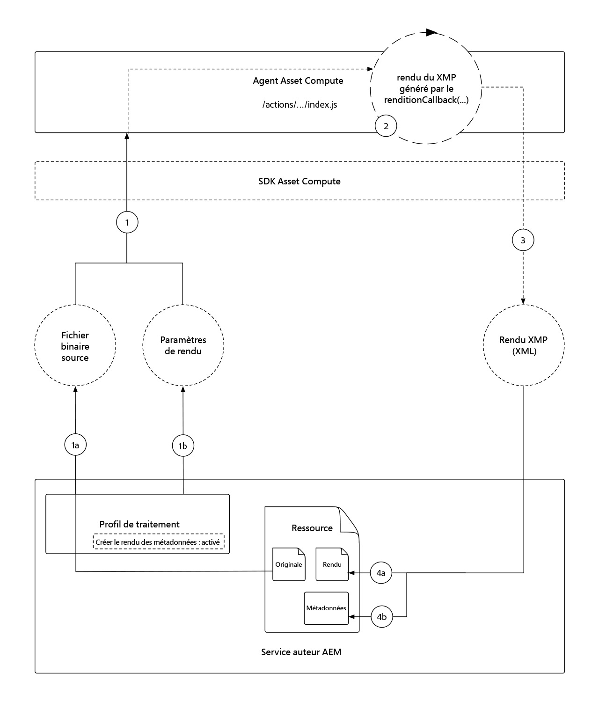
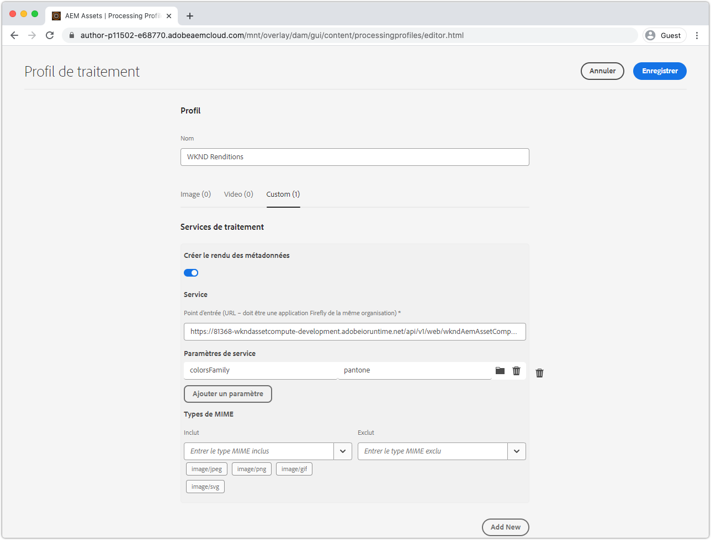
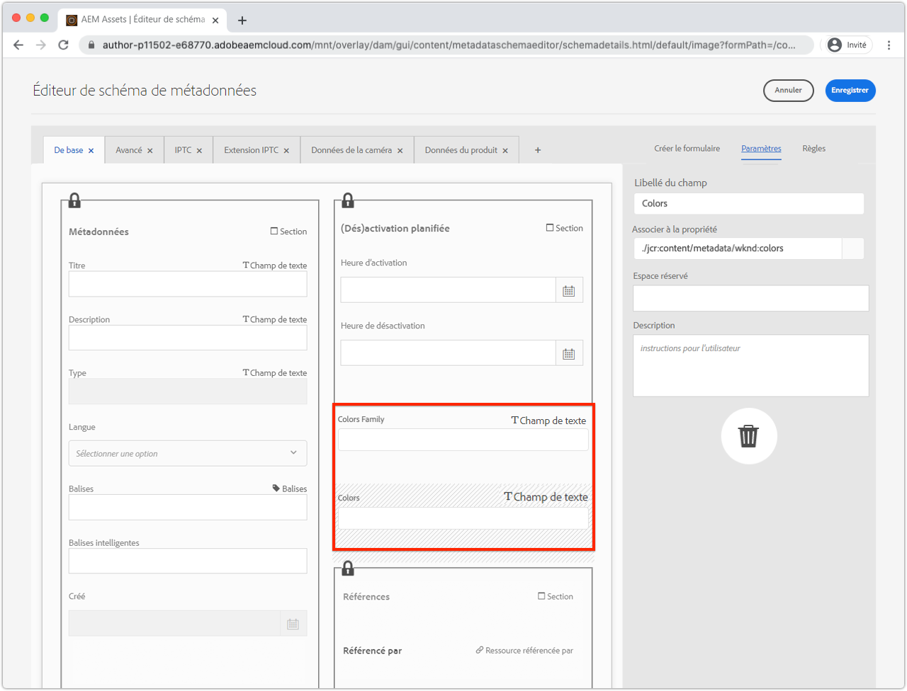
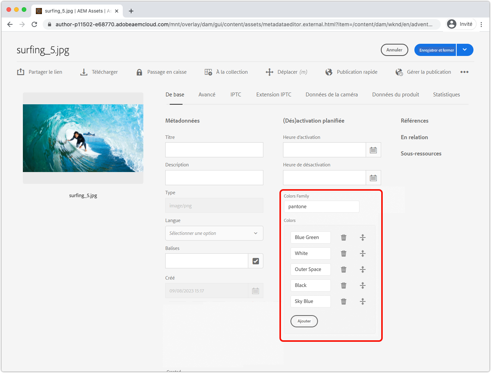
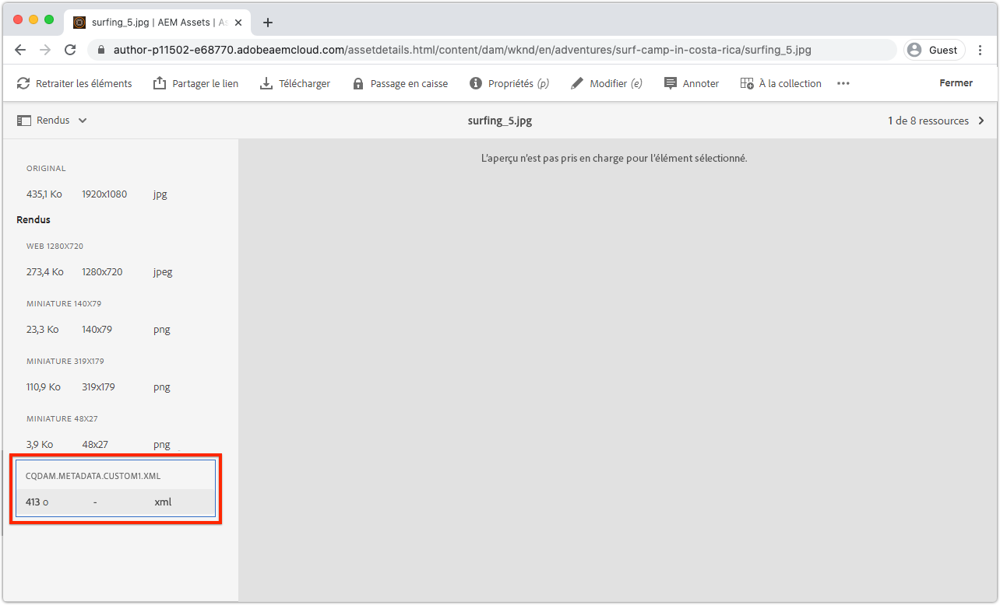

# Développement d’un intervenant de métadonnées de calcul de ressources

Les agents de traitement de l’actif personnalisé peuvent produire des données XMP (XML) qui sont renvoyées à AEM et stockées en tant que métadonnées sur un actif.

Les cas d&#39;utilisation courants sont les suivants :

+ Intégrations à des systèmes tiers, tels qu’un PIM (Product Information Management System), dans lequel des métadonnées supplémentaires doivent être récupérées et stockées sur la ressource
+ Intégrations à des services d’Adobe, tels que Content and Commerce AI, afin d’enrichir les métadonnées de ressources par des attributs d’apprentissage automatique supplémentaires.
+ Déplacement des métadonnées du fichier à partir de son fichier binaire et stockage de celui-ci en tant que métadonnées de fichier dans AEM en tant que Cloud Service

## Ce que vous allez faire

>[!VIDEO](https://video.tv.adobe.com/v/327313?quality=12&learn=on)

Dans ce didacticiel, nous allons créer un programme de travail des métadonnées de calcul des ressources qui dérive les couleurs les plus couramment utilisées dans un fichier d&#39;image et écrit les noms des couleurs dans les métadonnées du fichier dans AEM. Bien que le programme de travail lui-même soit de base, ce didacticiel l’utilise pour explorer comment les collaborateurs d’Asset Compute peuvent être utilisés pour écrire des métadonnées sur des ressources en AEM en tant que Cloud Service.

## Flux logique d’un appel d’opérateur de métadonnées Asset Compute

L’appel des opérateurs de métadonnées Asset Compute est presque identique à celui des opérateurs [générateurs de rendus](../develop/worker.md)binaires, la Principale différence étant que le type de retour est un rendu XMP (XML) dont les valeurs sont également écrites dans les métadonnées du fichier.

Les agents d’Asset Compute implémentent le contrat d’API de travail SDK Asset Compute dans la `renditionCallback(...)` fonction, qui est conceptuellement :

+ __Input :__ Paramètres binaires d’origine d’une ressource AEM et paramètres de Profil de traitement
+ __Output :__ Un rendu XMP (XML) conservait la ressource AEM en tant que rendu et les métadonnées de la ressource.



1. Le service Auteur AEM appelle le programme de travail des métadonnées Asset Compute, en fournissant le fichier binaire __(1a)__ original et __(1b)__ tous les paramètres définis dans le Profil de traitement.
1. Le SDK Asset Compute orchestre l’exécution de la `renditionCallback(...)` fonction personnalisée du programme de travail des métadonnées Asset Compute, en dérivant un rendu XMP (XML), en fonction du binaire de la ressource __(1a)__ et des paramètres de Profil de traitement __(1b)__.
1. Le programme de travail Asset Compute enregistre la représentation XMP (XML) dans `rendition.path`.
1. Les données XMP (XML) écrites sur `rendition.path` sont transportées via le SDK Asset Compute vers le service d’auteur AEM et les exposent sous la forme __(4a)__ d’un rendu de texte et __(4b)__ conservées dans le noeud de métadonnées de la ressource.

## Configuration du fichier manifest.yml{#manifest}

Tous les employés Asset Compute doivent être enregistrés dans [manifest.yml](../develop/manifest.md).

Ouvrez le projet `manifest.yml` et ajoutez une entrée de collaborateur qui configure le nouveau collaborateur, dans ce cas `metadata-colors`.

_Rappelez-vous `.yml` est sensible aux espaces blancs._

```
packages:
  __APP_PACKAGE__:
    license: Apache-2.0
    actions: 
      worker:
        function: actions/worker/index.js 
        web: 'yes' 
        runtime: 'nodejs:12'
        limits:
          timeout: 60000 # in ms
          memorySize: 512 # in MB
          concurrency: 10 
        annotations:
          require-adobe-auth: true
      metadata-colors:
        function: actions/metadata-colors/index.js 
        web: 'yes' 
        runtime: 'nodejs:12'
        limits:
          memorySize: 512 # in MB   
```

`function` pointe vers l’implémentation du collaborateur créée à l’étape [](#metadata-worker)suivante. Nommez les agents de manière sémantique (par exemple, le nom `actions/worker/index.js` peut être mieux `actions/rendition-circle/index.js`indiqué), comme ils s’affichent dans l’URL [du](#deploy) travailleur et déterminent également le nom de dossier [de la suite de tests du](#test)travailleur.

Les et `limits` `require-adobe-auth` sont configurés séparément par travailleur. Dans ce programme de travail, `512 MB` la mémoire est allouée lorsque le code examine (potentiellement) les données d’image binaires volumineuses. Les autres `limits` sont supprimés pour utiliser les valeurs par défaut.

## Développement d’un intervenant de métadonnées{#metadata-worker}

Créez un nouveau fichier JavaScript de travail de métadonnées dans le projet Asset Compute à l’emplacement manifest.yml [défini par le chemin d’accès pour le nouveau collaborateur](#manifest), à l’emplacement `/actions/metadata-colors/index.js`

### Installation des modules npm

Installez les modules npm supplémentaires ([@adobe/asset-compute-xmp](https://www.npmjs.com/package/@adobe/asset-compute-xmp?activeTab=versions), [get-image-color](https://www.npmjs.com/package/get-image-colors)et [color-namer](https://www.npmjs.com/package/color-namer)) qui seront utilisés dans ce programme de travail Asset Compute.

```
$ npm install @adobe/asset-compute-xmp
$ npm install get-image-colors
$ npm install color-namer
```

### Code de travail des métadonnées

Ce programme de travail ressemble beaucoup au programme de travail [générateur de](../develop/worker.md)rendus, la Principale différence est qu’il écrit des données XMP (XML) à l’utilisateur `rendition.path` pour les enregistrer à AEM.


```javascript
"use strict";

const { worker, SourceCorruptError } = require("@adobe/asset-compute-sdk");
const fs = require("fs").promises;

// Require the @adobe/asset-compute-xmp module to create XMP 
const { serializeXmp } = require("@adobe/asset-compute-xmp");

// Require supporting npm modules to derive image colors from image data
const getColors = require("get-image-colors");
// Require supporting npm modules to convert image colors to color names
const namer = require("color-namer");

exports.main = worker(async (source, rendition, params) => {
  // Perform any necessary source (input) checks
  const stats = await fs.stat(source.path);
  if (stats.size === 0) {
    // Throw appropriate errors whenever an erring condition is met
    throw new SourceCorruptError("source file is empty");
  }
  const MAX_COLORS = 10;
  const DEFAULT_COLORS_FAMILY = 'basic';

  // Read the color family parameter to use to derive the color names
  let colorsFamily = rendition.instructions.colorsFamily || DEFAULT_COLORS_FAMILY;

  if (['basic', 'hex', 'html', 'ntc', 'pantone', 'roygbiv'].indexOf(colorsFamily) === -1) { 
      colorsFamily = DEFAULT_COLORS_FAMILY;
  }
  
  // Use the `get-image-colors` module to derive the most common colors from the image
  let colors = await getColors(source.path, { options: MAX_COLORS });

  // Convert the color Chroma objects to their closest names
  let colorNames = colors.map((color) => getColorName(colorsFamily, color));

  // Serialize the data to XMP metadata
  // These properties are written to the [dam:Asset]/jcr:content/metadata resource
  // This stores
  // - The list of color names is stored in a JCR property named `wknd:colors`
  // - The colors family used to derive the color names is stored in a JCR property named `wknd:colorsFamily`
  const xmp = serializeXmp({
      // Use a Set to de-duplicate color names
      "wknd:colors": [...new Set(colorNames)],
      "wknd:colorsFamily": colorsFamily
    }, {
      // Define any property namespaces used in the above property/value definition
      // These namespaces will be automatically registered in AEM if they do not yet exist
      namespaces: {
        wknd: "https://wknd.site/assets/1.0/",
      },
    }
  );

  // Save the XMP metadata to be written back to the asset's metadata node
  await fs.writeFile(rendition.path, xmp, "utf-8");
});

/**
 * Helper function that derives the closest color name for the color, based on the colors family
 * 
 * @param {*} colorsFamily the colors name family to use
 * @param {*} color the color to convert to a name
 */
function getColorName(colorsFamily, color) {
    if ('hex' === colorsFamily) {  return color; }

    let names = namer(color.rgb())[colorsFamily];

    if (names.length >= 1) { return names[0].name; }
}
```

## Exécution locale du programme de travail des métadonnées{#development-tool}

Une fois le code de travail terminé, il peut être exécuté à l’aide de l’outil de développement de l’informatique d’actifs local.

Comme notre projet Asset Compute contient deux collaborateurs (le rendu [](../develop/worker.md) cercle précédent et ce `metadata-colors` collaborateur), la définition de profil de l&#39;outil de développement de [](../develop/development-tool.md) Asset Compute liste des profils d&#39;exécution pour les deux collaborateurs. La deuxième définition du profil désigne le nouveau `metadata-colors` travailleur.


1. A partir de la racine du projet Asset Compute
1. Exécuter pour `aio app run` début l&#39;outil de développement de calcul des ressources
1. Dans la __liste déroulante Sélectionner un fichier...__ , sélectionnez un [exemple d’image](../assets/samples/sample-file.jpg) à traiter.
1. Dans la seconde configuration de définition de profil, qui pointe vers le `metadata-colors` programme de travail, mettez à jour `"name": "rendition.xml"` lorsque ce programme de travail génère un rendu XMP (XML). Vous pouvez éventuellement ajouter un `colorsFamily` paramètre (valeurs prises en charge `basic`, `hex`, `html`, `ntc`, `pantone`, `roygbiv`).

   ```json
   {
       "renditions": [
           {
               "worker": "...",
               "name": "rendition.xml",
               "colorsFamily": "pantone"
           }
       ]
   }
   ```
1. Appuyez sur __Exécuter__ et attendez la génération du rendu XML.
   + Les deux travailleurs étant répertoriés dans la définition du profil, les deux rendus sont générés. Vous pouvez éventuellement supprimer la définition de profil supérieur pointant vers le programme de travail [de rendu](../develop/worker.md) circulaire, afin d’éviter de l’exécuter à partir de l’outil de développement.
1. La section __Rendus__ prévisualisation le rendu généré. Appuyez sur le `rendition.xml` pour le télécharger et ouvrez-le dans VS Code (ou dans votre éditeur XML/texte favori) pour le consulter.

## Tester le collaborateur{#test}

Les opérateurs de métadonnées peuvent être testés à l’aide de la [même structure de test Asset Compute que les rendus](../test-debug/test.md)binaires. La seule différence est que le `rendition.xxx` fichier dans le cas de test doit être le rendu XMP (XML) attendu.

1. Créez la structure suivante dans le projet Asset Compute :

   ```
   /test/asset-compute/metadata-colors/success-pantone/
   
       file.jpg
       params.json
       rendition.xml
   ```

2. Utilisez le fichier [](../assets/samples/sample-file.jpg) d’exemple comme exemple `file.jpg`de cas de test.
3. Ajoutez le fichier JSON suivant sur le `params.json`.

   ```
   {
       "fmt": "xml",
       "colorsFamily": "pantone"
   }
   ```

   Notez que `"fmt": "xml"` vous devez indiquer à la suite de tests de générer un rendu `.xml` texte.

4. Indiquez le code XML attendu dans le `rendition.xml` fichier. Pour ce faire, on peut :
   + Exécution du fichier d’entrée de test via l’outil de développement et enregistrement du rendu XML (validé).

   ```
   <?xml version="1.0" encoding="UTF-8"?><rdf:RDF xmlns:rdf="http://www.w3.org/1999/02/22-rdf-syntax-ns#" xmlns:wknd="https://wknd.site/assets/1.0/"><rdf:Description><wknd:colors><rdf:Seq><rdf:li>Silver</rdf:li><rdf:li>Black</rdf:li><rdf:li>Outer Space</rdf:li></rdf:Seq></wknd:colors><wknd:colorsFamily>pantone</wknd:colorsFamily></rdf:Description></rdf:RDF>
   ```

5. Exécutez `aio app test` à partir de la racine du projet Asset Compute pour exécuter toutes les suites de tests.

### Déployer le collaborateur sur Adobe I/O Runtime{#deploy}

Pour appeler ce nouveau programme de travail de métadonnées à partir d’AEM Assets, il doit être déployé sur Adobe I/O Runtime à l’aide de la commande :

```
$ aio app deploy
```


Notez que cela va déployer tous les travailleurs du projet. Consultez les instructions [de déploiement](../deploy/runtime.md) sans abréviation pour savoir comment effectuer le déploiement dans les espaces de travail Stage and Production.

### Intégration des Profils de traitement AEM{#processing-profile}

Appelez le collaborateur à partir de AEM en créant un nouveau service de Profil de traitement personnalisé ou en modifiant un service existant qui appelle ce collaborateur déployé.



1. Connexion à AEM en tant que service d’auteur Cloud Service en tant qu’administrateur __AEM__
1. Accédez à __Outils > Ressources > Profils de traitement.__
1. __Créer__ un nouveau Profil de traitement, ou __modifier__ et existant,
1. Appuyez sur l’onglet __Personnalisé__ , puis sur __Ajouter Nouveau.__
1. Définir le nouveau service
   + __Créer un rendu__ de métadonnées : Basculer vers principal
   + __Point de terminaison :__ `https://...adobeioruntime.net/api/v1/web/wkndAemAssetCompute-0.0.1/metadata-colors`
      + Il s’agit de l’URL du collaborateur obtenue lors du [déploiement](#deploy) ou à l’aide de la commande `aio app get-url`. Assurez-vous que l’URL pointe vers l’espace de travail approprié en fonction de l’AEM en tant qu’environnement Cloud Service.
   + __Paramètres de service__
      + Appuyez sur Paramètre __d’Ajoute__
         + Clé: `colorFamily`
         + Valeur : `pantone`
            + Valeurs prises en charge : `basic`, `hex`, `html`, `ntc`, `pantone`, `roygbiv`
   + __Types MIME__
      + __Comprend :__ `image/jpeg`, `image/png`, `image/gif`, `image/svg`
         + Il s&#39;agit des seuls types MIME pris en charge par les modules npm tiers utilisés pour dériver les couleurs.
      + __Exclure :__ `Leave blank`
1. Appuyez sur __Enregistrer__ en haut à droite.
1. Appliquer le Profil de traitement à un dossier AEM Assets si ce n’est pas déjà fait

### Mise à jour du Schéma de métadonnées{#metadata-schema}

Pour consulter les métadonnées des couleurs, associez deux nouveaux champs du schéma de métadonnées de l’image aux nouvelles propriétés de données de métadonnées que le programme de travail remplit.



1. Dans le service AEM Author, accédez à __Outils > Ressources > Schémas de métadonnées.__
1. Accédez à la page __par défaut__ , sélectionnez et modifiez l’ __image__ et ajoutez des champs de formulaire en lecture seule pour afficher les métadonnées de couleur générées.
1. Ajouter un texte sur une __seule ligne__
   + __Libellé du champ__: `Colors Family`
   + __Associer à la propriété__: `./jcr:content/metadata/wknd:colorsFamily`
   + __Règles > Champ > Désactiver la modification__: Coché
1. Ajouter un texte à __plusieurs valeurs__
   + __Libellé du champ__: `Colors`
   + __Associer à la propriété__: `./jcr:content/metadata/wknd:colors`
1. Appuyez sur __Enregistrer__ en haut à droite.

## Traitement des fichiers



1. Dans le service AEM Author, accédez à __Ressources > Fichiers__
1. Accédez au dossier, ou sous-dossier, auquel le Profil de traitement est appliqué
1. Téléchargez une nouvelle image (JPEG, PNG, GIF ou SVG) dans le dossier ou retraitez les images existantes à l’aide du Profil de [traitement mis à jour.](#processing-profile)
1. Une fois le traitement terminé, sélectionnez le fichier, puis appuyez sur __les propriétés__ dans la barre d’actions supérieure pour afficher ses métadonnées.
1. Examinez les champs `Colors Family` et `Colors` [](#metadata-schema) métadonnées des métadonnées écrits à partir du programme de travail de métadonnées Asset Compute personnalisé pour rechercher les métadonnées enregistrées.

Ces métadonnées de couleur sont désormais disponibles pour être réécrites au format binaire sous forme de données XMP (sur la prochaine XMP de réécriture) ainsi que pour faciliter la découverte de ressources au moyen d’une recherche de texte intégral.

### Rendu des métadonnées en AEM Assets



Le fichier XMP réel généré par le programme de travail des métadonnées Asset Compute est également stocké en tant que rendu distinct sur la ressource. Ce fichier n’est généralement pas utilisé, mais les valeurs appliquées au noeud de métadonnées du fichier sont utilisées, mais la sortie XML brute du programme de travail est disponible dans AEM.

## code de travail de métadonnées-couleurs sur Github

Le dernier `metadata-colors/index.js` est disponible sur Github à l&#39;adresse :

+ [aem-guides-wknd-asset-compute/actions/metadata-colors/index.js](https://github.com/adobe/aem-guides-wknd-asset-compute/blob/master/actions/metadata-colors/index.js)

La dernière suite de `test/asset-compute/metadata-colors` tests est disponible sur Github à l’adresse suivante :

+ [aem-guides-wknd-asset-computing/test/asset-computing/metadata-color](https://github.com/adobe/aem-guides-wknd-asset-compute/blob/master/test/asset-compute/metadata-colors)
