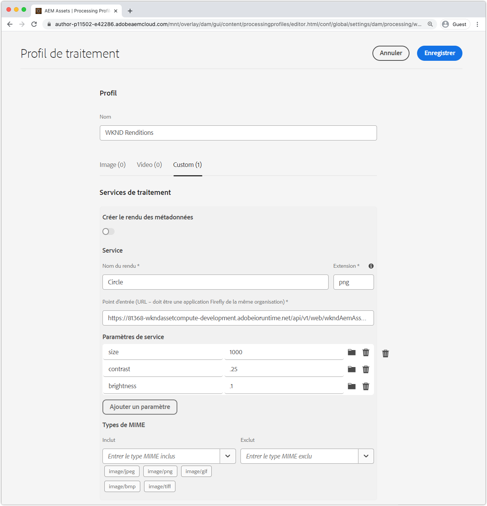
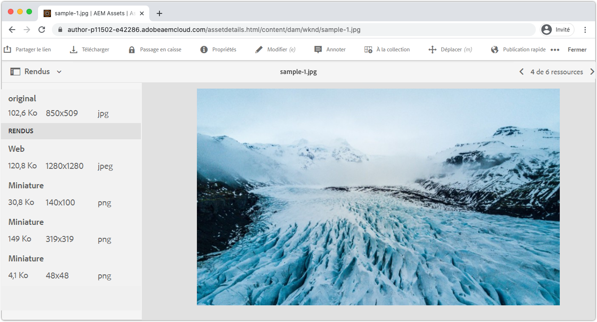

# Intégration des Profils de traitement AEM

Pour que les agents Asset Compute puissent générer des rendus personnalisés en AEM en tant que Cloud Service, ils doivent être enregistrés en AEM en tant que service d’auteur Cloud Service via les Profils de traitement. Tous les actifs soumis à ce Profil de traitement font appel au programme de travail lors du transfert ou du retraitement, et le rendu personnalisé est généré et rendu disponible via les rendus de l’actif.

## Définir un Profil de traitement

Créez d’abord un nouveau Profil de traitement qui appellera le programme de travail avec les paramètres configurables.

1. Connectez-vous à AEM en tant que service d’auteur Cloud Service en tant qu’administrateur ____ AEM. Comme il s’agit d’un tutoriel, nous vous recommandons d’utiliser un environnement Dev ou un environnement dans un Sandbox.
1. Accédez à __Outils > Ressources > Profils de traitement.__
1. Appuyez sur le bouton __Créer__ .
1. Nommez le Profil de traitement, `WKND Asset Renditions`
1. Appuyez sur l’onglet __Personnalisé__ , puis sur __Ajouter Nouveau.__
1. Définir le nouveau service
   + __Nom du rendu:__ `Circle`
      + Le rendu du nom de fichier qui sera utilisé pour identifier ce rendu en AEM Assets
   + __Extension :__ `png`
      + Extension du rendu qui sera généré. Défini sur `png` étant donné qu’il s’agit du format de sortie pris en charge par le service Web du collaborateur, ce dernier obtient un arrière-plan transparent derrière le cercle découpé.
   + __Point de terminaison :__ `https://...adobeioruntime.net/api/v1/web/wkndAemAssetCompute-0.0.1/worker`
      + Il s’agit de l’URL du travailleur obtenu par `aio app get-url`. Assurez-vous que l’URL pointe vers l’espace de travail approprié en fonction de l’AEM en tant qu’environnement Cloud Service dans lequel le Profil de traitement est configuré. Notez que ce sous-domaine correspond à l’ `development` espace de travail.
      + Assurez-vous que l’URL du collaborateur pointe vers l’espace de travail approprié. aem en tant que scène de Cloud Service doit utiliser l’URL de l’espace de travail de scène et AEM en tant que production de Cloud Service doit utiliser l’URL de l’espace de travail de production.
   + __Paramètres de service__
      + Appuyez sur Paramètre __d’Ajoute__
         + Clé: `size`
         + Valeur : `1000`
      + Appuyez sur Paramètre __d’Ajoute__
         + Clé: `contrast`
         + Valeur : `0.25`
      + Appuyez sur Paramètre __d’Ajoute__
         + Clé: `brightness`
         + Valeur : `0.10`
      + Ces paires clé/valeur sont transmises au programme de travail Asset Compute et disponibles par le biais d’un objet `rendition.instructions` JavaScript.
   + __Types MIME__
      + __Comprend :__ `image/jpeg`, `image/png`, `image/gif`, `image/bmp`, `image/tiff`
         + Ces types MIME sont les seuls pris en charge par le service Web du collaborateur, ce qui limite les ressources qui peuvent être traitées par le collaborateur personnalisé.
      + __Exclure :__ `Leave blank`
         + Ne traitez jamais les ressources avec ces types MIME à l’aide de cette configuration de service. Dans ce cas, nous n&#39;utilisons qu&#39;une liste autorisée.
1. Appuyez sur __Enregistrer__ en haut à droite.

## Appliquer et appeler un Profil de traitement

1. Sélectionnez le nouveau Profil de traitement, `WKND Asset Renditions`
1. Appuyez sur __Appliquer le Profil aux dossiers__ dans la barre d’actions supérieure.
1. Sélectionnez un dossier auquel appliquer le Profil de traitement, par exemple `WKND` et appuyez sur __Appliquer.__
1. Accédez au dossier auquel le Profil de traitement n’a pas été appliqué via __AEM > Ressources > Fichiers__ et appuyez sur `WKND`la touche.
1. Téléchargez de nouveaux fichiers d’images ([sample-1.jpg](../assets/samples/sample-1.jpg), [sample-2.jpg](../assets/samples/sample-2.jpg)et [sample-3.jpg](../assets/samples/sample-3.jpg)) dans n’importe quel dossier situé sous le dossier auquel le Profil de traitement est appliqué, et attendez que le fichier téléchargé soit traité.
1. Appuyez sur la ressource pour ouvrir ses détails
   + Les rendus par défaut peuvent générer et apparaître plus rapidement dans les AEM que les rendus personnalisés.
1. Ouvrez la vue __Rendus__ à partir de la barre latérale gauche.
1. Appuyez sur la ressource nommée `Circle.png` et passez en revue le rendu généré.

   

## Terminé!

Félicitations ! Vous avez terminé le [didacticiel](../overview.md) sur la façon d&#39;étendre l&#39;AEM en tant que microservices Cloud Service Asset Compute ! Vous devez désormais être en mesure de configurer, de développer, de tester, de déboguer et de déployer des agents de traitement d’actifs personnalisés pour une utilisation par votre AEM en tant que service d’auteur Cloud Service.

## Résolution des incidents

### Rendu personnalisé manquant dans le fichier

+ __Erreur :__ Le nouveau traitement et le nouveau traitement des ressources ont réussi, mais le rendu personnalisé est absent

#### Profil de traitement non appliqué au dossier ancêtre

+ __Cause :__ La ressource n’existe pas sous un dossier avec le Profil de traitement qui utilise le programme de travail personnalisé.
+ __Résolution :__ Appliquer le Profil de traitement à un dossier ancêtre de la ressource

#### Profil de traitement remplacé par Profil de traitement inférieur

+ __Cause :__ Le fichier se trouve sous un dossier auquel est appliqué le Profil de traitement du programme de travail personnalisé. Toutefois, un autre Profil de traitement qui n’utilise pas le programme de travail client a été appliqué entre ce dossier et le fichier.
+ __Résolution :__ Combiner, ou réconcilier, les deux Profils de traitement et supprimer le Profil de traitement intermédiaire

### Échec du traitement des ressources

+ __Erreur :__ Balise Échec du traitement des ressources affichée sur la ressource
+ __Cause :__ Une erreur s&#39;est produite dans l&#39;exécution du programme de travail personnalisé
+ __Résolution :__ Suivez les instructions relatives au [débogage des activations](../test-debug/debug.md#aio-app-logs) Adobe I/O Runtime à l’aide de `aio app logs`.