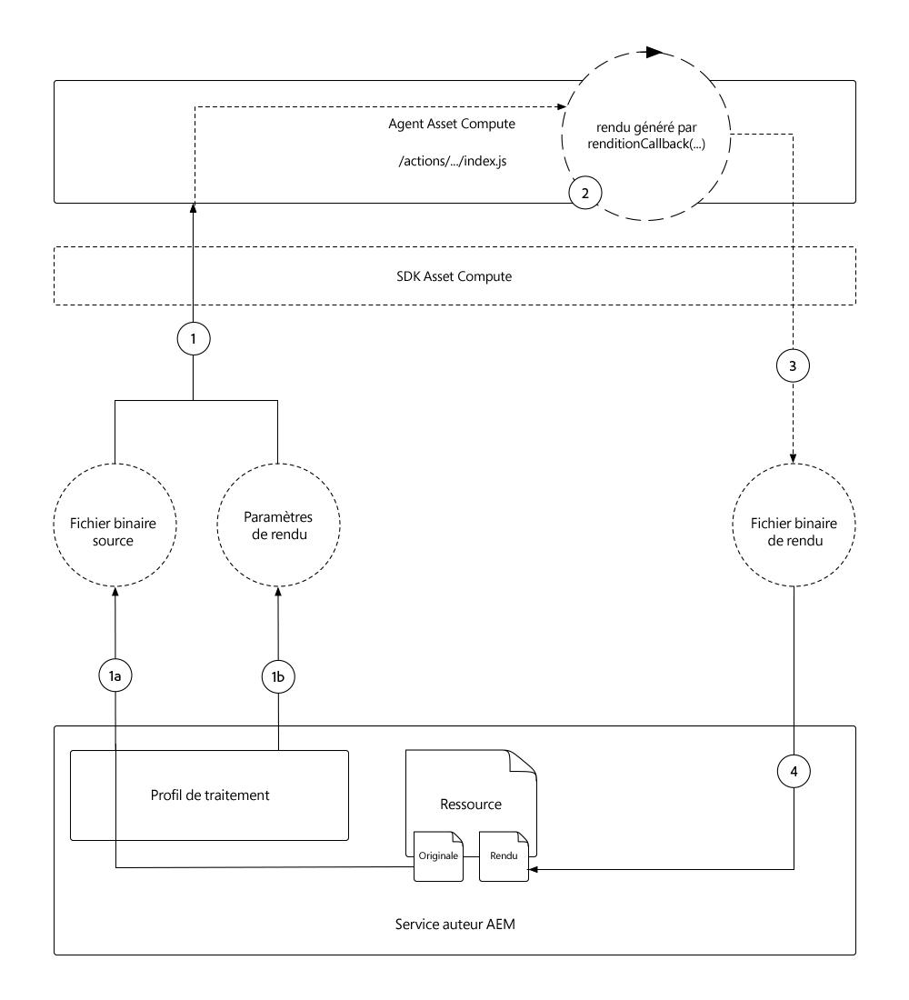

# Développer un Asset compute

Les travailleurs d’Asset compute sont au coeur d’un projet d’Asset compute car ils fournissent des fonctionnalités personnalisées qui exécutent, ou orchestrent, le travail effectué sur une ressource pour créer un nouveau rendu.

Le projet d’Asset compute génère automatiquement un programme de travail simple qui copie le fichier binaire d’origine dans un rendu nommé, sans aucune conversion. Dans ce tutoriel, nous allons modifier ce travailleur pour créer un rendu plus intéressant, pour illustrer la puissance des travailleurs de l&#39;Asset compute.

Nous allons créer un intervenant d’Asset compute qui génère un nouveau rendu d’image horizontal, qui couvre l’espace vide à gauche et à droite du rendu de fichier avec une version floue de la ressource. La largeur, la hauteur et le flou du rendu final seront paramétrés.

## Flux logique d’un appel de travailleur d’Asset compute

Les agents d’Asset compute implémentent le contrat Asset compute SDK worker API dans la fonction `renditionCallback(...)`, qui est conceptuellement :

+ __Entrée :__ binaire d’origine d’une ressource AEM et paramètres de Profil de traitement
+ __Output :__ un ou plusieurs rendus à ajouter à la ressource AEM



1. Le service Auteur AEM appelle l’agent d’Asset compute, en fournissant le __(1a)__ paramètre binaire d’origine de la ressource (`source`) et __(1b)__ tous les paramètres définis dans le Profil de traitement (`rendition.instructions` paramètre).
1. Le Asset compute SDK orchestre l’exécution de la fonction `renditionCallback(...)` du programme de travail des métadonnées d’Asset compute personnalisé, en générant un nouveau rendu binaire, basé sur le fichier binaire original __(1a)__ et les paramètres __(1b)__.

   + Dans ce didacticiel, le rendu est créé &quot;en cours&quot;, ce qui signifie que le collaborateur compose le rendu. Toutefois, le binaire source peut être envoyé à d’autres API de service Web pour la génération de rendu.

1. Le programme de travail d’Asset compute enregistre les données binaires du nouveau rendu dans `rendition.path`.
1. Les données binaires écrites dans `rendition.path` sont transportées par l’Asset compute SDK vers le service d’auteur AEM et exposées sous la forme __(4a)__ d’un rendu de texte et __(4b)__ conservées dans le noeud de métadonnées de la ressource.

Le diagramme ci-dessus décrit les préoccupations des développeurs d&#39;Assets compute et le flux logique vers l&#39;appel des travailleurs d&#39;Asset compute. Pour les curieux, les [détails internes de l&#39;exécution des Assets compute](https://docs.adobe.com/content/help/en/asset-compute/using/extend/custom-application-internals.html) sont disponibles, mais seuls les contrats d&#39;API du SDK d&#39;Asset compute public peuvent être dépendants.

## Anatomie d&#39;un travailleur

Tous les travailleurs d&#39;Asset compute suivent la même structure de base et le même contrat d&#39;entrée/sortie.

```javascript
'use strict';

// Any npm module imports used by the worker
const { worker, SourceCorruptError } = require('@adobe/asset-compute-sdk');
const fs = require('fs').promises;

/**
Exports the worker implemented by a custom rendition callback function, which parametrizes the input/output contract for the worker.
 + `source` represents the asset's original binary used as the input for the worker.
 + `rendition` represents the worker's output, which is the creation of a new asset rendition.
 + `params` are optional parameters, which map to additional key/value pairs, including a sub `auth` object that contains Adobe I/O access credentials.
**/
exports.main = worker(async (source, rendition, params) => {
    // Perform any necessary source (input) checks
    const stats = await fs.stat(source.path);
    if (stats.size === 0) {
        // Throw appropriate errors whenever an erring condition is met
        throw new SourceCorruptError('source file is empty');
    }

    // Access any custom parameters provided via the Processing Profile configuration
    let param1 = rendition.instructions.exampleParam;

    /** 
    Perform all work needed to transform the source into the rendition.
    
    The source data can be accessed:
        + In the worker via a file available at `source.path`
        + Or via a presigned GET URL at `source.url`
    **/
    if (success) {
        // A successful worker must write some data back to `renditions.path`. 
        // This example performs a trivial 1:1 copy of the source binary to the rendition
        await fs.copyFile(source.path, rendition.path);
    } else {
        // Upon failure an Asset Compute Error (exported by @adobe/asset-compute-commons) should be thrown.
        throw new GenericError("An error occurred!", "example-worker");
    }
});

/**
Optionally create helper classes or functions the worker's rendition callback function invokes to help organize code.

Code shared across workers, or to complex to be managed in a single file, can be broken out across supporting JavaScript files in the project and imported normally into the worker. 
**/
function customHelperFunctions() { ... }
```

## Ouverture du fichier index.js du collaborateur


1. Vérifier que le projet d&#39;Asset compute est ouvert dans le code VS
1. Accédez au dossier `/actions/worker`
1. Ouvrez le fichier `index.js`.

Il s&#39;agit du fichier JavaScript de l&#39;intervenant que nous allons modifier dans ce didacticiel.

## Installation et importation des modules npm de prise en charge

Basés sur Node.js, les projets d’Asset compute bénéficient de l’écosystème [module npm](https://npmjs.com) robuste. Pour exploiter les modules npm, nous devons d&#39;abord les installer dans notre projet d&#39;Asset compute.

Dans ce programme de travail, nous utilisons [jimp](https://www.npmjs.com/package/jimp) pour créer et manipuler l’image de rendu directement dans le code Node.js.

>[!WARNING]
>
>Tous les modules npm pour la manipulation de ressources ne sont pas pris en charge par l’Asset compute. Les modules npm qui dépendent de l’existence d’applications telles que ImageMagick ou d’autres bibliothèques dépendantes du système d’exploitation ne sont pas pris en charge. Il est préférable de limiter l’utilisation des modules npm JavaScript uniquement.

1. Ouvrez la ligne de commande dans la racine du projet d&#39;Asset compute (vous pouvez le faire dans le code VS via __Terminal > New Terminal__) et exécutez la commande :

   ```
   $ npm install jimp
   ```

1. Importez le module `jimp` dans le code de travail afin de pouvoir l’utiliser via l’objet JavaScript `Jimp`.
Mettez à jour les directives `require` en haut de l&#39;élément `index.js` du programme de travail pour importer l&#39;objet `Jimp` à partir du module `jimp` :

   ```javascript
   'use strict';
   
   const { Jimp } = require('jimp');
   const { worker, SourceCorruptError } = require('@adobe/asset-compute-sdk');
   const fs = require('fs').promises;
   
   exports.main = worker(async (source, rendition, params) => {
       // Check handle a corrupt input source
       const stats = await fs.stat(source.path);
       if (stats.size === 0) {
           throw new SourceCorruptError('source file is empty');
       }
   
       // Do work here
   });
   ```

## Paramètres de lecture

Les travailleurs d’Asset compute peuvent lire dans des paramètres qui peuvent être transmis via des Profils de traitement définis dans AEM en tant que service d’auteur Cloud Service. Les paramètres sont transmis au programme de travail via l&#39;objet `rendition.instructions`.

Vous pouvez les lire en accédant à `rendition.instructions.<parameterName>` dans le code de travail.

Ici, nous allons lire les éléments `SIZE`, `BRIGHTNESS` et `CONTRAST` du rendu configurable, en fournissant les valeurs par défaut si aucun élément n’a été fourni par le Profil de traitement. Notez que `renditions.instructions` sont transmis en tant que chaînes lorsqu’ils sont appelés à partir d’AEM en tant que Profils de traitement Cloud Service. Assurez-vous donc qu’ils sont transformés en types de données corrects dans le code de travail.

```javascript
'use strict';

const { Jimp } = require('jimp');
const { worker, SourceCorruptError } = require('@adobe/asset-compute-sdk');
const fs = require('fs').promises;

exports.main = worker(async (source, rendition, params) => {
    const stats = await fs.stat(source.path);
    if (stats.size === 0) {
        throw new SourceCorruptError('source file is empty');
    }

    // Read in parameters and set defaults if parameters are provided
    // Processing Profiles pass in instructions as Strings, so make sure to parse to correct data types
    const SIZE = parseInt(rendition.instructions.size) || 800; 
    const CONTRAST = parseFloat(rendition.instructions.contrast) || 0;
    const BRIGHTNESS = parseFloat(rendition.instructions.brightness) || 0;

    // Do work here
}
```

## Erreurs de déclenchement{#errors}

Les employés d&#39;Asset compute peuvent rencontrer des situations qui génèrent des erreurs. Le Adobe Asset compute SDK fournit [une suite d’erreurs prédéfinies](https://github.com/adobe/asset-compute-commons#asset-compute-errors) qui peuvent être générées lorsque de telles situations se produisent. Si aucun type d&#39;erreur spécifique n&#39;est appliqué, l&#39;élément `GenericError` peut être utilisé ou un élément personnalisé spécifique `ClientErrors` peut être défini.

Avant de commencer à traiter le rendu, vérifiez que tous les paramètres sont valides et pris en charge dans le contexte de ce programme de travail :

+ Assurez-vous que les paramètres d’instruction de rendu pour `SIZE`, `CONTRAST` et `BRIGHTNESS` sont valides. Dans le cas contraire, envoyez une erreur personnalisée `RenditionInstructionsError`.
   + Une classe `RenditionInstructionsError` personnalisée qui étend `ClientError` est définie au bas de ce fichier. L’utilisation d’une erreur personnalisée spécifique est utile lorsque [l’écriture de tests](../test-debug/test.md) pour le collaborateur.

```javascript
'use strict';

const { Jimp } = require('jimp');
// Import the Asset Compute SDK provided `ClientError` 
const { worker, SourceCorruptError, ClientError } = require('@adobe/asset-compute-sdk');
const fs = require('fs').promises;

exports.main = worker(async (source, rendition, params) => {
    const stats = await fs.stat(source.path);
    if (stats.size === 0) {
        throw new SourceCorruptError('source file is empty');
    }

    // Read in parameters and set defaults if parameters are provided
    const SIZE = parseInt(rendition.instructions.size) || 800; 
    const CONTRAST = parseFloat(rendition.instructions.contrast) || 0;
    const BRIGHTNESS = parseFloat(rendition.instructions.brightness) || 0;

    if (SIZE <= 10 || SIZE >= 10000) {
        // Ensure size is within allowable bounds
        throw new RenditionInstructionsError("'size' must be between 10 and 1,0000");
    } else if (CONTRAST <= -1 || CONTRAST >= 1) {
        // Ensure contrast is valid value
        throw new RenditionInstructionsError("'contrast' must between -1 and 1");
    } else if (BRIGHTNESS <= -1 || BRIGHTNESS >= 1) {
        // Ensure contrast is valid value
        throw new RenditionInstructionsError("'brightness' must between -1 and 1");
    }

    // Do work here
}

// Create a new ClientError to handle invalid rendition.instructions values
class RenditionInstructionsError extends ClientError {
    constructor(message) {
        // Provide a:
        // + message: describing the nature of this erring condition
        // + name: the name of the error; usually same as class name
        // + reason: a short, searchable, unique error token that identifies this error
        super(message, "RenditionInstructionsError", "rendition_instructions_error");

        // Capture the strack trace
        Error.captureStackTrace(this, RenditionInstructionsError);
    }
}
```

## Création du rendu

Lorsque les paramètres sont lus, expurgés et validés, le code est écrit pour générer le rendu. Le pseudo-code pour la génération de rendu est le suivant :

1. Créez un canevas `renditionImage` en dimensions carrées spécifié via le paramètre `size`.
1. Créez un objet `image` à partir du fichier binaire de l’actif source.
1. Utilisez la bibliothèque __Jimp__ pour transformer l’image :
   + Recadrer l’image d’origine sur un carré centré
   + Coupe un cercle à partir du centre de l’image &quot;carrée&quot;
   + Ajuster à l&#39;échelle selon les dimensions définies par la valeur du paramètre `SIZE`
   + Ajuster le contraste en fonction de la valeur du paramètre `CONTRAST`
   + Ajuster la luminosité en fonction de la valeur du paramètre `BRIGHTNESS`
1. Placez le `image` transformé au centre du `renditionImage` avec un arrière-plan transparent.
1. Ecrivez le composé `renditionImage` sur `rendition.path` afin qu’il puisse être enregistré à nouveau en AEM en tant que rendu de ressource.

Ce code utilise les [API Jimp](https://github.com/oliver-moran/jimp#jimp) pour effectuer ces transformations d&#39;image.

Les travailleurs d&#39;Asset compute doivent terminer leur travail de façon synchrone, et le `rendition.path` doit être entièrement écrit avant que le travailleur ne termine son travail `renditionCallback`. Pour ce faire, les appels de fonctions asynchrones doivent être effectués de manière synchrone à l&#39;aide de l&#39;opérateur `await`. Si vous ne connaissez pas les fonctions asynchrones JavaScript et comment les exécuter de manière synchrone, familiarisez-vous avec [l’opérateur d’attente de JavaScript](https://developer.mozilla.org/en-US/docs/Web/JavaScript/Reference/Operators/await).

Le travailleur terminé `index.js` doit se présenter comme suit :

```javascript
'use strict';

const Jimp = require('jimp');
const { worker, SourceCorruptError, ClientError } = require('@adobe/asset-compute-sdk');
const fs = require('fs').promises;

exports.main = worker(async (source, rendition, params) => {
    const stats = await fs.stat(source.path);
    if (stats.size === 0) {
        throw new SourceCorruptError('source file is empty');
    }

    const SIZE = parseInt(rendition.instructions.size) || 800; 
    const CONTRAST = parseFloat(rendition.instructions.contrast) || 0;
    const BRIGHTNESS = parseFloat(rendition.instructions.brightness) || 0;

    if (SIZE <= 10 || SIZE >= 10000) {
        throw new RenditionInstructionsError("'size' must be between 10 and 10,000");
    } else if (CONTRAST <= -1 || CONTRAST >= 1) {
        throw new RenditionInstructionsError("'contrast' must between -1 and 1");
    } else if (BRIGHTNESS <= -1 || BRIGHTNESS >= 1) {
        throw new RenditionInstructionsError("'brightness' must between -1 and 1");
    }

    // Create target rendition image of the target size with a transparent background (0x0)
    let renditionImage =  new Jimp(SIZE, SIZE, 0x0);

    // Read and perform transformations on the source binary image
    let image = await Jimp.read(source.path);

    // Crop a circle from the source asset, and then apply contrast and brightness using Jimp
    image.crop(
            image.bitmap.width < image.bitmap.height ? 0 : (image.bitmap.width - image.bitmap.height) / 2,
            image.bitmap.width < image.bitmap.height ? (image.bitmap.height - image.bitmap.width) / 2 : 0,
            image.bitmap.width < image.bitmap.height ? image.bitmap.width : image.bitmap.height,
            image.bitmap.width < image.bitmap.height ? image.bitmap.width : image.bitmap.height
        )   
        .circle()
        .scaleToFit(SIZE, SIZE)
        .contrast(CONTRAST)
        .brightness(BRIGHTNESS);

    // Place the transformed image onto the transparent renditionImage to save as PNG
    renditionImage.composite(image, 0, 0)

    // Write the final transformed image to the asset's rendition
    renditionImage.write(rendition.path);
});

// Custom error used for renditions.instructions parameter checking
class RenditionInstructionsError extends ClientError {
    constructor(message) {
        super(message, "RenditionInstructionsError", "rendition_instructions_error");
        Error.captureStackTrace(this, RenditionInstructionsError);
    }
}
```

## Exécution du collaborateur

Maintenant que le code de travail est terminé et qu’il a été précédemment enregistré et configuré dans [manifest.yml](./manifest.md), il peut être exécuté à l’aide de l’outil de développement d’Asset compute local pour afficher les résultats.

1. A partir de la racine du projet d&#39;Asset compute
1. Exécuter `aio app run`
1. L&#39;outil de développement d&#39;Asset compute doit s&#39;ouvrir dans une nouvelle fenêtre
1. Dans la section __Sélectionner un fichier...Liste déroulante__, sélectionnez un exemple d’image à traiter
   + Sélectionnez un exemple de fichier image à utiliser comme fichier binaire source
   + S’il n’en existe pas encore, appuyez sur __(+)__ à gauche, téléchargez un fichier [exemple d’image](../assets/samples/sample-file.jpg), puis actualisez la fenêtre du navigateur des outils de développement.
1. Mettez à jour `"name": "rendition.png"` en tant que ce programme de travail pour générer un fichier PNG transparent.
   + Notez que ce paramètre &quot;name&quot; n’est utilisé que pour l’outil de développement et ne doit pas être utilisé.

   ```json
   {
       "renditions": [
           {
               "worker": "...",
               "name": "rendition.png"
           }
       ]
   }
   ```
1. Appuyez sur __Exécuter__ et attendez la génération du rendu.
1. La section __Rendus__ prévisualisation le rendu généré. Appuyez sur la prévisualisation de rendu pour télécharger le rendu complet.

   

### Exécution du programme de travail avec des paramètres

Les paramètres transmis via les configurations de Profil de traitement peuvent être simulés dans les outils de développement d’Asset compute en les fournissant en tant que paires clé/valeur sur le paramètre de rendu JSON.

>[!WARNING]
>
>Lors du développement local, les valeurs peuvent être transmises à l’aide de différents types de données, lorsqu’elles sont transmises d’AEM en tant que Profils de traitement Cloud Service en tant que chaînes. Assurez-vous donc que les types de données appropriés sont analysés si nécessaire.
> Par exemple, la fonction `crop(width, height)` de Jimp requiert que ses paramètres soient `int`. Si `parseInt(rendition.instructions.size)` n&#39;est pas analysé en tant qu&#39;entier, l&#39;appel à `jimp.crop(SIZE, SIZE)` échoue, car les paramètres sont incompatibles avec le type &quot;String&quot;.

Notre code accepte les paramètres pour :

+ `size` définit la taille du rendu (hauteur et largeur en tant qu’entiers)
+ `contrast` définit l’ajustement du contraste, doit être compris entre -1 et 1, sous forme de flotteurs
+ `brightness`  définit le réglage de la luminosité, doit être compris entre -1 et 1, sous forme de flotteurs

Ils sont lus dans le travailleur `index.js` via :

+ `const SIZE = parseInt(rendition.instructions.size) || 800`
+ `const CONTRAST = parseFloat(rendition.instructions.contrast) || 0`
+ `const BRIGHTNESS = parseFloat(rendition.instructions.brightness) || 0`

1. Mettez à jour les paramètres de rendu pour personnaliser la taille, le contraste et la luminosité.

   ```json
   {
       "renditions": [
           {
               "worker": "...",
               "name": "rendition.png",
               "size": "450",
               "contrast": "0.30",
               "brightness": "0.15"
           }
       ]
   }
   ```

1. Appuyez à nouveau sur __Exécuter__.
1. Appuyez sur la prévisualisation de rendu pour télécharger et consulter le rendu généré. Notez ses dimensions et comment le contraste et la luminosité ont été modifiés par rapport au rendu par défaut.

   

1. Téléchargez d’autres images dans la liste déroulante __Fichier source__, et essayez d’exécuter le programme de travail à l’aide de différents paramètres !

## Worker index.js sur Github

Le `index.js` final est disponible sur Github à l&#39;adresse suivante :

+ [aem-guides-wknd-asset-compute/actions/worker/index.js](https://github.com/adobe/aem-guides-wknd-asset-compute/blob/master/actions/worker/index.js)

## Résolution des incidents

+ [Le rendu est renvoyé partiellement dessiné/corrompu](../troubleshooting.md#rendition-returned-partially-drawn-or-corrupt)
