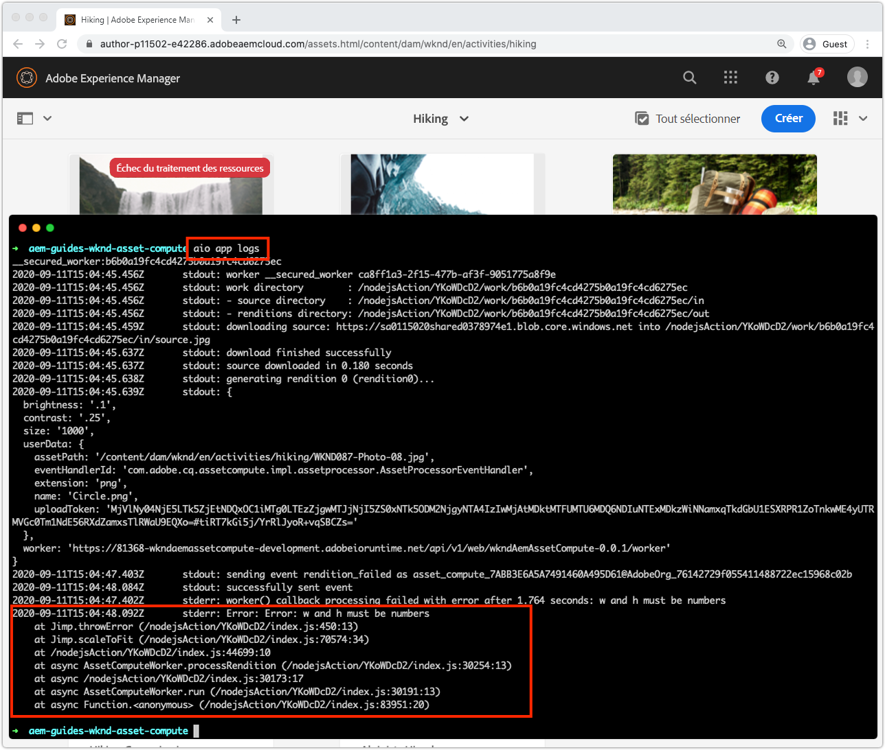

# Débogage d’un intervenant d’Asset compute

Les travailleurs d&#39;Asset compute peuvent être débogués de plusieurs manières, des instructions simples du journal de débogage, au code VS joint en tant que débogueur distant, à l&#39;extraction des journaux pour les activations dans Adobe I/O Runtime initiée à partir d&#39;AEM en tant que Cloud Service.

## Journalisation

La forme la plus élémentaire de débogage des travailleurs d&#39;Asset compute utilise les instructions traditionnelles `console.log(..)` dans le code de travail. L&#39;objet JavaScript `console` est implicite et global. Il n&#39;est donc pas nécessaire de l&#39;importer ni de l&#39;exiger, car il est toujours présent dans tous les contextes.

Les instructions de journal suivantes peuvent faire l’objet d’une révision différente en fonction de la manière dont le travailleur d’Asset compute est exécuté :

+ À partir de `aio app run`, les journaux s&#39;impriment en sortie standard et les [Journaux d&#39;Activation de l&#39;outil de développement ](../develop/development-tool.md) 
   
+ De `aio app test`, les journaux s&#39;impriment dans `/build/test-results/test-worker/test.log`
   
+ À l&#39;aide de `wskdebug`, consigne les instructions imprimées dans la console de débogage du code VS (Vue > Console de débogage), hors ligne
   
+ À l&#39;aide de `aio app logs`, les instructions de journal s&#39;impriment dans la sortie du journal des activations.

## Débogage à distance via un débogueur joint

>[!WARNING]
>
>Utiliser Microsoft Visual Studio Code 1.48.0 ou version ultérieure pour la compatibilité avec wskdebug

Le module npm [wskdebug](https://www.npmjs.com/package/@openwhisk/wskdebug) prend en charge l&#39;association d&#39;un débogueur aux travailleurs d&#39;Asset compute, y compris la possibilité de définir des points d&#39;arrêt dans le code VS et de parcourir le code.

>[!VIDEO](https://video.tv.adobe.com/v/40383/?quality=12&learn=on)

_Clic publicitaire du débogage d’un intervenant d’Asset compute à l’aide de wskdebug (sans audio)_

1. Assurez-vous que les modules [wskdebug](../set-up/development-environment.md#wskdebug) et [ngrok](../set-up/development-environment.md#ngork) npm sont installés.
1. Assurez-vous que [Docker Desktop et les images Docker prises en charge](../set-up/development-environment.md#docker) sont installés et en cours d&#39;exécution.
1. Fermez toutes les instances principales en cours d’exécution de l’outil de développement.
1. Déployez le code le plus récent à l’aide de `aio app deploy` et enregistrez le nom de l’action déployée (nom compris entre `[...]`). Elle sera utilisée pour mettre à jour le `launch.json` à l&#39;étape 8.

   ```
   ℹ Info: Deploying package [wkndAemAssetCompute-0.0.1]...
   ```
1. Début d&#39;une nouvelle instance de l&#39;outil de développement d&#39;Asset compute à l&#39;aide de la commande `npx adobe-asset-compute devtool`
1. Dans le code VS, appuyez sur l’icône Débogage dans le volet de navigation de gauche.
   + Si vous y êtes invité, appuyez sur __créer un fichier launch.json > Node.js__ pour créer un nouveau fichier `launch.json`.
   + Sinon, appuyez sur l&#39;icône __Engrenage__ à droite de la liste déroulante __Programme de lancement__ pour ouvrir l&#39;élément `launch.json` existant dans l&#39;éditeur.
1. Ajoutez la configuration d’objet JSON suivante sur le tableau `configurations` :

   ```json
   {
       "type": "pwa-node",
       "request": "launch",
       "name": "wskdebug",
       "attachSimplePort": 0,
       "runtimeExecutable": "wskdebug",
       "args": [
           "wkndAemAssetCompute-0.0.1/__secured_worker",  // Version must match your Asset Compute worker's version
           "${workspaceFolder}/actions/worker/index.js",  // Points to your worker
           "-l",
           "--ngrok"
       ],
       "localRoot": "${workspaceFolder}",
       "remoteRoot": "/code",
       "outputCapture": "std",
       "timeout": 30000
   }
   ```

1. Sélectionnez le nouveau __wskdebug__ dans la liste déroulante.
1. Appuyez sur le bouton vert __Exécuter__ à gauche de la liste déroulante __wskdebug__.
1. Ouvrez `/actions/worker/index.js` et appuyez sur à gauche des numéros de ligne pour ajouter des points de rupture 1. Accédez à la fenêtre du navigateur Web de l&#39;outil de développement d&#39;Asset compute ouverte à l&#39;étape 6.
1. Appuyez sur le bouton __Exécuter__ pour exécuter le programme de travail.
1. Revenez au code VS, à `/actions/worker/index.js` et parcourez le code.
1. Pour quitter l&#39;outil de développement débogage, appuyez sur `Ctrl-C` dans le terminal qui a exécuté la commande `npx adobe-asset-compute devtool` à l&#39;étape 6.

## Accès aux journaux à partir de Adobe I/O Runtime{#aio-app-logs}

[L&#39;AEM en tant que Cloud Service mobilise les travailleurs d&#39;Asset compute via les ](../deploy/processing-profiles.md) profils de traitement en les appelant directement dans Adobe I/O Runtime. Comme ces invocations n&#39;impliquent pas le développement local, leurs exécutions ne peuvent pas être déboguées à l&#39;aide d&#39;outils locaux tels que Asset compute Development Tool ou wskdebug. A la place, l’interface de ligne de commande de l’Adobe I/O peut être utilisée pour récupérer les journaux du collaborateur exécuté dans un espace de travail particulier de Adobe I/O Runtime.

1. Assurez-vous que les [variables d&#39;environnement propres à l&#39;espace de travail](../deploy/runtime.md) sont définies via `AIO_runtime_namespace` et `AIO_runtime_auth`, en fonction de l&#39;espace de travail nécessitant un débogage.
1. Dans la ligne de commande, exécutez `aio app logs`
   + Si l&#39;espace de travail génère un trafic important, augmentez le nombre de journaux d&#39;activation à l&#39;aide de l&#39;indicateur `--limit` :
      `$ aio app logs --limit=25`
1. Les journaux d&#39;activations les plus récents (jusqu&#39;aux `--limit` fournis) seront renvoyés en tant que sortie de la commande pour révision.

   

## Résolution des incidents

+ [Le débogueur n’est pas joint](../troubleshooting.md#debugger-does-not-attach)
+ [Points d’arrêt non suspendus](../troubleshooting.md#breakpoints-no-pausing)
+ [Débogueur de code VS non joint](../troubleshooting.md#vs-code-debugger-not-attached)
+ [Débogueur de code VS attaché après le début de l&#39;exécution du programme de travail](../troubleshooting.md#vs-code-debugger-attached-after-worker-execution-began)
+ [Le programme de travail expire lors du débogage](../troubleshooting.md#worker-times-out-while-debugging)
+ [Impossible d&#39;arrêter le processus de débogage](../troubleshooting.md#cannot-terminate-debugger-process)
