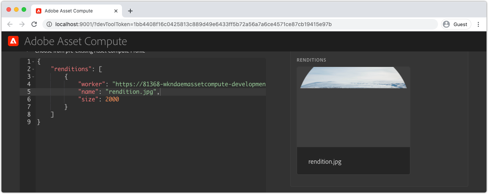

# Résoudre les problèmes d’extensibilité d’Asset Compute

Vous trouverez ci-dessous un index des problèmes et erreurs courants, ainsi que leurs résolutions, pouvant survenir lors du développement et du déploiement de programmes de travail Asset Compute personnalisés pour AEM Assets.

## Développer{#develop}

### Le rendu est renvoyé partiellement tracé/corrompu{#rendition-returned-partially-drawn-or-corrupt}

+ __Erreur__ : le rendu est incomplet (lorsqu’il s’agit d’une image) ou est corrompu et ne peut pas être ouvert.

  .

+ __Cause__ : la fonction `renditionCallback` du programme de travail se ferme avant que le rendu puisse être entièrement écrit dans `rendition.path`.
+ __Résolution__ : vérifiez le code du programme de travail personnalisé et assurez-vous que tous les appels asynchrones sont effectués de manière synchrone à l’aide de `await`.

## Outil de développement{#development-tool}

### Fichier Console.json manquant dans le projet Asset Compute{#missing-console-json}

+ __Erreur :__ erreur : fichiers requis manquants lors de la validation (.../node_modules/@adobe/asset-compute-client/lib/integrationConfiguration.js:XX:YY) sur async setupAssetCompute (../node_modules/@adobe/asset-compute-devtool/src/assetComputeDevTool.js:XX:YY)
+ __Cause :__ le fichier `console.json` est absent de la racine du projet Asset Compute.
+ __Résolution :__ téléchargez un nouvel élément `console.json` de votre projet Adobe I/O.
   1. Dans console.adobe.io, ouvrez le projet Adobe I/O que le projet Asset Compute est configuré pour utiliser.
   1. Appuyez sur le bouton __Télécharger__ en haut à droite.
   1. Enregistrez le fichier téléchargé à la racine de votre projet Asset Compute à l’aide du nom de fichier `console.json`.

### Mise en retrait incorrecte de YAML dans manifest.yml{#incorrect-yaml-indentation}

+ __Erreur :__ YAMLException : mise en retrait incorrecte d’une entrée de mappage à la ligne X, colonne Y : (via Standard Out depuis la commande `aio app run`).
+ __Cause :__ les fichiers Yaml sont sensibles aux espaces blancs. Il est probable que votre mise en retrait soit incorrecte.
+ __Résolution :__ vérifiez votre `manifest.yml` et assurez-vous que toutes les mises en retrait sont correctes.

### La limite memorySize est définie trop basse{#memorysize-limit-is-set-too-low}

+ __Erreur :__ OpenWhiskError du serveur de développement local : PUT https://adobeioruntime.net/api/v1/namespaces/xxx-xxx-xxx/actions/xxx-0.0.1/__secured_workeroverwrite=true renvoyé HTTP 400 (Bad Request) —> « Le contenu de la demande est incorrect : l’exigence a échoué : mémoire de 64 Mo en dessous du seuil autorisé de 134217728 B ».
+ __Cause :__ une limite `memorySize` pour le programme de travail dans le `manifest.yml` a été définie sous le seuil minimal autorisé comme indiqué par le message d’erreur en bytes.
+ __Résolution :__ consultez les limites `memorySize` dans le `manifest.yml` et assurez-vous qu’elles sont toutes supérieures au seuil minimal autorisé.

### L’outil de développement ne peut pas démarrer en raison d’une clé privée manquante{#missing-private-key}

+ __Erreur :__ erreur de serveur de développement local : fichiers requis manquants à validatePrivateKeyFile... (via Standard Out depuis la commande `aio app run`).
+ __Cause :__ la valeur `ASSET_COMPUTE_PRIVATE_KEY_FILE_PATH` dans le fichier `.env` ne pointe pas vers `private.key` ou `private.key` n’est pas lisible par la personne utilisatrice actuelle.
+ __Résolution :__ consultez la valeur `ASSET_COMPUTE_PRIVATE_KEY_FILE_PATH` dans le fichier `.env` et assurez-vous qu’elle contient le chemin d’accès absolu et complet vers la `private.key` sur votre système de fichiers.

### Fichier source : menu déroulant incorrect{#source-files-dropdown-incorrect}

L’outil de développement d’Asset Compute peut passer à un état dans lequel il extrait des données obsolètes. Cela est le plus visible dans le menu déroulant __Fichier source__ affichant des éléments incorrects.

+ __Erreur :__ le menu déroulant Fichier source affiche des éléments incorrects.
+ __Cause :__ l’état obsolète des données du navigateur mises en cache provoque le problème.
+ __Résolution :__ dans votre navigateur, effacez complètement l’« état de l’application » de l’onglet du navigateur, la mémoire cache du navigateur, le stockage local et le programme de travail de service.

### Paramètre de requête devToolToken absent ou non valide{#missing-or-invalid-devtooltoken-query-parameter}

+ __Erreur :__ notification « non autorisée » dans l’outil de développement Asset Compute.
+ __Cause :__ `devToolToken` absent ou non valide.
+ __Résolution :__ fermez la fenêtre du navigateur de l’outil de développement Asset Compute, arrêtez les processus de l’outil de développement en cours d’exécution initiés via la commande `aio app run` et redémarrez l’outil de développement (à l’aide de `aio app run`).

### Impossible de supprimer les fichiers source{#unable-to-remove-source-files}

+ __Erreur :__ il n’existe aucun moyen de supprimer les fichiers source ajoutés depuis l’interface utilisateur des outils de développement.
+ __Cause :__ cette fonctionnalité n’a pas été implémentée.
+ __Résolution :__ connectez-vous à votre fournisseur d’espace de stockage cloud à l’aide des informations d’identification définies dans `.env`. Recherchez le conteneur utilisé par les outils de développement (également spécifié dans `.env`), accédez au dossier __source__ et supprimez les images sources. Vous devrez peut-être effectuer les étapes décrites dans la section [Fichier source : menu déroulant incorrect](#source-files-dropdown-incorrect) si les fichiers source supprimés continuent à s’afficher dans le menu déroulant, car ils peuvent être mis en cache localement dans l’« état de l’application » des outils de développement.

  

## Tester{#test}

### Aucun rendu généré lors de l’exécution du test{#test-no-rendition-generated}

+ __Erreur :__ échec : aucun rendu n’a été généré.
+ __Cause :__ le programme de travail n’a pas pu générer de rendu en raison d’une erreur inattendue, telle qu’une erreur de syntaxe JavaScript.
+ __Résolution :__ examinez le `test.log` de l’exécution de test sur `/build/test-results/test-worker/test.log`. Recherchez la section dans ce fichier correspondant au cas de test d’échec et examinez les erreurs.

  

### Le test génère un rendu incorrect provoquant l’échec du test.{#tests-generates-incorrect-rendition}

+ __Erreur :__ échec : le rendu « rendition.xxx » n’est pas celui attendu.
+ __Cause :__ le programme de travail génère un rendu qui n’est pas identique au rendu `rendition.<extension>` fourni dans le cas de test.
   + Si le fichier `rendition.<extension>` attendu n’est pas créé exactement de la même manière que le rendu généré localement dans le cas de test, le test peut échouer, car il peut y exister une différence dans les bits. Par exemple, si le programme de travail Asset Compute modifie le contraste à l’aide des API et que le résultat attendu est créé en ajustant le contraste dans Adobe Photoshop CC, les fichiers peuvent apparaître de la même manière, mais des variations mineures dans les bits peuvent causer des différences.
+ __Résolution :__ examinez la sortie du rendu du test en accédant à `/build/test-worker/<worker-name>/<test-run-timestamp>/<test-case>/rendition.<extension>`, puis comparez-le au fichier de rendu attendu dans le cas du test. Pour créer une ressource telle qu’attendue, procédez de l’une des manières suivantes :
   + Utilisez l’outil de développement pour générer un rendu, le valider comme étant correct et l’utiliser comme fichier de rendu attendu.
   + Vous pouvez également valider le fichier généré par le test à l’adresse `/build/test-worker/<worker-name>/<test-run-timestamp>/<test-case>/rendition.<extension>`, valider la valeur correcte et l’utiliser comme fichier de rendu attendu.

## Déboguer

### Impossible de joindre le débogueur.{#debugger-does-not-attach}

+ __Erreur__ : erreur de traitement du lancement : erreur : impossible de se connecter à la cible de débogage à...
+ __Cause__ : Docker Desktop n’est pas en cours d’exécution sur le système local. Vérifiez ce message en consultant la console de débogage de VS Code (Affichage > Console de débogage), puis en confirmant que cette erreur est signalée.
+ __Résolution__ : lancez [Docker Desktop et vérifiez que les images Docker requises sont installées](./set-up/development-environment.md#docker).

### Impossible de mettre les points d’arrêt en pause.{#breakpoints-no-pausing}

+ __Erreur__ : lors de l’exécution du programme de travail Asset Compute à partir de l’outil de développement de débogage, VS Code ne se met pas en pause aux points d’arrêt.

#### Débogueur de VS Code non joint.{#vs-code-debugger-not-attached}

+ __Cause :__ le débogueur de VS Code a été arrêté/déconnecté.
+ __Résolution :__ redémarrez le débogueur de VS Code et vérifiez qu’il est joint dans la console de sortie de débogage de VS Code (Affichage > Console de débogage).

#### Débogueur VS Code joint après le début de l’exécution du programme de travail.{#vs-code-debugger-attached-after-worker-execution-began}

+ __Cause :__ le débogueur de VS Code ne s’est pas joint avant d’appuyer sur __Exécuter__ dans l’outil de développement.
+ __Résolution :__ vérifiez que le débogueur a été joint en examinant la console de débogage de VS Code (Affichage > Console de débogage), puis relancez le programme de travail Asset Compute à partir de l’outil de développement.

### Le programme de travail expire lors du débogage.{#worker-times-out-while-debugging}

+ __Erreur__ : la console de débogage indique « L’action expire dans -XXX millisecondes. » ou l’aperçu du rendu de l’[Outil de développement d’Asset Compute](./develop/development-tool.md) tourne indéfiniment ou
+ __Cause__ : le délai d’expiration du programme de travail tel que défini dans [manifest.yml](./develop/manifest.md) est dépassé pendant le débogage.
+ __Résolution__ : augmentez temporairement le délai d’expiration du programme de travail dans [manifest.yml](./develop/manifest.md) ou accélérez les activités de débogage.

### Impossible d’arrêter le processus de débogage.{#cannot-terminate-debugger-process}

+ __Erreur__ : `Ctrl-C` sur la ligne de commande n’arrête pas le processus de débogage (`npx adobe-asset-compute devtool`).
+ __Cause__ : du fait d’un bug dans `@adobe/aio-cli-plugin-asset-compute` 1.3.x, `Ctrl-C` n’est pas reconnu comme une commande d’arrêt.
+ __Résolution__ : mettez à jour `@adobe/aio-cli-plugin-asset-compute` vers la version 1.4.1 ou ultérieure.

  ```
  $ aio update
  ```

  

## Déployer{#deploy}

### Rendu personnalisé manquant dans la ressource dans AEM{#custom-rendition-missing-from-asset}

+ __Erreur :__ les nouvelles ressources et les ressources retraitées sont traitées avec succès, mais le rendu personnalisé est manquant.

#### Profil de traitement non appliqué au dossier ancêtre

+ __Cause :__ la ressource n’existe pas sous un dossier avec le profil de traitement qui utilise le programme de travail personnalisé.
+ __Résolution :__ appliquez le profil de traitement à un dossier ancêtre de la ressource.

#### Profil de traitement remplacé par le profil de traitement inférieur

+ __Cause :__ la ressource existe sous un dossier auquel est appliqué le profil de traitement personnalisé du programme de travail, mais un autre profil de traitement qui n’utilise pas le programme de travail client a été appliqué entre ce dossier et la ressource.
+ __Résolution :__ combinez ou réconciliez les deux profils de traitement et supprimez le profil de traitement intermédiaire.

### Échec du traitement des ressources dans AEM{#asset-processing-fails}

+ __Erreur :__ badge Échec du traitement des ressources affiché sur la ressource.
+ __Cause :__ une erreur s’est produite lors de l’exécution du programme de travail personnalisé.
+ __Résolution :__ suivez les instructions de [débogage des activations Adobe I/O Runtime](./test-debug/debug.md#aio-app-logs) à l’aide de `aio app logs`.
